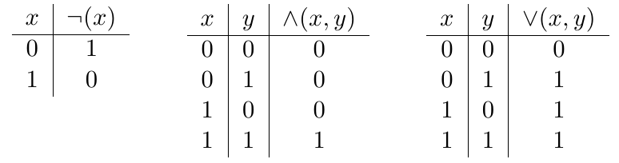
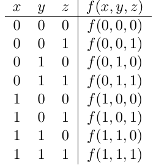
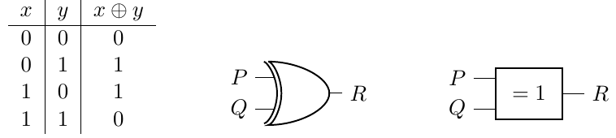
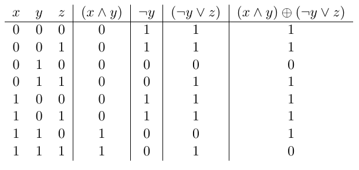

??? quote "Version PDF de ce cours"
    

    [:material-cursor-default-click: Télécharger ce cours au format PDF](documents/booleens_suite.pdf){ target="_blank" }
    

# Fonctions et expressions booléennes

## Les fonctions booléennes

On a vu précédemment que les **circuits électroniques** pouvaient être conceptualisés en termes de **fonctions booléennes**, ce qui signifie qu'ils acceptent **un** ou **plusieurs bits en entrée** et produisent **un seul bit en sortie**.

Si nous désignons $\neg (x)$ comme la fonction associée à la porte **NOT**, $\land (x, y)$ comme celle associée à la porte **AND**, et $\lor (x, y)$ comme celle de la porte **OR**, ces trois fonctions sont caractérisées par les **tables de vérité** suivantes :

{ width="450" }

Les trois **fonctions booléennes élémentaires** $\neg (x)$, $\land (x, y)$ et $\lor (x, y)$ sont utilisées comme **bases** pour la construction d'**autres fonctions booléennes**, et peuvent être combinées pour en définir de nouvelles.

Plus généralement, la **table de vérité** d’une fonction avec $n$ **bits** en **entrée** aura $2^n$ **lignes** correspondant aux $2n$ **combinaisons possibles** des **entrées**.
Par exemple, une fonction booléenne $f$ avec trois entrées $x$, $y$ et $z$ sera définie par une **table de vérité** à $2^3 = 8$ **lignes**, de la forme suivante :

{ width="200" }

Aussi, pour simplifier la définition des fonctions booléennes, on utilisera plutôt ces fonctions comme des **opérateurs**, et on écrira et dira que :

- $\neg x$ est la **négation** de x,
- $x \land y$ est la **conjonction** de x et y,
- $x \lor y$ est la **disjonction** de x et y.

!!! tip ""
    Ces opérateurs sont désignés comme des opérateurs booléens en l'honneur de **Georges Boole**, un mathématicien et philosophe du *19e siècle* qui a créé ce système de calcul, également connu sous le nom d'**algèbre booléenne**. Ce calcul repose sur l'utilisation d'**opérateurs** et de **chiffres binaires**, appelés également **chiffres booléens**.

Parmi les opérateurs de base que nous n'avons pas encore abordés, il y a l'opérateur <u>**ou exclusif**</u>, que l'on note $x \oplus y$, qui est défini comme suit (avec sa représentation symbolique américaine et européenne) :

{ width="480" }

La sortie est $1$ lorsque l'**une et une seule** de ses **entrées** est égale à $1$, et elle renvoie $0$ dans les autres cas.

## Expressions booléennes.

En utilisant ces **opérateurs**, on peut définir **n’importe quelle fonction booléenne** comme une **expression booléenne sur ses entrées**. Par exemple, l’égalité suivante définit une fonction $f$ avec **trois paramètres** $x$, $y$ et $z$ à l’aide d’une expression booléenne sur ses variables :

$$f(x,y,z) = (x \land y) \oplus (\lnot y \lor z)$$

Pour calculer la **table de vérité** associée à la fonction $f$, on calcule les résultats des **sous-expressions**, en commençant par les calculs en profondeur puis en remontant.
Sur l'exemple précédent, cela revient à calculer les résultats des expressions $x \land y$ et $\lnot y$, puis $\lnot y \lor z$ et enfin le **résultat final** :

{ width="400" }

Le calcul avec les **opérateurs booléens** obéit à quelques **identités élémentaires**, en voici quelques unes :

| identité           | cas 1                                           |   cas 2                                                  |
| ------------------ | --------------------------------------------------- | -------------------------------------------------- |
| **involutif**          | $¬(¬x) = x$                                         |                                                    |
| **neutre**         | $1 ∧ x = x$                                         | $0 \lor x = x$                                     |
| **absorbant**      | $0 ∧ x =0$                                          | $1 \lor x = 1$                                     |
| **idempotence**    | $x \land x = x$                                     | $x \lor x = x$                                     |
| **complément**     | $x \land \lnot x = 0$                               | $x \lor \lnot x = 1$                               |
| **commutativité**  | $x \land y = y \land x$                             | $x \lor y = y \lor x$                              |
| **associativité**  | $x \land (y \land z) = (x \land y) \land z$         | $x \lor (y \lor z) = (x \lor y) \lor z$            |
| **distributivité** | $x \land (y \lor z) = (x \land y) \lor (x \land z)$ | $x \lor (y \land z) = (x \lor y) \land (x \lor z)$ |
| **De Morgan**      | $\lnot (x \land y) = \lnot x \lor \lnot y$          | $\lnot (x \lor y) = \lnot x \land \lnot y$         |

On peut, à l'aide de ces **identités élémentaires**, montrer par exemple l’égalité suivante :

| $\lnot (y \land (x \lor \lnot y))$ | $= \lnot y \lor \lnot (x \lor \lnot y)$           | De Morgan              |
| ---------------------------------- | ------------------------------------------------- | ---------------------- |
|                                    | $= \lnot y \lor (\lnot x \land y)$                | De Morgan et involutif |
|                                    | $= (\lnot y \lor \lnot x) \land (\lnot y \lor y)$ | distributivité         |
|                                    | $= (\lnot y \lor \lnot x) \land 1$                | complément             |
|                                    | $= (\lnot y \lor \lnot x)$                        | neutre                 |
|                                    | $= (\lnot x \lor \lnot y)$                        | commutativité          |

## Exercices

!!! note "Question 1"
    Montrer de **deux manières différentes** l’égalité suivante :

    - en comparant les deux **tables de vérité**
    - en utilisant les **identités élémentaires**.\newline

    $(x ∧ y) ∨ (¬y ∧ z) = (x ∨ ¬y) ∧ (y ∨ z)$

!!! note "Question 2"
    Définir une fonction booléenne $f$ sur deux variables $x$ et $y$ qui vaut $1$ **si et seulement si les deux variables** ont la **même valeur** (qu’elle soit $0$ ou $1$), en utilisant **uniquement** les opérations **NON**, **ET**, **OU** ou **OU exclusif**.\newline

    Donner sa **table de vérité**.

!!! note "Question 3"
    On considère la **fonction booléenne** à **trois variables** suivante :\newline

    $f(x, y, z) = (x ∧ ¬y ∧ ¬z) ∨ (¬x ∧ y ∧ ¬z) ∨ (¬x ∧ ¬y ∧ z)$\newline

    Donner sa **table de vérité**. Que fait cette fonction ?
    Donner une **expression booléenne plus simple** pour cette fonction.

!!! note "Question 4"
    Une **fonctions booléenne** peut être représentée par sa **forme normale conjonctive** (*FNC*) ou sa **forme normale disjonctive** (*FND*). Par exemple, voici une fonction $f(a, b)$ dont voici la table de vérité :\newline

    | a    | b    | f(a, b) |
    | ---- | ---- | ------- |
    | 0    | 0    | 1       |
    | 0    | 1    | 0       |
    | 1    | 0    | 1       |
    | 1    | 1    | 0       |\newline

    On peut alors écrire que $f(a, b) = (\lnot a \land \lnot b) \lor (a \land \lnot b)$.
    Il s'agit ici de la **forme normale disjonctive**, car on a des **sous-expressions** contenant des **conjonctions** $\land$ (entre parenthèses), et ces sous-expressions sont séparées par des **disjonctions** $\lor$. \newline

    On peut également écrire que $f(a, b) = \lnot ((\lnot a \land b) \lor (a \land b)) = (a \lor \lnot b) \land (\lnot a \lor \lnot b)$, qui est la **forme normale conjonctive**.\newline

    En vous basant sur sa **table de vérité**, donnez la **forme normale disjonctive** de l'opérateur **XOR** $\oplus$.\newline

    $x \oplus y = ...........................................$