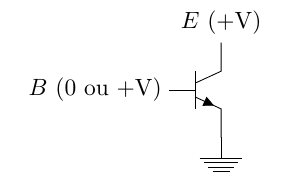
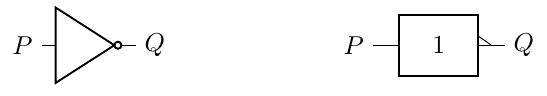
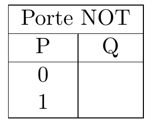
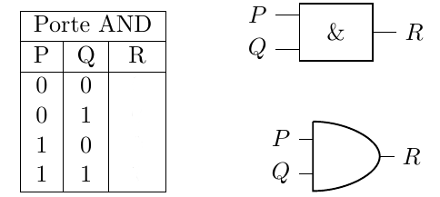
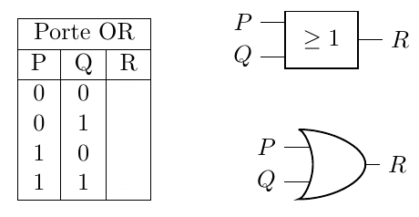

??? quote "Version PDF de ce cours"
    <center>
    [:material-cursor-default-click: Télécharger ce cours au format PDF](documents/booleens.pdf){ target="_blank" }
    </center>
    
# Introduction à la logique booléenne

## Les portes logiques NOT, AND et OR

Les *circuits* d’un ordinateur (mémoire, microprocesseur, etc.) manipulent uniquement des **chiffres binaires** `0` et `1` qui, en interne, sont représentés à l'aide de **tensions électriques**. Ainsi, le bit `0` est représenté par une tension basse (proche de 0 volt) et le bit `1` par une tension haute (que l’on notera $+V$ volts, car cette tension varie selon les *circuits*).

Les **opérateurs** (**logiques** ou **arithmétiques**) sur ces nombres binaires sont construits à partir de *circuits électroniques* dont les briques élémentaires sont appelées **transistors**. Les **transistors** que l’on trouve dans les circuits des ordinateurs se comportent comme des **interrupteurs** qui laissent ou non passer un courant électrique, selon le mode du tout ou rien, comme représenté graphiquement de la manière suivante.

{ width="250" }


Dans ce schéma, la **broche B** est responsable de la **commande** de l'**interrupteur**. Lorsque la broche **B** est alimentée en **tension élevée**, elle permet au courant de circuler entre la broche **E** (également alimentée en **tension élevée**) et la **masse**, indiquée par une petite flèche pour indiquer le sens du courant. Cette action a pour effet de mettre la **broche E** à une **tension basse**, tout en veillant à éviter les courts-circuits grâce à la présence de résistances placées judicieusement.\newline

À l'inverse, lorsque la **broche B** est alimentée en **tension basse**, la **broche E** reste maintenue à une **tension élevée**. Ce **transistor** simple permet d'accomplir une **opération de base** appelée **porte logique NON** (ou *NOT* en anglais). Une porte logique est une fonction qui prend un ou plusieurs **bits** en **entrée** et génère un **bit** en **sortie**.

!!! abstract "Porte *NOT*"

    La porte logique **NOT** réalisée par le transistor ci-dessus est la plus élémentaire de toutes les portes logiques. Elle ne comporte qu'**un seul bit en entrée** (noté **P**) et produit **un bit en sortie** (notée **Q**) égale à `0` lorsque l'entrée est à `1`, et inversement, elle génère une sortie à `1` lorsque l'entrée est à `0`. Sur le schéma ci-dessous, la porte **NOT** est représentée graphiquement, avec la notation américaine à gauche et la notation européenne à droite :

    { width="350" }

    Pour représenter le calcul réalisé par une *porte logique*, on utilise une *table logique* ou *table de vérité* qui relie les **valeurs** des **entrées** à la **valeur** du **résultat**. La table logique de la porte **NOT** est donnée ci-dessous :

    { width="170" }

!!! abstract "Porte *ET*"

    Une autre **porte logique** très importante est la porte **ET** (**AND** en anglais).
    Elle peut aussi être construite avec plusieurs portes **NOR**. Voici ci-dessous la **table de vérité** de la porte **ET**, ses représentations symboliques **américaine** (*en bas*) et **européenne** (*en haut*) :

    { width="350" }

!!! abstract "Porte *OU*"

    Enfin, voici la porte **OU** (**OR** en anglais) qui est également beaucoup utilisée :

    { width="350" }

## Les fonctions booléennes

Certains **circuits électroniques** peuvent être conceptualisés en termes de **fonctions booléennes**, ce qui signifie qu'ils acceptent **un** ou **plusieurs bits en entrée** et produisent **un seul bit en sortie**.
Les **portes logiques** vues précédemment peuvent ainsi être considérées comme des **fonctions booléennes élémentaires**.

Ainsi, si nous désignons $\neg (x)$ comme la fonction associée à la porte **NOT**, $\land (x, y)$ comme celle associée à la porte **AND**, et $\lor (x, y)$ comme celle de la porte **OR**, ces trois fonctions sont caractérisées par les **tables de vérité** suivantes :

{ width="450" }

Les trois **fonctions booléennes élémentaires** $\neg (x)$, $\land (x, y)$ et $\lor (x, y)$ sont utilisées comme **bases** pour la construction d'**autres fonctions booléennes**. On peut combiner ces trois fonctions pour en définir de nouvelles.

Aussi, pour simplifier la définition des fonctions booléennes, on utilisera plutôt ces fonctions comme des **opérateurs**, et on écrira et dira que :

- $\neg x$ est la négation de x,
- $x \land y$ est la conjonction de x et y,
- $x \lor y$ gest la disjonction de x et y.

## En Python

### Opérations bit-à-bit

Python dispose de nombreux **opérateurs** qui permettent d'effectuer des **opérations logiques** entre des **bits**. On les appelle **opérateurs *bit-à-bit*** (*bitwise* en anglais).

L’opérateur `&` réalise un **et logique** entre les **représentations binaires de deux nombres**.

```python
>>> 5 & 12
4
>>> bin(0b0101 & 0b1100)
’0b100’
```

*Rappel* : La fonction `bin(x)` renvoie l'écriture binaire d'un nombre entier `x`.

L'opérateur `|` permet quant à lui d'effectuer un **OU bit-à-bit**.

### Décalages de bits

Python propose également des **opérateurs** pour **décaler les bits** d’un **nombre** vers la **droite** ou vers la **gauche**. On note ces opérateurs `<<` et `>>`, et ils prennent **deux arguments** : le **nombre** dont il faut **décaler les bits** et le **nombre de position à décaler**.

Par exemple, pour décaler les bits d’un nombre de **2 positions vers la gauche**, on écrira :

```python
>>> 10 << 2
40
>>> bin(0b0001010 << 2)
’0b101000’
```
Si on avait voulu **décaler vers la droite**, on aurait utilisé l'opérateur `>>`.
On constate que **décaler d'un cran à gauche** permet de **multiplier un nombre par deux** et que **décaler d'un cran à droite** permet de **diviser un nombre par deux**.