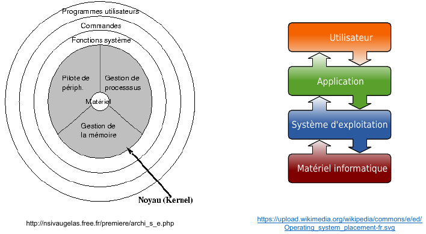

# Systèmes d'exploitation

## Introduction

Examinons ensemble le petit script Python ci-dessous :

```python
from os.path import getsize
from tkinter.filedialog import askopenfilename

fichier = askopenfilename()

if fichier:
    print(fichier, "fait", str(getsize(fichier)), "octets")
```

La fonction `askopenfilename()` génère une **boîte de dialogue** pour **sélectionner un fichier**. Si l'utilisateur **annule l'opération** en **fermant la boîte de dialogue**, la fonction **renvoie une chaîne de caractères vide**. Autrement, elle **renvoie** une **chaîne de caractères** contenant le **chemin du fichier**, comprenant le **nom du fichier** et **tous les répertoires nécessaires pour y accéder**.

Une fois que le nom du fichier est obtenu, le programme **vérifie qu'il n'est pas vide**.  
Dans ce cas, il **affiche** le **nom du fichier** ainsi que **sa taille en octets**, obtenue grâce à la fonction `getsize()` de la bibliothèque standard Python. Le programme se termine lorsque l'utilisateur **ferme la fenêtre** créée par l'appel à `askopenfilename()`.

!!! success ""
    Ce **script** met en lumière **différentes fonctionnalités fournies par un système d'exploitation** :
    
    - Tout d'abord, **lors de l'exécution du programme**, **le reste du système continue de fonctionner sans interruption**, ce qui reste transparent à la fois pour l'utilisateur (le programme s'ajoute à la liste des programmes en cours d'exécution) et pour le programmeur (le code est une séquence d'instructions indépendante des autres programmes en cours). Ensuite, on observe que **le nombre potentiel de programmes en cours d'exécution** peut **dépasser le nombre de processeurs de la machine**, suggérant que quelque chose permet à tous les programmes de fonctionner en parallèle sans intervention du programmeur.
    - Deuxièmement, le programme fonctionne correctement **indépendamment de l'emplacement du fichier choisi** (disque dur, partage réseau, clé USB). Le programmeur n'a pas besoin d'écrire un code spécifique pour gérer **différents périphériques de stockage**. De plus, le programme s'exécute **de manière cohérente**, quelle que soit **la taille de l'écran** ou le **dispositif de pointage utilisé** (pavé tactile ou souris).
    - Enfin, quel que soit la taille du fichier, le **temps d'exécution du programme**, une fois le **fichier choisi**, reste **constant**. Notamment, la **demande de la taille** d'un **grand fichier** est **aussi rapide que pour un fichier plus petit**. De plus, le programme peut répondre même pour des fichiers très simples (comme des fichiers texte) qui ne contiennent pas leur taille comme information. Ces observations suggèrent que "le système" maintient des **méta-données associées aux fichiers**, telles que **leur taille** ou **leur type**.

## Une vidéo d'introduction

Voici une petite **vidéo d'introduction aux systèmes d'exploitation** :

<center>
[:octicons-video-16: Visionner la vidéo](https://www.youtube.com/watch?v=4OhUDAtmAUo){ target="_blank" }
</center>

!!! success ""
    Pour faire l'interface entre le ma**t**ériel et l'**utilisateur**, un **ensemble de programmes**, appelé **système d'exploitation** (**SE** ou **OS** en anglais pour *Operating System*) "tournent" donc en permanence sur un ordinateur de façon à faciliter son utilisation.
    
    Les **utilisateurs** utilisent les **applications**, qui demandent des **ressources** au **système d’exploitation**, qui **pilote le matériel informatique**, le partageant entre **différentes applications** et **différents utilisateurs**.
    
    Le système d'exploitation étant **proches de la machine**, les **plus anciens** étaient donc **écrits en assembleur**; actuellement, ils sont généralement écrits **dans un langage à mi-chemin entre le bas niveau et le haut niveau**, comme le **langage C**.

## Principes généraux et composants logiciels

Un **système d'exploitation** est un **programme** ou un **ensemble de programmes** conçus pour **gérer les ressources matérielles et logicielles d'un ordinateur**. Son rôle principal est de **fournir** un **accès unifié** aux **ressources de la machine** pour les programmes utilisateurs. Le schéma ci-dessous illustre la position du système d'exploitation et ses diverses interactions :



L'**utilisateur** interagit avec des **programmes** tels que des *jeux*, un *navigateur web* ou un *logiciel de traitement de texte*. Ces **programmes** nécessitent l'**utilisation des ressources matérielles** pour effectuer leurs tâches, comme la lecture ou la sauvegarde de fichiers, l'affichage d'images à l'écran, ou la récupération des caractères saisis au clavier ou de la position du pointeur de la souris. Le **système d'exploitation** offre un **ensemble de fonctions primitives** permettant cette **interaction avec le matériel**.
Le système d'exploitation permet à l'utilisateur de s'**abstraire du matériel**, en fournissant des **services communs** pour **tous les matériels**.

!!! abstract "Principaux éléments d'un SE"
    Un système d’exploitation est constitué de différents éléments :

    1. Le ==**noyau**== : C’est le **cœur du système**. Il est lui-même constitué de **plusieurs composants logiciels** :
          - L'==**ordonnanceur**==, responsable de la décision quant à quel **programme** doit **s'exécuter à un moment donné** sur le **processeur**.
          - Le ==**gestionnaire de mémoire**==, chargé de **répartir la mémoire vive** entre les **différents programmes en cours d'exécution**.
          - Les différents ==**systèmes de fichiers**==, déterminant la **manière** de **stocker les fichiers** sur des **supports physiques** tels que *disques*, *clés USB*, *disques optiques*, etc.
          - La ==**pile réseau**==, implémentant, entre autres, des **protocoles** tels que **TCP/IP** (on en parlera lors du chapitre dédié aux réseaux informatiques).
          - Les ==**pilotes de périphériques**==, également appelés "drivers" en anglais, ayant pour objectif de **gérer** les **dispositifs matériels** tels que **cartes graphiques**, **disques durs**, **claviers**, etc.
    2. L'==**invite de commande**== : C’est un moyen d’accéder directement à **certaines fonctions du système d’exploitation** ou à sa **configuration**. Il existe plusieurs variantes de l’**invite de commande** (ou *Shell* en anglais), par exemple `bash`, `ksh` et `zsh` sur les systèmes Linux.
    3. L'**==interface graphique==** : L’interface graphique est une **IHM** (**I**nterface **H**omme **M**achine) permettant d’interagir avec le système d’exploitation et les applications dans un environnement graphique.

Voici une vidéo proposée par Lumni sur le **fonctionnement d'un système d'exploitation** :

<center>
[:octicons-video-16: Visionner la vidéo](http://www.lumni.fr/video/comprendre-ce-qu-est-un-systeme-d-exploitation){ target="_blank" }
</center>

## Historique des systèmes d'exploitation

- **Avant 1950** : Les premiers calculateurs, comme l'ENIAC (1945), ne disposent **pas de système d'exploitation**. Ils exécutent **un seul programme à la fois**, saisi en **recâblant physiquement** l'ordinateur via la connexion de câbles entre différentes sections effectuant des calculs élémentaires.
- **1956** : **GM-NAA I/O** est l'un des premiers systèmes d'exploitation. Ce programme opère sur le calculateur **IBM 704** et a pour rôle d'exécuter séquentiellement des programmes utilisateurs stockés sur des cartes perforées. Il propose également des **routines** pour accéder facilement aux **périphériques d'entrée/sortie**.
- **1967** : **MultICS** (Multiplexed Information and Computing Service), développé au centre de recherche de  **Bell Labs** et au **MIT**, est l'un des premiers **systèmes d'exploitation à temps partagé**, permettant à **plusieurs programmes** de s'**exécuter simultanément**. Il influence considérablement les systèmes d'exploitation modernes.
- **1970-1990** : ==**Unix**==, créé par l'entreprise **AT&T** et développé à **Bell Labs**, est l'un des **premiers systèmes d'exploitation multitâches et multi-utilisateurs**. Ses premières versions sont écrites en **assembleur**, puis en **langage C**, créé à cet effet. Une **variante d'Unix**, la *Berkeley Software Distribution* (*BSD*), voit le jour et prospère entre **1978** et **1990**.
- **1960-1980** : Les ordinateurs **IBM** utilisent divers systèmes d'exploitation, différents d'**Unix**. À partir des années **1980**, ils adoptent notamment le système ==**MS-DOS**== de **Microsoft**, conçu pour fonctionner exclusivement sur le processeur **x86** d'**Intel**.
- **1980-1990** : Le succès de l'**architecture x86** d'**Intel** et de l'**ordinateur personnel** (**PC**) établit **MS-DOS** comme le **principal système d'exploitation pour les particuliers** et de **nombreux secteurs d'activité**.
- **1990-présent** : **Microsoft** développe un **système graphique au-dessus de MS-DOS**, qui évolue ensuite en un **système d'exploitation indépendant**, le système ==**Windows**==. Il devient le système le plus largement utilisé sur les **PC** après **MS-DOS**.
- **1984-2001** : En parallèle, Apple commercialise des ordinateurs personnels basés sur l'architecture **Motorola** puis **PowerPC**. Ces machines fonctionnent avec le système d'exploitation ==**Mac OS**==, un système graphique.
- **1991** : **Linus Torvalds**, étudiant à l'Université d'Helsinki, souhaite modifier le système **MINIX** (variante d'Unix pour processeurs Intel, développée par Andrew S. Tanenbaum). Ne pouvant diffuser les modifications en raison de la licence logicielle, Torvalds crée son propre système d'exploitation, ==**Linux**==, qu'il diffuse sous la **licence libre GNU GPL**.
- **1991-présent** : **Linux** connaît une adoption rapide en raison de sa diffusion sous **licence libre**, devenant un système d'exploitation courant pour **serveurs**, **calculs** et **stockage**.
- **2001-présent** : **Apple** crée ==**macOS**==, basé sur **BSD**, en tant que **nouveau système d'exploitation**.
- **2007-présent** : **Apple** adapte le **cœur de macOS** pour les **téléphones portables** et le commercialise.
- **2008-présent** : **Google** diffuse ==**Android**==, un système d'exploitation pour téléphones mobiles, utilisant le **noyau Linux** auquel des **programmes** et **bibliothèques non libres** sont ajoutés.

## Systèmes libres vs propriétaires

Les systèmes d'exploitation **Windows**, **macOS** ou encore **UNIX** sont considérés comme des systèmes ==**"propriétaires"**== (certains utilisent le terme "privateurs"), ce qui signifie qu'ils **ne sont pas libres**. Mais qu'est-ce qu'un **logiciel libre** de manière plus générale ?

!!! quote ""
    Selon *Wikipédia*, "Un logiciel libre est un logiciel dont l'utilisation, l'étude, la modification et la duplication par autrui en vue de sa diffusion sont permises, techniquement et légalement, ceci afin de garantir certaines libertés induites, dont le contrôle du programme par l'utilisateur et la possibilité de partage entre individus." Le système UNIX ne respecte pas ces droits (par exemple, le code source d'UNIX n'est pas disponible, rendant l'étude d'UNIX impossible). UNIX est donc considéré comme un système "propriétaire", opposé à un système "libre". Il est important de noter que la notion de logiciel libre ne signifie pas nécessairement qu'il est gratuit, bien que cela soit souvent le cas. La confusion entre "libre" et "gratuit" provient de l'anglais, car "free" signifie à la fois "libre" et "gratuit".

En **1991**, **Linus Torvalds**, un étudiant finlandais, décide de créer un **clone libre d'UNIX** à partir de zéro, car le **code source d'UNIX** n'est **pas public**. Ce **clone d'UNIX** est baptisé ==**Linux**== (Linus + UNIX).

Voici une courte vidéo racontant l'histoire de Linux avec plus de détails :

<center>
[:octicons-video-16: Visionner la vidéo](https://www.youtube.com/watch?v=IquNF_DXcF8){ target="_blank" }
</center>

!!! abstract ""
    La différence fondamentale réside dans le fait que le **code** d'un **logiciel libre** (et donc d'un système libre) est **public**. En général, on peut le **modifier** ou **l'utiliser pour créer de nouveaux produits**.

    Les **logiciels propriétaires** sont généralement **non ouverts**, ce qui rend **plus difficile** (voire illégal) leur **modification**.

    Les **logiciels libres** sont souvent **entretenus par la communauté**, mais peuvent également l'être par des **entreprises** les utilisant et ayant **intérêt** à les **maintenir efficaces et utilisés par d'autres**, garantissant ainsi la **disponibilité de développeurs** pour contribuer à leur maintenance.

    Quant aux **logiciels propriétaires**, ils sont principalement **développés** et **mis à jour par l'entreprise qui les possède** et qui peut décider d'**arrêter de les maintenir**.

    Ce sont deux modèles économiques très différents.

    - **Systèmes libres** : GNU/Linux, GNU/BSD, Android (pas complètement),...
    - **Systèmes propriétaires** : Windows, macOS, iOS,...

    Les **systèmes d'exploitation libres** ont longtemps été perçus comme destinés uniquement aux "geeks" et autres experts en informatique, difficiles à utiliser par le grand public en raison de leur complexité. Cette réputation est aujourd'hui **complètement injustifiée**, car ils sont devenus aussi **conviviaux** que les systèmes propriétaires "classiques".

## TP - Les commandes Linux

!!! success "À télécharger"
    Téléchargez les **trois fichiers suivants** :

    - [activite_commandes.odt](documents/activite_commandes.odt){ target="_blank" } - L'énoncé de l'activité, à compléter directement dans le fichier.
    - [commandes_linux.pdf](documents/commandes_linux.pdf){ target="_blank" } - Récapitulatif des commandes Linux essentielles.
    - [v86state.bin](https://www.mediafire.com/file/38sc8rsjy4qa8oc/v86state.bin/file){ target="_blank" } - Une sauvegarde d'état de la machine que vous allez utiliser.