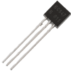

# Modèle d'architecture de Von Neumann

Les **ordinateurs** tels que nous les connaissons aujourd'hui sont parfaitement intégrés à notre quotidien, si bien qu'il peut être difficile d'imaginer tout le cheminement qu'il a été nécessaire de faire pour en arriver là.

Les premiers "vrais" **ordinateurs** apparaissent aux États-Unis et en Angleterre, juste après la guerre. Il s'agit de **machines** capables d’exécuter des **programmes**. Mais qu'est-ce qu'un **programme**, d'abord ?

Un ==**programme**==, c'est un ==**algorithme**== **ET** des ==**données**==. Les deux sont intimement liés, et doivent être stockés dans une **mémoire**.

## Introduction : Histoire des ordinateurs

Avant d'en arriver à nos **ordinateurs modernes**, de nombreuses **machines** ont été réalisées depuis l'**Antiquité** pour effectuer des **calculs**.

Visionnez la petit vidéo suivante sur l'**histoire de l'architecture des ordinateurs** :

[:octicons-video-16: Visionner la vidéo sur *Lumni*](https://www.lumni.fr/video/une-histoire-de-l-architecture-des-ordinateurs){ target="_blank" }

!!! note "Exercice 1"
    En vous basant sur la partie de la vidéo ci-dessus, répondez aux **questions** suivantes :

    1. Comment étaient transmis les programmes avec l’**ENIAC** ?
    2. Reproduire le schéma de l’**architecture de Von Neumann** présenté dans la video.
    3. Quel était le **composant fondamental** des premiers ordinateurs (**ENIAC**, **EDVAC**) ? Quels étaient ses **inconvénients** ? Quel **composant** l’a remplacé dans les **années 1950** et est encore utilisé dans les **ordinateurs modernes** ?
    4. Commenter le **tableau** ci-dessous.  
    { width="450" }
    5. Qu’appelle-t-on **System On a Chip** ?

??? tip "Correction exercice 1"
    1. L'**ENIAC** (*Electronic Numerical Integrator and Computer*), l'un des premiers ordinateurs électroniques, a été programmé en utilisant des **panneaux de connexion** et des **interrupteurs**. Les **instructions** et les **données** étaient **saisies manuellement par les opérateurs** en **connectant des câbles** et en **positionnant les interrupteurs**, ce qui était un processus laborieux et propice aux erreurs.
    2. Voir la suite de ce cours.
    3. Le composant fondamental des premiers ordinateurs tels que l'**ENIAC** et l'**EDVAC** était le **tube à vide**, également appelé **tube électronique** ou **lampe à vide**. Les **tubes à vide** étaient utilisés comme **éléments de commutation et de stockage d'informations binaires**. Cependant, ils présentaient des **inconvénients** tels que leur **taille**, leur **consommation d'énergie élevée**, leur **production de chaleur importante** et leur **propension à défaillir**.  
    Les tubes à vide ont été largement remplacés dans les **années 1950** par les **transistors**, qui sont **beaucoup plus compacts**, plus **fiables**, plus **robustes** et **consomment moins d'énergie**. Cette transition a marqué le début de l'ère des **ordinateurs à transistors**. Les **transistors** sont toujours utilisés dans les **ordinateurs modernes**, mais ils sont **intégrés à une échelle beaucoup plus petite** grâce à la **miniaturisation des composants électroniques**.
    4. On constate qu'au fil du temps, le **nombre de transistor** a considérablement **augmenté**, et que la **surface** nécessaire par **transistor** a **fortement diminuée**.
    5. Le terme "System On a Chip" (SoC) désigne un concept où **tous les composants nécessaires** pour exécuter un **système complet** sont **intégrés sur une seule puce**. Cela inclut le **processeur** central (**CPU**), la **mémoire**, les **interfaces d'entrée/sortie**, et parfois même des **composants spécialisés**. Les **SoC** sont largement utilisés dans les **dispositifs électroniques modernes** tels que les **smartphones**, les **tablettes**, et d'autres appareils intégrés comme les **Raspberry**, offrant une solution compacte et économe en énergie.

!!! abstract "Résumé historique"
    

    [:octicons-video-16: Télécharger la présentation (pour voir les inventions en images)](documents/NSI-archi.pdf){ target="_blank" }
    

    **Machines de l'Antiquité** :

    - **Anticythère** (*150-100 av. J.-C.*) : Un ancien mécanisme qui a servi à effectuer des calculs astronomiques, représentant une première utilisation de la mécanique pour le traitement de l'information.
    - **Odomètre** de Héron d'Alexandrie (10-70 apr. J.-C.) : Un dispositif antique pour mesurer les distances, montrant une application précoce de la technologie à des besoins pratiques.

    **17e siècle** :
    
    - **Pascaline** (*1642*) : Inventée par Blaise Pascal, la Pascaline est une calculatrice mécanique précoce, symbolisant les premiers efforts pour automatiser les calculs.

    **19e siècle** :
    
    - **Machine analytique de Babbage** (conçue dans les *années 1830*) : Conception révolutionnaire préfigurant les ordinateurs programmables, même si elle n'a jamais été construite de son vivant.

    **Analyse de Charles Babbage et Ada Lovelace** :

    - **Ada Lovelace** (*1843*) : Pionnière dans la programmation informatique, Ada Lovelace a créé le premier programme pour la machine analytique, jetant les bases de la programmation.

    **20e siècle** :

    - **"A Symbolic Analysis of Relay and Switching Circuits"** de Shannon (*1937*) : Le travail de Claude Shannon a établi les fondements de la théorie des circuits logiques, essentielle à la conception des premiers ordinateurs.

    - **ENIAC** (*1946*) : Le premier ordinateur électronique à grande échelle, l'ENIAC, a marqué le passage des calculateurs mécaniques aux **machines électroniques programmables**.

    - **"First Draft of a Report on the EDVAC"** de Von Neumann (*1945*) : Le document de Von Neumann a introduit le concept d'architecture von Neumann, standard pour la conception des ordinateurs modernes. Il s'est basé sur les travaux d'**Alan Turing** (en 1936), notamment des concepts suivants :
        - **Machine de Turing** : Turing a proposé un **modèle abstrait** de machine, connu sous le nom de machine de Turing, qui fonctionne selon des règles simples et manipule des symboles sur une bande infinie. Cette machine hypothétique possède une tête de lecture/écriture mobile qui peut se déplacer vers la gauche ou la droite et changer l'état de la machine en fonction des symboles lus. Voici une [petite vidéo du CNRS](https://images.cnrs.fr/video/3001){ target="_blank" } sur le sujet, que je vous invite à visionner.
        - **Universalité** : Turing a démontré qu'il était possible de construire une machine de Turing universelle, capable de simuler n'importe quelle autre machine de Turing. Cette idée d'universalité signifie que, en principe, une seule machine pourrait exécuter n'importe quel programme, établissant ainsi le concept de programmabilité et d'instructions stockées.

    **Développements clés dans les composants électroniques** :

    - **Transistor** (*1947*) : L'invention du transistor a révolutionné l'électronique, remplaçant les tubes à vide et permettant la miniaturisation des composants.

    - **Circuit intégré** (*1958*) : Les circuits intégrés ont consolidé de multiples composants sur une seule puce, accélérant les calculs et réduisant la taille des ordinateurs.

    - **MOS Transistor** (*1960*) : Le transistor MOS a ouvert la voie aux circuits intégrés à faible consommation d'énergie, crucial pour les appareils portables et les microprocesseurs modernes.

    **Évolution des composants électroniques** :

    - **7400 - Texas Instruments** (*1964*) : La série 7400 de circuits intégrés logiques a facilité la construction de systèmes électroniques plus complexes.

    - **4004 - Intel** (*1971*) : Le premier microprocesseur, le 4004, a introduit l'idée d'un processeur complet sur une seule puce, marquant le début de l'ère des ordinateurs personnels.

    - **Power4 - IBM** (*2001*) : L'architecture avancée de Power4 a ouvert la voie aux serveurs hautes performances et aux superordinateurs.

    - **Snapdragon 855 - Qualcomm** (*2018*) : La puce mobile Snapdragon 855 a défini de nouveaux standards pour les performances des appareils mobiles et l'intégration de technologies avancées.

    **Architecture moderne** :

    - **Carte mère** (*1980s*) : La carte mère est devenue le socle central d'un ordinateur, connectant tous les composants et permettant une évolutivité aisée.

    - **Raspberry Pi** (*2012*) : La sortie du Raspberry Pi a rendu les ordinateurs accessibles à un public plus large grâce à son faible coût et à sa polyvalence pour les projets informatiques.

## Le modèle de Von Neumann

### Présentation

Le **modèle d'architecture de Von Neumann**, fondamental dans la **conception des ordinateurs modernes**, tire ses origines des travaux novateurs d'**Alan Turing** sur les **machines universelles**.

Développé dans les **années 1940** par le **mathématicien** et **physicien John von Neumann**, ce modèle a été influencé par les idées de **Turing** concernant les **machines universelles de calcul**.

L'**architecture de Von Neumann** repose sur le concept de ==**programme**== **stocké**, où les **instructions** et les **données** sont **traitées de la même manière** et sont **toutes deux stockées dans la mémoire de l'ordinateur**. Cela contraste avec les premières machines, où les **programmes** étaient **câblés physiquement**. L'introduction de cette architecture a considérablement simplifié le processus de programmation, permettant aux programmeurs de manipuler les **instructions** comme des **données**.

Le **modèle de Von Neumann** a donc joué un rôle crucial dans l'**évolution des ordinateurs** en les rendant **plus flexibles**, **programmables** et capables d'exécuter une **variété de tâches** en fonction des **instructions fournies**, contribuant ainsi de manière significative à l'essor de l'informatique moderne.

<figure markdown>
  { width="250" }
  <figcaption>Modèle de Von Neumann</figcaption>
</figure>

??? tip "Voir une version plus détaillée du modèle de Von Neumann"
    <figure markdown>
    { width="500" }
    <figcaption>Modèle de Von Neumann</figcaption>
    </figure>

!!! abstract "Modèle de Von Neumann"
    Un **ordinateur** est une machine ==**programmable**==, ==**automatique**== et ==**universelle**== :

    - **programmable** : la séquence d’opérations exécutée par un ordinateur peut être entièrement spécifiée dans le texte d’un programme ;
    - **automatique** : un ordinateur peut exécuter un programme sans intervention extérieure (câblage . . .) ;
    - **universelle** : un ordinateur peut exécuter tout programme calculable (selon la théorie de Turing) avec le jeu d’instructions **câblé dans son processeur**.

    En **1945**, **John von Neumann**, **mathématicien** hongrois exilé aux États-Unis, publie un rapport sur la réalisation du **calculateur EDVAC** où il propose une **architecture** permettant d’**implémenter une machine universelle**, décrite par **Alan Turing** dans son article fondateur de **1936** sur le problème de l’**indécidabilité**.

    L’**architecture de Von Neumann** va servir de modèle pour ==la plupart des ordinateurs de 1945 jusqu’à nos jours==, elle se compose de **quatre parties distinctes** :

    - L’==**Unité Centrale de Traitement**== (*Central Processing Unit* en anglais) ou **Processeur**, qui permet d'exécuter les instructions machine des programmes informatiques, est constituée de **deux sous-unités** :
        - L’==**Unité de Commande**== (*UC*) charge la **prochaine instruction** dont l’**adresse mémoire** se trouve dans un **registre** appelé **Compteur de Programme** (PC en anglais) ou **Compteur ordinal**, la **décode** avec le **décodeur** et commande l’**exécution** par l’**ALU** avec le **séquenceur**. L’instruction en cours d’exécution est chargée dans le **Registre d’Instruction** (**IR**). L’Unité de Commande peut aussi effectuer une **opération de branchement**, un **saut dans le programme**, en modifiant le **Compteur de Programme**, qui par défaut est **incrémenté de 1** lors de chaque instruction.
        - L’==**Unité Arithmétique et Logique**== (*ALU* en anglais) qui réalise des **opérations arithmétiques** (*addition*, *multiplication*...), **logiques** (*et*, *ou*...), de **comparaisons** ou de **déplacement de mémoire** (*copie de* ou *vers* la mémoire). L’**ALU** stocke les données dans des **mémoires d’accès très rapide** appelées **registres**. Les **opérations** sont réalisées par des **circuits logiques** constituant le **jeu d’instructions** du processeur.
    - La ==**mémoire**== où sont stockés les **données et les programmes**.  
    Il y a différents **types de mémoires** : la mémoire **volatile** (*RAM* par exemple), la mémoire **permanente** (*disque dur* par exemple).
    - Des ==**bus**== qui sont des **fils** reliant le **CPU** et la **mémoire** et permettant les **échanges de données et d’adresses**. Les ==**adresses**==, les ==**données**== et les ==**commandes**== circulent par les **bus**. Un **bus** ne peut être utilisé que par deux
    composants (émetteur/récepteur) à la fois !
    - Des ==**dispositifs d’entrées/sorties**== permettant d’échanger avec l’extérieur (**lecture** ou **écriture** de **données**).

    **Dans le modèle de Von Neumann, le processeur exécute une instruction à la fois, de façon séquentielle.**

??? abstract "Cycle d'instruction"
    Le **cycle d’une instruction** est constitué d’un **cycle de recherche** puis d’un **cycle d’exécution** qui mettent en jeu des **échanges** entre la **mémoire** et l’**Unité Centrale de Traitement** (qui contient l'**ALU** et les **registres**), synchronisés par des **signaux périodiques** émis par une **horloge à quartz**. Chaque **cycle** peut couvrir plusieurs **cycles d’horloge**.

    <figure markdown>
    
    <figcaption>^^Source^^ : Architecture et technologie des ordinateurs d’Emmanuel Lazard</figcaption>
    </figure>

    Le **cycle d'instruction** dans une **architecture de Von Neumann** suit généralement ces étapes :

    1. **Fetch** (Chargement) : L'**unité de contrôle** (*Control Unit*) extrait l'instruction depuis la **mémoire principale** (*RAM*) à l'adresse spécifiée par le **compteur de programme** (Program Counter, registre **PC**), puis la stocke dans le **registre d'instruction**.
    2. **Decode** (Décodage) : L'**unité de contrôle interprète l'instruction** extraite pour comprendre **quelle opération** doit être effectuée et sur **quelles données**.
    3. **Execute** (Exécution) : L'**unité de traitement** (*ALU - Arithmetic Logic Unit*) effectue l'opération demandée, que ce soit une opération **arithmétique**, **logique** ou de **transfert de données**.
    4. **Write Back** (Écriture) : Les **résultats** de l'**opération** peuvent être **stockés** dans un **registre** ou dans la **mémoire**, en fonction de l'**instruction**.
    5. **Increment** (Incrémentation) : Le **compteur de programme** (registre **PC**) est généralement **incrémenté** pour **pointer vers l'instruction suivante**.

    Ce cycle se répète continuellement, traitant chaque instruction séquentiellement. Chaque étape du cycle est synchronisée par l'**horloge du système**. L'architecture de Von Neumann permet à l'ordinateur de charger des instructions depuis la mémoire, de les décoder, de les exécuter et d'écrire les résultats, suivant ainsi un **modèle séquentiel**. Cette architecture est fondamentale dans la conception des processeurs modernes.

??? abstract "Registres PC et IR"
    Le **compteur de programme** (**PC** pour *Program counter*) contient en permanence l'**adresse de la prochaine instruction à exécuter**.

    À chaque **début de cycle d'exécution**, l'**instruction à exécuter** est **chargée** dans le **registre IR** à partir de l'**adresse contenue dans le registre PC**.

    Ensuite, le **registre PC est incrémenté** pour **pointer** sur l'**instruction suivante**.

    Le **registre d'instruction** (**IR**) contient l'**instruction en cours d'exécution**.

    Ce **registre** est **chargé** au **début du cycle d'exécution** par l'**instruction** dont l'**adresse** est donnée par le **compteur de programme PC**.

### La mémoire

La **mémoire** joue un rôle essentiel dans le **stockage de données et de programmes**. Elle se subdivise en **deux catégories** distinctes :

- La **mémoire volatile**, qui héberge les **programmes** et les **données en cours d'utilisation** (on parle de *processus* pour les programmes en cours d'utilisation). Cette mémoire perd son contenu dès qu'elle n'est plus **alimentée** en énergie.
- La **mémoire permanente**, qui renferme les **programmes** et les **données fondamentaux** de la **machine**. Contrairement à la **mémoire volatile**, cette mémoire **conserve son contenu** même en cas de mise **hors tension**.

La plupart des mémoires organisent les informations par **adresses**, chaque **octet** étant accessible via une **adresse unique**.

Pour des considérations économiques, les **mémoires** sont généralement regroupées en plusieurs catégories distinctes.

#### Une mémoire de masse ou mémoire de stockage

<figure markdown>
{ width="200" }
<figcaption>HDD</figcaption>
</figure>

<figure markdown>
{ width="200" }
<figcaption>SSD</figcaption>
</figure>

Elle permet de stocker à **long terme** des **grandes quantités d’informations**. Les technologies les plus courantes de mémoires de masse sont **électromécaniques** (**disques durs – HDD**) ou à semi-conducteurs (**SSD**, **clefs USB**, …), elles visent à obtenir une capacité de stockage élevée à faible coût et ont généralement une vitesse inférieure aux autres mémoires.

*ordres de grandeur* :

- **capacité** : jusqu’à 10 To (HDD)
- **vitesse** : jusqu’à 500 Mo/s (SSD)

#### La mémoire vive, ou RAM

<figure markdown>
{ width="300" }
<figcaption>SDRAM</figcaption>
</figure>

La **mémoire vive**, également connue sous le nom de **RAM** (*Random Access Memory*), constitue l'**espace principal de stockage du microprocesseur**. Cependant, il s'agit d'une **mémoire volatile**, ce qui signifie que son contenu est **perdu** lorsque **l'alimentation est coupée**. Elle est nommée **RAM** en raison de son **accès rapide aux données, indépendamment de leur emplacement**.

*Ordres de grandeur* :

- **Capacité** : jusqu'à 32 Go
- **Vitesse** : jusqu'à 2 Go/s

#### Une mémoire cache

<figure markdown>
{ width="400" }
<figcaption>Différents niveaux de mémoire</figcaption>
</figure>

??? tip "Explication de ce schéma"
    **Mot** :
    
    - Le terme "mot" fait généralement référence à la plus petite unité de données que le processeur peut manipuler en une seule opération. La taille d'un mot peut varier en fonction de l'architecture du processeur, mais c'est souvent la taille des registres du processeur.

    **L1 et L2** :
    
    - **"L1"** et **"L2"** font référence aux niveaux de mémoire cache dans la **hiérarchie de mémoire d'un processeur**.
        -  **L1 (Level 1)** : C'est la première couche de mémoire cache, généralement intégrée directement dans le processeur. Elle est de petite capacité, mais elle offre une très haute vitesse d'accès. Le terme "ligne" entre "CPU" et "L1" pourrait indiquer le flux direct de données entre le processeur (CPU) et la mémoire cache de niveau 1.
        -  **L2 (Level 2)** : C'est la deuxième couche de mémoire cache, située généralement à proximité du processeur mais avec une capacité plus grande que la L1. La connexion entre L1 et L2 peut être représentée par le terme "ligne" et indique le transfert de données entre la mémoire cache de niveau 1 et la mémoire cache de niveau 2.

Bien que la **RAM** soit **rapide**, le **microprocesseur** l'est **encore plus** ! Pour éviter de limiter ses performances en le contraignant à attendre (connu sous le terme de goulot d'étranglement), on utilise des **unités de mémoire plus petites**, mais **considérablement plus rapides**, bien que plus **coûteuses**. Les différentes niveaux de mémoire cache servent à stocker temporairement des informations fréquemment consultées. Elles se distinguent par leur vitesse élevée et leur coût important pour une capacité de stockage limitée.

*Ordres de grandeur* :

- **Capacité** : quelques ko (L1) à quelques Mo (L2)
- **Vitesse** : jusqu'à 5 Go/s

#### Le registre de processeur

Intégré directement dans le **processeur**, le **registre de processeur** représente un type de mémoire **extrêmement rapide mais également coûteux**. En conséquence, il est réservé à une quantité **très restreinte** de données.

*Ordres de grandeur* :

- **Capacité** : quelques dizaines d'octets
- **Vitesse** : jusqu'à 30 Go/s

### Les bus

Afin de faciliter la circulation des données entre les divers composants d'un ordinateur tels que la mémoire, le CPU et les entrées/sorties, des systèmes de communication appelés bus sont utilisés. Ces bus se déclinent en trois catégories principales :

- Le **bus d'adresse** a pour fonction de transmettre des adresses, telles que l'adresse d'une donnée à extraire de la mémoire.
- Le **bus de données** est dédié à la transmission des données elles-mêmes.
- Le **bus de contrôle** a pour rôle de définir le type d'action à entreprendre, par exemple, l'écriture ou la lecture d'une donnée en mémoire.

<figure markdown>
{ width="450" }
<figcaption><u>Source</u> : <a href="https://info.blaisepascal.fr/nsi-modele-darchitecture-de-von-neumann/#Les_bus" target="_blank">info.blaisepascal.fr</a></figcaption>
</figure>

### Un petit QCM

??? tip "QCM d'entraînement"
    Qu'est-ce qui caractérise l'architecture de Von Neumann ?

    a. La présence d'une unité arithmétique et logique (UAL)
    b. La séparation de la mémoire et du processeur
    c. L'utilisation exclusive de la mémoire permanente

    Quelle est la fonction principale de l'unité de commande dans l'architecture de Von Neumann ?

    a. Effectuer des opérations arithmétiques
    b. Contrôler le flux d'instructions
    c. Stocker des données à long terme

    Quel composant est responsable de l'exécution des opérations arithmétiques dans un ordinateur de type Von Neumann ?

    a. Unité de commande
    b. Unité arithmétique et logique (UAL)
    c. Mémoire vive (RAM)

    Quelle est la caractéristique principale de la mémoire volatile dans l'architecture de Von Neumann ?

    a. Elle conserve son contenu après la mise hors tension.
    b. Elle est utilisée pour le stockage à long terme.
    c. Son contenu est perdu lorsqu'elle n'est plus alimentée.

    Quel est le rôle du bus d'adresse dans un système Von Neumann ?

    a. Faire circuler des adresses vers la mémoire
    b. Faire circuler des données
    c. Contrôler le type d'action à effectuer

    Pourquoi utilise-t-on des mémoires caches dans l'architecture de Von Neumann ?

    a. Pour augmenter la capacité de stockage
    b. Pour accélérer l'accès aux données fréquemment utilisées
    c. Pour réduire le coût global du système

    Qu'est-ce qui caractérise la mémoire permanente dans l'architecture de Von Neumann ?

    a. Sa volatilité
    b. Sa capacité à stocker des données de manière permanente
    c. Sa vitesse élevée d'accès aux données

    Quel est le rôle du registre de processeur dans l'architecture de Von Neumann ?

    a. Stocker des données de manière permanente
    b. Effectuer des opérations arithmétiques
    c. Stocker temporairement des données pour un accès rapide

    Quelle est la base du langage machine utilisé dans l'architecture de Von Neumann ?

    a. Base 8 (octal)
    b. Base 10 (décimale)
    c. Base 2 (binaire)

    Qui est considéré comme le père de l'architecture de Von Neumann ?
    
    a. Alan Turing
    b. John von Neumann
    c. Charles Babbage

## Organisation de la mémoire

!!! note "Exercice - Organisation de la mémoire"
    Pour vérifier votre compréhension de l'organisation de la mémoire, vous pouvez réaliser les **exercices 1 et 2** de la **partie 1** du document suivant proposé par le [lycée Louis Feuillade](https://www.nsi-a-feuillade.fr/){ target="_blank" } :

    

    [:material-cursor-default-click: Télécharger la fiche d'exercices](documents/04b-Exercice-simul_archi_von_Neumann673046053.pdf){ target="_blank" }
    

## Instructions machine

### Le transistor

Vous l'avez vu, le composant principal des **circuits d'un ordinateur** est le **transistor**.

<figure markdown>
  
  <figcaption>Un transistor</figcaption>
</figure>

Dans un ordinateur, les **transistors** agissent comme des **interrupteurs**, adoptant **deux états fondamentaux** :

- soit le transistor **autorise le passage du courant électrique** (interrupteur **fermé**),
- soit il le **bloque** (interrupteur **ouvert**). 

Cette dichotomie constitue l'essence même du fonctionnement d'un **transistor** dans un ordinateur, ne laissant place qu'à **deux états distincts** : soit le courant **circule** (état "haut"), soit il ne **circule pas** (état "bas"). Ces états sont souvent représentés par les **chiffres** `1` et `0` respectivement.  
Ainsi, le fonctionnement de l'ordinateur se résume à l'**utilisation exclusive de deux chiffres**, d'où la raison pour laquelle il opère en **base 2** (*système binaire*) plutôt qu'en base 10, comme dans la vie quotidienne.

Le **transistor** joue un rôle central dans la construction des circuits logiques, qui permettent d'effectuer des **opérations booléennes**. Ces opérations sont directement liées à l'**algèbre de Boole**, développée par le mathématicien britannique **George Boole** au **XIXe siècle**.

Pour en savoir plus sur les circuits logiques, vous pouvez [consulter ce cours](circuits.md).

### Le langage machine

Le **CPU** se consacre exclusivement à la gestion de **grandeurs booléennes**, d'où le codage en **binaire** des instructions qu'il exécute. Le **langage machine** (langage dit de *bas niveau*) englobe l'ensemble des **instructions directement exécutables par le microprocesseur**. En opposition, les **langages de programmation** évolués (langages dits de *haut niveau*) tels que **Python** ou **C++**, conçus pour l'interaction humaine, présentent des **instructions complexes** opérant sur des types de données bien plus élaborés que les simples booléens.

Ainsi, une **conversion du langage évolué** vers le **langage machine** est nécessaire, où chaque instruction évoluée engendre plusieurs **instructions élémentaires** en **langage machine**. Cette transition peut se faire soit par **compilation** (pour l'ensemble du code, c'est le cas avec le langage **C** par exemple), soit par **interprétation** (au fur et à mesure du déroulement du code, c'est le cas avec le langage **Python** par exemple).

!!! abstract "Instruction machine"
    Une **instruction machine**, essentiellement une **chaîne binaire** de **32 bits**, se compose principalement de deux parties :

    

    - le champ =="**code opération**"== spécifiant le **type de traitement** que le processeur doit réaliser (par exemple le code $0010~0110$ donne l’ordre au CPU d’effectuer une **multiplication**),
    - le champ =="**opérandes**"== indiquant la **nature des données** sur lesquelles l'opération désignée par le "code opération" doit s'appliquer.

    Les **instructions machines**, qualifiées d'**instructions de bas niveau**, englobent :

    - des ==**opérations arithmétiques**== (*addition*, *soustraction*, *multiplication*).  
    *Par exemple, on peut avoir une instruction qui ressemble à « additionne la valeur contenue dans le registre R1 et le nombre 789 et range le résultat dans le registre R0 ».*
    - des ==**transferts de données**== entre le **CPU** et la **mémoire vive**.  
    *Par exemple, on peut avoir une instruction qui ressemble à « prendre la valeur située à l’adresse mémoire 487 et la placer dans la registre R2 » ou encore « prendre la valeur située dans le registre R1 et la placer à l’adresse mémoire 512 ».*
    - des ==**ruptures de séquence**==.  
    *Par exemple : si l’instruction n°1 est située à l’adresse mémoire 343, l’instruction n°2 sera située à l’adresse mémoire 344, l’instruction n°3 sera située à l’adresse mémoire 345…
    Au cours de l’exécution d’un programme, le CPU passe d’une instruction à une autre en passant d’une adresse mémoire à l’adresse mémoire immédiatement supérieure :  
    Par exemple, après avoir exécuté l’instruction n°2 (situé à l’adresse mémoire 344), le CPU « va chercher » l’instruction suivante à l’adresse mémoire 344+1=345.  
    Les instructions de rupture de séquence d’exécution encore appelées instructions de saut ou de branchement permettent d’interrompre l’ordre initial sous certaines conditions en passant à une instruction située une adresse mémoire donnée.  
    Par exemple, dans le cas où à l’adresse mémoire 354 nous avons l’instruction suivante : « si la valeur contenue dans le registre R1 est strictement supérieure à 0 alors exécuter l’instruction située à l’adresse mémoire 4521 ».  
    Si la valeur contenue dans le registre R1 est strictement supérieure à 0 alors la prochaine instruction à exécuter est l’adresse mémoire 4521, dans le contraire, la prochaine instruction à exécuter est à l’adresse mémoire 355.*

Les opérandes peuvent prendre la forme de **valeurs immédiates**, de **registres du CPU**, ou de **données en mémoire vive**.

### Assembleur

L'**assembleur** facilite la lisibilité des **instructions** en remplaçant les **mots binaires** par des **symboles mnémoniques**.

Par exemple, l'**instruction binaire** suivante :  

$111000101000~0010~0001~000001111101$  

signifie :  

« additionne le nombre 125 et la valeur située dans le registre R2 , range le résultat dans le registre R1 »  

et se traduit en **assembleur** par :  

=="ADD R1, R2, #125"==  

Cela préserve ainsi la représentation binaire sous-jacente tout en simplifiant la programmation.

!!! tip ""
    Il est à noter que chaque élément de l'instruction occupe une quantité de mémoire bien définie, par exemple, en architecture **ARM** :
    
    - l'instruction **ADD** occupe les **12 bits de poids fort**
    - les **adresses** des **registres R1 et R2** occupent chacune **4 bits**
    - l'**opérande #125** occupe les **12 bits de poids faible**.

!!! note "TP - Programmer en assembleur"
    Pour s'entraîner à la **programmation en assembleur**, on travaillera avec un [simulateur de CPU basé sur l'architecture de Von Neumann de Peter Higginson](https://www.peterhigginson.co.uk/AQA/){ target="_blank" }.

    Suivez les **étapes** suivantes :

    1. [Découvrir le simulateur](https://info.blaisepascal.fr/nsi-simulateur-de-cpu/){ target="_blank" } - lisez attentivement la page et réalisez les quelques tâches à effectuer.
    2. [Télécharger le TP](documents/TPAssembleurAQAEleve.odt){ target="_blank" } - complétez directement le fichier à l'aide du logiciel **LibreOffice Writer**.

    Ce TP est proposé par le [lycée Ozenne](https://sites.google.com/view/nsi-toulouse-centre){ target="_blank" }.

!!! note "Autres exercices - Programmation en assembleur"
    Pour vous entraîner davantage sur la **programmation en assembleur**, vous pouvez également réaliser les **exercices** de la **partie 2** du document suivant proposé par le [lycée Louis Feuillade](https://www.nsi-a-feuillade.fr/){ target="_blank" } :

    

    [:material-cursor-default-click: Télécharger la fiche d'exercices](documents/04b-Exercice-simul_archi_von_Neumann673046053.pdf){ target="_blank" }
    
