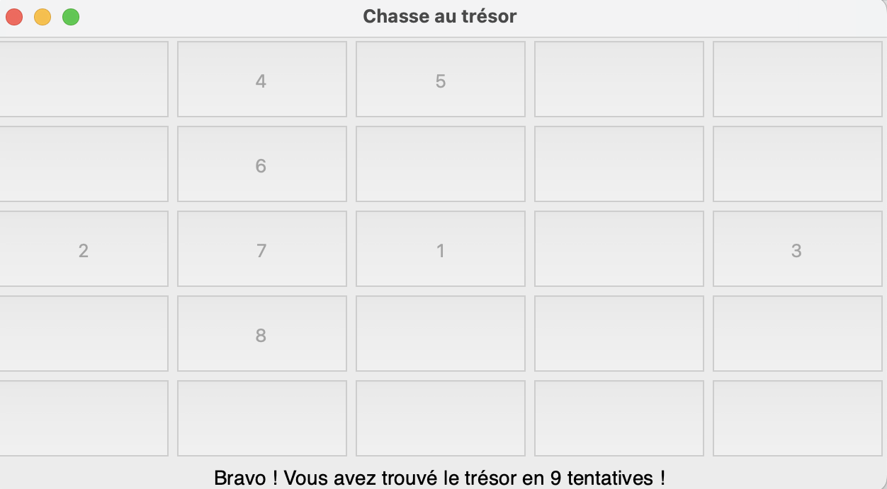

# Jeu - Chasse au trésor

## Présentation et explications

<figure markdown="span">
  
  <figcaption>Une image du jeu</figcaption>
</figure>

!!! abstract "Présentation du jeu"
    L'objectif de ce **TP** est de créer un petit jeu de **chasse au trésor** en *Python*, dans lequel le but est de **trouver un trésor** dans une **grille de jeu** de taille donnée.  
    
    La **grille** contient des **boutons cliquables**. Le joueur devra alors **cliquer** sur les **boutons** de son choix, avec à chaque erreur un **indice** lui indiquant s'il se **rapproche** ou s'il **s'éloigne** du **trésor**.

    Le **nombre de tentatives effectuées** sera **stocké** et **affiché** à la fin du jeu.

    Le module `tkinter` sera utilisé pour gérer l'interface graphique du jeu.

!!! success "À télécharger"
    **Téléchargez** et **ouvrez dans Thonny** le fichier *Python* suivant :

    <center style="font-size:1.3em">
    [chasse_au_tresor.py](scripts/chasse_au_tresor.py)
    </center>

??? tip "Corrigé"
    Voici le **corrigé détaillé** de ce programme :

    <center style="font-size:1.3em">
    [chasse_au_tresor_corr.py](scripts/chasse_au_tresor_corr.py)
    </center>

    Prenez connaissance du **programme corrigé**, lisez bien les **commentaires**.  
    On a ajouté une **fonction** `desactiver_boutons_cliques()` qui permet de désactiver les boutons sur lesquels le joueur a cliqué (et ainsi éviter qu'il reclique dessus).

    En cas de difficultés de compréhension de certaines parties du programme, n'hésitez pas à me contacter.

!!! info "Grille de jeu et coordonnées"
    La **grille de jeu** est **carrée**, il y a donc **autant** de **lignes** que de **colonnes**.  
    Les axes en `x` et en `y` se présentent ainsi :

    

    Sur cette **grille** de taille `N = 5`, le **bouton** colorié en <span style="color:green">**vert**</span> aura donc pour **coordonnées** `x = 3` et `y = 1`.  
    **<u>Important</u>** : Les **coordonnées** `x` et `y` commencent à partir de l'**indice** `0`, et non pas `1`.

    ---

    La **grille de jeu** est représentée avec une nouvelle **structure de données** : une **==liste==**.

    Une **liste** est créée à l'aide de **crochets**.  
    Par exemple, une liste contenant les éléments `4`, `8` et `2` se crée ainsi :

    ```python
    liste = [4, 8, 2]
    ```

    On peut ensuite récupérer un **élément** de cette liste à l'aide de son **indice**. Les **indices** commencent à partir de `0`. Pour récupérer le **premier élément** de la liste, on écrira :

    ```python
    liste[0]  # récupérer le premier élément de la liste, c'est-à-dire 1
    ```

    Pour créer un **tableau** (à deux dimensions), on utilise une **liste de listes**.  
    Chaque **ligne du tableau** sera représentée par une **sous-liste** de la **liste principale**.  
    Voici un exemple de **tableau** en `Python` :

    ```python
    tab = [ [1, 2, 3],
            [4, 5, 6],
            [7, 8, 0] ]
    ```

    On a défini la variable `tab` sur 3 lignes ici pour la compréhension, mais on peut très bien l'écrire sur une seule ligne :

    ```python
    tab = [[1, 2, 3], [4, 5, 6], [7, 8, 9]]
    ```

    Ainsi, pour récupérer par exemple l'élément `4`, on écrira :

    ```python
    tab[1][0]
    ```

    Cela correspond au **premier élément** de la **2ème ligne**.

!!! tip "Constante et variables globales"
    Les ==**variables globales**== sont des **variables** qui peuvent être utilisées **n'importe où** dans un **programme**, y compris à l'intérieur des **fonctions**. Elles se trouvent généralement **au début** d'un **programme**, juste après les *imports* :

    ```python
    N = 5  # Constante définissant la taille de la grille

    # Coordonnées du trésor (choisies aléatoirement au début du jeu)
    TRESOR_X = randint(...)
    TRESOR_Y = randint(...)

    # Variables pour stocker la position de la dernière case cliquée par le joueur (initialement None)
    derniere_pos_x = None
    derniere_pos_y = None

    # Compteur de tentatives (initialement 0)
    tentatives = 0
    ```

    Une ==**constante**== est une **variable globale** dont la **valeur** n'est **pas modifiée** par le programme. Les constantes sont, par convention, écrites en **MAJUSCULES**.  
    Ici, on distingue **trois constantes** :
    
    - `N` qui représente la **taille** de la **grille de jeu** (la grille est **carrée**), vous pouvez à tout moment modifier cette valeur pour **augmenter la taille** de la **grille** de votre jeu !
    - `TRESOR_X` et `TRESOR_Y` qui définissent les **coordonnées du trésor** dans la grille de jeu. Ces coordonnées sont définies **aléatoirement** à l'aide de la **fonction** `randint` du module `random`.
    
    Les autres **variables globales** sont :
    
    - `derniere_pos_x`, `derniere_pos_y` qui stockent les **coordonnées** de la **dernière case** sur laquelle le joueur a **cliqué**, on les initialise à `None` puisqu'au début du jeu, le joueur n'a pas encore cliqué.
    - `tentatives` qui stocke le **nombre de tentatives** effectuées par le joueur, on l'initialise à `0` au début du jeu.

    Ces trois dernières **variables globales** sont **modifiées** par la **fonction** `verifier_case` du programme. Pour pouvoir **modifier des variables globales** dans une **fonction**, il faut les référencer avec le **mot-clé** `global` :

    ```python
    global tentatives, derniere_pos_x, derniere_pos_y
    ```

## Travail à réaliser

!!! note "À faire"
    Vous devez **compléter le programme** `chasse_au_tresor.py`, en remplaçant les pointillés `...` par le **code approprié**. Les parties du programme à compléter sont indiquées par le commentaire `"À COMPLÉTER"`.

    Vous devez également compléter les **fonctions** `verifier_case` et `calculer_distance`.  
    Lisez bien les **commentaires** (précédes par un `#`), qui vous aideront à comprendre le programme.

    Pour `calculer_distance` :
    
    - vous utiliserez la **fonction native** `abs` qui **renvoie** la **valeur absolue** d'un nombre donné en entrée,
    - vous utiliserez la [distance de Manhattan](https://fr.wikipedia.org/wiki/Distance_de_Manhattan).

    Aidez-vous des **commentaires** pour compléter les lignes de code incomplètes.

    Une fois votre programme complet, **exécutez-le** pour **tester votre jeu**.

## Aller plus loin

!!! warning "IMPORTANT : Avant de continuer"
    Pour cette partie, je vous recommande de [télécharger le programme corrigé](scripts/chasse_au_tresor_corr.py), afin d'avoir la **version corrigée** du jeu avec de nouveaux **commentaires d'explications** ajoutés.

    On a également ajouté une **fonction** `desactiver_boutons_cliques()` au programme, qui permet de désactiver les **boutons** sur lesquels **le joueur a cliqué** (et ainsi éviter qu'il reclique dessus).

Maintenant que votre **jeu** est complet, on propose d'y apporter des **améliorations** !  
Ces améliorations doivent permettrent de rendre le jeu plus **interactif** et plus **difficile**, tout en utilisant uniquement les notions de base nous avons vu en Python.

!!! note "À faire"
    Vous devez ajouter les **deux améliorations** suivantes à votre programme.

    1. **==Limitation du nombre de tentatives==** : Le joueur ne dispose plus d’un nombre illimité de tentatives. Le **nombre maximal de tentatives** sera fixé par une **nouvelle variable globale** `MAX_TENTATIVES` (qu'il faudra définir en haut du programme, comme les autres variables globales).  
    Si le joueur n’a **pas trouvé** le **trésor** après le **nombre fixé de tentatives**, le jeu affiche un **message d’échec** et **désactive les boutons**.

    2. **==Affichage de la proximité en nombre de cases==** : En plus de donner l’indication `“Plus proche !”` ou `“Plus loin !”`, afficher la **distance** en **nombre de cases** par rapport au trésor. Il suffira d'afficher la valeur obtenue avec la fonction `calculer_distance()`.  
    *Exemple d'affichage* : `"Plus proche ! Vous êtes à 3 cases du trésor."`.

!!! note "Pour les plus motivés"
    Si vous vous sentez à l'aise et motivé, vous pouvez tenter d'apporter une nouvelle amélioration, plus complexe à mettre en place, consistant à **ajouter un deuxième trésor caché**.
    
    - Le jeu contiendra alors **deux trésors cachés** à des **positions différentes** (déterminées *aléatoirement*).

    - Le joueur devra trouver les **deux trésors** pour gagner. L’interface devra donc afficher un **message distinct** pour **chaque trésor** trouvé.  
    *Exemple de message* : `"Bravo ! Vous avez trouvé le trésor 1 en 5 tentatives !"`

    - De même, à **chaque tentative**, on indiquera si le joueur est **plus proche** ou **plus loin** (ainsi que la **distance** en **nombre de cases**) par rapport au **trésor le plus proche**. Il faudra donc déterminer **lequel des deux trésors** est le **plus proche du joueur** avant d'afficher le message.

    - La **partie s'arrêtera** si le joueur a **trouvé les deux trésors**, ou s'il a **dépassé la limite de tentatives** fixée par la variable globale `MAX_TENTATIVES` définie dans le cadre des améliorations précédentes.