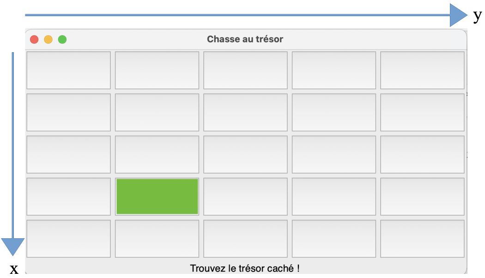

# Jeu - Chasse au trésor

<figure markdown="span">
  
  <figcaption>Une image du jeu</figcaption>
</figure>

!!! abstract "Présentation du jeu"
    L'objectif de ce **TP** est de créer un petit jeu de **chasse au trésor** en *Python*, dans lequel le but est de **trouver un trésor** dans une **grille de jeu** de taille donnée.  
    
    La **grille** contient des **boutons cliquables**. Le joueur devra alors **cliquer** sur les **boutons** de son choix, avec à chaque erreur un **indice** lui indiquant s'il se **rapproche** ou s'il **s'éloigne** du **trésor**.

    Le **nombre de tentatives effectuées** sera **stocké** et **affiché** à la fin du jeu.

    Le module `tkinter` sera utilisé pour gérer l'interface graphique du jeu.

!!! info "Grille de jeu et coordonnées"
    La **grille de jeu** est **carrée**, il y a donc **autant** de **lignes** que de **colonnes**.  
    Les axes en `x` et en `y` se présentent ainsi :

    

    Sur cette **grille** de taille `N = 5`, le **bouton** colorié en **vert** aura donc pour coordonnées `x = 3` et `y = 1`.  
    **Note importante** : Les coordonnées `x` et `y` commencent à partir de l'indice `0` et pas `1`.

!!! success "À télécharger"
    **Téléchargez** et **ouvrez dans Thonny** le fichier *Python* suivant :

    <center style="font-size:1.3em">
    [chasse_au_tresor.py](scripts/chasse_au_tresor.py)
    </center>

!!! note "À faire"
    Vous devez **compléter le programme** `chasse_au_tresor.py`, en remplaçant les pointillés `...` par le **code approprié**. Les parties du programme à compléter sont indiquées par le commentaire `"À COMPLÉTER"`.

    Vous devez également compléter les **fonctions** `verifier_case` et `calculer_distance`.  
    Lisez bien les **commentaires** (précédes par un `#`), qui vous aideront à comprendre le programme.

    Pour `calculer_distance` :
    
    - vous utiliserez la **fonction native** `abs` qui **renvoie** la **valeur absolue** d'un nombre donné en entrée,
    - vous utiliserez la [distance de Manhattan](https://fr.wikipedia.org/wiki/Distance_de_Manhattan).

    Aidez-vous des **commentaires** pour compléter les lignes de code incomplètes.

    Une fois votre programme complet, **exécutez-le** pour **tester votre jeu**.

!!! tip "Constante et variables globales"
    Les ==**variables globales**== sont des **variables** qui peuvent être utilisées **n'importe où** dans un **programme**, y compris à l'intérieur des **fonctions**. Elles se trouvent généralement **au début** d'un **programme**, juste après les *imports* :

    ```python
    N = 5  # Constante définissant la taille de la grille

    # Coordonnées du trésor (choisies aléatoirement au début du jeu)
    TRESOR_X = randint(...)
    TRESOR_Y = randint(...)

    # Variables pour stocker la position de la dernière case cliquée par le joueur (initialement None)
    derniere_pos_x = None
    derniere_pos_y = None

    # Compteur de tentatives (initialement 0)
    tentatives = 0
    ```

    Une ==**constante**== est une **variable globale** dont la **valeur** n'est **pas modifiée** par le programme. Les constantes sont, par convention, écrites en **MAJUSCULES**.  
    Ici, on distingue **trois constantes** :
    
    - `N` qui représente la **taille** de la **grille de jeu** (la grille est **carrée**), vous pouvez à tout moment modifier cette valeur pour **augmenter la taille** de la **grille** de votre jeu !
    - `TRESOR_X` et `TRESOR_Y` qui définissent les **coordonnées du trésor** dans la grille de jeu. Ces coordonnées sont définies **aléatoirement** à l'aide de la **fonction** `randint` du module `random`.
    
    Les autres **variables globales** sont :
    
    - `derniere_pos_x`, `derniere_pos_y` qui stockent les **coordonnées** de la **dernière case** sur laquelle le joueur a **cliqué**, on les initialise à `None` puisqu'au début du jeu, le joueur n'a pas encore cliqué.
    - `tentatives` qui stocke le **nombre de tentatives** effectuées par le joueur, on l'initialise à `0` au début du jeu.

    Ces trois dernières **variables globales** sont **modifiées** par la **fonction** `verifier_case` du programme. Pour pouvoir **modifier des variables globales** dans une **fonction**, il faut les référencer avec le **mot-clé** `global` :

    ```python
    global tentatives, derniere_pos_x, derniere_pos_y
    ```