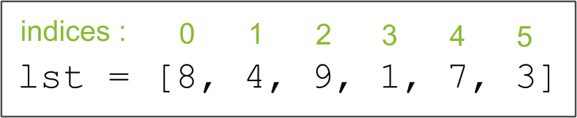

# Les listes en langage Python

En programmation en langage **Python**, les **listes** sont l'une des **structures de données** les plus couramment utilisées. Une **liste** (**objet** de type `list`) est une **collection ordonnée d'éléments** pouvant être de différents **types** (*nombres entiers*, *flottants*, *chaînes de caractères*, *objets*, etc.). Les listes sont extrêmement flexibles et permettent de stocker et de manipuler des données de manière efficace.

## Création d'une liste

Pour **créer une liste** en Python, on utilise les **crochets** `[]`.

### Créer une liste vide

Une **liste vide** est créée simplement avec des crochets vides `[]`.

Si l'on veut **stocker** une **nouvelle liste vide** dans une **variable**, par exemple dans une variable appelée `ma_liste_vide`, il suffit de faire une **affectation** :

```python
>>> ma_liste_vide = []
>>> ma_liste_vide
[]
```

### Créer une liste non vide

On peut également **créer une liste** et directement y mettre des **éléments**, en les séparant par des **virgules**. Voici un exemple :

```python
>>> ma_liste = [1, 2, 3, 4, 5]
>>> ma_liste
[1, 2, 3, 4, 5]
```

On aurait également pu créer cette **liste** en utilisant la méthode de **création de liste par compréhension**, en utilisant une **boucle** :

```python
>>> ma_liste = [v for v in range(1, 6)]
>>> ma_liste
[1, 2, 3, 4, 5]
```

Si l'on voulait créer une **liste** contenant **tous les nombres pairs de 2 à 98** en utilisant la méthode **par compréhension**, on aurait écrit :

```python
>>> ma_liste = [v for v in range(2, 99, 2)]
```

ou bien, en ajoutant une **condition** `if` :

```python
>>> ma_liste = [v for v in range(2, 99) if v % 2 == 0]
```

Une liste peut contenir **n'importe quel type d'élément**, y compris **d'autres listes**. Par exemple :

```python
>>> liste_mixte = [1, "texte", 3.14, [10, 20, 30]]
>>> liste_mixte
[1, "texte", 3.14, [10, 20, 30]]
```

## Accès aux éléments d'une liste

Vous pouvez **accéder** aux **éléments individuels d'une liste** en utilisant leur **indice** (*position*) dans la **liste**. L'indice **commence à `0`** pour le **premier élément**, puis aumgente de `1` en `1`.

<figure markdown="span">
  { width="600" }
  <figcaption>Une liste d'éléments avec les indices (en vert) associés.</figcaption>
</figure>

Voici comment accéder aux éléments d'une liste :

```python
>>> ma_liste = [10, 20, 30, 40, 50]  # création d'une liste
>>> ma_liste[0] # accès au premier élément (indice 0)
10
>>> ma_liste[2] # accès au troisième élément (indice 2)
30
```

On peut bien sûr stocker ces éléments dans de nouvelles **variables** :

```python
>>> ma_liste = [10, 20, 30, 40, 50]  # création d'une liste
>>> el = ma_liste[3]  # accès au quatrième élément (indice 3)
>>> el
40
```

!!! info "La fonction `len`"
    La **fonction** `len` est une fonction permettant d'obtenir le **nombre d'éléments** d'une **liste**, d'un **tuple**, d'un **dictionnaire** ou encore d'une **chaîne de caractères**.

    Il suffit d'appeler `len` en lui donnant comme **entrée** une **liste** dont on cherche à déterminer le nombre d'éléments, et la fonction **renverra** le **nombre d'éléments** de la liste.

    *Exemple* :

    ```python
    >>> lst = [2, 4, 6, 8, 10, 12]
    >>> len(lst)
    6
    ```

Si l'on dipose d'une **liste** dont on ne sait pas **combien elle contient d'éléments**, et qu'on souhaite trouver le **dernier élément de cette liste**, on peut alors utiliser la fonction `len` pour trouver l'**indice** de cet élément, et ainsi **accéder à l'élément**.

{{ IDE('scripts/32.py') }}

!!! note "Explication"
    Pour obtenir l'**indice** du **dernier élément** d'une **liste**, il suffit donc de **retirer 1** à la **taille de cette liste**.

## Modification des éléments d'une liste

Les éléments d'une liste peuvent être **modifiés** en à l'aide d'une simple **affectation**.  
Il suffit de connaître l'**indice** de l'**élément à modifier**.

Par *exemple* :

```python
>>> ma_liste = [10, 20, 30, 40, 50]
>>> ma_liste[1] = 25  # modification du deuxième élément (indice 1)
>>> ma_liste
[10, 25, 30, 40, 50]
```

## Ajout et suppression d'éléments

!!! info "Une *méthode*, kézako ?"
    Une **méthode** est une **fonction** associée à un **type d'éléments** spécifique.  
    Pour **appeler** une **méthode**, on écrit une instruction de la forme : `<objet>.<methode>`.

    Par exemple, le **type** `list` de *Python* dispose d'une **méhode** appelée `append` qui permet d'**ajouter un élément** à une **liste**.  
    

Pour **ajouter un élément à la fin d'une liste**, vous pouvez utiliser la **méthode** `append()` :

```python
>>> ma_liste = [1, 2, 3]
>>> ma_liste.append(4)
>>> ma_liste
[1, 2, 3, 4]
```

On peut utiliser `append` dans une **boucle** pour **créer une liste** contenant beaucoup d'éléments. Il s'agit d'une solution alternative à la création de liste **"par compréhension"** vue précédemment.

Par exemple, si l'on souhaite **créer une liste** dans une variable `lst` qui contient **tous les entiers** de `1` à `100`, on peut procéder comme suit (cliquez sur *Lancer* pour voir le résultat) :

{{ IDE('scripts/31.py') }}

Pour **supprimer un élément** en fonction de **sa valeur**, vous pouvez utiliser la **méthode** `remove()` :

```python
>>> ma_liste = [1, 2, 3, 4, 5]
>>> ma_liste.remove(3)
>>> ma_liste
[1, 2, 4, 5]
```

Pour **supprimer un élément** en fonction de **son indice**, vous pouvez utiliser la **méthode** `pop`, qui **supprime** et **renvoie** l'**élément** de la liste dont l'indice est donné en entrée :

```python
ma_liste = [1, 2, 3, 4, 5]
del ma_liste[2]  # La liste devient maintenant [1, 2, 4, 5]
```

!!! warning "Hors-programme"
    À noter que la **suppression d'éléments dans une liste** n'est pas au programme de *première*, ni même de *terminale*. Vous ne serez donc pas interrogé dessus, mais cela peut s'avérer bien utile tout de même.

## Parcours d'une liste avec des boucles

Les **listes** sont souvent parcourues à l'aide de **boucles bornées** `for`. Voici comment **parcourir une liste** et **afficher ses éléments** :

{{ IDE('scripts/25.py') }}

Ce code affichera chaque élément de la liste sur une ligne différente.

Une **autre méthode** pour **parcourir une liste** et **afficher ses éléments** consiste à utiliser **l'indice de ses éléments** : On souhaite maintenant **parcourir**, à l'aide d'une boucle `for`, chaque élément à partir de l'**indice** `0` (indice du **premier élément**), et jusqu'à l'**indice du dernier élément**.

On peut faire cela en utilisant une boucle `for` avec la fonction `range()` pour **générer des indices**, puis en **accédant aux éléments de la liste** à l'aide de ces **indices**. Voici comment cela fonctionne :

{{ IDE('scripts/23.py') }}

Dans cet exemple, nous avons utilisé la fonction `len` sur `ma_liste` pour **obtenir la longueur de la liste**, c'est-à-dire son **nombre d'éléments**.  
Ensuite, nous avons utilisé une boucle `for` pour **parcourir** les **indices** de `0` à `longueur - 1`.  
À **chaque itération de la boucle**, nous avons **accédé** à **l'élément d'indice** `i` à l'aide de `ma_liste[i]`, puis nous l'avons **affiché**.

On aurait pu écrire ce programme de manière plus simple, comme ceci :

{{ IDE('scripts/24.py') }}

Ici, on a mis directement `len(ma_liste)` à l'intérieur du `range`, ce qui évite de créer une **variable** supplémentaire.

## À vous de jouer !

!!! note "Exercice : Manipulation de listes"
    Créez un **programme** en réalisant les tâches suivantes :

    1. **Créez une liste** appelée `nombres` contenant les **entiers** de `1` à `5`.
    2. Utilisez une **boucle** `for` pour **parcourir la liste** `nombres` et **afficher** chaque élément.
    3. **Modifiez la liste** `nombres` pour qu'elle contienne **les carrés des nombres de** `1` **à** `5`. Cela signifie que la liste doit maintenant contenir `[1, 4, 9, 16, 25]`.
    4. Utilisez à nouveau une **boucle** `for` pour **parcourir la liste mise à jour** et **afficher chaque élément**.

    ??? tip "Aide - Code à trous"
        Pour vous aider, vous pouvez réutiliser ce programme à trous :

        ```python
        # Créer une liste contenant les entiers de 1 à 5
        nombres = .......

        # Parcourir la liste et afficher chaque élément
        print("Liste d'origine :")
        for nombre in .......:
            print(.......)

        # Modifier la liste pour qu'elle contienne les carrés des nombres de 1 à 5
        for ... in range(.......):
            nombres[i] = ....... ** 2

        # Parcourir la liste mise à jour et afficher chaque élément
        print("\nListe mise à jour :")
        for nombre in .......:
            print(.......)
        ```
    
    Vous pouvez réaliser ce programme sur ***Thonny*** ou dans l'**IDE ci-dessous** (vous pourrez *télécharger* votre programme en cliquant sur le *deuxième bouton* pour le conserver.)

    {{ IDE() }}