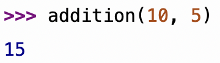

# Exercices de rappels sur les fonctions

??? quote "Version PDF"
    Vous pouvez [cliquer ici](pdf/activite_rappels_fonctions.pdf) pour télécharger une **version PDF** de ces exercices.

!!! abstract "Les fonctions, kézako ?"
    Une ==**fonction**== en langage *Python* (et dans la plupart des langages de programmation) est un **bloc de code** que l’on peut **réutiliser**.  
    Elle permet de regrouper des **instructions** sous un **nom**, ce qui évite de répéter du code et rend le programme **plus clair** et **plus facile** à modifier.\newline

    Par exemple, si l'on souhaite créer une **fonction** `addition(a, b)`, qui effectue une **addition** de deux **entiers** donnés et **renvoie le résultat**, on pourrait écrire :\newline

    ```python
    def addition(a, b):  # a et b sont les paramètres de la fonction
        return a + b  # le mot-clé return permet de renvoyer le résultat
    ```

    `a` et `b` sont appelés **paramètres de la fonction**. Ce sont des variables **définies uniquement dans la fonction**.\newline

    Pour **utiliser la fonction**, il faut alors l'\hilight{\textbf{l'appeler}}, voici un exemple d'**appel** :

    ```python
    resultat = addition(3, 5)  # Appel de la fonction avec 3 et 5 comme arguments
    print(resultat)  # Affiche 8
    ```

    Dans le bout de code ci-dessus, `3` et `5` sont appelés **arguments**.  
    La **fonction** est alors **exécutée** en remplaçant `a` par `3` et `b` par `5`.  
    La **valeur de retour** de la fonction est ici stockée dans une variable `resultat`, et on affiche ensuite avec un `print` le contenu de cette variable `resultat`.\newline

    À noter que si l'on souhaite **appeler une fonction** dans l'**interpréteur Python**, il n'y a pas besoin d'utiliser un `print`.

    { width="250px" }

!!! info "Une fonction = une tâche"
    Généralement, **une fonction** permet de définir **une tâche** bien précise dans un programme.  
    Cela permet de maintenir une certaine clarté et modularité dans l'écriture du programme.

!!! note "Exercice 1"
    On considère **définie** la fonction suivante :

    ```python
    def mystere(a, b):
        res = 0
        for i in range(b):
            res += a
        return res
    ```

    1. Donner le résultat de l'**appel** `mystere(3, 5)`.
    2. À quoi sert cette **fonction** ?

!!! note "Exercice 2"
    Réécrivez et complétez la fonction `pairs(x, y)` suivante qui **affiche** tous les **nombres pairs** de `x` à `y` **INCLUS**.

    ```python
    def pairs(x, y):
        for ... in range(..., ...):
            if ... % 2 == ...:
                print(...)
    ```

    Sur le **même modèle**, écrivez une fonction `impairs(x, y)` qui **affiche** tous les **nombres impairs** de `x` à `y` **INCLUS**.

Une **fonction** ne **renvoie pas obligatoirement** quelque chose.  
Si l'on n'utilise pas de `return`, la valeur `None` (qui correspond au "rien" en Python) est alors **renvoyée** automatiquement.

Une **fonction** peut parfois être utilisée pour **afficher** quelque chose plutôt que pour renvoyer une valeur, comme c'est le cas de la fonction `print` par exemple.

!!! note "Exercice 3"
    On souhaite écrire une **fonction** qui autorise ou non l'accès à un manège selon le poids et la taille du visiteur.\newline

    Écrire une fonction `passe(taille, poids)` qui **affiche** `"Accès autorisé"` si la **taille** (un `float`) donné  est comprise entre $1m50$ (`= 1.50`) et $1m85$ (`= 1.85`), et si le **poids** donné (un `int`) est compris entre $65$ et $85~kg$.  
    Sinon, on **affichera** `"Accès interdit"`.\newline

    Pour *rappel*, on peut utiliser l'**opérateur booléen** `and` pour combiner plusieurs conditions.

!!! note "Exercice 4"
    Écrire une fonction `dessiner(longueur, largeur)` qui **dessine** sur la console un **rectangle** de *longueur* et de *largeur* données, à l'aide d'étoiles (`*`).

    Voici un exemple d'**appel** de cette fonction :

    ```python
    >>> dessiner(15, 3)
    ***************
    ***************
    ***************
    ```

!!! note "Exercice 5"
    Écrire une **fonction** `compter(v)`, qui simule `x` (un *entier*) lancers de **dés de 6 faces**, et compte le nombre de fois où la valeur `v` (un *entier*) est tirée.\newline

    Testez ensuite votre fonction.