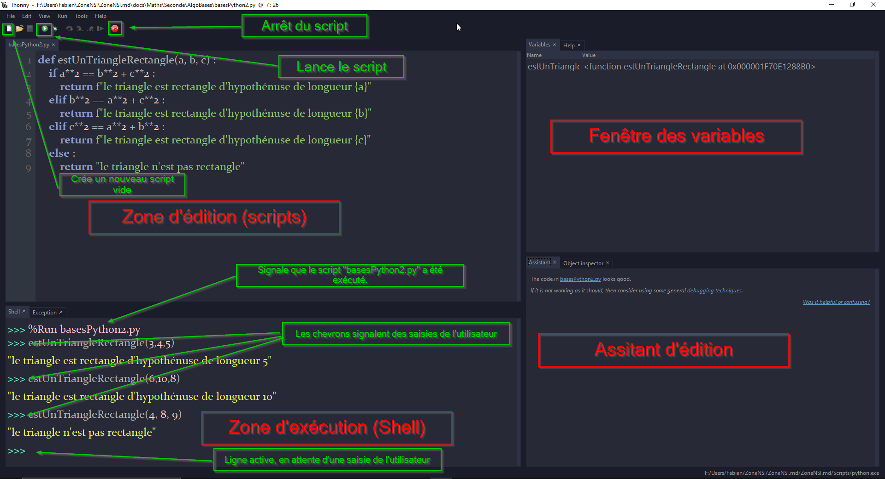

!!! quote "Sources"
    > Serge Bays - *Spécialité Numérique et sciences informatiques - Première*  
    > Zonensi - [Programmation en Python et utilisation de Thonny](https://www.zonensi.fr/Maths/Seconde/AlgoBases/ProgrammationPythonThonny/){ target="_blank" }

# Découverte de l'IDE Thonny

Tout au long de l'année, nous utiliserons un **IDE** (pour *integrated development environment*) ou **EDI** en français (pour *environnement de développement*) **gratuit** et **open source** conçu spécialement pour les débutants : <u>**Thonny**</u>.

!!! note "À faire"
    Cliquez sur "Démarrer", puis cherchez et exécutez **Thonny** pour lancer le programme.

!!! info "Installer Thonny à la maison"
    **Thonny** est un programme **multiplateforme**, vous pouvez donc l'installer sur Windows, mais aussi sur Linux ou MacOS.  
    De plus, Thonny est livré avec **Python** version **3.10**, vous n'avez donc pas à installer Python séparément.
    Vous pouvez télécharger **Thonny** [depuis le site officiel](https://thonny.org/){ target="_blank" }.

## Présentation de Thonny

<figure markdown>
  
  <figcaption>Source : <a href="https://www.zonensi.fr/Maths/Seconde/AlgoBases/ProgrammationPythonThonny/" target="_blank">zonensi</a><br />
  <a href="../images/captureThonny1.png" target="_blank">Ouvrir l'image en plein écran</a></figcaption>
</figure>

!!! info
    L'interface se décompose de la manière suivante :

    * La **zone d'exécution**, ou Shell, ou **console**, est une zone interactive dans laquelle vous pouvez saisir une **instruction Python**. La console peut être utilisée pour tester une instruction ou série d'instructions, mais elle est également utilisée pour l'exécution des **scripts**. Pour utiliser la console, il vous suffit de saisir votre instruction à droite des trois chevrons puis d'appuyer sur la touche **"Entrée"** du clavier.
    * La **zone d'édition** ou **zone de scripts**, est la zone dans laquelle vous pouvez saisir une **série d'instructions Python**, de manière à la sauvegarder sous la forme d'un **script Python**. Un **script Python** porte d'extension `.py`.
    * Pour exécuter un **script**, il faut appuyer soit sur la **flèche verte** de la barre de menu, soit sur la touche **F5** du clavier, ou encore par l'intermédiaire du menu "Run > Run current script" (ou "Exécuter > Exécuter le script courant" en français). Le résultat de l'exécution du script sera affiché **dans la console**.
    * La **fenêtre des variables** est bien utile pour débuter, elle permet de voir la liste des variables créées et les valeurs associées suite à l'exécution d'instructions ou d'un script.
    * L'**assistant d'édition** contient des informations qui peuvent être utiles pour analyser un programme qui ne fonctionne pas.

## Exercices d'entraînement

!!! note "Exercice 1"
    Dans la **zone d'exécution**, saisissez l'expression suivante :

    ```python
    >>> 12 + 6
    ```

    Quel résultat obtenez-vous ?

!!! note "Exercice 2"
    Exécutez d'autres expressions arithmétiques en utilisant les opérateurs `+`, `-`, `*` et `/`.

!!! note "Exercice 3"
    Voici un **algorithme** écrit en **pseudo-code** :

    $A \leftarrow 14$  
    $B \leftarrow 2$  
    $C \leftarrow \frac{A}{B}$  
    $D \leftarrow \frac{A + 6}{B + 3}$  
    $E \leftarrow C - D$

    Transcrivez cet algorithme sous la forme d'**instructions Python**, en utilisant des variables nommées `a`, `b`, `c`, `d` et `e`, et saisissez-les dans la **zone de scripts** de Thonny. Enregistrez le script sous le nom `calcul.py`, puis **exécutez le script**.

    Observez la **fenêtre des variables**, quelle est valeur associée à la variable `e` ?  
    Vous pouvez également voir le contenu de la variable en saisissant simplement `e` dans la **console** de Thonny. En effet, lorsque vous exécutez un script, vous pouvez exécuter des instructions dans la console en utilisant les variables définies suite à l'exécution du script.