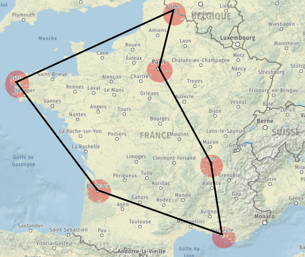

# Cours - Les algorithmes gloutons

## Introduction

Nous allons voir à travers ce chapitre un **nouveau type d'algorithme** permettant de répondre à des **problèmes complexes**.

!!! question "Force brute"
    La stratégie la plus évidente pour résoudre un problème compliqué est la **force brute** :

    
    
    - **Principe** : on calcule **tout**, quitte à calculer les choses **plusieurs fois**, voire à calculer des choses qui n'ont pas d'utilité pour trouver la solution.
    - **Type de problème** : tous les problèmes à priori.
    - **Problème** : cela peut prendre énormément de temps si l'on doit faire beaucoup de calculs.

Nous allons voir que l'on peut "tricher" en utilisant la **==stratégie gloutonne==**.

- **Principe** : on ne regarde pas le **problème** dans **sa totalité**. On prend une décision **localement optimale**, de façon **définitive** et sans se soucier de ce que va devenir le problème restant à traiter.
- **Type de problème** : ceux pour lequels on peut trouver plusieurs solutions, optimales ou pas.

Voici un *exemple* : **Mr. Glouton** veut atteindre la case en **bas à droite** en mangeant le plus mal possible.


Comme on le voit, la taille du problème à traiter diminue à chaque décision.

## La problématique des problèmes complexes

Les **problèmes complexes** (**NP**, *Non déterministe Polynomial*) sont des problèmes pour lequels :

- le **coût** de la **résolution** par **force brute** est **plus complexe** qu'un coût **polynomial**,
- on peut trouver la **meilleure solution** si on fait les bons choix **par hasard** et qu'on a de la **chance**,
- on peut vérifier qu'une **solution** qu'on vous propose est **valide** ou **pas** avec un **coût polynomial**.

Nous allons justement voir des problèmes de ce type, et nous y tenterons d'y répondre en temps raisonnable.

## Problème du voyageur de commerce

### Présentation

!!! info "Le problème"
    Imaginons le **problème suivant** : vous devez organiser la tournée de votre commercial. Il doit passer dans **toutes les villes** sous sa responsabilité (une fois uniquement) et revenir à son **point de départ** (*Lille* pour notre exemple). Pour limiter les frais, il faut définir le **trajet le moins long** au total.

    Nous allons nous limiter à **6 villes** uniquement ici.

    

    Voici un **tableau** récapitulant les **distances** entre ces **6 villes** :

    |            | Brest | Bordeaux | Lille | Lyon | Marseille | Paris |
    |------------|-------|----------|-------|------|-----------|-------|
    | Brest      |   -   |   598    |  708  | 872  |   1130    |  572  |
    | Bordeaux   |  598  |    -     |  802  | 520  |   637     |  554  |
    | Lille      |  708  |   802    |   -   | 650  |   1002    |  225  |
    | Lyon       |  872  |   520    |  650  |  -   |   367     |  465  |
    | Marseille  | 1130  |   637    | 1002  | 367  |    -      |  777  |
    | Paris      |  572  |   554    |  225  | 465  |   777     |   -   |

    Nous pourrions choisir la ville de départ parmi la liste des 6 villes. Il y a donc **6 choix de lieux de départ**.

!!! note "Q.1"
    Partons de **Lille**. Combien de destinations différentes peut-on choisir ?

??? tip "Correction Q.1"
    On peut choisir **5 destinations** à partir de **Lille**.

!!! note "Q.2"
    Partant de **Lille**, on choisit **Bordeaux**. Combien de destinations différentes peut-on choisir ensuite ?

??? tip "Correction Q.2"
    On peut choisir **4 destinations** à partir de **Bordeaux**.

!!! note "Q.3"
    Après avoir choisi **Lille - Bordeaux - Brest**, combien de destinations différentes peut-on choisir ensuite ?

??? tip "Correction Q.3"
    On peut choisir **3 destinations** à partir de **Brest**.

!!! note "Q.4"
    Combien de **possibilités d'itinéraires différents** va-t-on avoir en partant d'une **première ville aléatoire** pour aller jusqu'à la **6e ville** ? Faire le **calcul**.

??? tip "Correction Q.4"
    Le nombre total d'itinéraires différents s'obtient par le calcul suivant :

    $6 \times 5 \times 4 \times 3 \times 2 \times 1 = 6! = 720$ itinéraires.

    En effet, il y a au début **6 villes** possibles, puis **5**, puis **4**, puis **3**, puis **2**, puis **une seule**.  
    Le nombre d'itinéraires totale correspond donc à $6!$ (6 *factorielle*).

Ici, il s'agit de trouver un **chemin fermé**, c'est un **cycle**.

- **1er simplification** : le point de départ n'a aucune importance puisqu'on passe successivement dans **toutes les villes** et qu'on revient au **point de départ**.
- **2e simplification** : le **sens de parcours du cycle** n'a pas d'importance non plus. Dans les deux cas, on fera le tour des **6 villes**. Qu'on fasse Lyon-Lille-... ou Lille-Lyon-... ne changera rien à la **distance parcourue**.


!!! note "Q.5"
    Combien de **possibilités** doit-on vraiment calculer en tenant compte des **deux simplifications** précédentes ?

??? tip "Correction Q.5"
    En tenant compte des **deux simplifications**, le calcul peut se ré-écrire de la manière suivante :

    $\frac{5 \times 4 \times 3 \times 2 \times 1}{2} = \frac{5!}{2} = \frac{120}{2} = 60$ itinéraires.

!!! note "Q.6"
    Combien de **possibilités d'itinéraires différents** va-t-on avoir pour **12 villes** ? Juste six petites villes en plus...

??? tip "Correction Q.6"
    En ajoutant **6 villes** supplémentaires, on aura donc $\frac{11!}{2} = \frac{39916800}{2} = 19~958~400$ itinéraires possibles, soit près de **20 millions** de trajets à vérifier !

    On voit donc que la **résolution** par **force brute** peut vite devenir inenvisageable, tant le **temps de résolution** peut devenir très long...

### Résolution par force brute

Avant de passer aux **algorithmes gloutons**, voyons comment résoudre ce problème par **force brute** : nous allons faire **tous les calculs** et ne garder que le **meilleur**.

Ici, avec **6 villes**, il faut donc tester les **60 possibilités** une par une.  
Avec **12 villes**, on passe à **20 millions de possibilités**.

C'est faisable avec **6 villes**.

Le **trajet optimal** sera réalisé avec le parcours suivant (dans un sens ou dans l'autre) :

- **Brest-Bordeaux-Marseille-Lyon-Paris-Lille-Brest en 3000 km**
- **Brest-Lille-Paris-Lyon-Marseille-Bordeaux-Brest en 3000 km**



L'itinéraire de la partie précédente était correct mais celui proposé ici donne un trajet optimal (si on a réussi à le trouver !)

!!! note "Q.7"
    Choisir un **autre itinéraire** et calculer **à la main** la **distance parcourue**. Le tableau des distances est fourni ci-dessous. Vérifier qu'on obtient pas moins qu'avec le trajet optimal.

    |            | Brest | Bordeaux | Lille | Lyon | Marseille | Paris |
    |------------|-------|----------|-------|------|-----------|-------|
    | Brest      |   -   |   598    |  708  | 872  |   1130    |  572  |
    | Bordeaux   |  598  |    -     |  802  | 520  |   637     |  554  |
    | Lille      |  708  |   802    |   -   | 650  |   1002    |  225  |
    | Lyon       |  872  |   520    |  650  |  -   |   367     |  465  |
    | Marseille  | 1130  |   637    | 1002  | 367  |    -      |  777  |
    | Paris      |  572  |   554    |  225  | 465  |   777     |   -   |

### Algorithme glouton

Nous avons vu que la **force brute** ne permet pas de résoudre (en un temps raisonnable) le problème du **voyageur de commerce** lorsqu'on **augmente le nombre de villes**.

!!! info "Stratégie"
    Nous appliquerons une **stratégie gloutonne** à notre **voyageur de commerce**.

    Voici le **choix local** que nous allons toujours privilégier en espérant que cela nous mène à une solution globale correcte : nous allons systématiquement **choisir la ville non-visitée la plus proche**.

On rappelle les distances :

|            | Brest | Bordeaux | Lille | Lyon | Marseille | Paris |
|------------|-------|----------|-------|------|-----------|-------|
| Brest      |   -   |   598    |  708  | 872  |   1130    |  572  |
| Bordeaux   |  598  |    -     |  802  | 520  |   637     |  554  |
| Lille      |  708  |   802    |   -   | 650  |   1002    |  225  |
| Lyon       |  872  |   520    |  650  |  -   |   367     |  465  |
| Marseille  | 1130  |   637    | 1002  | 367  |    -      |  777  |
| Paris      |  572  |   554    |  225  | 465  |   777     |   -   |

!!! note "Q.8"
    On décide de partir de Lyon. Choisir la ville suivante en prenant la ville la plus proche non encore visitée. Calculer la distance parcourue.

??? tip "Correction Q.8"
    On choisira **Marseille**, car c'est la ville la plus proche de **Lyon**.

!!! note "Q.9"
    On a fait **Lyon-Marseille**. Quelle ville choisir ensuite ?

??? tip "Correction Q.9"
    On choisira **Bordeaux**, car c'est la ville (non visitée) la plus proche de **Marseille**.

!!! note "Q.10"
    On a fait **Lyon-Marseille-Bordeaux**. Quelle ville choisir ensuite ?

??? tip "Correction Q.10"
    On choisira **Paris**, car c'est la ville (non visitée) la plus proche de **Bordeaux**.

!!! note "Q.11"
    On a fait **Lyon-Marseille-Bordeaux-Paris**. Quelle ville choisir ensuite ?

??? tip "Correction Q.11"
    On choisira **Lille**, car c'est la ville (non visitée) la plus proche de **Paris**.

A partir de là, c'est fini. On fait **Lille-Brest** (c'est la seule destination disponible) puis **Brest-Lyon** pour revenir au **point de départ**.

Cela donne **d = 367 + 637 + 554 + 225 + 708 + 872 km**, soit au total **d = 3363 km**.

- **Désavantage** : c'est moins bien que la **solution optimale de 3000 km**.
- **Avantage** : avec plus de villes que sur notre exemple, le programme en **force brute** tournerait encore très longtemps...

## Problème du rendu de monnaie

### Présentation

Un autre cas classique où la **stratégie gloutonne** peut être appliquée est le ==**problème de rendu de monnaie**==.

Considérons une somme de **5,50 euros** à rendre.  
Nous disposons de **billets** de **5 euros**, de **pièces** de **2 euros**, de **pièces** de **1 euro**, de **pièces** de **50 cents**, de **pièces** de **20 cents**, de **pièces** de **10 cents** et de **pièces** de **5 cents**.

!!! question "Problème d'optimisation"
    Pour le formuler comme un problème d'**optimisation**, nous devons définir un **critère** pour évaluer la **qualité des solutions** :  
    nous souhaitons **trouver une solution** qui ==**minimise** le **nombre de pièces ou de billets rendus**==.

Pour un être humain, trouver la solution n'est pas difficile : un *billet de 5 euros* et une *pièce de 50 cents* suffisent. Cependant, il est important de noter la complexité pour une machine de **comparer toutes les possibilités** envisageables...

!!! abstract "Stratégie gloutonne"
    Nous allons donc appliquer une **stratégie gloutonne** en choisissant comme **choix local optimal** : toujours compléter la **somme à rendre** avec le **billet** ou la **pièce** la **plus grande utilisable**.

!!! note "Q.1"
    En appliquant ce principe, que doit-on donner si on doit rendre 29 euros à l'aide de billets de 20 euros, 10 euros et 5 euros et de pièces de 2 euros et 1 euro ?

!!! note "Q.2"
    Fournir la réponse de notre stratégie gloutonne si on doit rendre 10 euros en choisissant dans l'ensemble `{ 5, 2, 1 }`. Est-ce la solution optimale pour notre ensemble de pièces disponibles ?

!!! note "Q.3"
    Fournir la réponse de notre stratégie gloutonne si on doit rendre 10 euros avec l'ensemble `{ 8, 5, 1 }`. Proposer une meilleure solution en utilisant votre cerveau et pas la stratégie gloutonne.

On constate donc que la **stratégie gloutonne** ne donne pas toujours la **solution optimale**.

### Avec Python

On commencera par créer un tableau `les_pieces`, trié en **ordre décroissant** et regroupant les **pièces/billets** que l'on peut **rendre** et une fonction `rendu_monnaie()` qui possède deux paramètres :

- le paramètre `a_rendre` pour récupérer la somme qu'il faudra rendre,
- le paramètre `pieces` pour récupérer le **tableau trié** des **choix de billets ou pièces disponibles**, du plus grand au plus petit.

La **fonction** `rendu_monnaie()` devra **renvoyer** un **tableau** contenant les **éléments à rendre**.  
Par exemple `[100, 10, 5, 2, 2]` pour rendre `119` **euros**.

!!! abstract
    Voici le prototype de cette **fonction** : `rendu_monnaie(a_rendre: int, pieces: 'list[int]') -> 'list[int]`

    Voici les instructions incomplètes correspondantes :

    ```python
    les_pieces = [100, 50, 20, 10, 5, 2, 1]
    
    def rendu_monnaie(a_rendre, pieces = les_pieces):
        res = []
        # À COMPLÉTER
        return res
    ```

    On remarquera que le **deuxième paramètre** de la fonction, `pieces`, possède une **valeur par défaut** : il prend initialement la valeur de la **variable globale** `les_pieces`. On est donc pas obligé de lui fournir un **tableau de pièces/billets** lors de l'**appel**.

    On pourra donc activer l'appel de notre fonction simplement de cette façon pour rendre **12 euros** :

    ```python
    rendu_monnaie(12)
    ```

    Mais on pourra également **fournir une valeur** pour le paramètre `pieces` :

    ```python
    rendu_monnaie(12, [50, 20, 10, 1])
    ```

Voici l'**algorithme** en **pseudo-code** que vous écrirez en *Python*.

!!! abstract "Algorithme de rendu de monnaie" 
    <div style="font-size:1.1em">
    **ALGORITHME** : rendu_monnaie  
    **ENTRÉE** :  
    &emsp;&emsp;`a_rendre` : un **entier**  
    &emsp;&emsp;`pieces` : le **tableau** des **pièces/billets** (triés dans l'ordre **décroissant**) utilisés  
    **SORTIE** : Une **liste** des **pièces/billets** à rendre

    **DÉBUT**  
    &emsp;&emsp;res ← [ ]  
    &emsp;&emsp;reste ← a_rendre  
    &emsp;&emsp;i ← 0  
    &emsp;&emsp;**TANT QUE** reste **STRICTEMENT SUPÉRIEURE À** 0 :  
    &emsp;&emsp;&emsp;&emsp;**SI** reste **SUPÉRIEUR OU ÉGAL À** pieces[i] :  
    &emsp;&emsp;&emsp;&emsp;&emsp;&emsp;reste ← reste $-$ pieces[i]  
    &emsp;&emsp;&emsp;&emsp;&emsp;&emsp;**Ajouter** pieces[i] **à** res  
    &emsp;&emsp;&emsp;&emsp;**SINON** :  
    &emsp;&emsp;&emsp;&emsp;&emsp;&emsp;i ← i $+$ 1  
    &emsp;&emsp;&emsp;&emsp;**FIN SI**  
    &emsp;&emsp;**FIN TANT QUE**  
    &emsp;&emsp;**RENVOYER** res  
    **FIN ALGORITHME**
    </div>

!!! note "Q.4"
    Ouvrez **Thonny** et **écrivez la fonction** `rendu_monnaie` en vous aidant de l'**algorithme** en **pseudo-code**.

Est-ce que cet algorithme **se termine dans tous les cas** ?

!!! note "Q.5"
    Pour vérifier cela, répondez aux **questions suivantes** :

    - **<u>Question 1</u>** : Le programme pourrait-il fonctionner avec des **euros entiers** si nous avions le tableau suivant (dans lequel il manque juste la pièce d'un euro) : `les_pieces = [100, 50, 20, 10, 5, 2]` ? Faire le test avec `rendu_monnaie(13)` et `rendu_monnaie(12)` pour tenter de voir s'il peut tourner en boucle.

    - **<u>Question 2</u>** : Que va-t-il se passer si on demande `rendu_monnaie(17.5)` ? Que pourrait-on faire pour permettre au système de gérer les **centimes** ?

    - **<u>Question 3</u>** : Le programme pourrait-il **fonctionner avec des centimes** (en rajoutant les centimes dans le tableau bien entendu : `les_pieces = [100, 50, 20, 10, 5, 2, 1, 0.50, 0.20, 0.10, 0.05, 0.02, 0.01]` ? Faire le test avec `rendu_monnaie(17.50)` et `rendu_monnaie(17.15)` pour tenter de voir s'il peut tourner à chaque fois.

!!! warning "Stockage des flottants"
    Comme on l'a déjà vu, le **stockage des flottants** en machine n'est **pas précis**. Cela amène donc à des problèmes lors de **tests d'égalité** ou de **calculs** avec des flottants.

    Essayez par exemple de saisir les instructions :

    ```python
    >>> 0.3 == (3*0.1)
    ```

    ou encore :

    ```python
    >>> 0.1 + 0.2
    ```

    et observez le résultat.

Comment faire alors pour **traiter les centimes** ? Le plus "simple" est d'**arrondir les calculs** à chaque fois.  
On peut, pour cela, utiliser la fonction native `round()` qui permet d'**arrondir au plus proche** et en **précisant le nombre de chiffres après la virgule** à gérer. Dans notre cas, on arrondira à **2 chiffres après la virgule**. Ainsi, `14.009999` **euros** par exemple deviendra `14.01` et nous éviterons le problème précédent.

!!! note "Q.6"
    Utilisez la fonction `round` pour arrondir le `reste` à **deux chiffres après la virgule**, sur ses deux affectations, puis refaites les tests de la question *Q.5*.

!!! tip ""
    Une **autre méthode plus propre** consisterait plutôt à ne faire travailler la fonction qu'**avec des centimes**. Comme ça, les calculs sont faits avec des **entiers**. Il n'y aura ainsi plus de problème de résultats approximatifs à cause de l'**encodage des flottants**.

    Ainsi :

    - `0.1` euro sera transformé en `10` cents.
    - `5` euros sera transformé en `500` cents...

!!! note "Q.7"
    Utiliser le programme puis répondre aux questions :

    ```python
    les_pieces = [100, 50, 20, 10, 5, 2, 1, 0.50, 0.20, 0.10, 0.05, 0.01]
 
    def rendre(a_rendre, pieces = les_pieces):
        pieces_en_cents = [round(valeur*100) for valeur in choix]
        res = []
        reste = round(a_rendre*100)
        i = 0
        while reste > 0:
            if reste >= pieces_en_cents[i]:
                reste = reste - pieces_en_cents[i]
                res.append(choix[i])
            else:
                i = i + 1
        return res
    ```

    **Question 1** : donner le contenu du tableau `pieces_en_cents` après exécution de la ligne 4. Tenir compte du tableau fourni en ligne 1.

    **Question 2** : comment se nomme cette manière de créer un tableau : par *compréhension*, par *extension et ajouts successifs*, par *omission*, par *dissimulation* ?

    **Question 3** : les calculs des lignes *9* et *10* sont donc faits en *cents*. En regardant la ligne *10*, dire si le résultat transmis par la fonction va lui être donné en **euros** ou en **centimes**.

!!! note "Q.8"
    Pour terminer, écrivez la **documentation** (*docstring*) de la fonction, contenant :

    - une **petite phrase d'explication**,
    - les **préconditions** (sur les paramètres d'entrée),
    - la ou les post-**conditions** (sur la réponse)
    - au moins **un exemple** permettant de comprendre son fonctionnement et de l'utiliser éventuellement pour un *doctest*.

    On peut également ajouter une **assertion** pour provoquer une **exception/erreur** lorsqu'on demande de rembourser une **somme négative**. Pensez à en tenir compte lors de la rédaction de la documentation que la fonction **n'accepte pas de valeurs négatives à rembourser**.