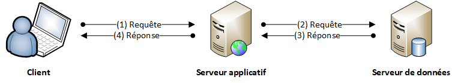
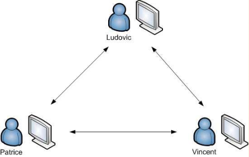

??? quote "Sources"
    - *Balabonski Première*
    - [nsi-a-feuillade.fr](https://www.nsi-a-feuillade.fr/document/premiere/06d_modele_client_serveur_protocole_HTTP60770327.pdf)
    - [geonov.fr](https://www.geonov.fr/architecture-client-serveur/)

# Le modèle client/serveur

Le **Web** était initialement une **collection de documents hypertextes** accessibles sur Internet. Toutefois, les sites Web ont évolué pour devenir de véritables **applications**, avec une **interface graphique** (décrite en *HTML* et *CSS*), du **code client** de **gestion d’éléments interactifs** (*JavaScript*) s’exécutant dans le **navigateur** et des **traitements de données** complexes effectués sur le **serveur Web** (avec des langages comme *PHP*) hébergeant le site.

Dans cette partie, nous verrons les éléments communs à la **conception d’une application Web interactive** : le **modèle client/serveur**, le **protocole HTTP** ainsi que la notion de **formulaire Web**.

## Le modèle client/serveur

!!! question ""
    Lorsqu'un **ordinateur A** veut **échanger des données** avec un **ordinateur B**, l'**ordinateur A** va **demander des fichiers** (*texte*, *photos*, *vidéos*…) à l'**ordinateur B**.

    Dans ce cas l'**ordinateur A** est le ==**client**== (il demande des ressources), l'**ordinateur B** (qui fournit les ressources) est ==**le serveur**==.

    

    { width="350" }
    

    L'exemple classique est lorsque l'on effectue une **navigation sur internet**.
    Notre **navigateur web** (donc nous sommes **client**) **demande** (on dit qu'il effectue une "requête") le **contenu d'une page web** stockée sur un **serveur web** (donc **serveur**). Ce dernier lui envoie le **résultat** (on parle de "réponse").

    Dans le cas d'une **consultation de page web**, le **serveur** enverra l'**ensemble des données** qui accompagne le lecture correcte de la **page**: fichiers *css*, *images*, fichiers *javascript*…

!!! abstract "Les types d'architecture client/serveur"
    Si toutes les ressources nécessaires sont présentes sur **un seul serveur**, on parle d’**architecture à deux niveaux** ou **2 tiers**. Ici par exemple, les deux tiers sont le **client** et le **serveur** :

    

    { width="350" }
    

    Si certaines ressources sont présentes sur un **deuxième serveur** (par exemple des bases de données), on parle d’**architecture à trois niveaux** ou **3 tiers** (1 client interroge le premier serveur qui lui-même interroge le deuxième serveur)

    

    { width="350" }
    

    Au-delà, on parle d'architecture $n$-tiers.

!!! abstract "Le *peer-to-peer*"
    Dans certains cas, l'**ordinateur** peut à la fois jouer le rôle de **client** et de **serveur**, (c'est le cas par exemple avec le *peer-to-peer*).

    

    { width="350" }
    

## Les datacenters

Afin d'assurer une **continuité de service**, dans les sociétés, plusieurs serveurs assurent exactement le **même rôle** (on parle de *redondance*).  
Il est en effet peu envisageable d'utiliser un seul serveur dès lors qu'un site génère un trafic important, et donc implique un nombre conséquent de **requêtes**.

Les très gros sites web comme *Google*, *Amazon* ou encore *Facebook*, possèdent un **très grand nombre de serveurs** afin de pouvoir satisfaire les demandes des utilisateurs en permanence.

!!! abstract ""
    Pour répondre à ce **nombre de requêtes important**, les serveurs sont concentrés dans un ==**datacenter**== (qui sont des bâtiments très sécurisés).

    

    { width="300" } { width="200" }
    

    Chaque armoire sur l'image ci-contre (qu'on appelle une baie) contient des centaines de serveur entassés les uns sur les autres.

    Ces serveurs sont des **machines plates**, ce qui facilite leur **entassement**. Il n'y a pas de moniteur, car on ne les utilise pas directement. Ils se contentent de **transmettre des données** sur le réseau.

!!! abstract "Des serveurs spécialisés"
    Parfois, les sites web utilisent des **serveurs spécialisés dans certaines tâches**.  
    Par exemple, les **serveurs** qui envoient aux **clients** des **pages HTML** sont appelés *serveurs web*.

    Il existe des serveurs pour **gérer des fichiers** (*serveurs de fichier*), des **serveurs** pour permettre l'**impression de document** (*serveurs d'impression*), pour **gérer les emails** (*serveurs de messagerie*)...

    Les **serveurs** peuvent **générer du code HTML**. Ainsi le **code HTML** envoyé aux clients dépendra des **actions du client** lui-même. On parle de ==**page web dynamique**==.  
    Pour gérer le **traitement des requêtes** et l'**interaction avec les bases de données**, il existe des **langages de programmation** mais qui s'exécute "coté serveur". Le plus utilisé se nomme **PHP**, mais on peut aussi utiliser du **JavaScript** (avec *node.js*), du **python**, du **ruby**...