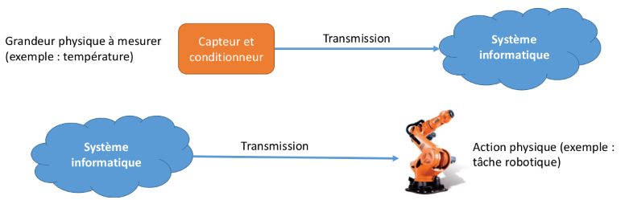
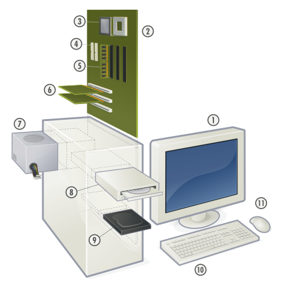

# Cours - Interface Homme-Machine (IHM)

## Les systèmes embarqués

### Vidéo d'introduction

Voici une petite **vidéo d'introduction** sur le principe des **systèmes embarqués** :

<iframe width="560" height="315" src="https://www.youtube-nocookie.com/embed/DOECi_ZKaYI?si=gBaXvsSF9mcJ2a1X" title="YouTube video player" frameborder="0" allow="accelerometer; autoplay; clipboard-write; encrypted-media; gyroscope; picture-in-picture; web-share" referrerpolicy="strict-origin-when-cross-origin" allowfullscreen></iframe>

Et voici une petite **activité d'introduction** :

<center>
[:material-file-word: Télécharger l'activité au format ODT](src/activite_microcontroleur.odt){ style="font-size:1.5em" target="_blank" }
</center>

<center>
[:material-file-pdf-box: Télécharger l'activité au format PDF](src/activite_microcontroleur.pdf){ style="font-size:1.5em" target="_blank" }
</center>

### Principe des systèmes embarqués

!!! abstract ""
    Un ==**système informatique embarqué**== est un **dispositif autonome** de **traitement** de l’**information** qui ne **dispose pas** de périphériques standard tels qu'un clavier et un écran. Il reçoit des **données** de l'extérieur via des ==**capteurs**==, qui sont ensuite traitées par une ==**unité de calcul** (processeur)==. Selon le **programme** du système, des **actions physiques** peuvent être exécutées à l'aide d'**actionneurs**. Les **capteurs** servent de **périphériques d'entrée** tandis que les **actionneurs** fonctionnent comme **périphériques de sortie**.

Les signaux capturés sont **analogiques**, c'est-à-dire qu'ils reflètent le **phénomène mesuré**, comme la **rotation** de l'**axe d'un anémomètre** mesurant la **vitesse du vent** sur une **station météo**. Pour être traités par le **processeur**, ces signaux sont **numérisés**, c'est-à-dire convertis en un **nombre fini d'informations codées** en `0` et `1` (langage binaire) par le biais de l'**échantillonnage** (un nombre fini de relevés) et de la **quantification** (un nombre fini de valeurs possibles).

!!! tip "Échantillonnage et quantification"
    L'**échantillonnage** est le processus consistant à **prendre des mesures d'un signal analogique** à intervalles réguliers pour en **capturer des valeurs discrètes**. Par exemple, dans **une seconde** de **musique**, on pourrait prendre 44 100 échantillons (fréquence d'échantillonnage de *44,1 kHz*) pour représenter le son de manière numérique.

    La **quantification**, quant à elle, est le **processus de conversion** de ces valeurs échantillonnées en **valeurs numériques discrètes**. Chaque échantillon est assigné à une **valeur** parmi un **nombre fini de niveaux possibles**. Par exemple, si on utilise une résolution de **16 bits**, chaque échantillon peut être représenté par l'un des **65 536 niveaux possibles**.

## Les microcontrôleurs

!!! abstract ""
    Les **microcontrôleurs** sont des **circuits intégrés** qui regroupent une mémoire, un processeur et des **entrées-sorties**, à l'instar d'un ordinateur, mais se distinguent par une **miniaturisation accrue**, une **consommation électrique réduite** et des **performances moindres**. Malgré ces limitations, ils sont suffisants pour un nombre croissant d'applications grâce aux progrès techniques.

Les **systèmes informatiques embarqués** sont omniprésents dans divers domaines : l'**industrie** (robots), le **transport** (avionique, automobile, métro, etc.), la **médecine** (pacemakers, imagerie, etc.), la **maison** (domotique, appareils ménagers, etc.), les **télécommunications** (téléphonie, etc.), le **monde du travail** (contrôle d'accès, etc.) et les **loisirs** (vélos électriques, etc.). On parle d'informatique ubiquitaire pour décrire cette présence généralisée de l'informatique dans notre environnement.

Les **smartphones** modernes ne sont **pas des microcontrôleurs**, mais des **ordinateurs miniatures** bien plus puissants que les systèmes de guidage des premières missions Apollo qui ont amené l'homme sur la Lune. Ils sont équipés de nombreux capteurs.

### Programmation

<figure markdown="span">
  
  <figcaption>Schéma de fonctionnement d'un système embarqué</figcaption>
</figure>

Un **algorithme de contrôle** fréquent sur un **système informatique embarqué** consiste en une **boucle infinie** où s’enchaînent **capture d’événements** par les **émetteurs**, **traitement** puis **action** par les **actionneurs**.

```
Initialiser les actionneurs à leur position de départ
Tant que Vrai
    Lire les informations des capteurs
    Traiter ces informations
    Calculer des informations sur les actionneurs
    Transmettre ces informations aux actionneurs
```

### Activité - Micro:bit

<center>
[:material-file-pdf-box: Fiche de la carte Micro:bit](src/109_Carte_MicroBit.pdf){ style="font-size:1.5em" target="_blank" }
</center>

<center>
[Capytale - Activité Micro:bit](https://capytale2.ac-paris.fr/web/c/fd97-3585492){ style="font-size:1.5em" target="_blank" }
</center>

## Interface Homme-Machine

### Principe

!!! abstract ""
    Une **Interface Homme Machine** (IHM) est un **ensemble de moyens physiques** (*boutons*, *manettes*) ou **logiciels** (*interface graphique*) qui permettent à un humain d’**échanger des informations** avec une **machine**.

    Les moyens matériels permettant l’interaction sont appelés **périphériques** : on distingue les périphériques d’**entrée** ou de **sortie**.
    Douglas Engelbart est un des pionniers des **IHM** en informatique avec son système **NLS** qui a été le premier à utiliser la **souris**, les liens hypertextes, les écrans à balayage, le fonctionnement par fenêtre et d'autres concepts informatiques modernes.

!!! note "Exercice"
    Nommer les différents **composants** d'un **ordinateur** :

    

### Fiabilité et sécurité

!!! abstract "Sûreté"
    La **sûreté** garantit qu’un système réalise ce qu'il doit faire et évite ce qu'il ne doit pas faire.
    
    Les **programmes** des **systèmes embarqués** doivent parfois fonctionner sous des contraintes strictes (ressources limitées, temps de réaction très rapide) et ne sont pas toujours développés avec la rigueur nécessaire, ce qui rend les bugs fréquents.  
    Ces bugs peuvent être bénins, comme la mauvaise gestion des années bissextiles qui a arrêté le lecteur MP3 Zune de Microsoft le 31/12/2008, ou avoir des conséquences dramatiques, comme les défaillances du Therac 25 (appareil de radiothérapie) ou du système de contrôle moteur des Toyota Camry, ayant provoqué plusieurs décès.

!!! abstract "Confidentialité"
    La **confidentialité** est une problématique majeure pour les systèmes embarqués qui collectent des données personnelles sur leurs utilisateurs, comme les cartes électroniques de transport telles que le pass Navigo ou la carte Técély.

!!! abstract "Sécurité"
    La **sécurité** est souvent un point faible des systèmes embarqués, qui manquent de ressources matérielles, ont des cycles de vie longs sans mises à jour, et utilisent des modes de communication sans contact particulièrement vulnérables.
    
    Par exemple, une voiture ne peut démarrer que si la carte de démarrage est à proximité, car la carte et la voiture partagent un secret commun pour déverrouiller le système antidémarrage. L’attaque par relais peut contourner ce protocole en relayant la communication : un pirate près de la voiture et un autre près de la carte font croire aux deux parties qu'elles sont à proximité. Tous les systèmes embarqués utilisant des communications sans contact (carte bancaire, carte d’accès, etc.) sont vulnérables à ce type d’attaque.

## Objets connectés

!!! abstract ""
    Un ==**objet connecté**== est un **système informatique embarqué** disposant d’une connexion à un réseau local ou à L’Internet.

    Les Interfaces Homme Machine des objets connectés sont souvent des applications Web disponibles sur
    Smartphone.

Avec la baisse des coûts des microcontrôleurs et des puces WiFi, les objets connectés se multiplient. On peut facilement en fabriquer à partir de cartes Arduino, de Raspberry Pi ou de cartes WiFi ESP8266. Actuellement, il y a plus d'objets connectés à Internet que d'êtres humains, et leur nombre devrait augmenter considérablement dans les années à venir grâce à la réduction des coûts.

On parle d’**Internet des objets** (*IoT*) pour désigner l’ensemble de ces objets connectés. On estime que le nombre d’objets connectés atteindra 50 milliards en 2020.