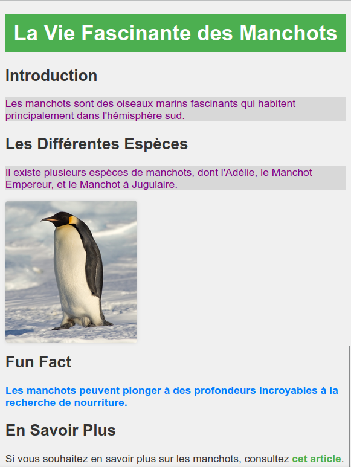

# Exercices et notebooks sur l'IHM

## Entraînement sur le HTML et CSS

!!! note ""
    Rendez-vous sur le site [jsbin.com](https://jsbin.com/), puis tentez de **reproduire la page web suivante**.  
    N'hésitez pas à consulter [les cours](htmlcss.md){ target="_blank" } pour vous aider si besoin.

    <center>
    { width="500" }
    </center>

## Notebooks Jupyter

!!! success ""
    **HTML et CSS** :

    - [Notebook - Les bases du HTML et du CSS](src/06a_basesHTML_CSS.ipynb){ target="_blank" }
    - [Notebook - CSS approfondissement](src/06b_CSS_avancee.ipynb){ target="_blank" }

    **JavaScript** :

    - [Notebook - Modifier les éléments du DOM avec JavaScript](src/06c_DOM_javascript.ipynb){ target="_blank" }

!!! tip "Correction Exercice final - TP Javascript"
    Voici le fichier `script.js` final permettant :
    - de remplacer la **photo** par une autre au **survol**,
    - de **changer la couleur** et le **texte du titre** lors d'un clic sur celui-ci.

    Ici, on a utilisé deux images nommées `stephane.jpg` (l'image d'origine) et une autre image nommée `philippe.jpg`.

    ```javascript
    function changerImage() {
    document.getElementById("photo").src = "philippe.jpg";
    }

    function resetImage() {
        document.getElementById("photo").src = "stephane.jpg";
    }

    function changerTexteEtCouleur() {
        titre.style.color = "blue";
        titre.innerHTML = "Philippe Etchebest";
    }

    // Changer l'image lors du survol
    document.getElementById("photo").addEventListener("mouseover", changerImage);
    document.getElementById("photo").addEventListener("mouseout", resetImage);

    // Changer texte et sa couleur lors du click
    let titre = document.getElementsByTagName("p")[0];
    titre.onclick = changerTexteEtCouleur;
    ```

## Autres exercices

Voici d'autres **exercices** pour vous permettre d'aller plus loin dans votre apprentissage du **JavaScript** :

- [http://portail.lyc-la-martiniere-diderot.ac-lyon.fr/srv1/html/cours_js_nsi/evenements/actions.html](http://portail.lyc-la-martiniere-diderot.ac-lyon.fr/srv1/html/cours_js_nsi/evenements/actions.html)
- [https://pixees.fr/informatiquelycee/n_site/nsi_prem_js.html](https://pixees.fr/informatiquelycee/n_site/nsi_prem_js.html)
- [https://frederic-junier.gitlab.io/parc-nsi/chapitre23/javascript-git2/](https://frederic-junier.gitlab.io/parc-nsi/chapitre23/javascript-git2/)
- [https://odyssey.sdlm.be/](https://odyssey.sdlm.be/)