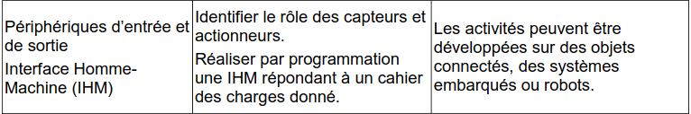

# Interface Homme-Machine (IHM)

<figure markdown="span">
  
  <figcaption>Extrait du programme</figcaption>
</figure>

| Liste des contenus                           | Description                         |
| -------------------------------------------- | ----------------------------------- |
| [Cours - Interface Homme-Machine](cours.md) | Périphériques d’entrée et de sortie et IHM. |