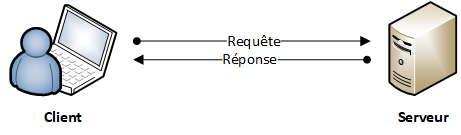

??? quote "Sources"
    - *Balabonski Première*
    - [nsi-a-feuillade.fr](https://www.nsi-a-feuillade.fr/document/premiere/06d_modele_client_serveur_protocole_HTTP60770327.pdf)
    - [geonov.fr](https://www.geonov.fr/architecture-client-serveur/)

# Modèle client/serveur et protocole HTTP

Le **Web** était initialement une **collection de documents hypertextes** accessibles sur Internet. Toutefois, les sites Web ont évolué pour devenir de véritables **applications**, avec une **interface graphique** (décrite en *HTML* et *CSS*), du **code client** de **gestion d’éléments interactifs** (*JavaScript*) s’exécutant dans le **navigateur** et des **traitements de données** complexes effectués sur le **serveur web** (avec des langages comme *PHP*) hébergeant le site.

Dans cette partie, nous verrons les éléments communs à la **conception d’une application Web interactive** : le **modèle client/serveur**, le **protocole HTTP** ainsi que la notion de **formulaire Web**.

## Le modèle client/serveur

!!! question ""
    Lorsqu'un **ordinateur A** veut **échanger des données** avec un **ordinateur B**, l'**ordinateur A** va **demander des fichiers** (*texte*, *photos*, *vidéos*…) à l'**ordinateur B**.

    Dans ce cas l'**ordinateur A** est le ==**client**== (il demande des ressources), l'**ordinateur B** (qui fournit les ressources) est ==**le serveur**==.

    <center>
    { width="350" }
    </center>

    L'exemple classique est lorsque l'on effectue une **navigation sur internet**.
    Notre **navigateur web** (donc nous sommes **client**) **demande** (on dit qu'il effectue une "requête") le **contenu d'une page web** stockée sur un **serveur web** (donc **serveur**). Ce dernier lui envoie le **résultat** (on parle de "réponse").

    Dans le cas d'une **consultation de page web**, le **serveur** enverra l'**ensemble des données** qui accompagne le lecture correcte de la **page**: fichiers *css*, *images*, fichiers *javascript*…

!!! abstract "Les types d'architecture client/serveur"
    Si toutes les ressources nécessaires sont présentes sur **un seul serveur**, on parle d’**architecture à deux niveaux** ou **2 tiers**. Ici par exemple, les deux tiers sont le **client** et le **serveur** :

    <center>
    { width="350" }
    </center>

    Si certaines ressources sont présentes sur un **deuxième serveur** (par exemple des bases de données), on parle d’**architecture à trois niveaux** ou **3 tiers** (1 client interroge le premier serveur qui lui-même interroge le deuxième serveur)

    <center>
    { width="350" }
    </center>

    Au-delà, on parle d'architecture $n$-tiers.

!!! abstract "Le *peer-to-peer*"
    Dans certains cas, l'**ordinateur** peut à la fois jouer le rôle de **client** et de **serveur**, (c'est le cas par exemple avec le *peer-to-peer*).

    <center>
    { width="350" }
    </center>

## Les datacenters

Afin d'assurer une **continuité de service**, dans les sociétés, plusieurs serveurs assurent exactement le **même rôle** (on parle de *redondance*).  
Il est en effet peu envisageable d'utiliser un seul serveur dès lors qu'un site génère un trafic important, et donc implique un nombre conséquent de **requêtes**.

Les très gros sites web comme *Google*, *Amazon* ou encore *Facebook*, possèdent un **très grand nombre de serveurs** afin de pouvoir satisfaire les demandes des utilisateurs en permanence.

!!! abstract ""
    Pour répondre à ce **nombre de requêtes important**, les serveurs sont concentrés dans un ==**datacenter**== (qui sont des bâtiments très sécurisés).

    <center>
    { width="300" } { width="200" }
    </center>

    Chaque armoire sur l'image ci-contre (qu'on appelle une baie) contient des centaines de serveur entassés les uns sur les autres.

    Ces serveurs sont des **machines plates**, ce qui facilite leur **entassement**. Il n'y a pas de moniteur, car on ne les utilise pas directement. Ils se contentent de **transmettre des données** sur le réseau.

!!! abstract "Des serveurs spécialisés"
    Parfois, les sites web utilisent des **serveurs spécialisés dans certaines tâches**.  
    Par exemple, les **serveurs** qui envoient aux **clients** des **pages HTML** sont appelés *serveurs web*.

    Il existe des serveurs pour **gérer des fichiers** (*serveurs de fichier*), des **serveurs** pour permettre l'**impression de document** (*serveurs d'impression*), pour **gérer les emails** (*serveurs de messagerie*)...

    Les **serveurs** peuvent **générer du code HTML**. Ainsi le **code HTML** envoyé aux clients dépendra des **actions du client** lui-même. On parle de ==**page web dynamique**==.  
    Pour gérer le **traitement des requêtes** et l'**interaction avec les bases de données**, il existe des **langages de programmation** mais qui s'exécute =="coté serveur"==. Le plus utilisé se nomme **PHP**, mais on peut aussi utiliser du **JavaScript** (avec *node.js*), du **python**, du **ruby**...

## Le protocole HTTP

### Principe et fonctionnement

!!! abstract ""
    Le ==protocole **HTTP**== (acronyme de *Hypertext Transfer Protocol*) est le **protocole réseau** utilisé par les **navigateurs Web** (Firefox, Internet Explorer...) et les **serveurs Web** (Apache, Nginx, Microsoft IIS...) pour communiquer entre eux.

    C'est ce **protocole** qui est utilisé lorsque vous **accédez à une page web**. Il permet ainsi d'**obtenir** les *fichiers HTML*, *CSS*, *JavaScript*, les *images*, les *vidéos*, bref, toutes les ressources dont votre navigateur a besoin pour **afficher votre page web**.

    Le **protocole HTTP** permet également de **transmettre des données au serveur**, par l'intermédiaire de **formulaires** Internet.

    Techniquement, il s'agit d'un protocole texte (donc lisible en clair) s'appuyant les protocoles plus bas-niveau **TCP** et **IP** (voir le modèle *Internet* ci-dessous).

    Les **robots** des **moteurs de recherche** (comme *Googlebot*) qui **explorent** les sites internet utilisent également le protocole **HTTP** pour communiquer avec les **serveurs web**.

!!! abstract "Fonctionnement du protocole *HTTP*"
    Prenons comme exemple l'*URL* suivante : `http://nsi.erwandemerville.fr/premiere/ihm`.

    Lorsque l'on essaie d'accéder à cette *URL* avec un **navigateur**, voici ce qu'il se passe :

    - le `http` au début de l'*URL* indique que l'on utilise le **procole HTTP**,
    - le **navigateur** extrait le **nom de domaine** 'nsi.erwandemerville.fr' (ici, l'adresse est plus précisément composée d'un **sous-domaine** `nsi` et d'un **domaine** `erwandemerville.fr`) et à partir de cette information, il trouve le **serveur web distant** en faisant appel à un **serveur DNS** qui fait le lien entre le **nom de domaine** et l'**adresse IP**,
    - à partir de là, une **connexion** (basée sur les protocoles *TCP/IP*) est **établie** entre le **navigateur** et le **serveur web distant**,
    - une **requête HTTP** demandant la **ressource** '/premiere/ihm' est alors **transmise par le navigateur**,
    - le **serveur web** trouve la **ressource** correspondante et en **renvoie le contenu** dans une **réponse HTTP**,
    - le **navigateur** est désormais capable d'**afficher le fichier HTML** à l'internaute.

!!! tip "Une en-tête de requête envoyée par le navigateur"
    Une **en-tête** de **requête** envoyée par le **navigateur** à un **serveur web** ressemble à ceci :

    ```shell
    GET /fichier.html HTTP/1.1[CRLF]
    Host: www.monsite.com[CRLF]
    User-Agent: Mozilla/5.0 Safari/531.9[CRLF][CRLF]
    ```

    La **première ligne** contient toujours :

    - le **type de requête** (ici `GET`), la partie **chemin de l'URL** de la **ressource cible** et enfin la **version du protocole** (1.0 ou 1.1 généralement, ici `1.1`).
    - Les **2 types de requête** les plus courantes sont :
      - ==**GET**== : permet d'==obtenir== une **ressource**. Il s'agit de la requête la plus utilisée sur Internet, c'est celle qui est utilisée lorsque vous accédez à un site web dans votre navigateur.
      - ==**POST**== : permet d'**envoyer** le **contenu d'un formulaire** à un **serveur**, afin que ces données soient **traitées** (par exemple, un formulaire de connexion à un site web utilise la méthode `POST`).

    Les `[CRLF]` symbolisent une **séquence ASCII**, appelée `[Carriage Return - Line feed]`. C'est en fait le **délimiteur** utilisé par le **protocole HTTP** pour séparer les **lignes** de l'**en-tête**. En **ASCII**, c'est le caractère *13* suivi du caractère *10*.
    
    Les **lignes suivantes** sont des **champs HTTP**, toujours formatées de cette manière `"NomChamps: Valeur"`.

!!! tip "Une en-tête de réponse envoyée par le serveur"
    Une **en-tête** de **réponse** à une requête du navigateur ressemble à ceci :

    ```shell
    HTTP/1.1 200 OK[CRLF]
    Date: Thu, 24 Sep 2009 19:37:34 GMT[CRLF]
    Server: Apache/2.2.3[CRLF]
    Content-Length: 7234[CRLF]
    Content-Type: text/html; charset=UTF-8[CRLF][CRLF]
    [ici se trouve le corps de la réponse : la page HTML]
    ```

    La **première ligne** de la **réponse** contient toujours un **code HTTP** indiquant si la requête a **réussi ou pas** (ici, le code est `200`, indiquant une **réussite**).

    Ensuite, comme pour la **réponse**, on trouve les **lignes** des **champs HTTP**.
    - La ligne **Server** indique le **type de serveur** qui a fourni la réponse (le plus souvent Apache (installé sur près de la moitié des serveurs mondiaux).
    - Ensuite se trouve le corps de la réponse, qui dans le cas d'un **GET** d'un fichier **HTML** contient par exemple le **code HTML** de la page visée.

### La commande `curl`

La commande `curl` permet d'effectuer une **requête** vers un **serveur web**.

Par exemple : `curl https://nsi.erwandemerville.fr --head`.  
Le `--head` permet de ne récupérer **que l'en-tête de la réponse**, sans le code HTML.

??? question "Les informations obtenues"
    - **HTTP/2 200**: C'est le code de statut HTTP qui indique que la requête a réussi (200 OK). HTTP/2 est la version du protocole HTTP utilisée pour cette réponse.
    - **server**: GitHub.com: Cela indique le serveur qui a répondu à la requête. Dans ce cas, la réponse provient du serveur GitHub.com.
    - **content-type**: text/html; charset=utf-8: Cela spécifie le type de contenu de la réponse, dans ce cas, c'est du texte au format HTML avec un encodage de caractères UTF-8.
    - **last-modified**: Fri, 05 Apr 2024 06:18:40 GMT: C'est la date et l'heure de la dernière modification du contenu de la ressource sur le serveur. Cela peut être utile pour les caches et les clients qui veulent savoir si la version qu'ils ont est à jour.
    - **access-control-allow-origin** : Cet en-tête indique quelles origines sont autorisées à accéder à la ressource en réponse à une requête d'origine croisée. Ici, l'astérisque () indique que toutes les origines sont autorisées.
    - **etag**: "660f97c0-12b67": C'est une chaîne de caractères qui représente la version spécifique de la ressource. Il est utilisé pour la mise en cache et la vérification de la version.
    - **expires**: Sun, 07 Apr 2024 23:43:03 GMT: C'est la date et l'heure à laquelle la réponse ne sera plus considérée comme valide sans effectuer une nouvelle requête au serveur. Cela aide les navigateurs à décider s'ils doivent utiliser une copie en cache ou demander une nouvelle version.
    - **cache-control:** max-age=600: Cela indique les directives de mise en cache pour les clients et les caches intermédiaires. Dans ce cas, il spécifie que la réponse peut être mise en cache pendant 600 secondes (10 minutes).
    - **x-proxy-cache**: MISS: Cet en-tête indique si la réponse a été récupérée à partir d'un cache proxy. Dans ce cas, il indique qu'elle n'a pas été trouvée dans le cache (MISS).
    - **x-github-request-id**: C'est un identifiant unique généré par GitHub pour cette requête spécifique. Il peut être utilisé pour le débogage et le suivi des requêtes.
    - **accept-ranges**: bytes: Cela indique au client que le serveur prend en charge les demandes de plage de ressources. Cela signifie que le client peut demander des parties spécifiques de la ressource plutôt que de la télécharger en entier.
    - **age**: 0: C'est l'âge de la réponse en secondes, indiquant depuis combien de temps la réponse est en cache sur un serveur intermédiaire.
    - **date**: Sun, 07 Apr 2024 23:33:03 GMT: C'est la date et l'heure actuelle selon le serveur.
    - **via**: 1.1 varnish: Cela indique que la réponse est passée par un serveur de mise en cache (Varnish) sur le chemin de retour au client.
    - **x-served-by**: cache-par-lfpg1960049-PAR: Cet en-tête indique le serveur qui a servi la réponse, dans ce cas, un serveur de cache avec une certaine identification.
    - **x-cache**: MISS: Cet en-tête fournit des informations sur l'état de mise en cache de la réponse. Dans ce cas, il indique que la réponse n'était pas dans le cache (MISS).
    - **x-cache-hits**: 0: Cet en-tête indique le nombre de fois que cette réponse a été trouvée dans le cache. Dans ce cas, elle n'a pas été trouvée dans le cache précédemment.
    - **x-timer**: S1712532784.540291,VS0,VE113: Cet en-tête fournit des informations sur le temps qu'il a fallu pour traiter la requête du serveur. Il comprend différents marqueurs de temps liés au traitement de la requête.
    - **vary**: Accept-Encoding: Cela indique que la réponse peut varier en fonction de l'en-tête Accept-Encoding envoyé par le client, ce qui signifie que le serveur peut répondre avec différentes versions en fonction des capacités de compression du client.
    - **x-fastly-request-id**: c83fb09b8200e484b8cabe6906aee527a217a6cf: C'est un identifiant unique généré par le service de mise en cache Fastly pour cette requête spécifique. Il peut être utilisé pour le suivi et le débogage.
    - **content-length**: 76647: C'est la longueur du contenu de la réponse en octets.

    Ces en-têtes fournissent diverses informations sur la réponse HTTP qui peuvent être utilisées par le client pour interpréter et traiter la réponse de manière appropriée.

## Exercices - Activités

<center>
[Quelques exemples avec Flask](src/serveurpythonflasktp.pdf){ style="font-size:1.5em" target="_blank" }
</center>

<center>
[:material-cursor-default-click: Un TP avec Flask](https://capytale2.ac-paris.fr/web/c/4c81-6110190){ style="font-size:1.5em" target="_blank" }
</center>
