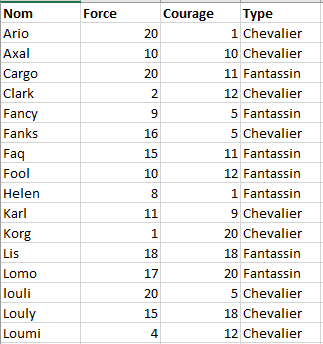
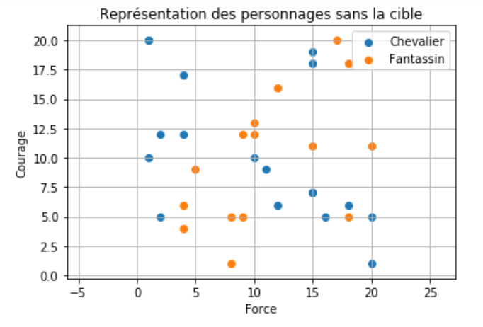
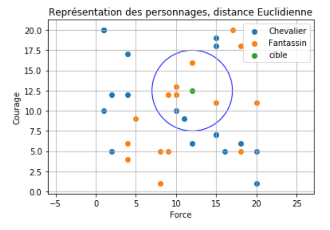
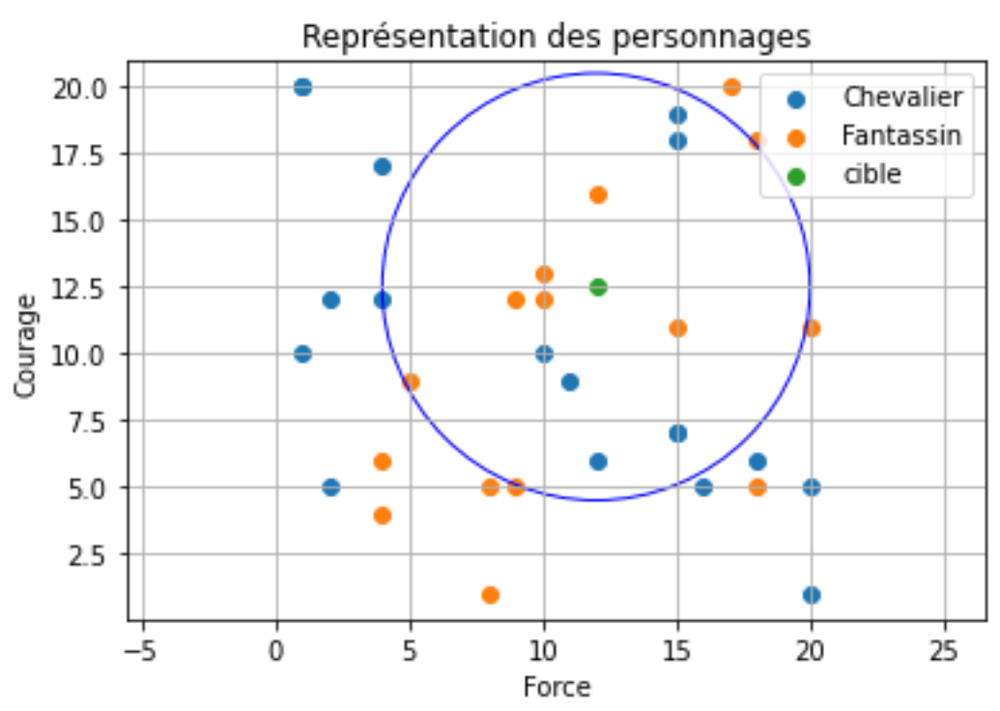

# Cours - Algorithme des $k$ plus proches voisins

??? quote "Sources / Liens utiles"
    - [monlyceenumerique.fr](http://www.monlyceenumerique.fr/nsi_premiere/algo_a/a4_algo_knn.php)

## Introduction

L'**algorithme** des $k$ **plus proches voisins** (*k-NN*, de l'anglais **k-nearest neighbors**) est une **méthode d'apprentissage automatique supervisé** qui **classe** un *élément* en fonction de la **catégorie prédominante** parmi ses **voisins les plus proches** dans l'**ensemble d'entraînement**.

Son principe peut se résumer par l'expression : *Dis-moi qui sont tes amis et je te dirai qui tu es*.

## Un premier exemple

!!! quote ""
    *Source de cet exemple : [monlyceenumerique](http://www.monlyceenumerique.fr/nsi_premiere/algo_a/a4_algo_knn.php#1.1)*

!!! abstract ""
    Dans cette introduction, nous examinons un **ensemble de données structuré** ainsi :

    - Les **données** se divisent en deux **types** : *type 1* et *type 2*.
    - Chaque **donnée** possède deux **caractéristiques** : *caractéristique 1* et *caractéristique 2*.

    Considérez la situation suivante dans un jeu :

    - Il y a deux **types** de personnages : les *fantassins* (type 1 : "fantassin") et les *chevaliers* (type 2 : "chevalier").
    - Les personnages ont deux **caractéristiques** : la *force* (caractéristique 1 : valeur entre 0 et 20) et le *courage* (caractéristique 2 : valeur entre 0 et 20).
    - Vous disposez d'une **collection de personnages** dont vous connaissez les **types** et les **caractéristiques**.

    Vous introduisez un **nouveau personnage** dont le **type** est **inconnu**, mais vous avez ses **caractéristiques**. L'objectif de l'algorithme ==**KNN**== (k plus proches voisins) est de déterminer le **type de ce nouveau personnage**.

Voici un aperçu de ces données :

Et une représentation visuelle, avec la **force** en **abscisse** et le **courage** en **ordonnée**.  
Les **points bleus** représentent les **chevaliers**, les **points oranges** représentent les **fantassins**.

{ width="600px" }

!!! note "Nouvelle donnée"
    On introduit à présent une **nouvelle donnéee** (le point vert) que l'on appelera **cible**, qui dispose des **caractéristiques** suivantes :

    - une **force** de **12**,
    - un **courage** de **12,5**.

    Le but de l'**algorithme KNN** des **k plus proches voisins** est de déterminer le **type** de cette **nouvelle donnée**.

### Avec $k = 7$

Dans un premier temps, on définit le **nombre de voisins** à $k = 7$. Cela signifie que l'on se basera sur les **7 voisins les plus proches** de la **cible** pour déterminer son **type**.

{ width="600px" }

!!! question "Type de la cible ?"
    Pour déterminer le **type le plus probable** de notre **cible**, il faut regarder quel est le **type** le plus présent parmi ses **7 voisins**.

    On constate qu'il y a :

    - *5 fantassins* (les points oranges),
    - *2 chevaliers* (les points bleus).

    $5 > 2$, donc on déterminera que notre **cible** est un **==fantassin==**.

### Avec $k = 13$

Cette fois, on souhaite déterminer le **type** de notre **cible** à partir de ses **13 voisins plus proches voisins**.

{ width="600px" }

!!! question "Type de la cible ?"
    Pour déterminer le **type le plus probable** de notre **cible**, il faut regarder quel est le **type** le plus présent parmi ses **7 voisins**.

    On constate qu'il y a :

    - *5 fantassins* (les points oranges),
    - *2 chevaliers* (les points bleus).

    $5 > 2$, donc on déterminera que notre **cible** est un **==fantassin==**.