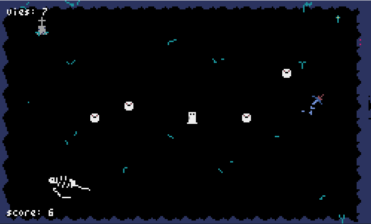
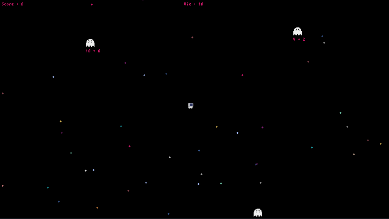
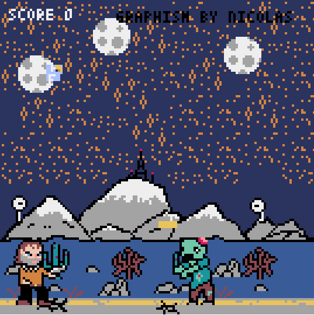
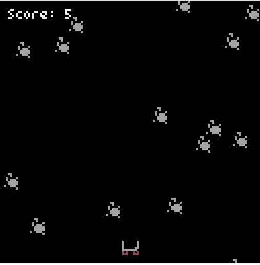
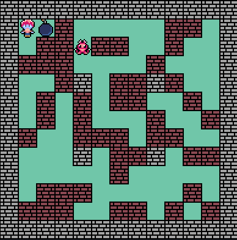

# Réalisations des élèves

Voici les **jeux** réalisés par les **élèves de première** à l'aide du module *Pyxel*.

Cliquez sur le **bouton** ++"Jouer"++ pour **lancer un jeu** sur votre navigateur.  
*Note : au moment où le texte `"CLICK TO START"` apparaît, il faut parfois patienter quelques secondes après avoir cliqué pour que le jeu démarre.*  
Vous pouvez également **télécharger le jeu** afin de l'**exécuter sur votre machine** avec le bouton ++"Télécharger"++.

---

Fantôme Survivor

{ width="400" }

[Jouer :video_game:](#){ .md-button onclick="window.open('../jeux/FantomeSurvivor.html', '_blank', 'scrollbars=yes,resizable=yes,width=1280,height=720')" }
[:material-microsoft-windows: Télécharger](jeux/FantomeSurvivor.exe){ .md-button target="_blank" }

---

Ghost Invasion

{ width="400" }

[Jouer :video_game:](#){ .md-button onclick="window.open('../jeux/Ghost_invasion.html', '_blank', 'scrollbars=yes,resizable=yes,width=1280,height=720')" }
[:material-microsoft-windows: Télécharger](jeux/Ghost_invasion.exe){ .md-button target="_blank" }

---

Zombie Crusher

{ width="400" }

[Jouer :video_game:](#){ .md-button onclick="window.open('../jeux/Zombie_crusher.html', '_blank', 'scrollbars=yes,resizable=yes,width=1280,height=720')" }
[:material-microsoft-windows: Télécharger](jeux/Zombie_crusher.exe){ .md-button target="_blank" }

---

Cave's Runner

{ width="400" }

[Jouer :video_game:](#){ .md-button onclick="window.open('../jeux/Caves_runner.html', '_blank', 'scrollbars=yes,resizable=yes,width=1280,height=720')" }
[:material-microsoft-windows: Télécharger](jeux/Caves_runner.exe){ .md-button target="_blank" }

---

Bomberman

{ width="400" }

[Jouer :video_game:](#){ .md-button onclick="window.open('../jeux/Bomberman.html', '_blank', 'scrollbars=yes,resizable=yes,width=1280,height=720')" }
[:material-microsoft-windows: Télécharger](jeux/Bomberman.exe){ .md-button target="_blank" }

