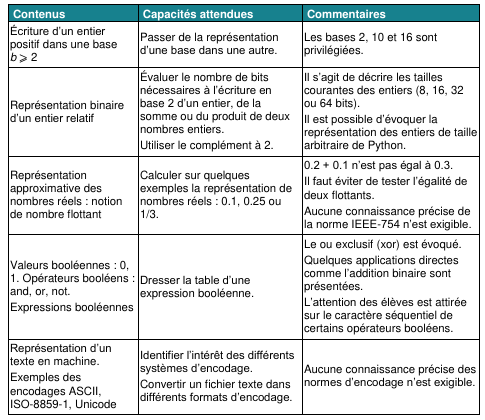
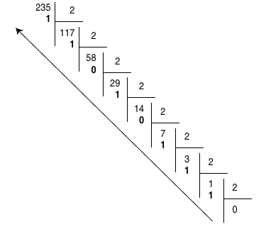
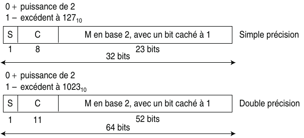
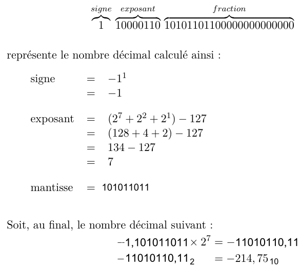
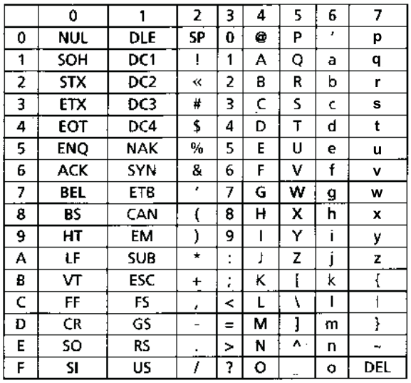
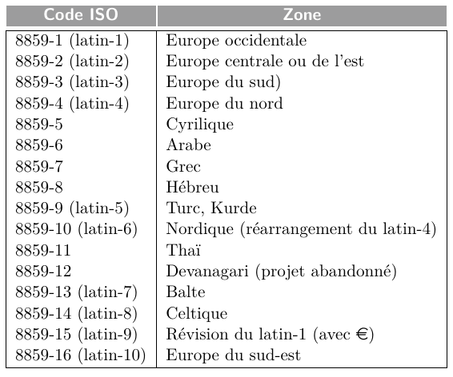
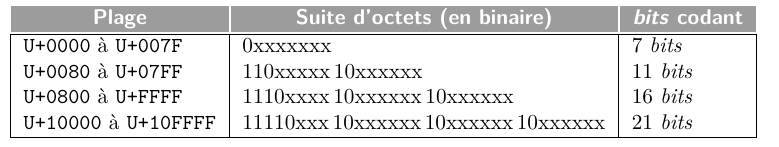
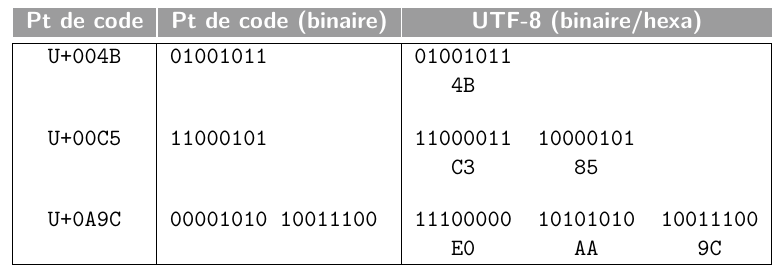

# Représentation des données en machine

??? abstract "Extrait du programme"
    Voici un extrait du programme indiquant les notions à maîtriser sur ce thème.

    

Dans un ordinateur, toutes les **informations** (**données** ou **programmes**) sont représentées à l’aide de** deux chiffres** : le **0** et **1**, appelés chiffres binaires ou Binary Digits (*bits*) en anglais.

Dans la mémoire d’un ordinateur (RAM, ROM, registres des microprocesseurs, etc.), ces chiffres binaires sont regroupés par **paquets de 8**, que l'on appelle **octets** (ou *bytes* en anglais), puis organisés en **mots machine** (ou *words* en anglais) de 2, 4 ou 8 octets en général. Un ordinateur de **32 bits** par exemple manipule directement des mots de **4 octets** (4 octets × 8 bits = 32 bits) lorsqu’il effectue des opérations en mémoire ou dans ses calculateurs.

Le **regroupement des bits** en **octets** ou **mots machine** permet de représenter des données telles que des **nombres entiers**, des **nombres réels** (on verra que l'on ne peut représenter que des approximations des nombres réels), ou encore des **caractères** et des **textes** (on introduira la notion d'*encodage*).

## Représentation des entiers naturels

L'encodage le plus simple est celui des **nombres entiers naturels** (nombres entiers positifs).

Pour représenter des nombres, les ordinateurs utilisent le **système binaire** :  
Le codage binaire d’un **nombre positif** $n$ est la suite de $k$ **bits** $b_{k - 1} ... b_0$ telle que
$n = b_{k − 1} × 2^{k − 1} + b_{k − 2} × 2^{k − 2} + ... + b_1 × 2^1 + b_0 × 2^0$ . Ainsi le nombre $42$ en **décimal** est représenté par $101010$ en **binaire** :  
$42 = \textbf{1} × 2⁵ + \textbf{0} × 2⁴ + \textbf{1} × 2³ + \textbf{0} × 2² + \textbf{1} × 2¹ + \textbf{0} × 2⁰$  
$42 = \textbf{1} × 2⁵ + \textbf{1} × 2³ + \textbf{1} × 2^1$  
$42 = 32 + 8 + 2$

!!! note "À vous de jouer"
    Voici des **nombres entiers** en **base binaire**, donner l'**écriture** en **base décimale** de ces nombres :

    - $0100 1010_2$
    - $1111 0101_2$

Le **codage binaire** d'un nombre décimal consiste à passer de la **base 10** (base *décimale*) à la **base 2**, mais il existe d'autres bases comme la **base 8** (base *octale*), ou la **base 16** (base *hexadécimale*).

!!! tip "Chiffres autorisés selon la base X de représentation"
    **Base 2** : chiffre $0$ et $1$.  
    **Base 8** : chiffre $0, 1, 2, 3, 4, 5, 6, 7$.  
    **Base 10** : chiffre $0, 1, 2, 3, 4, 5, 6, 7, 8, 9$  
    **Base 16** : chiffre $0, 1, 2, 3, 4, 5, 6, 7, 8, 9, A, B, C, D, E, F$ avec $A = 10_{10}, B = 11_{10}, C = 12_{10}, D = 13_{10}, E = 14_{10}, F = 15_{10}$.

??? tip "Rappels - Écriture en base 10"
    Un **nombre entier** en **base 10** est une **séquence de chiffres** compris entre $0$ et $9$. Pour calculer la valeur d’une séquence $c_{k−1} , c_{k−2} , . . . , c_{1} , c_{0}$ de $k$ **chiffres**, on affecte à **chaque chiffre** $c_n$ un poids $10^n$, ce poids étant une **puissance de 10** qui dépend de sa position $n$ dans la séquence, et on calcule la somme des termes $c_n × 10^n$. 
    
    Si l'on prend l’exemple de la séquence $61027$, et qu'on la représente en différentes colonnes, en indiquant la position de chaque chiffre, en commençant à **compter les indices** et les **poids correspondants** à partir de $0$ de la **droite vers la gauche**, on obtient : 

    | séquence     | 6    | 1    | 0    | 2    | 7    |
    | ------------ | ---- | ---- | ---- | ---- | ---- |
    | **position** | 4    | 3    | 2    | 1    | 0    |
    | **poids**    | 10⁴  | 10³  | 10²  | 10¹  | 10⁰  |

    La **valeur** de la séquence est un **entier**, que l'on notera $N$, calculé de la manière suivante :

    $N = 6 × 10^4 + 1 × 10^3 + 0 × 10^2 + 2 × 10^1 + 7 × 10^0$

    Plus généralement, une séquence $d_{k−1} , d_{k−2} , . . . , d_1 , d_0$ de $k$ chiffres décimaux $d_i$ correspond au nombre $N$ suivant :
    
    $N = d_{k−1} × 10^{k−1} + d_{k−2} × 10^{k−2} + · · · + d_1 × 10^1 + d_0 × 10^0$

??? tip "Rappels - Écriture en base 2"
    Tout comme l’**encodage en base 10**, une **séquence de chiffres binaires** peut s’interpréter comme un **nombre écrit en base 2**. Dans cette base, chaque **chiffre** (**0** ou **1**), appelé **bit**, de la séquence est associée à un **poids** $2^i$ et à une **puissance de 2** qui dépend de sa position $i$.

    Par exemple, l’**octet** (suite de 8 bits) $0100 1101$ peut être représenté de la manière suivante.

    | séquence     | 0    | 1    | 0    | 0    | 1    | 1    | 0    | 1    |
    | ------------ | ---- | ---- | ---- | ---- | ---- | ---- | ---- | ---- |
    | **position** | 7    | 6    | 5    | 4    | 3    | 2    | 1    | 0    |
    | **poids**    | 2⁷   | 2⁶   | 2⁵   | 2⁴   | 2³   | 2²   | 2¹   | 2⁰   |


    La **valeur** de cette **séquence**, que l'on notera $N$, est calculée comme suit :

    $N = 0 × 2^7 + 1 × 2^6 + 0 × 2^5 + 0 × 2^4 + 1 × 2^3 + 1 × 2^2 + 0 × 2^1 + 1 × 2^0$  
    $N = 77_{10}$

    Plus généralement, une séquence $b_{k−1} , b_{k−2} , . . . , b_1, b_0$ de $k$ bits $b_i$ correspond au nombre $N$ suivant :
    
    $N = b_{k−1} × 2^{k−1} + b_{k−2} × 2^{k−2} + · · · + b_1 × 2^1 + d_0 × b^0$

    Cette manière d'**encoder les entiers naturels** à l'aide de **séquences** de $k$ **bits** permet de représenter les entiers de $0$ à $2^k − 1$. Sur **1 octet** (= **8 bits**) par exemple, on peut donc représenter les **entiers naturels** de $0$ à $255$.

??? tip "Rappels - Base 16 (hexadécimale)"
    ...

### Méthode des divisions euclidiennes successives

Si l'on souhaite par exemple représenter $235_{10}$ en **base 2** :

<figure markdown>
  { width="340" }
  <figcaption>Méthode des divisions successives</figcaption>
</figure>

L'écriture binaire de $235_{10}$ sur **8 bits** est donc $1110 1011_2$.

Si l'on souhaite convertir un nombre vers la **base 16** (en hexadécimal), le principe est le même, mais on **divisera par 16** au lieu de diviser par 2. On rappelle qu'en **hexadécimal**, les valeurs vont de $0$ à $F$ : $1, 2, ..., 8, 9, A, B, ... E, F$, les restes supérieurs à $9$ devront donc être remplacés par **une lettre**.

### Méthode des soustractions

Pour convertir un **entier** noté $N$ en **base** $X$, on procède comme suit :

La plus grande puissance de $X$ qui est **inférieure ou égale** à $N$ est soustraite à $N$. Ce processus de soustraction est **répété** sur le **reste** de la différence, jusqu’à obtenir un résultat **égal à 0**. Le nombre $N$ exprimé en base $X$ est alors obtenu en notant **le nombre de fois** où une même puissance de $X$ a été retirée, et cela pour chaque puissance depuis la plus grande apparaissant, dans l’ordre décroissant des puissances.

Dans le cas d'une conversion vers la **base 2**, chaque puissance de $X$ ne peut être retirée qu'**une seule fois** (car les seules valeurs possibles en binaire sont **0** et **1**.)

**<u>Exemples</u>** :

Si l'on souhaite **convertir** $125_{10}$ en **base 2** :  
On sait que $2⁰ = 1; 2¹ = 2; 2² = 4; 2³ = 8; 2⁴ = 16; 2⁵ = 32; 2⁶ = 64; 2⁷ = 128$.  
$125 - \textbf{64} = 61; 61 - \textbf{32} = 29; 29 - \textbf{16} = 13; 13 - \textbf{8} = 5; 5 - \textbf{4} = 1; 1 - \textbf{1} = 0;$

Donc $125_{10} = 0111~1101$.

Si l'on souhaite **convertir** $235_{10}$ en **base 8** :  
On sait que $8^0 = 1; 8¹ = 1; 8^2 = 64; 8^3 = 512$.    
$235 – 64 = 171; 171 – 64 = 107; 107 – 64 = 43; 43 – 8 = 35; 35 – 8 = 27; 27 – 8 = 19;$  
$19 – 8 = 11; 11 – 8 = 3; 3 – 1 = 2; 2 – 1 = 1; 1 – 1 = 0$

Donc $235_{10} = 3 × 64 + 5 × 8 + 3 × 1 = 353_8$.

### Convertir un nombre de la base 2 vers la base 16

Pour convertir un nombre de la **base 2** vers la **base 16**, c'est simple : il suffit de faire des paquets de **4 bits**, et de coder **chaque paquet** avec **une valeur hexadécimale**. Par exemple, si l'on reprend l'écriture binaire précédente : $1110~1011_2$, le premier groupe $1110$ se code par $14$ en **décimal**, et donc par $E$ en **hexadécimal**. Le deuxième groupe $1011$ se code par $11$ en **décimal**, et donc par $B$ en **hexadécimal**. Ainsi, $235_{10} = 1110~1011_2 = EB_{16}$.

À l'inverse, convertir un nombre exprimé en **base 16** vers la **base 2** s’effectue en remplaçant simplement **chacun** des **chiffres** du nombre en **base 16** par leur **équivalent binaire** sur **4 bits**.

**<u>Par exemple</u>** :  
$45 A_{16} = 0100~0101~1010_2$ et $1100~1111_2 = CF_{16}$

### Quelques exercices

!!! note "Exercice 1"
    En utilisant la méthode des **divisions euclidiennes successives**, donner l'**écriture binaire** du nombre **147** sur **8 bits**. À partir de l'**écriture binaire** obtenue, donner son **écriture hexadécimale**.

!!! note "Exercice 2"
    En utilisant la méthode **des soustractions successives**, donner l'écriture binaire du nombre **169** sur **8 bits**. À partir de l'**écriture binaire** obtenue, donner son **écriture hexadécimale**.

!!! note "Exercice 3"
    Donner la représentation en **base 2** et **sur 8 bits** des entiers **14**, **218**, **42** et **57**.
    
    Vous pourrez vérifier vos réponses avec la fonction `bin` de **Python**. La fonction `bin` prend un **nombre entier** en entrée, et renvoie la **représentation binaire** de ce nombre.

    Par exemple :

    ```python
    >>> bin(42)
    '0b101010'
    ```

    Ici, on voit que l'écriture binaire de **42** est $101010$. Le `0b` indique **la base** (`b` pour *binaire*, `o` pour octal, `x` pour hexadécimal).

!!! note "Exercice 4"
    Donner la représentation en **base 16** des **entiers binaires** suivants.

    - 1001010
    - 100010001
    - 1010010011110010

    Vous pourrez vérifier vos réponses avec la fonction `hex` de **Python**. La fonction `hex` prend un **nombre entier** en entrée, et renvoie la **représentation hexadécimale** de ce nombre.

    Par exemple :

    ```python
    >>> hex(42)
    '0x2A'
    ```

    Ici, on voit que l'écriture hexadécimale de **42** est $2A$. Le `0x` indique **la base** (`b` pour *binaire*, `o` pour octal, `x` pour hexadécimal).

!!! note "Exercice 5"
    Quelle est la valeur en **base 10** de l’entier qui s’écrit $BEEF$ en **base 16** ? 

## Représentation des entiers relatifs

La **représentation d’un nombre signé** s’effectue selon une **séquence binaire** d’une **longueur fixée** à $n$ bits. Cette longueur peut être de **8 bits**, de **16 bits** ou de **32 bits**.

Plusieurs **conventions de représentation** existent. Le choix de la convention est effectué par le **constructeur de la machine**, et éventuellement par le **programmeur** en fonction du **type** affecté aux variables déclarées. Dans le langage **C** par exemple, déclarer une variable avec un type `int`, détermine une **représentation sur 2 octets** selon la **convention du complément à 2**. Par ailleurs, une déclaration avec un type `unsigned short` détermine une **représentation d’un nombre sur 8 bits**, **non signé**.

### Convention de la valeur signée

Dans cette convention, le **bit de poids fort** (c'est-à-dire celui qui est tout à gauche de l'écriture) correspond au **signe** ($0$ pour un entier positif, $1$ pour un entier négatif). Tous les autres bits codent la **valeur absolue du nombre**.

<u>Exemple</u> :

- Représentation de $+ 77_{10}$ sur **8 bits** : $01001101_2$.
- Représentation de $– 77_{10}$ sur **8 bits** : $11001101_2$.

On peut faire les **remarques** suivantes sur cette représentation :

- deux représentations de la valeur $0$ sont possibles, l'une correspondant à un zéro **positif** ($00000000_2$ = $(+ 0)_{10}$ sur 8 bits), l'autre à un zéro **négatif** ($10000000_2$ = $(– 0)_{10}$ sur $8$ bits);
- l’intervalle des nombres signés représentables est **borné** en fonction de la **longueur de la chaîne binaire** utilisée pour la représentation. Sur $8$ bits par exemple, l’intervalle des nombres représentables est $[11111111_2, 01111111_2]$, soit l’intervalle $[-127_{10}, + 127_{10}]$. L’arithmétique des machines est donc différente de celle de l’être humain puisque l’intervalle des nombres n’est pas infini, mais dépend de la longueur des chaînes de bits manipulées par la machine;
- pour effectuer une **soustraction**, il est nécessaire d'utiliser un circuit particulier différent de celui permettant d'effectuer des **additions**.

Voici les **valeurs représentables** avec cette convention selon la **longueur de la chaine de bits** fixée :

| Longueur de la chaine de bits | Intervalle de base 10                |
| ----------------------------- | ------------------------------------ |
| $8$ bits                      | $[- 127, + 127]$                     |
| $16$ bits                     | $[- 32 767, + 32 767]$               |
| $32$ bits                     | $[– 2 147 483 647, + 2 147 483 647]$ |
| $p$ bits                      | $[– 2^{p – 1} – 1, + 2^{p – 1} – 1]$ |

### Convention du complément à 2

Le **complément à 2** ou *complément vrai* d’un nombre binaire $N = b_{n–1} ... b_0$ s’obtient en ajoutant la valeur $1$ au **complément restreint** ou **complément à 1** de ce nombre.

Le **complément à 1** ou *complément restreint* d’un nombre binaire $N = b_{n-1} ... b_0$ s’obtient en **inversant** la **valeur** de **chacun des bits** de ce nombre.

<u>Exemple</u> :

|                      | $10001001_2$  |
| -------------------- | -------- |
| complément à 1 | $01110110_2$ |
|                      | + $1_2$      |
| complément à 2       | $01110111_2$ |

Dans la convention du **complément à 2**, un nombre **négatif** $– N$ exprimé sur $n$ **bits** est représenté en prenant le **complément à 2** de son **équivalent positif** $+ N$. Un nombre positif $+ N$ est quant à lui représenté par sa **valeur binaire** sur $n$ **bits**.

<u>Exemple</u> :

| Représentation de $+ 77_{10}$ sur 8 bits :  | $01001101_2$ |              |
| ------------------------------------------ | ------------ | ------------ |
| **Représentation de $– 77_{10}$ sur 8 bits :** | $+ 77_{10}$  | $01001101_2$ |
| complément restreint :                     |              | $10110010_2$ |
|                                            | $+$          | $1_2$        |
| complément vrai :                          |              | $10110011_2$ |

On peut faire les **remarques** suivantes sur cette représentation :

- **une seule représentation** du **zéro** est admise : $00000000_2$ = $(+ 0)_{10}$ sur $8$ bits.
- l’intervalle des nombres signés représentables est **borné** en fonction de la **longueur de la chaîne binaire** utilisée pour la représentation. Sur $8$ bits par exemple, l’intervalle des nombres représentables est $[10000000_2, 01111111_2]$, soit l’intervalle $[– 128_{10}, + 127_{10}]$. La chaîne $10000000_2$ après le **complément à 2** donne de nouveau la chaîne $10000000_2$. Par convention, elle représente la valeur $- 128_{10}$ ;
- pour effectuer une **soustraction**, il n'est pas nécessaire d'utiliser un **circuit** particulier, puisque soustraire un nombre **A** à un autre nombre **B** équivaut à additionner au nombre **B** le **complément à 2** du nombre **A**.

Voici les **valeurs représentables** avec cette convention selon la **longueur de la chaine de bits** fixée :

| Longueur de la chaine de bits | Intervalle de base 10                |
| ----------------------------- | ------------------------------------ |
| $8$ bits                      | $[- 128, + 127]$                     |
| $16$ bits                     | $[- 32 768, + 32 767]$               |
| $32$ bits                     | $[– 2 147 483 648, + 2 147 483 647]$ |
| $p$ bits                      | $[– 2^{p – 1}, + 2^{p – 1} – 1]$ |

#### Binaire vers décimal

L'**opération inverse**, permettant de **retrouver un entier codé** avec la **convention du complément à 2**, est assez simple à effectuer.

Le **bit de poids fort** (celui qui est tout à gauche) de la **chaîne binaire** peut être également inter-prété comme **bit de signe**. Ainsi :

- s'il vaut $\textbf{0}$, alors la **chaîne binaire** représente un **nombre positif** $+ N$ dont la **valeur décimale** est donnée directement par la **conversion de la chaîne** depuis la **base 2** vers la **base 10**;
- s'il vaut $\textbf{1}$, alors la **chaîne binaire** représente un **nombre négatif** $– N$ dont la **valeur décimale** est celle du **nombre positif** associé $+ N$ obtenu en **complémentant de nouveau à 2** la chaîne, ou plus simplement en **inversant tous les bits situés à gauche de premier bit à 1** (en partant de la droite).

!!! quote "Conversion binaire (complément à 2) vers décimal"
    $0011~0011_2$ : Le **bit de poids fort est à 0** (nombre *positif*), donc on **convertit simplement vers la base 10** :

    <center>
    $0011~0011_2 = 2^0 + 2^1 + 2^4 + 2^5 = 1 + 2 + 16 + 32 = + 51_{10}$
    </center>

    $1011~1100_2$ : Le **bit de poids fort est à 1** (nombre *négatif*), donc :

    - soit on refait le **complément à 2**,
    - soit on inverse tous les bits situés **à gauche** du **premier bit à 1** en partant de la droite, ce qui donne ici : $\textbf{1011 1}100_2 → \textbf{0100 0}100_2$.  
    $0100~0100_2 = 68_{10}$, donc il ne reste qu'à ajouter le **signe** $-$ 

    <center>
    $1011~1100_2 = - 68_{10}$
    </center>

#### Bit de carry

Lors d’une opération arithmétique effectuée sur des nombres de $p$ **bits**, un $p + 1er$ **bit** peut être généré. Ce bit supplémentaire de **poids fort** est mémorisé comme étant le **bit de carry** par un **indicateur de 1 bit** noté $C$ dans un registre du processeur appelé **registre d'état** (*PSW*).

*<u>Par exemple</u>*, l'addition de $0111~1111_2$ ($+ 127$) et $1111~1110$ ($- 2$) :

|      |      | $0111$ | $1111_2$ |
| ---- | ---- | ------ | -------- |
| +    |      | $1111$ | $1110_2$ |
|      | 1    | $0111$ | $1101_2$ |

Ici, le **9ème bit** est le **bit de carry**.

#### Overflow

Lorsque l'on effectue une **opération mathématique** impliquant des nombres de même signe et ayant chacun $p$ **bits**, il est possible que le résultat **dépasse la capacité de représentation de la machine**. En d'autres termes, ce résultat peut être en dehors de la plage des nombres que la machine peut représenter en utilisant la convention choisie pour ces nombres signés.

Dans de tels cas, le résultat obtenu est incorrect par rapport à son **interprétation** prévue : on appelle cela un ***overflow*** ou un *dépassement de capacité*. Tout comme le *carry*, la survenue d'un overflow est enregistrée dans le **registre d'état** (*PSW*) du processeur à l'aide d'un **indicateur d'un bit**, généralement noté $O$.

*<u>Par exemple</u>*, si l'on effectue l'**addition** des nombres $+ 127_{10}$ et $+ 2_{10}$ représentés selon la convention du **complément à 2** :

|      | $0111$ | $1111_2$ |
| ---- | ------ | -------- |
| +    | $0000$ | $0010_2$ |
|      | $1000$ | $0001_2$ |

Le **résultat obtenu** est le nombre $– 127_{10}$ et non pas la valeur attendue $+ 129_{10}$. Il y a ici un **dépassement de capacité**. En effet, l’intervalle des nombres représentables sur $8$ **bits** selon la convention du **complément à 2** est $[– 127_{10}, + 127_{10}]$.

---

!!! question "Pourquoi préfère t-on cette convention ?"
    La convention du **complément à 2** est généralement préférée à celle de la **valeur signée** pour les raisons suivantes :
    
    1. **Simplicité des opérations arithmétiques** : Avec le complément à 2, les opérations arithmétiques telles que l'addition et la soustraction fonctionnent de la même manière que pour les nombres non signés, en utilisant le même matériel de calcul. Cela simplifie considérablement la conception des circuits électroniques et les opérations de base, car il n'est pas nécessaire de traiter les cas spéciaux pour les nombres signés.

    2. **Unicité de la représentation** : En utilisant le complément à 2, chaque nombre a une représentation unique. Cela signifie qu'il n'y a pas de valeur positive et négative qui se chevauchent, ce qui évite les ambiguïtés.

    3. **Facilité de conversion** : La conversion entre nombres signés et non signés (et vice versa) est plus simple avec le complément à 2 que avec d'autres méthodes de représentation signée. Il suffit d'appliquer le complément à 2 sur un nombre négatif pour obtenir sa représentation positive, et vice versa.

    4. **Prise en charge native des opérations binaires** : Le complément à 2 est idéal pour les ordinateurs, qui traitent naturellement les opérations binaires. La représentation en complément à 2 facilite les opérations bit à bit, ce qui est essentiel pour la conception des processeurs.

    5. **Gestion de l'overflow** : Lorsque des opérations arithmétiques dépassent la capacité de stockage d'un registre, le complément à 2 permet de gérer naturellement les dépassements (overflow) sans nécessiter de matériel ou de logiciel supplémentaire compliqué.

!!! note "Exercice 6"
    Donner la **représentation** en **complément à 2** et sur **8 bits** des entiers **-10**, **-128**, **-42** et **97**.

!!! note "Exercice 7"
    Donner en **base 10** la **valeur** des octets *signés* $11100111$ et $11000001$.

!!! note "Plus d'exercices"
    Vous pouvez également vous entraîner sur les exercices proposés à la fin de [cette page](https://iut-info.univ-reims.fr/users/nourrit/codages/page9.html){ target="_blank" } (*IUT de Reims*).

### Addition et soustraction de nombres entiers

Pour **additionner deux nombres entiers** en **écriture binaire**, on utilise le **même principe** que dans le **système décimal**, en additionnant les chiffres un à un, de droite à gauche. La table d’addition des nombres binaires est la suivante :

- 0 + 0 = 0
- 0 + 1 = 1
- 1 + 0 = 1
- 1 + 1 = 10, c’est-à-dire **0** avec une **retenue** de **1**
- 1 + 1 + 1 = 11, c’est-à-dire **1** avec une **retenue** de **1**

On souhaite par exemple **additionner** les **entiers** $42_{10} = 00101010_2$ et $14_{10} = 00001110_2$ :

|       |      |      |      | (1)  | (1)  | (1)  |      |      |      |
| ----- | ---- | ---- | ---- | ---- | ---- | ---- | ---- | ---- | ---- |
|       | 0    | 0    | 1    | 0    | 1    | 0    | 1    | 0    | (42) |
| **+** | 0    | 0    | 0    | 0    | 1    | 1    | 1    | 0    | (14) |
| **=** | 0    | 0    | 1    | 1    | 1    | 0    | 0    | 0    | (56) |

Si l'on souhaite faire une **soustraction**, par exemple si l'on souhaite **soustraire** $14$ à $42$, le plus simple est de faire une **addition** entre $42$ et le **complément à 2** de $14$.  
Le **complément à 2** de $14_{10} = 00001110_2$ est $11110010_2$, donc :

| (1)   | (1)  | (1)  |      |      |      | (1)  |      |      |      |
| ----- | ---- | ---- | ---- | ---- | ---- | ---- | ---- | ---- | ---- |
|       | 0    | 0    | 1    | 0    | 1    | 0    | 1    | 0    | (42) |
| **+** | 1    | 1    | 1    | 1    | 0    | 0    | 1    | 0    | (-14) |
| **=** | 0    | 0    | 0    | 1    | 1    | 1    | 0    | 0    | (28) |

**Dépassement de capacité** :

L’addition de deux nombres entiers peut **dépasser** la **capacité de représentation** des mots binaires: en effet, pour représenter un nombre $n$ en binaire, il faut $\lceil log_2(n) \rceil$ **bits**. La somme de deux nombres $n$ et $m$ est inférieure ou égale à $2 × max(n, m)$, donc le **nombre de bits nécessaires** pour représenter cette somme est, au plus : $\lceil log_2(2 × max (n,m)) \rceil = \lceil log_2(max(n,m) + 1) \rceil$, soit **1 bit de plus** que le **nombre de bits significatifs** du **plus grand** des deux nombres.

Il existe des solutions pour tester l'existence d'un dépassement, par exemple en utilisant un *OU EXCLUSIF* (*xor*) pour comparer la retenue entrante et la retenue sortante de l'addition des deux bits de poids fort. Il y a dépassement si ces deux bits sont opposés.

## Représentation des nombres réels

Nous avons vu que le langage Python était capable de calculer des nombres décimaux particuliers appelés **nombres flottants** (type `float`). Nous allons voir que ces nombres ont un encodage très compact, ce codage pouvant être sur **32** ou sur **64 bits**, ce qui permet de représenter des nombres très grands ou de très petits nombres, bien au-delà de ce qu’il est possible de représenter avec un codage des entiers sur le même nombre de bits.

Pour **représenter en binaire** des **nombres réels** (nombres avec une partie fractionnaire), il faut décomposer celle-ci en une **somme de puissances inverses** de **2** : $b_1 ... b_k$ est la représentation binaire de $d(0 \lt d \lt 1)$ si :  
$d = b_1 × 2^{-1} + b_2 × 2^{-2} + b_3 × 2^{-3} + ... + b_k × 2^{-k}$  
$d = b_1 × \frac{1}{2} + b_2 × \frac{1}{2^2} + b_3 × \frac{1}{2³} + ... + b_k × \frac{1}{2^k}$.

!!! warning "Codage inexact"
    Contrairement au codage de la partie entière, le codage de la **partie décimale** peut être **infini**, de la même façon que des nombres fractionnaires peuvent avoir une partie décimales infinie, comme par exemple $\frac{1}{3} = 0,3333...$.

    Il y a donc des nombres décimaux que l'on ne peut pas **représenter de manière exacte** en **machine**. Si l'on prend le nombre `0.3` par exemple, le nombre de bits nécessaire pour le représenter est infini. Si on le représente sur **un octet** par exemple, son **écriture binaire** serait `01001100`, soit :  
    $0 × \frac{1}{2} + 1 × \frac{1}{4} + 0 × \frac{1}{8}+ 0 × \frac{1}{16} + 1 × \frac{1}{32} + 1 × \frac{1}{64} + 0 × \frac{1}{2} + 0 × \frac{1}{256}$, ce qui vaut $0,296875$.

    Les **nombres réels** représentables avec une **partie décimale finie** en **binaire** sont ceux dont le dénominateur est une **puissance de 2**, comme $\frac{1}{2}$, $\frac{1}{4}$, $\frac{1}{8}$...

!!! note "À vous de jouer 1"
    Essayez de saisir dans l'**interpréteur Python** l'expression `0.1 + 0.2`. Que devriez-vous obtenir ? Qu'obtenez-vous, et pourquoi ?

!!! note "À vous de jouer 2"
    Quelle est la **représentation binaire** du nombre réel dont l'écriture décimale est $1.25$ ? $12.125$ ? $0.3$ (sur 8 bits) ?

!!! note "À vous de jouer 3"
    Quelle est la **représentation décimale** du nombre réel dont l'écriture binaire est : $0.0101$ ? $1011.00001$ ?

### Codage en virgule fixe

Une approche initiale pour la représentation des nombres réels avec une partie fractionnaire est le codage en **virgule fixe**, où la **partie entière** et la **partie décimale** sont toutes deux représentées sur un **nombre préalablement défini de bits**, par exemple **8 bits** chacune.

Avec cette approche, pour encoder les **nombres réels négatifs**, on utilise simplement le **complément à 2** après avoir effectué le codage en virgule fixe du nombre positif équivalent.

Cependant, cette méthode présente des limitations importantes. Tout d'abord, l'intervalle de nombres que l'on peut représenter reste restreint, correspondant à la plage d'entiers sur 8 bits, c'est-à-dire $[-128, +127]$. De plus, la représentation de la **partie décimale** est également **limitée**, avec la possibilité de représenter seulement $256$ valeurs distinctes. En conséquence il devient impossible de représenter tous les nombres réels, tous les nombres décimaux, et même des nombres "simples" tels que $0,1$ de manière exacte.  
Seules quelques valeurs décimales spécifiques peuvent être représentées précisément, tandis que d'autres doivent être approximées. Ces approximations sont la principale source d'erreurs de calcul.

<center>
:material-arrow-right-box: [Voir des exemples d'encodage en virgule fixe](https://iut-info.univ-reims.fr/users/nourrit/codages/page11.html){ target="_blank" }
</center>

### Codage en virgule flottante - Norme IEEE 754

La **norme IEEE 754** définit un **format standardisé** qui vise à unifier la représentation des nombres flottants, qui est très diverse selon les constructeurs.

!!! abstract "Formats de représentation"
    Cette norme propose **deux formats de représentation** : un format **simple précision** sur **32 bits** et un format **double précision** sur **64 bits**.

    { width="600" }

En **simple précision**, la **chaîne de 32 bits** représentant le nombre est décomposée en :

- **1 bit de signe** indiquant le signe de la mantisse, 
- **8 bits** pour l’**exposant**,
- **23 bits** pour le **codage de la mantisse**.

En **double précision**, la **chaîne de 64 bits** représentant le nombre est décomposée en :

- **1 bit de signe** indiquant le signe de la mantisse, 
- **11 bits** pour l’**exposant**,
- **52 bits** pour le **codage de la mantisse**.

!!! abstract "Représentation d'un nombre flottant"
    La **représentation d’un nombre flottant selon la norme IEEE 754** est similaire à l’**écriture scientifique** d’un **nombre décimal**, à savoir une **décomposition en trois parties** : un signe $s$, une mantisse $m$ et un exposant $n$. De manière générale, un nombre flottant a la forme suivante :

    <center>
    <span style="font-size: 1.4em;"> $(−1)^sm × 2^{(n−d)}$</span>
    </center>

La norme **IEEE 754** présente quelques différences avec l’**écriture scientifique** :

- la **base** choisie est maintenant la **base 2**,
- la **mantisse** est maintenant dans l’intervalle $[1, 2[$,
- l’**exposant** $n$ est **décalé** (ou **biaisé**) d’une valeur $d$ qui dépend du **format** choisi (**32** ou **64 bits**).

#### Bit de signe

Le **signe** $s$ est codé sur **un bit** (le **bit de poids fort** de l’entier de **32 bits** ou de **64 bits**) : ce bit vaut $0$ si le nombre représenté est **positif**, et $1$ s'il est **négatif**.

#### Exposant

Pour pouvoir représenter à la fois des **exposants positifs** et **négatifs** dans la **norme IEEE 754**, une méthode différente du **complément à 2** est employée. Cette méthode consiste à **stocker l'exposant** sous une **forme décalée**, en tant qu'**entier non signé**. Plus précisément, l'**exposant décalé**, noté $n$, est représenté par un **entier** de **8 bits** pouvant prendre des valeurs entre $0$ et $255$ :

- dans le format **32 bits**, ce décalage est de $d = +127_{10}$, ce qui permet de représenter des exposants signés dans l'intervalle $[-127_{10}, + 128_{10}]$. Toutefois, les valeurs $0_{10}$ et $255_{10}$ sont **réservées** pour représenter des **cas spéciaux**, donc les exposants signés **réellement utilisables** se situent dans l'intervalle $[-126_{10}, + 127_{10}]$,
- dans le format **64 bits**, ce décalage est de $d = +1023_{10}$, ce qui permet de représenter des exposants signés dans l'intervalle $[-1023_{10}, + 1024_{10}]$. Toutefois, les valeurs $0_{10}$ et $2047_{10}$ sont **réservées** pour représenter des **cas spéciaux**, donc les exposants signés **réellement utilisables** se situent dans l'intervalle $[-1022_{10}, + 1023_{10}]$,
- de manière **générale**, pour un **exposant** stocké sur un nombre $n$ de **bits**, le **décalage** sera de $2^{n - 1} - 1$.

#### Mantisse

La **mantisse** $m$ est toujours comprise dans l’intervalle $[1, 2[$, et représente un **nombre** de la forme $1, xx . . . xx$, c’est-à-dire un nombre commençant nécessairement par le **chiffre 1**. Par conséquent, pour gagner **1 bit** de précision, les **23 bits** (en *simple précision*) ou **52 bits** (en *double précision*) dédiés à la **mantisse** sont uniquement utilisés pour représenter les **chiffres après la virgule**, qu’on appelle la **fraction de la mantisse**.

Ainsi, si les **23 bits** dédiés à la mantisse sont $b_1 b_2 . . . b_{23}$ , alors la mantisse représente le nombre $1 + b_1 × 2^{−1} + b_2 × 2^{−2} + · · · + b_{23} × 2^{−23}$.

!!! abstract "Représentation *normalisée* d'un nombre flottant"
    Ainsi, avec la **mantisse** sous sa **forme normalisée**, les **nombres flottants** seront représentés comme suit.
    
    Sur **32 bits** :

    <center>
    <span style="font-size: 1.4em;">$(−1)^s \times 1, f \times 2^{(e−127)}$</span>
    </center>

    Sur **64 bits** :

    <center>
    <span style="font-size: 1.4em;">$(−1)^s \times 1, f \times 2^{(e−1023)}$</span>
    </center>

    où $s$ est le **bit de signe**, $f$ est la **fraction de la mantisse** et $e$ est l'**exposant**.

!!! quote "Conversion binaire (virgule flottante) → décimal (*extrait du Balabonski Première*)"
    Voici un **mot de 32 bits** et le **nombre décimal** qu'il représente.

    { width="450" }

    Pour voir des **exemples supplémentaires** :
    <center>
    :material-arrow-right-box: [IUT de Reims - Virgule flottante → décimal](https://iut-info.univ-reims.fr/users/nourrit/codages/page13.html){ target="_blank" }
    </center>

#### Récapitulatif des encodages

|               | exposant ($e$) | fraction ($f$) | valeur                         |
| ------------- | -------------- | -------------- | ------------------------------ |
| **$32$ bits** | 8 *bits*       | 23 *bits*      | $(−1)^s × 1, f × 2^{(e−127)}$  |
| **$64$ bits** | 11 *bits*      | 52 *bits*      | $(−1)^s × 1, f × 2^{(e−1023)}$ |

En **simple précision** (**32 bits**), les **nombres flottants positifs** peuvent
représenter les **nombres décimaux** compris (approximativement) dans l’intervalle $[10^{−38}, 10^{38}]$.

En **double précision** (**64 bits**), cet intervalle est (approximativement) de $[10^{−308}, 10^{308}]$.

!!! quote "Conversion décimal → binaire (virgule flottante)"
    On cherche à **représenter** le **nombre** $– 10,125_{10}$ selon le format **IEEE 754 simple précision**.

    $10,125_{10} = 1010,001_{2} = 1,010001_{2} × 2^3$.

    L’exposant $e = 3$ est translaté de la valeur $+127_{10}$.  
    $e' = e + 127_{10} = 130_{10} = 10000010_2$.

    Le **signe** de la mantisse est **négatif** et vaut donc **1**.

    Finalement, le codage du nombre $- 10,125_{10}$ donne la **chaîne binaire** suivante :
    $1~10000010~01000100000000000000000_2 = C1220000_{16}$

    Pour plus de détails sur ce codage et des exemples supplémentaires :
    <center>
    :material-arrow-right-box: [IUT de Reims - Codage en virgule flottante](https://iut-info.univ-reims.fr/users/nourrit/codages/page12.html){ target="_blank" }
    </center>

#### Valeurs spéciales

| signe | exposant | fraction | valeur spéciale |
| ----- | -------- | -------- | --------------- |
| 0     | 0        | 0        | $+0$            |
| 1     | 0        | 0        | $-0$            |
| 0     | 255      | 0        | $+\infty$       |
| 1     | 255      | 0        | $-\infty$       |
| 0     | 255      | $\ne 0$  | $NaN$           |

#### Nombres dénormalisés

Comme vu précédemment, si l’**exposant** $e$ d’un **nombre flottant** (sur **32 bits**) est compris entre $1$ et $254$, la valeur représentée par l’encodage est :

<center>
$(−1)^s \times 1, f \times 2^{(e−127)}$
</center>

Les nombres représentés ainsi sont dits **normalisés**. Avec cet encodage, le **plus petit nombre décimal positif représentable** est donc $2^{−126}$ (soit $∼ 10^{−38}$).

Étant donné que la **mantisse** est **implicitement** de la forme $1, f$ , il n’y a pas de nombres représentables dans l’intervalle $[0, 2^{−126} [$, là où il y en a $2^{23}$ dans l’intervalle $[1 × 2^{−126} , 2 \times 2^{−126}]$ = $[2^{−126} , 2^{−125}]$.

Afin de pouvoir représenter des **très petits nombres**, la norme ***IEEE 754*** permet d’encoder des nombres de la forme suivante, avec une **mantisse** commençant **implicitement** par un $0$ au lieu d'un $1$ :

<center>
$(−1)^s \times 0, f \times 2^{−126}$
</center>

On appelle ces nombres flottants des **nombres dénormalisés**, dont :

- l'**exposant** $e$ est à $0$,
- la **fraction** de la **mantisse** est **différente** de $0$. 

La **plus petite valeur représentable** avec des **nombres dénormalisés** est ainsi :  
$2^{−23} × 2^{−126} = 2^{−149}$ représentée par la **chaîne binaire** $0~00000000~00000000000000000000001_2$.

### Exercices

!!! note "Exercice 8"
    Donner la **représentation flottante** en **simple précision** de $128$ et $−32,75$.

!!! note "Exercice 9"
    Donner la **valeur décimale** des **nombres flottants** suivants codés en **simple précision** :

    - $1~01111110~11110000000000000000000$,
    - $0~10000011~11100000000000000000000$.

!!! note "Plus d'exercices"
    Vous pouvez également vous entraîner sur les exercices proposés par l'*IUT de Reims* :
    
    - Décimal → virgule flottante : [exercices à la fin de cette page](https://iut-info.univ-reims.fr/users/nourrit/codages/page12.html){ target="_blank" }
    - Virgule flottante → décimal : [exercices à la fin de cette page](https://iut-info.univ-reims.fr/users/nourrit/codages/page13.html){ target="_blank" }

## Représentation des textes

La **représentation des caractères** dans un ordinateur permet de **stocker** ou d'**échanger des textes**. 

Théoriquement, cela consiste simplement à **associer un numéro unique à chaque caractère**. Toutefois, le choix de la **norme d'encodage utilisée** nécessite de respecter certaines contraintes. Tout d’abord, il faut que tous les ordinateurs utilisent **le même encodage**. Ensuite, on doit pouvoir représenter le plus de caractères possible, des caractères éditables comme des **lettres majuscules et minuscules**, des **signes de ponctuation** et **signes mathématiques**, mais aussi des caractères dits « non imprimables », qui peuvent correspondre à des actions comme celle permettant de **passer à la ligne** ou d'**émettre un beep**, mais aussi à des **commandes** de protocoles de communication comme *accuser réception*, *début de texte*, etc. Par ailleurs, le but est également d'être le plus compact possible pour économiser la mémoire ou le volume des échanges réseaux.

### Norme ASCII

<figure markdown>
  { width="400" }
  <figcaption>Table ASCII standard</figcaption>
</figure>

Le codage **ASCII** (*American Standard Code for Information Interchange*) est un **codage à 7 bits** qui permet donc de représenter **128 caractères**. Chacun des codes associés à un caractère est donné dans une **table à deux entrées**, la **première entrée** codant la **valeur du quartet de poids faible** et la **seconde entrée** codant la **valeur des 3 bits de poids fort** du code associé au caractère.

Le caractère `A` est codé par la chaîne $100~0001_2$ soit le code hexadécimal $41_{16}$.

Le code ASCII est notamment très utilisé sur les processeurs de la famille **Intel**.

La table ASCII contient plusieurs catégories de caractères :

- les lettres de l’alphabet latin en majuscule (entre $41$ et $5A$) et en minuscule (entre $61$ et $7A$) ;
- les chiffres de $0$ à $9$ (entre $30$ et $39$) ;
- des signes de ponctuations (comme la **virgule** `,` qui vaut $2C$), des parenthèses ou des crochets (comme le symbole `(` qui vaut $28$ ou le crochet ouvrant `[` qui vaut $5B$) ;
- des opérateurs arithmétiques (comme le signe `+` qui vaut $2B$).

La table ASCII contient également des **caractères spéciaux** :

!!! quote "Quelques caractères spéciaux"

    | caractère | numéro | signification          |
    | --------- | ------ | ---------------------- |
    | HT        | 09     | Tabulation horizontale |
    | LF        | 0A     | Nouvelle ligne         |
    | VT        | 0B     | Tabulation verticale   |
    | FF        | 0C     | Nouvelle page          |
    | CR        | 0D     | Retour chariot         |
    | **SP**    | 20     | **Espace**             |
    | BS        | 08     | Suppression            |
    | DEL       | 7F     | Effacement             |

Elle contient également des **caractères de contrôle** *non imprimables*, par exemple :

!!! quote "Quelques caractères de contrôle"

    | caractère | numéro | signification              |
    | --------- | ------ | -------------------------- |
    | SOH       | 01     | Début d’entête             |
    | STX       | 02     | Début de texte             |
    | ETX       | 03     | Fin de texte               |
    | EOT       | 04     | Fin de transmission        |
    | ENQ       | 05     | Demande                    |
    | ACK       | 06     | Accusé de réception        |
    | DC1       | 11     | Contrôle de périphérique 1 |
    | BEL       | 07     | Son sur le haut-parleur    |

!!! question "Bit de parité"
    Même si **7 bits** suffisent pour représenter **128 caractères** (de `000 0000` à `111 1111`), en pratique chaque caractère occupe **1 octet** (8 bits) en mémoire. Le **bit** de **poids fort** est utilisé pour effectuer une **somme de contrôle** afin de détecter d’éventuelles erreurs de transmission. L'idée est de fixer la valeur de ce bit de manière à ce que le **nombre de bits** à `1` dans l’octet soit **toujours pair**. C’est la raison pour laquelle on appelle ce bit le **bit de parité**.

!!! tip "ASCII et Python"
    La fonction ord de Python renvoie le code ASCII correspondant à un caractère. L’entier renvoyé est en **base 10**, mais on peut le **convertir en hexadécimal** avec la fonction `hex`.

    ```python
    >>> ord(’A’)
    65
    >>> hex(ord(’A’))
    '0x41'
    ```

    Inversement, la fonction chr renvoient le caractère correspondant à un entier.

    ```python
    >>> chr(0x26)
    ’&’
    ```

    Les caractères peuvent également être saisis directement par leur code ASCII
    en utilisant la notation \xhh, où hh est le code hexadécimal du caractère.

    ```python
    >>> print(’\x43e\x63i es\x74...’)
    Ceci est...
    ```

!!! note "Exercice 10"

    Donner le **codage ASCII** (en **hexadécimal** et **binaire**) des deux chaînes de caractères Python ci-dessous :

    - `’bonjour tout le monde!’`
    - `’’’programmer en Python’’’`

!!! note "Exercice 11"
    Écrire une fonction `printASCII(s)` qui affiche à l’écran les **codes ASCII au format hexadécimal** d’une chaîne de caractères. Utiliser cette fonction pour vérifier les réponses à l’exercice précédent.

#### Normes ISO 8859

Les **caractères imprimables** de la table **ASCII** se sont révélés rapidement insuffisants pour représenter efficacement des textes dans des langues autres que l'anglais. Cela est particulièrement évident pour les langues utilisant l'alphabet **latin**, car la table **ASCII** ne prend pas en compte de nombreux éléments tels que les **lettres accentuées** et les **symboles de monnaie**. Pour résoudre cette limitation, l'**ISO** (*Organisation Internationale de Normalisation*) a introduit la norme **ISO 8859**, une extension de l'**ASCII** qui utilise **huit bits par octet** pour représenter les **caractères**, permettant ainsi un total de **256 caractères encodés**. Malgré cette expansion, cela reste encore **insuffisant** pour englober tous les **caractères** utilisés dans les **langues latines**.

Afin de maximiser la représentation des caractères, la norme **ISO 8859** propose plusieurs tables de correspondance, également appelées pages et notées **ISO-8859-n**, où **n** représente le numéro de la table. Bien que ces tables soient indépendantes les unes des autres, elles ont été conçues pour être compatibles entre elles. Les **premiers 128 caractères** correspondent à la norme **ASCII**, tandis que les **128 suivants** sont spécifiques à la table **n**. De plus, les caractères identiques ont le même code.

La **norme 8859** inclut un total de **seize tables**, dont dix sont dédiées aux **langues latines**. Plutôt que de les référencer par leur nomenclature **ISO**, elles sont parfois appelées **latin-1**, **latin-2**, etc.

<figure markdown>
  { width="420" }
  <figcaption>Tables de la norme 8859</figcaption>
</figure>

### Norme Unicode

Les pages **ISO-8859-n**, bien qu'elles permettent un **encodage étendu**, ne conviennent pas pour les **textes** avec un **mélange de caractères** provenant de **différentes pages**. Pour remédier à cela, l'**ISO** a introduit l'**Universal Character Set** (*UCS*) sous la norme **ISO-10646**. Cette norme attribue à chaque caractère un **nom unique** et un **numéro** appelé **point de code**. Elle recense plus de **110 000 caractères** et peut contenir ceux de **n'importe quelle langue**, avec une capacité maximale de **4 294 967 295 caractères**.

Les **256 premiers points de code** de l'**ISO-8859-1** sont inclus par souci de compatibilité. La notation $U+xxxx$ représente les **points de code** du **jeu universel de caractères**, où chaque $x$ est un chiffre **hexadécimal**. Par exemple, $U+006F$ désigne le point de code de la lettre "o".

!!! abstract ""
    **UNICODE** reprend le *codage ASCII* concernant les **principaux caractères**, en étendant le code à **16 bits**. Ainsi, le caractère `A` a pour **point de code** $0041_{16}$.

    **Unicode**, créé en 1991 et encore en développement, comporte déjà **137 374 caractères** d’une **centaine d’écritures** dont les **idéogrammes**, l’**alphabet grec** etc.

    La norme **Unicode** définit **plusieurs techniques d'encodage** pour représenter les **points de code** de manière plus ou moins économique, selon la technique choisie.
    Ces encodages, appelés **formats de transformation universelle** ou **Universal Transformation Format** (*UTF*) en anglais, portent les noms *UTF-n*, où *n* indique **le nombre minimal de bits utilisés** pour représenter un **point de code**.

### UTF-8

C’est le format **le plus utilisé sous Linux**, dans les **protocoles réseaux** et les **sites Web**. Comme son nom l’indique, il faut **seulement 8 bits** pour coder **les principaux caractères**. L’**UTF-8** est entièrement compatible avec le **standard ASCII**, c’est-à-dire que les **127 premiers caractères** sont représentés sur **1 octet**, exactement comme en *ASCII*. Les programmes fonctionnant sur des textes encodés en *ASCII* devraient également fonctionner si ces textes sont encodés en **UTF-8**.

L’**unicode** et en particulier **UTF-8** vise à :

- minimiser l’espace occupé par un caractère
- proposer un encodage adaptable à tous les caractères employés sur terre
- conserver l’ordre de la table ascii de départ

**UTF-8** est utilisé par **90,5% des sites web** en *2017* et dans la **majorité des systèmes UNIX**.

!!! info "Principe de l'encodage UTF-8"
    Le principe de l’**encodage UTF-8** est le suivant :

    - Si le **bit de poids fort** d’un octet est à **0**, alors il s’agit d’un **caractère ASCII codé sur les 7 bits restant**.
    - Sinon, les **premiers bits de poids fort de l’octet** indiquent **le nombre d’octets utilisés pour encoder le caractère** à l’aide d’une **séquence de bits à 1 et se terminant par un bit à 0**.
    *Par exemple, si le premier octet commence par $110xxxxx$, cela signifie que le caractère est codé par **2 octets** puisqu’il commence par une séquence de **deux bits** de poids fort à **1** suivie d’un **0**. De même, si le premier octet commence par $1110xxxx$, cela signifie que le caractère est codé par **3 octets**.*
    - Enfin, dans le cas d’un **encodage** sur $k$ octets, les $k − 1$ octets qui suivent l’**octet de poids fort** doivent tous être de la forme $10xxxxxx$, c’est-à-dire commencer par deux bits de poids fort valant $10$.

Voici un tableau résumant le principe de l’**encodage UTF-8**, avec la **plage des caractères représentables** selon le **nombre d’octets utilisés**.

<figure markdown>
  { width="550" }
  <figcaption>Principe de l'encodage UTF-8</figcaption>
</figure>

Et voici quelques *exemples* de **représentations** de **points de code** selon le format **UTF-8** :

<figure markdown>
  { width="500" }
  <figcaption>Exemples de représentations selon UTF-8</figcaption>
</figure>

!!! note "Exercice 12"
    Sachant que le **point de code** du **symbole** `é` est $233$, donner la **séquence de points de code** du mot `élégance`, puis les **octets en binaire** correspondant à l’encodage **UTF-8** de ce mot.

    Voici comment procéder :

    - Chercher le **point de code** de **chaque lettre** en **hexadécimal** et en **binaire**.
    - En vous aidant de la table *Principe de l'encodage UTF-8* ci-dessus, retrouver l'**encodage** en **UTG-8** de **chaque symbole** en choisissant **le bon nombre d'octets**. On rappelle que les **symboles** présents dans la table *ASCII* (comme les lettres de `a` à `z`) sont codés sur **un seul octet**, donc avec *7 bits codants*.
    - Enfin, écrire les **octets en binaire** correspondant à l'encodage du mot complet.

!!! note "Exercice 13"
    Pour chacun des **caractères** suivants, dont le **point de code** est donné en **décimal**, donner l’**encodage UTF-8** du caractère, en donnant les **octets en décimal** et en **hexadécimal**.

    1. caractère `A` (point de code $65$)
    2. caractère `è` (point de code $232$)
    3. caractère (étoile) (point de code $8902$)