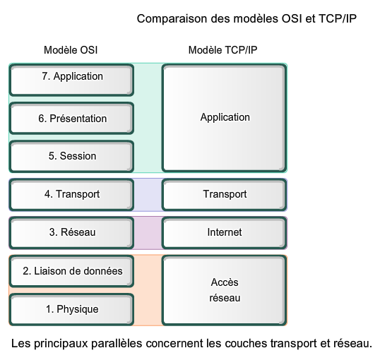
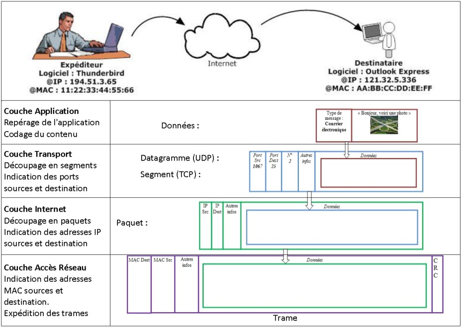
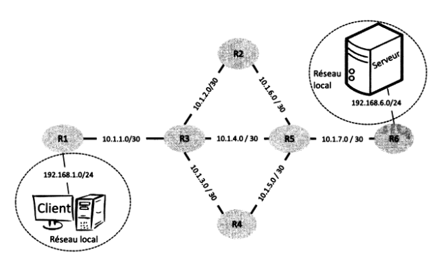
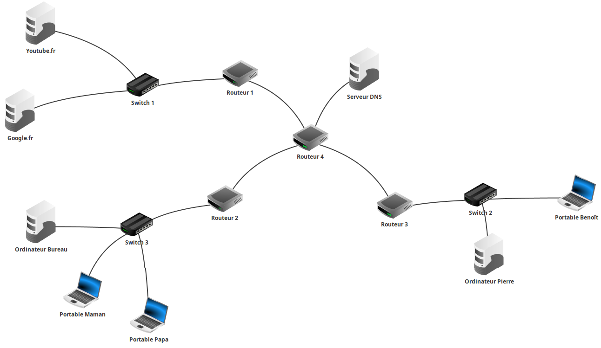
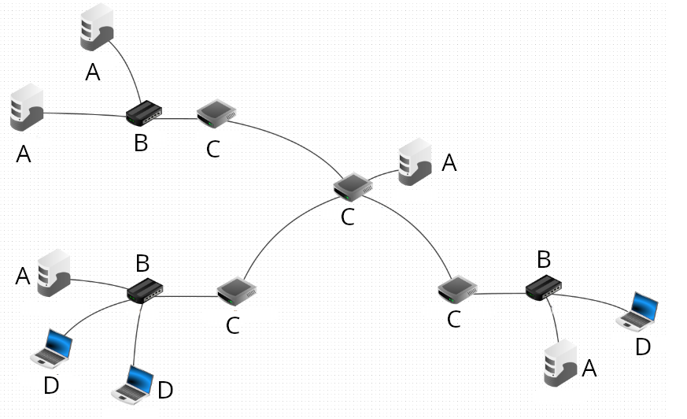

# Cours - Réseaux

??? quote "Sources / Liens utiles"
    - Protocole du bit alterné : [https://www.nsi-a-feuillade.fr/document/premiere/04c-Part3-Protocole_bit_alterne218512101.pdf](nsi-a-feuillade.fr)
    - [frederic-junier.gitlab.io/](https://frederic-junier.gitlab.io/parc-nsi/chapitre25/reseau-cours-git/)
    - [glassus.github.io](https://glassus.github.io/premiere_nsi/T3_Architecture_materielle/3.4_Protocoles_de_communication/cours/)
    - Activité : [https://www.nsi-a-feuillade.fr/document/premiere/04c-TP_reseauPython853717355.pdf](https://www.nsi-a-feuillade.fr/document/premiere/04c-TP_reseauPython853717355.pdf)

## Rappels sur l'adressage IP

Voici une petite activité (sous la forme d'un notebook) autour de l'**adressage IP et des masques de sous-réseau** :
    

[:material-cursor-default-click: Télécharger l'activité d'introduction](src/protocoles_routage_activite_introduction.ipynb){ target="_blank" }

!!! tip "Adresses *broadcast* et *multicast*"
    - **Broadcast** : Cette adresse vous permet d'appeler **tous les hôtes** (*interfaces*) à l'intérieur d'un **sous-réseau**. Une **adresse IP broadcast** est par exemple `192.168.100.255` et un **broadcast MAC** est `FF:FF:FF:FF:FF:FF`.
    - **Multicast** : Ce type d'adresse permet d'appeler un **groupe spécifique d'hôtes** (*interfaces*) dans un **sous-réseau**.

## Vidéo - Qu'est-ce qu'un réseau ?

Vous pouvez dans un premier temps essayer de faire l'[exercice 1](#exercices) pour tester vos connaissances sur les composants d'un réseau.

Voici une petite vidéo résumant la **constitution d'un réseau** (et plus généralement du **réseau mondial**) :

<iframe width="560" height="315" src="https://www.youtube-nocookie.com/embed/JqweQE6TDTc" title="YouTube video player" frameborder="0" allow="accelerometer; autoplay; clipboard-write; encrypted-media; gyroscope; picture-in-picture; web-share" allowfullscreen></iframe>

## Vidéo - Le fonctionnement d'internet

<iframe width="560" height="315" src="https://www.youtube-nocookie.com/embed/dCknqcjcItU" title="YouTube video player" frameborder="0" allow="accelerometer; autoplay; clipboard-write; encrypted-media; gyroscope; picture-in-picture; web-share" allowfullscreen></iframe>

## Le modèle OSI et TCP/IP

La transmission des données repose sur un **modèle en couches** (en **7 couches** avec le modèle **OSI** et en **4 couches** avec le modèle **TCP/IP**,également appelé "modèle internet".)

!!! abstract "Schéma plus détaillé - Encapsulation des données (modèle TCP/IP)"
    

!!! abstract "Protocoles IP et TCP"
    Les **deux protocoles** qui nous intéressent particulièrement sont :

    - Le **protocole IP** (COUCHE **RÉSEAU**) qui consiste à attribuer à chaque machine une **adresse IP unique** pour l’**identifier sur le réseau**, et ainsi transmettre l'information sous la forme de **paquets** comportant l'indication de l'**adresse IP source** et de l'**adresse IP de destination**.
    - Le **protocole TCP** (COUCHE **TRANSPORT**) qui permet d’assurer la communication de l’information en la **découpant en segments**, comportant l'indication du **port source** et du **port de destination**, et en s’assurant que tous les paquets soient bien **reçus** et **conformes** à l’**information envoyée**. (Il existe un protocole plus rapide mais qui, contraiement à **TCP**, n'assure pas que toutes les données soient reçues : le protocole **UDP**.)

    Voici un rappel de la manière dont s'effectue l'**établissement d'une connexion** ainsi que la **transmission des données** avec le protocole **TCP** ([source de l'image](https://openclassrooms.com/fr/courses/2340511-maitrisez-vos-applications-et-reseaux-tcp-ip/5678267-exercez-vous-au-suivi-de-connexion){ target="_blank" }):

    

    Lorsqu'un paquet n'est pas correctement transmis, il est **de nouveau envoyé** ([source de l'image](http://shtroumbiniouf.free.fr/CoursInfo/Reseau2/Cours/TCP/TCP.html){ target="_blank" }):

    

    
    

    

    [:octicons-link-external-16: Voir plus d'informations sur le protocole TCP](https://laissus.developpez.com/tutoriels/cours-introduction-tcp-ip/?page=page_7){ target="_blank" }
    

## Modèle client-serveur et routeurs

Un **réseau informatique** permet la **connexion entre différentes machines** afin de faciliter la **communication** entre elles. Le modèle de communication généralement utilisé est le ==**modèle client-serveur**==, qui permet aux ==**clients**== d'échanger des **paquets d'informations** avec les ==**serveurs**==.  
La notion de "client" est large, pouvant désigner aussi bien une application qu'une machine exécutant cette application. De même, le terme "serveur" peut faire référence à l'ordinateur hébergeant un **service** ou au **logiciel** fournissant ce service.

Les **paquets** de **bits** échangés sont les unités de base transitant sur le réseau physique. Ils résultent de la **fragmentation des données** à transmettre, telles que des *pages web*, des *courriels* ou des *vidéos*. Ces paquets sont envoyés séparément sur le réseau, et l'information initiale est **reconstituée** une fois qu'ils atteignent leur destination, que ce soit du côté **client** ou **serveur**.

En plus des **clients** et des **serveurs**, un réseau informatique est composé de ==**routeurs**==, pouvant être de deux types : des **routeurs d'accès** (en bordure de réseau) ou des **routeurs internes**.  
Ces machines ont pour rôle de **relayer les paquets** dans le **réseau** pour les acheminer vers leur **destination finale**. Un **routeur** fait le lien entre **deux réseaux**. Les **clients** et les **serveurs** sont connectés aux routeurs d'accès via des **réseaux locaux** (en utilisant par exemple le *Wi-Fi* ou l'*Ethernet*). Les **routeurs internes** sont reliés entre eux sur de **plus longues distances** à l'aide de **fibres optiques**, de **câbles téléphoniques**, de **liaisons par satellite**, etc. L'interconnexion de ces routeurs via ces liens forme la **topologie du réseau**.

Par exemple, la **figure ci-dessous** représente la **topologie d'un réseau** avec **six routeurs**.

<figure markdown>
  
  <figcaption><b>Figure 1</b> : Topologie d'un réseau</figcaption>
</figure>

!!! success ""
    Les **routeurs R1** et **R6** sont des **routeurs d'accès** permettant aux **machines Client** et **Serveur** d'**accéder au réseau**. Les autres routeurs (**R2 à R5**) sont des **routeurs internes**. Les **adresses IP** des machines sont indiquées par une paire **sous-réseau/masque**. Par exemple, les routeurs **R1** et **R3** sont connectés à un **sous-réseau** avec l'adresse **10.1.1.0** et un **masque de 30**, signifiant que seuls les deux bits de poids faible de l'adresse peuvent être utilisés pour associer des adresses IP aux machines.

Lorsqu'un routeur reçoit un paquet, il analyse l'**adresse de destination** et choisit vers **quel routeur voisin** transmettre le paquet pour le faire progresser vers sa destination. Cette décision est prise en se basant sur la **table de routage du routeur**, qui associe les **adresses de destination** à des **adresses de routeurs voisins**. Ainsi, le paquet progresse de routeur en routeur jusqu'à atteindre le client ou le serveur auquel il est destiné. 

!!! note ""
    Par exemple, si un client souhaite envoyer un message au serveur, il le transmet à son **routeur d'accès** (R1), qui le renvoie au routeur R3. R3 choisit ensuite le prochain routeur à utiliser (R2, R4 ou R5) en se basant sur sa **table de routage**. Ce processus se répète à chaque routeur jusqu'à ce que le paquet parvienne au routeur R6, qui le délivre ensuite au **serveur**.

## Un exemple de réseau avec Filius

Voici ci-dessous un exemple de réseau réalisé sur **Filius**, composé d'*ordinateurs*, de *commutateurs* (switchs), de *routeurs* et d'un *serveur DNS*. À noté que ce que l'on appelle *"serveur DNS"* fait à la fois référence à la **machine** nommée `Serveur DNS`, au au **logiciel** exécuté sur cette machine.

[Télécharger le fichier Filius `.fls`](src/reseau_avec_DNS.fls){ style="font-size:1.5em" target="_blank" }

Vous pouvez **télécharger** le fichier ci-dessus et l'**ouvrir dans le logiciel *Filius***. Vous devriez obtenir le réseau suivant :

## Processus du bit alterné

En construction. En attendant, vous pouvez [consulter ce diaporama](https://www.nsi-a-feuillade.fr/document/premiere/04c-Part3-Protocole_bit_alterne218512101.pdf) expliquant très bien le **protocole du bit alterné**.

## Exercices

!!! note "Exercice 1 - Composants dans un réseau"
    Identifiez les différents composants du réseau suivant :

    

    A = `..........`  
    B = `..........`  
    C = `..........`  
    D = `..........`