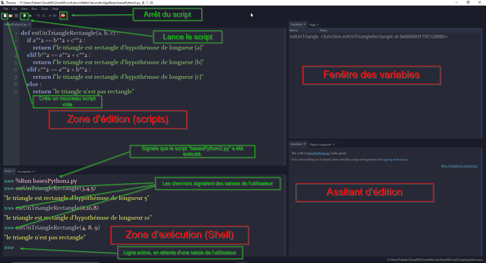

!!! quote "Sources"
    > Serge Bays - *Spécialité Numérique et sciences informatiques - Première*  
    > Zonensi - [Programmation en Python et utilisation de Thonny](https://www.zonensi.fr/Maths/Seconde/AlgoBases/ProgrammationPythonThonny/){ target="_blank" }

# Découverte de l'IDE Thonny

Tout au long de l'année, nous utiliserons un **IDE** (pour *integrated development environment*) ou **EDI** en français (pour *environnement de développement*) **gratuit** et **open source** conçu spécialement pour les débutants : <u>**Thonny**</u>.

!!! note "À faire"
    Cliquez sur "Démarrer", puis cherchez et exécutez **Thonny** pour lancer le programme.

!!! info "Installer Thonny à la maison"
    **Thonny** est un programme **multiplateforme**, vous pouvez donc l'installer sur Windows, mais aussi sur Linux ou MacOS.  
    De plus, Thonny est livré avec **Python** version **3.10**, vous n'avez donc pas à installer Python séparément.
    Vous pouvez télécharger **Thonny** [depuis le site officiel](https://thonny.org/){ target="_blank" }.

## Le langage Python

Un **programme** est la description d’un **algorithme** dans un **langage** compréhensible par un **humain** et par une **machine**, qui l’exécute afin de traiter des **données**. 

Il existe de nombreux **langages de programmation**, dont certains sont plus proches du **langage naturel** (on parle de langages de *haut niveau*), tandis que d’autres sont plus proches de celui de la **machine** (on parle de langages de *bas niveau*), on rappelle que la machine ne comprend que le **binaire**, c'est-à-dire une suite de **bits** `0` ou `1` (nous reviendrons sur cela dans le cadre d'un autre chapitre).

On peut citer, parmi les langages :

* de **haut niveau** : **Python**, *JavaScript*, *Java*, *C#*,
* de **bas niveau** : *C*, *Assembleur*, *langage machine* (le plus bas niveau possible).

Le langage de programmation **Python**, que l'on utilisera dans le cadre de cet enseignement, est déjà utilisé au lycée en **mathématiques**, et est également présent dans d’autres disciplines et dans le nouvel enseignement de **sciences numériques et Technologie** (SNT) en seconde.  
Au-delà du cadre de l'enseignement, c'est un langage **extrêmement populaire**, car l’un des plus **versatiles** et **généralistes**. Il est utilisé aussi bien par des développeurs débutants que par des développeurs d’applications web et mobile, des ingénieurs logiciels, des Data Scientists...

<figure markdown>
  { width="500px" }
  <figcaption>Guido Van Rossum, créateur de Python<br />Source : <a href="https://fr.wikipedia.org/wiki/Guido_van_Rossum#/media/Fichier:Guido-portrait-2014-drc.jpg" target="_blank">Wikipédia</a></figcaption>
</figure>

Le langage Python a été créé par un **ingénieur informaticien néerlandais** du nom de **Guido Van Rossum**.

La première version publique date de *1991*. Van Rossum a ensuite poursuivi son travail sur le projet et a travaillé entre autres pour Google puis Dropbox. La version de Python que nous utiliserons est la **version 3**, disponible depuis *2008* avec des mises à jour régulières. La dernière version en date lors de l'écriture de cet article est la version **3.11.5**.

Le langage Python est **multiplateforme**, vous pouvez donc l'installer sur les systèmes d’exploitation **Linux**, **MacOs**, **Windows**, et même sur des smartphones dotés du système **Android** ou d'**iOS**. Il est **gratuit** et placé sous **licence libre**, la *Python Software Foundation License* (PSFL) .

Les **constructions élémentaires** propes au langage Python sont communes à de nombreux autres langages de programmation.

Un programme est ainsi composé :

* de **séquences**, (des instructions exécutées l’une après l’autre dans l’ordre où elles sont écrites),
* de définitions de **variables** et de **fonctions**,
* d’**affectations**,
* d’**instructions conditionnelles**,
* de **boucles** (bornées et non-bornées),
* d'**expressions** et d'**appels de fonctions**.

## Présentation de Thonny

<figure markdown>
  
  <figcaption>Source : <a href="https://www.zonensi.fr/Maths/Seconde/AlgoBases/ProgrammationPythonThonny/" target="_blank">zonensi</a><br />
  <a href="images/captureThonny1.png" target="_blank">Ouvrir l'image en plein écran</a></figcaption>
</figure>

!!! info
    L'interface se décompose de la manière suivante :

    * La **zone d'exécution**, ou Shell, ou **console**, est une zone interactive dans laquelle vous pouvez saisir une **instruction Python**. La console peut être utilisée pour tester une instruction ou série d'instructions, mais elle est également utilisée pour l'exécution des **scripts**. Pour utiliser la console, il vous suffit de saisir votre instruction à droite des trois chevrons puis d'appuyer sur la touche **"Entrée"** du clavier.
    * La **zone d'édition** ou **zone de scripts**, est la zone dans laquelle vous pouvez saisir une **série d'instructions Python**, de manière à la sauvegarder sous la forme d'un **script Python**. Un **script Python** porte d'extension `.py`.
    * Pour exécuter un **script**, il faut appuyer soit sur la **flèche verte** de la barre de menu, soit sur la touche **F5** du clavier, ou encore par l'intermédiaire du menu "Run > Run current script" (ou "Exécuter > Exécuter le script courant" en français). Le résultat de l'exécution du script sera affiché **dans la console**.
    * La **fenêtre des variables** est bien utile pour débuter, elle permet de voir la liste des variables créées et les valeurs associées suite à l'exécution d'instructions ou d'un script.
    * L'**assistant d'édition** contient des informations qui peuvent être utiles pour analyser un programme qui ne fonctionne pas.

## À vous de jouer !

!!! note "Exercice 1"
    Dans l'**interpréteur Python**, saisissez l'expression suivante :

    ```python
    >>> 12 + 6
    ```

    Quel résultat obtenez-vous ?

!!! note "Exercice 2"
    Exécutez d'autres expressions arithmétiques en utilisant les opérateurs `+`, `-`, `*` et `/`.

## Aller plus loin avec les variables

Saisir des expressions arithmétiques, c'est bien. Mais une calculatrice sait déjà le faire !

Nous allons maintenant introduire la notion de **variable**. Une **variable** permet de **stocker une donnée** utilisée par un **programme**.

Cela se fait par une **affectation** qui associe une **donnée**, représentée par une **valeur** ou une **expression**, avec un **nom**.  
Une **expression** stockée dans une variable peut elle-même contenir d'**autres variables**.

Une **variable** peut s'apparenter à une "boîte" sur laquelle est écrit un **nom** et dans laquelle on place des **informations** diverses (même si dans la réalité, ce n'est pas tout à fait ça). Un **nom** peut être n’importe quelle **chaîne alphanumérique**, à l'exception de certains mots réserés, et ne doit pas commencer par un chiffre.

L’opérateur d’affectation est noté `=`.  
Par exemple, l’instruction `x=4` associe la valeur 4 au **nom** `x`.  
L’instruction `y=3+5` associe la valeur de l’expression située à droite du signe `=`, ici **8**, au nom `y`.  
L’instruction `z=x+y` associe la valeur de l’expression située à droite du signe `=`, ici **12** (la somme des valeurs contenues dans les variables `x` et `y`), au nom `z`.

**Python** permet par ailleurs d'effectuer des **affectations multiples**, par exemple `x,y,z=1,3,5`, qui associe les valeurs **1**, **3** et **5** respectivement aux noms `x`, `y` et `z`. Ceci est équivalent à écrire `x=1; y=3; z=5` sur une ligne ou à effectuer les 3 affectations sur 3 lignes successives.

!!! info "À retenir"
    * Une **variable** est composée d’un **nom** (ou identificateur), d’une **adresse en mémoire** où est enregistrée une **valeur** (ou un **ensemble de valeurs**), et d’un **type** qui **définit ses propriétés**.
    * Une **expression** a une **valeur** qui est le **résultat** d’une **combinaison de variables ou d’objets**, de **constantes** et d’**opérateurs**.
    * Une **instruction** est une commande qui doit être **exécutée** par la machine.
    * Une **affectation** est une **instruction** qui commande à la machine de créer une **variable** en lui précisant son **nom** et la **valeur** qui lui est associée.

    Il est important de bien distinguer une <u>**expression**</u>, qui se **calcule** et a une **valeur**, d'une <u>**instruction**</u>, qui est **exécutée** par la machine.

!!! note "Exercice 3"
    Voici une suite d'instructions :

    ```python
    a = 4
    b = 6
    c = a + b
    ```

    Quelle sera la valeur contenue dans la variable `c` après avoir saisi ces instructions ?  
    Vérifier en utilisant la console de Thonny.

!!! note "Exercice 4"
    Voici une suite d'instructions :

    ```python
    a = 4
    a = a * a
    b = a + 4
    ```

    Quelle sera la valeur contenue dans la variable `b` après avoir saisi ces instructions ?  
    Vérifier en utilisant la console de Thonny.

!!! note "Exercice 5"
    Voici une suite d'instructions :

    ```python
    x = 3
    y = 6
    z = 4 + x * y
    x = z / 2
    ```

    Quelle sera la valeur contenue dans la variable `x` après avoir saisi ces instructions ?  
    Vérifier en utilisant la console de Thonny.  
    Que constatez-vous de particulier sur la valeur contenue dans `x` ?

??? tip "Réponse 5"
    Normalement, la console devrait afficher la valeur `11.0`. On constate que l'on obtient ici un nombre **décimal**, et non pas un nombre **entier**. En fait, il existe plusieurs **types de données** que peuvent contenir les variables : les **entiers**, les **flottants** (nombres décimaux), mais également d'autres types de données que l'on verra plus tard, comme les **chaînes de caractères**, les **booléens**...

    Si l'on avait utilisé l'opérateur `//`, c'est-à-dire si l'on avait saisi `z // 2`, on aurait obtenu le **quotient de la division euclidienne** entre les opérandes `z` et `2`, c'est-à-dire l'entier `11`. L'opérateur permettant d'obtenir le **reste d'une division euclidienne** est `%`.

    Vous découvrirez tout cela dans la partie [Les bases du Python](../bases_python/index.md).

!!! note "Exercice 6"
    Voici un **algorithme** écrit en **pseudo-code** :

    $A \leftarrow 14$  
    $B \leftarrow 2$  
    $C \leftarrow \frac{A}{B}$  
    $D \leftarrow \frac{A + 6}{B + 3}$  
    $E \leftarrow C - D$

    Transcrivez cet algorithme sous la forme d'**instructions Python**, en utilisant des variables nommées `a`, `b`, `c`, `d` et `e`, et saisissez-les dans la **zone de scripts** de Thonny. Enregistrez le script sous le nom `calcul.py`, puis **exécutez le script**.

    Observez la **fenêtre des variables**, quelle est valeur associée à la variable `e` ?  
    Vous pouvez également voir le contenu de la variable en saisissant simplement `e` dans la **console** de Thonny. En effet, lorsque vous exécutez un script, vous pouvez exécuter des instructions dans la console en utilisant les variables définies suite à l'exécution du script.