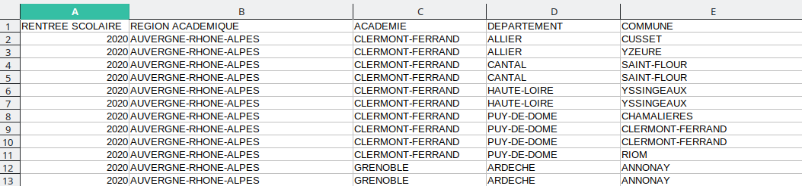

# Cours - Traitement des données en tables

L'informatique est souvent utilisée pour le **traitement de quantités importantes de données** dans de nombreux domaines tels que :

* La **gestion de données** de **sites web**. (<u>Exemple</u> : Données utilisateurs sur un réseau social.)
* La **Data Science** (science des données) : Extraire des connaissances à partir de données massives.
* La finance, les assurances, l'épidémiologie, etc.

En **Terminale** est étudiée la notion de **base de données**.<br />
Pour préparer les élèves, on étudie en **Première** le **traitement de données** organisées sous forme de **tables** (= listes de **p-uplets nommés**).

# Présentation des tables de données

Les données représentées en **tables** se présentent ainsi (image issue de [info.blaisepascal.fr](https://info.blaisepascal.fr/nsi-traitement-des-donnees-en-tables)):


## Le format CSV

Un fichier texte **CSV**:

* Permet de représenter des **données structurées**.
* Est couramment utilisé pour **importer** ou **exporter** des données d'une **feuille de calcul**.
* **Chaque ligne correspond à une ligne du tableau**.
* **Chaque colonne** est séparée par **un séparateur**, ou **délimiteur** (souvent une **virgule** ou un **point-virgule**)

La **feuille de calcul** suivante :


... donne un fichier **CSV** contenant :

```lua
Nom,Prenom,Age,Date naissance
Demerville,Erwan,26,03/05/95
Dupont,Michel,42,19/09/86
Dufoux,Alex,21,05/07/65
```

Chaque ligne correspond à un **enregistrement** (= **structure de données** éventuellement différentes).  
La première ligne définit les **clés** ou **attributs**.

## Les banques de données

Il existe des **banques de données libres** contenant des **bases de données** que vous pouvez **librement** télécharger dans **plusieurs formats** (*CSV*, *JSON*, *Excel*) et utiliser.

Par exemple :

- [https://data.education.gouv.fr](https://data.education.gouv.fr){ target="_blank" } : plateforme mise en place par le gouvernement et contenant de nombreuses **données du ministère de l'éducation nationale**,
- [https://www.data.gouv.fr/fr/](https://www.data.gouv.fr/fr/){ target="_blank" } : d'autres données libres proposées par le gouvernement (données géographiques, agriculture, énergies...)
- [https://donnees.banquemondiale.org/](https://donnees.banquemondiale.org/){ target="_blank" } : données de la banque mondiale,
- etc. Il en existe plein d'autres, pas uniquement francophones.

## Tables de données en Python

### Implémentation en Python

Une table de données est considérée comme une **liste de p-uplets nommés**.<br />
En Python, un **p-uplet nommé** peut être implémenté avec un **dictionnaire**.
Une **liste** de **p-uplets nommés** peut donc être implémentée par une **liste de dictionnaires**.

La **feuille de calcul** précédente :


... donnera donc l'**implémentation Python** suivante :

```python
table = \
[{'Nom': 'Demerville', 'Prenom': 'Erwan', 'Age': '26', 'Date naissance': '03/05/95'},
{'Nom': 'Dupont', 'Prenom': 'Michel', 'Age': '42', 'Date naissance': '19/09/86'},
{'Nom': 'Dufoux', 'Prenom': 'Alex', 'Age': '21', 'Date naissance': '05/07/65'}]
```

### Importer un fichier TXT / CSV :

On peut récupérer les **données** d'un **fichier** avec les fonctions de base de Python.

Pour cela, on va utiliser la fonction `open` pour **ouvrir un fichier** et les fonctions `readlines` et `readline` afin d'en récupérer le contenu.

Voici un fichier `lire_ecrire.py` contenant une **fonction** `lire_fichier` permettant de **lire une table de données** (en `.csv` ou `.txt`) et qui **renvoie** une **liste de dictionnaires**, et un fichier `ecrire_fichier` qui **crée un fichier** à partir d'une **table de données**.

<center>
[:material-cursor-default-click: Télécharger le fichier `lire_ecrire.py`](src/lire_ecrire.py){ target="_blank" }
</center>

En reprenant le **CSV précédent** :

```lua
Nom,Prenom,Age,Date naissance
Demerville,Erwan,26,03/05/95
Dupont,Michel,42,19/09/86
Dufoux,Alex,21,05/07/65
```

Si on fait appel à notre fonction ***lire_fichier*** en spécifiant le nom du fichier et éventuellement un **délimiteur**, on obtient donc :

```python
table = lire_fichier("exemple.csv")
table

[{'Nom': 'Demerville',
  'Prenom': 'Erwan',
  'Age': '26',
  'Date naissance': '03/05/95'},
 {'Nom': 'Dupont',
  'Prenom': 'Michel',
  'Age': '42',
  'Date naissance': '19/09/86'},
 {'Nom': 'Dufoux',
  'Prenom': 'Alex',
  'Age': '21',
  'Date naissance': '05/07/65'}]
```

!!! warning ""
    Le paramètre `delimiteur` de la fonction `lire_fichier` est **par défaut** défini à une **virgule**. Il n'y a donc pas besoin d'indiquer de **délimiteur** lors de l'appel à `lire_fichier` si l'on souhaite utiliser la **virgule**.  
    Il faut toutefois l'indiquer pour tout autre **délimiteur**, par exemple si le délimiteur est un **point-virgule**, l'appel sera du type `lire_fichier("nom_fichier.csv", ";")`.

<u><b>Note</b></u> : Les données sont toutes enregistrées en **chaînes de caractères**.<br />
On peut utiliser des fonctions comme **int()**, **float()** ou encore **eval()** pour convertir les données.

!!! note "À faire"
    Téléchargez le fichier `exemple.csv` contenant les enregistrements de l'exemple précédent :
    
    <center>
    [:material-cursor-default-click: Télécharger le fichier `exemple.csv`](src/exemple.csv){ target="_blank" }
    </center>

    1. Lire le fichier **CSV** avec la fonction `lire_fichier` du fichier [lire_ecrire.py](src/lire_ecrire.py){ target="_blank" } et stocker le résultat dans une **variable**.
    2. Votre **variable** contient donc une **liste de dictionnaires**. Rajoutez un **nouvel enregistrement** contenant votre **nom, prénom, âge et date de naissance**.
    3. **Ré-écrivez** à présent un **nouveau fichier CSV** nommé `nouveau.csv` à l'aide de la fonction `ecrire_fichier`.
    4. Ouvrez votre ² sur *LibreOffice Calc* ou *Excel*, et **observez** le résultat.

### Interroger les bases de données

Pour cette partie, on travaillera avec la **base de données** des "*Effectifs dans les enseignements de spécialités en Terminale générale par spécialités et selon les principales doublettes*", proposée par [data.education.gouv.fr](https://data.education.gouv.fr/explore/dataset/fr-en-effectifs-specialites-doublettes-terminale-generale/table/){ target="_blank" }.

<center>
[:material-cursor-default-click: Télécharger `fr-en-effectifs-specialites-doublettes-terminale-generale.csv`](src/fr-en-effectifs-specialites-doublettes-terminale-generale.csv){ target="_blank" }
</center>

!!! danger ""
    Ce fichier **CSV** utilise le **point-virgule** comme **délimiteur**.  
    Pour stocker les **enregistrements** dans une **variable** `d`, on écrira alors :  
    `d = lire_fichier('fr-en-effectifs-specialites-doublettes-terminale-generale.csv', ';')`

Ouvrons d'abord ce fichier avec *LibreOffice Calc* pour visuellement son contenu. Il ne faut pas oublier de cocher le **point-virgule** commme **séparateur**.

