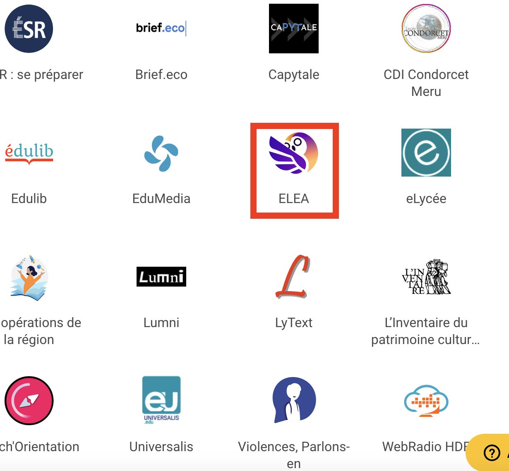

# :material-cloud-upload: Rendu des travaux

Les travaux demandés (*fichiers Python*, *TP*, *activités*, etc.) sont à rendre sur le **parcours Éléa**.

!!! info "Accéder à Éléa"
    Vous pouvez accéder à **Éléa** :
    
    - soit [en cliquant ici](https://hdf-60-occidentale.elea.apps.education.fr/) et en vous connectant en choisissant `ENT Hauts-de-France` dans la liste déroulante, 
    - soit en vous connectant à votre [ENT](https://enthdf.fr/welcome) et en ouvrant l'application **Éléa** à partir de votre **liste des applications** :

    

    { width="500px" }
    

!!! warning "Nommage des fichiers"
    - Afin d'éviter les confusions, pensez à **renommer vos fichiers** en y ajoutant **votre nom**. Par exemple, si vous souhaitez rendre un *script Python* nommé `programme.py`, renommez-le en `<VOTRE_NOM>_programme.py`.
    - Si votre travail contient **plusieurs fichiers**, créez une **archive ZIP** contenant tous vos fichiers et dont le nom sera de la forme `<VOTRE_NOM>_<NOM_ARCHIVE>.zip`. Pour créer une archive ZIP sur *Windows* : sélectionnez les fichiers à archiver, puis faites un **clic droit** :octicons-arrow-right-16: `Envoyer vers` :octicons-arrow-right-16: `Dossier compressé`.

---

??? tip "Autre méthode de rendu - UNIQUEMENT EN CAS DE SOUCIS AVEC ÉLÉA"
    ==**Cette méthode de rendu n'est à utiliser que si vous ne pouvez pas accéder au parcours Éléa !**==

    Cliquez sur le **bouton** correspondant à **votre classe** pour accéder à la page de téléversement :

    <noscript style="color:red">Vous devez activer <strong>JavaScript</strong> pour que cette page fonctionne correctement !</noscript>

    [Première](#){ .md-button onclick="window.open('https://mega.nz/filerequest/HtkAigI1iLA', '_blank', 'scrollbars=yes,resizable=yes,width=750,height=740')" } [Terminale](#){ .md-button onclick="window.open('https://mega.nz/filerequest/AoiiBiH_EOU', '_blank', 'scrollbars=yes,resizable=yes,width=750,height=740')" }