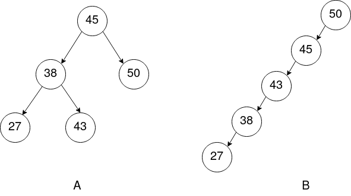

!!! warning "Important"
	Ce cours est encore en **construction**.

# Les arbres binaires de recherche

## Activité préliminaire

*Sources* : [https://www.zonensi.fr/NSI/Terminale/C05/ABR/](https://www.zonensi.fr/NSI/Terminale/C05/ABR/){: target="_blank" } et *Numérique et Sciences Informatiques, 24 leçons avec exercices corrigés, Balabonski, Conchon, Filliâtre, Nguyen, Editions Ellipses*.

Imaginons une bibliothèque contenant un **très grand nombre de livres**. Cette bibliothèque est organisée de la manière suivante :

* Il y a **17 576 pièces différentes**.
* Chaque pièce est repérée par une suite de **trois lettres**, et dans cette pièce sont rangés tous les livres dont les titres commencent par ces trois lettres.
* Chaque pièce possède **deux sorties**, une à **droite** et une à **gauche**.
* La sortie de gauche mène toujours soit à une salle dont les trois lettres sont situées **avant dans l'ordre alphabétique**, soit nulle part.
* La sortie de droite mène toujours soit à une salle dont les trois lettres sont situées **après dans l'ordre alphabétique**, soit nulle part.

Une **représentation** de cette **bibliothèque** peut être donnée sous la forme d'un **arbre binaire** comme celui-ci :


!!! note "Questions"
    1. **Redessinez** cet **arbre binaire**, en y ajoutant les **noeuds** qui correspondent aux **pièces** où sont situés les livres dont le titre commence par :
          * **KNU**
          * **UDP**
          * **JET**
          * **RSA**

    2. Pourquoi y-a-t-il 17 576 pièces différentes ?

Cette répartition peut se révéler **incroyablement efficace**.

Dans le **meilleur des cas**, il ne faudra traverser qu'**au maximum 15 salles** pour trouver n'importe quel livre (si la bibliothèque est correctement organisée, quasiment chaque noeud aura **2 sorties**, d'où une hauteur d'environ $log_{2}{(17576)}$, soit environ **15**).

## Définition d'un arbre binaire de recherche

**Définition** : Un **arbre binaire de recherche** est un **arbre binaire** *étiqueté* tel que :

* les *éléments* sont munis d'un **ordre total** (on peut les **comparer**),
* les *éléments* des **noeuds** du **sous-arbre gauche** sont tous $\leq$ à l'*élément* de la **racine**,
* les *éléments* des **noeuds** du **sous-arbre droit** sont tous $>$ à l'*élément* de la **racine**,
* les **sous-arbres gauches** et **droit** sont également des **ABR**.


*Note* : Un **arbre binaire vide** et **une feuille** sont également des **arbres binaires de recherche**.

## Notion d'arbre équilibré

Une autre notion qui va nous être utile est la notion d'**arbre équilibré**.

**Définition** : Un **arbre équilibré** est un arbre pour lequel, pour tout nœud de l'arbre, la **différence entre les hauteurs de ses deux sous-arbres est au plus de 1**.



* L'arbre **A** est un arbre **complet**, et donc **équilibré** car pour tout nœud de l'arbre, les deux sous-arbres ont **au plus** une différence de hauteur de **1**.
* L'arbre **B** est un arbre **filiforme** et donc **complètement déséquilibré**. Un tel arbre s'apparente à une **liste chaînée**.

## Recherche dans un arbre binaire de recherche

### Algorithme (à connaître par cœur !)

!!! note "À noter dans votre cours"
    Voici l'algorithme récursif, en *pseudo-code*, de la **recherche** dans un **arbre binaire de recherche**.

    !!! note "Recherche dans un arbre binaire de recherche"
        ```
        ALGO : rechercher
        ENTREES : abr : Arbre binaire de recherche
                  elt : Element
        SORTIE : Booléen
        DEBUT
            Si abr EST VIDE, alors :
                Renvoyer FAUX
            Sinon si valeur_racine(abr) = elt, alors :
                Renvoyer VRAI
            Sinon si elt <= valeur_racine(abr), alors :
                Renvoyer rechercher(gauche(abr), elt)
            Sinon :
                Renvoyer rechercher(droite(abr), elt)
        FIN
        ```

Contrairement à la recherche dans un **arbre binaire** classique, on n'effectue pas la recherche dans les deux sous-arbres. En fonction de l'**élément** recherché, on effectue la recherche **soit** dans le **sous-arbre gauche** (si l'élément est **inférieur ou égal** à la **valeur de la racine**), soit dans le **sous-arbre droit** (si l'élément est **supérieur** à la **valeur de la racine**).

### Coût de la recherche

Le coût de la recherche dépend du fait que l'arbre soit **équilibré ou non**.
Si l'on reprend les arbres précédents :


* Dans l'arbre **B**, **tous les noeuds sont du même côté**. Si l'on recherche le nombre **25** dans l'arbre (qui n'est pas présent dedans), on va toujours rechercher **dans le sous-arbre gauche**. Si l'on note $n$ le **nombre de nœuds** de l'arbre, Le nombre d'appels récursifs à `rechercher` sera **de l'ordre de** $n$.
* Dans l'arbre **A**, les **nœuds** sont **répartis** à peu près **équitablement** entre les **sous-arbres gauches et droit**. À chaque nouvel appel récursif, on ne recherche que dans **un des deux sous-arbres**, et on peut donc éliminer à chaque fois environ **la moitié** des **nœuds**. Si l'on note $A(n)$ le nombre d'appels à `rechercher` en fonction de la taille $n$ de l'arbre, on peut écrire $A(n) = 1 + A(\frac{n}{2}) = 1 + 1 + A(\frac{n}{4}) = [...] \approx log_2(n)$.


!!! note "À noter dans votre cours"
    Finalement, le coût de la **recherche** dans un **arbre binaire de recherche** est le suivant :

    * Si l'arbre est **équilibré**, le **coût** de la **recherche** est en $O(log_2(n))$,
    * Si l'arbre est **complètement déséquilibré** (arbre **filiforme**), le **coût** de la **recherche** est en $O(n)$.

!!! tip "Pour vous entraîner"
    Voir l'[exercice](exercices_abr.md) 4 et sa correction pour vous entraîner sur cette notion.

## Insertion dans un arbre binaire de recherche

### Algorithme (à connaître par cœur !)

!!! note "À noter dans votre cours"
    Voici l'algorithme récursif, en *pseudo-code*, de l'**insertion** dans un **arbre binaire de recherche**.

    !!! note "Insertion dans un arbre binaire de recherche"
        ```
        ALGO : inserer
        ENTREES : abr : Arbre binaire de recherche
                  elt : Element
        SORTIE : Arbre binaire de recherche
        DEBUT
            SI abr EST VIDE, alors :
                Renvoyer nouvel_ABR(elt, ABR_VIDE, ABR_VIDE)
            SINON SI elt <= valeur_racine(abr), alors:
                Renvoyer nouvel_ABR(valeur_racine(abr), inserer(gauche(abr), elt), droite(abr))
            SINON :
                Renvoyer nouvel_ABR(valeur_racine(abr), gauche(abr), inserer(droite(abr), elt))
        FIN
        ```

### Coût de la recherche

Le coût algorithmique de l'**insertion** dans un **arbre binaire de recherche** est **identique** au **coût** de la **recherche**. En effet, le principe est toujours le même :

* Si l'**élément** à insérer est **inférieur ou égal** à la racine, on **insère l'élément dans le sous-arbre gauche**.
* Si l'**élément** à insérer est **supérieur** à la racine, on **insère l'élément dans le sous-arbre droit**.

Ainsi, si l'arbre est **équilibré**, on divise environ par **deux** le nombre de **nœuds** à chaque appel récursif, et le coût est **logarithmique** au pire (si l'élément à insérer se positionne en profondeur maximale). Dans le cas où l'arbre est complètement **déséquilibré** (arbre *filiforme*), on doit, au pire, visiter chaque **nœud** pour insérer un élément, et on obtient donc un coût **linéaire** au pire, comme dans le cas d'une *liste chaînée*.

!!! note "À noter dans votre cours"
    Le coût algorithmique de l'**insertion** dans un **arbre binaire de recherche** est le suivant :

    * Si l'arbre est **équilibré**, le **coût** de l'**insertion** est en $O(log_2(n))$,
    * Si l'arbre est **complètement déséquilibré** (arbre **filiforme**), le **coût** de l'**insertion** est en $O(n)$.

!!! tip "Pour vous entraîner"
    Voir l'[exercice](exercices_abr.md) 5 et sa correction pour vous entraîner sur cette notion.