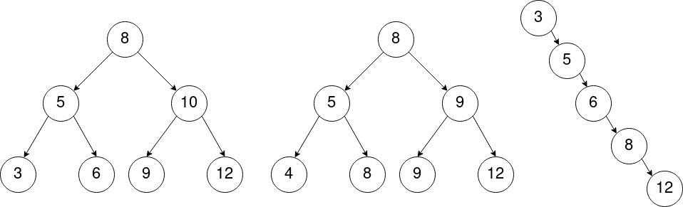

# Exercices - Arbres binaires de recherche

Voici 3 **arbres binaires** :



!!! note "Exercice 1"
    
    1. Parmi ces arbres, pouvez-vous dire lesquels sont des arbres binaires *de recherche* ?
    2. Dans un **arbre binaire de recherche**, où se trouve le **plus petit élément** ? Le **plus grand élément** ?
    3. Quelle est l'ordre des *noeuds* lors des parcours *préfixe*, *infixe*, *postfixe* du premier arbre ?
    4. Quel parcours est particulièrement intéressant avec les arbres binaire *de recherche* ? Pourquoi ?
    5. Comment vérifier facilement si un **arbre binaire** est un **arbre binaire de recherche** ?

??? tip "Correction exercice 1"
    1. Les **trois arbres** sont des **arbres binaires de recherche** (voir [définition](abr.md){: target="_blank" }).
    2. Pour trouver le **plus petit élément** d'un **arbre binaire de recherche**, on procède comme suit : Si l'arbre n'a **pas** de **sous-arbre gauche**, son **minimum** est alors la **valeur** de sa **racine**. Sinon, il s'agit du **minimum** (récursivement) de son **sous-arbre gauche**. Pour le **maximum**, c'est le même principe mais avec le **sous-arbre droit**.
    3. *préfixe* : [8, 5, 3, 6, 10, 9, 12]<br />*postfixe* : [3, 6, 5, 9, 12, 10, 8]<br />*infixe* : [3, 5, 6, 8, 9, 10, 12]
    4. Les **valeurs** des **nœuds** visités en **ordre infixe** sont dans l'**ordre croissant**.
    5. On peut donc facilement vérifier qu'un **arbre binaire est un arbre binaire de recherche** en **parcourant ses nœuds** dans l'**ordre infixe** et en vérifiant si les valeurs de ces nœuds sont **triées** dans l'**ordre croissant**.


!!! note "Exercice 2"
    Créez un **arbre binaire de recherche** en partant d'un **arbre binaire vide** et en  **insérant progressivement** les **nœuds de valeurs suivantes** (en suivant cet ordre) : **18, 13, 21, 20, 15, 10, 23**.

??? tip "Correction exercice 2"
    Pour dessiner cet arbre, il faut partir d'un **arbre binaire vide** puis **insérer chaque valeur une par une**. Pour **insérer** une **valeur**, il faut comparer cette valeur avec la **valeur racine** de l'arbre, puis insérer dans le **sous-arbre gauche** si la **valeur** est **inférieur ou égale** à la **valeur racine**, et à **droite** sinon (en procédant de manière récursive). On s'arrête lorsqu'on arrive sur un **arbre vide**, auquel cas cet **arbre vide** devient une **feuille** contenant la **valeur à insérer**.

    Voici l'arbre obtenu :

    

!!! note "Exercice 3"
    Dessinez un **arbre binaire de recherche** :

    1. En **insérant**, en suivant l'ordre, les nœuds de valeurs suivantes dans l'arbre : **14,13,12,11,8,5,4,3,1**<br />
    Que constatez-vous ? À quelle autre **structure de données** cet arbre s'apparente t-il ?
    2. Re-dessinez cet arbre de manière à obtenir un arbre **équilibré**.
    3. Si on **insère progressivement** chaque valeur une par une dans l'arbre, dans quel ordre faut-il les ajouter pour obtenir un arbre équilibré ? Décrivez votre méthode.

??? tip "Correction exercice 3"
    À venir...

!!! note "Exercice 4"
    1. Décrivez, en **pseudo-langage**, un algorithme **récursif** de **recherche** dans un **arbre binaire de recherche**, qui renvoie `Vrai` si un **élément fourni en entrée** est **présent** dans l'arbre, et `Faux` s'il ne l'est pas.
    2. Dessinez **deux arbres binaires de recherche**, construits en partant d'un arbre vide et en insérant progressivement les **nœuds suivants** :
        * **20, 15, 22, 18, 21, 16, 23, 13**
        * **13, 15, 16, 18, 20, 21, 22, 23**
  
    3. Que pouvez-vous dire du premier arbre ? Du second ?
    4. Déroulez votre algorithme sur **les deux arbres précédemment dessinés**, puis **comptez le nombre d'appels récursifs** pour rechercher :
        * la valeur **17** dans le premier arbre
        * la valeur **25** dans le deuxième arbre
  
    5. Choisissez ainsi le bon **coût algorithmique** dans le tableau ci-dessous **dans le pire cas** :

    |                  | **O(1)** | **O($log_2{n}$)** | **O(n)** | **O($nlog_2{n}$)** | **O(n²)** |
    | ---------------- | -------- | ----------------- | -------- | ------------------ | --------- |
    | ABR **équilibré** |          |                   |          |                    |           |
    | ABR **non équilibré** |        |                   |          |                    |           |

??? tip "Correction exercice 4"
    1 .
    ```
    ALGO : rechercher
    ENTREES : abr : Arbre binaire de recherche
              elt : Element
    SORTIE : Booléen
    DEBUT
        Si abr EST VIDE, alors :
            Renvoyer FAUX
        Sinon si valeur_racine(abr) = elt, alors :
            Renvoyer VRAI
        Sinon si elt <= valeur_racine(abr), alors :
            Renvoyer rechercher(gauche(abr), elt)
        Sinon :
            Renvoyer rechercher(droite(abr), elt)
    ```
    
    2 . 
    
    { width="80%" }
    
    3 .
    
    Le premier arbre est **équilibré** (pour chaque **nœud**, la **hauteur** entre le sous-arbre gauche et droit ne diffère pas de plus de **1**.)<br />
    Le deuxième arbre est un arbre **filiforme**, il n'est donc **pas du tout équilibré** (complètement déséquilibré).
    
    4 .
    
    Pour mieux comprendre, on notera `abr_20` pour indiquer qu'il s'agit de l'arbre de valeur racine égale à **20**, `abr_15` pour l'arbre de valeur racine égale à **15**, etc.
    
    ```
    rechercher(abr_20, 16):
        arbre NON VIDE
        elt != valeur_racine(abr_20)
        17 < 20 donc:
            renvoyer rechercher(abr_15, 16):
                17 > 15 donc :
                    renvoyer rechercher(abr_18, 16):
                        17 < 18 donc :
                            renvoyer rechercher(abr_16, 16):
                                17 > 16 donc :
                                    renvoyer rechercher(abr_VIDE, 16):
                                    	arbre EST VIDE donc : 
                                            renvoyer FAUX
    ```
    **nombre d'appels à `rechercher`: 5**
    
    Si l'on note $A(n)$ le **nombre d'appels** à `rechercher` dans le pire des cas **en fonction de la taille** $n$ de l'arbre, on peut écrire :<br />
	$A(0) = 1$ (si l'arbre est vide, on compte **un seul appel** à `rechercher`)<br />
	$A(n) = 1 + A(\frac{n}{2}) = 1 + 1 + A(\frac{n}{4}) = [...] = \lfloor log_2(n) \rfloor + 2 \approx log_2(n)$<br />
	Exemple pour $n = 8$ : $A(8) = log_2(8) + 2 = 3 + 2 = 5$ appels.
    
    Le **nombre d'appels récursifs** correspond *à peu près* au **nombre de fois** que l'on peut **diviser $n$ par $2$**. La complexité est donc **logarithmique**.
    
    ```
    rechercher(abr_13, 23):
        arbre non vide
        elt != valeur_racine(abr_13)
        23 > 13 donc:
            renvoyer rechercher(abr_15, 23):
                23 > 15 donc :
                    renvoyer rechercher(abr_16, 23):
                        23 > 16 donc :
                                renvoyer rechercher(abr_18, 23):
                                    23 > 18 donc :
                                        renvoyer rechercher(abr_20, 23):
                                            23 > 20 donc :
                                                renvoyer rechercher(abr_21, 23):
                                                    23 > 21 donc :
                                                        renvoyer rechercher(abr_22, 23):
                                                            23 > 22 donc :
                                                                renvoyer rechercher(abr_23, 23):
                                                                    25 > 23 donc :
                                                                    rechercher(abr_VIDE, 23):
                                                                        arbre EST VIDE donc :
                                                                            renvoyer FAUX
    ```
    **nombre d'appels à `rechercher`: 9**
    
    Si l'on note $A(n)$ le **nombre d'appels** à `rechercher` dans le pire des cas **en fonction de la taille** $n$ de l'arbre, on peut écrire :<br />
    $A(n) = n + 1 \approx n$.<br />Exemple pour $n = 8$ : $A(8) = 8 + 1 = 9$ appels.
    
    Le **nombre d'appels récursifs** correspond *à peu près* à la **taille** (nombre de noeuds) de l'arbre. La complexité est donc **linéaire**.
    
    5 .
    
    On rappelle que la notation $O$ (grand O) permet de définir un ordre de grandeur de la complexité algorithmique **dans le pire des cas** (on parle de borne asymptotique supérieure). Ici, on ne peut pas utiliser la notation $\Theta$ car le **coût** dépend de l'**élément recherché** dans l'arbre, et peut donc varier pour une même **taille** d'arbre.
       
    |                  | **O(1)** | **O($log_2{n}$)** | **O(n)** | **O($nlog_2{n}$)** | **O(n²)** |
    | ---------------- | -------- | ----------------- | -------- | ------------------ | --------- |
    | ABR **équilibré** |          |                   |       X  |                    |           |
    | ABR **non équilibré** |        |           X       |          |                    |           |

!!! note "Exercice 5"
    1. Décrivez, en **pseudo-langage**, un algorithme **récursif** d'**insertion** dans un **arbre binaire de recherche** qui **renvoie un nouvel arbre** dans lequel est ajouté **un nœud dont la valeur est donnée en entrée**.
    2. Déroulez votre algorithme sur **les deux arbres dessinés** à la *question précédente*, puis, pour chacun, **comptez le nombre d'appels récursifs** effectués pour insérer :
        * la valeur **17** dans le premier arbre
        * la valeur **25** dans le deuxième arbre

    3. Choisissez ainsi le bon **coût algorithmique** dans le tableau ci-dessous **dans le pire cas** :
    
    |                  | **O(1)** | **O($log_2{n}$)** | **O(n)** | **O($nlog_2{n}$)** | **O(n²)** |
    | ---------------- | -------- | ----------------- | -------- | ------------------ | --------- |
    | ABR **équilibré** |          |                   |          |                    |           |
    | ABR **non équilibré** |        |                   |          |                    |           |

??? tip "Correction exercice 5"
    1 .
    ```
    ALGO : insertion
    ENTREES : abr : Arbre binaire de recherche
              elt : Element
    SORTIE : Arbre binaire de recherche
    DEBUT
        Si abr EST VIDE, alors :
            Renvoyer nouvel_ABR(valeur_racine(abr), ARBRE_VIDE, ARBRE_VIDE)
        Sinon si elt <= valeur_racine(abr), alors :
            Renvoyer nouvel_ABR(valeur_racine(abr), insertion(gauche(abr)), droite(abr))
        Sinon :
            Renvoyer nouvel_ABR(valeur_racine(abr), gauche(abr), insertion(droite(abr)))
    ```

    Suite à venir...