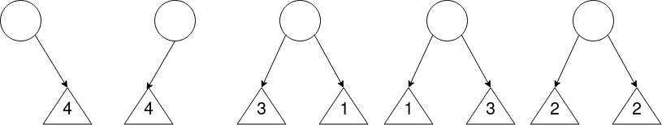

!!! info
	Ces exercices sont également disponibles en format **PDF** : [fiche1_vocabulaire.pdf](fiche1_vocabulaire.pdf){: target="_blank" }

# Exercices - Vocabulaire sur les arbres
## Dessiner un arbre
### Une arborescence de fichiers

Sur *Linux*, on peut lister récursivement les répertoires et fichiers du système à l'aide de la commande `tree`. Voici un exemple d'arborescence obtenue après exécution de cette commande :

<figure markdown>
  { width="75%" }
  <figcaption>Une arborescence sur Linux</figcaption>
</figure>

!!! note "Exercice 1"

	Dessinez un arbre représentant cette arborescence, en partant de l'arbre suivant :
	
	{ width="25%" }
	
	1. Quelle est la **taille** de cet arbre ?
	2. Combien y a t-il d'**arêtes** dans l'arbre ?
	3. Quelles sont les **feuilles** de l'arbre ?
	
	En considérant que la **profondeur** de la **racine** est de **1** :
	
	4. Quelle est la **profondeur** du nœud **D5** ?
	5. Quelle est la **hauteur** de l'arbre ?
	6. Cet arbre est-il un **arbre binaire** ? Pourquoi ?

### Arbre d'une page HTML

Voici le code HTML d'une page web :

```html
<html>
    <head>
        <meta charset="utf-8">
        <title>Ma superbe page</title>
    </head>
    <body>
        <h1>Mon super titre</h1>
        <p>Mon super paragraphe</p>
        
    </body>
    <footer>
        <p>Un pied de page</p>
    </footer>
</html>
```

L'arbre (appelé *arbre DOM*) représentant ce code HTML est le suivant :

<figure markdown>
  
  <figcaption>Arbre DOM d'une page HTML</figcaption>
</figure>

!!! note "Exercice 2"

	À votre tour, dessinez l'arbre DOM représentant la page HTML suivante :
	
	```html
	<html>
	    <head>
	        <meta charset="utf-8">
	        <link href="main.css" rel="stylesheet">
	        <title>Pokémons</title>
	    </head>
	    <body>
	        <section>
	            <h1>Types des pokémons</h1>
	            <ul>
	                <li>FEU</li>
	                <li>FOUDRE</li>
	                <li>EAU</li>
	                <li>HERBE</li>
	                <li>NORMAL</li>
	            </ul>
	        </section>
	    </body>
	</html>
	```
	
	1. Quelle est la **taille** de l'arbre obtenu ?
	2. Quelle est la **hauteur** de l'arbre obtenu :
	   1. Si la profondeur de la racine est de **0** ?
	   2. Si la profondeur de la racine est de **1** ?
	3. Quels **types d'éléments** représentent les **feuilles** de l'arbre ?
	4. Si les **nœuds** de l'arbre étaient des instances d'une classe `Noeud` caractérisés par une **étiquette** (`html`, `body`, etc) et des **données**, quelles pourraient être ces données ? (voir la balise `meta` ou `link` du code ci-dessus.)

### Arbre d'une expression arithmétique

Voici un **arbre binaire** représentant l'expression arithmétique $(6 + 9) / 3$ :

<figure markdown>
  { width="80%" }
  <figcaption>Arbre d'une expression arithmétique</figcaption>
</figure>

!!! note "Exercice 3"

    À votre tour, dessinez l'**arbre binaire** correspondant à l'expression $\frac{5*8}{30-(8*3)}$.
    
    1. Pour **quels opérateurs** le positionnement (gauche, droit) des opérandes a une importance ? Pourquoi ?
    2. Quelle est la **taille** de l'arbre obtenu ?
    3. Quelles sont les **feuilles** de l'arbre ? Quelle remarque pouvez-vous faire ?
    
    <br/>
    En considérant que la **profondeur** de la **racine** est de **0** :
    
    4. Quelle est la **profondeur** des feuilles **les moins éloignées** de la **racine** ?
    5. Quelle est la **hauteur** de l'arbre ?

## Encadrement de la hauteur

Pour l'exercice suivant, on considérera que la profondeur de la racine d'un arbre est de **1**.
Voici deux **arbres binaires** :

<figure markdown>
  { width="80%" }
  <figcaption>Deux arbres binaires</figcaption>
</figure>

!!! note "Exercice 4"

    1. Parmi ces deux arbres, lequel est un arbre **filiforme** ? Un arbre **complet** ?
    2. À quelle autre structure de données s'apparente un **arbre filiforme** ? Pourquoi ?
    3. Quelle est la **taille** de ces deux arbres ?
    4. Quelles sont toutes les **hauteurs** possibles pour une **taille** $n = 5$ ?
    5. Établissez une relation entre la **taille d'un arbre** notée $n$ et la **hauteur de cet arbre** notée $h$, dans le cas où l'arbre est **filiforme**.
    6. 
		1. Complétez l'arbre **B** de manière à obtenir un **arbre parfait**.
		2. Combien y a t-il de nœuds de **profondeur 1, 2 et 3**  dans cet **arbre parfait** ? En déduire combien il y aurait de **noeuds** de **profondeur 4** et **5** dans un **arbre parfait de hauteur 5** (vous pouvez dessiner un tableau).
		3. Établissez une relation entre le **nombre de nœuds** à une **certaine profondeur**, noté $n_{p}$, en fonction de cette **profondeur**, notée $p$.
		4. En déduire une expression calculant la **taille** $n$ (nombre de **nœuds**) d'un **arbre parfait** en fonction de sa **hauteur** $h$.
    7. Enfin, proposez d'abord un encadrement de la **taille d'un arbre binaire** notée $n$ en fonction de la **hauteur** notée $h$ (en utilisant vos réponses aux questions `5.` et `6.d.`).
	À partir de l'encadrement précédent, déduire un **encadrement de la hauteur** d'un **arbre binaire** en fonction de sa **taille**.

## Dénombrement d'arbres binaires

!!! note "Exercice 5"
    Dessinez et dénombrez tous les **arbres binaires** possibles :

    * pour une taille $n = 1$,
    * pour une taille $n = 2$,
    * pour une taille $n = 3$,
    * pour une taille $n = 4$
    
    Sans les dessiner et en vous aidant des réponses précédentes, déterminez le **nombre d'arbres** de taille $n = 5$.
    
??? tip "Indice 1 exercice 5"

	Vous pouvez dénombrer les arbres de **taille** $n = 5$ en faisant la **somme des arbres** dont les **noeuds** sont répartis de la manière suivante :

	* *1 noeud racine* et *4 noeuds à droite*
	* *1 noeud racine* et *4 noeuds à gauche*
	* *1 noeud racine*, *3 noeuds à gauche* et *1 noeud à droite*
	* *1 noeud racine*, *1 noeud à gauche* et *3 noeud à droite*
	* *1 noeud racine*, *2 noeuds à gauche* et *2 noeuds à droite*

	
	
	En comptant le nombre de possibilités pour ces 5 cas, vous obtiendrez le nombre total d'arbres de taille $n = 5$.
	
??? tip "Indice 2 exercice 5"

	Le nombre d'arbres d'une taille $n$ donnée peut être calculé avec le **nombre de Catalan**, voir [page Wikipedia](https://fr.wikipedia.org/wiki/Nombre_de_Catalan){: target="_blank" } pour plus d'informations. (Bien sûr, ce n'est pas au programme.)
	
	Donc, pour une taille $n = 5$ : $C_{5} = \frac{(2n)!}{(n+1)!n!} = \frac{10!}{6!*5!} = \frac{5040}{120} = 42$
	
	Il y a donc **42 arbres de taille 5**.