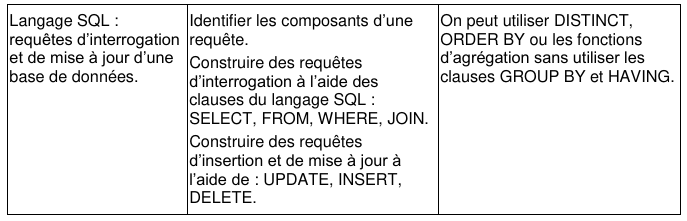
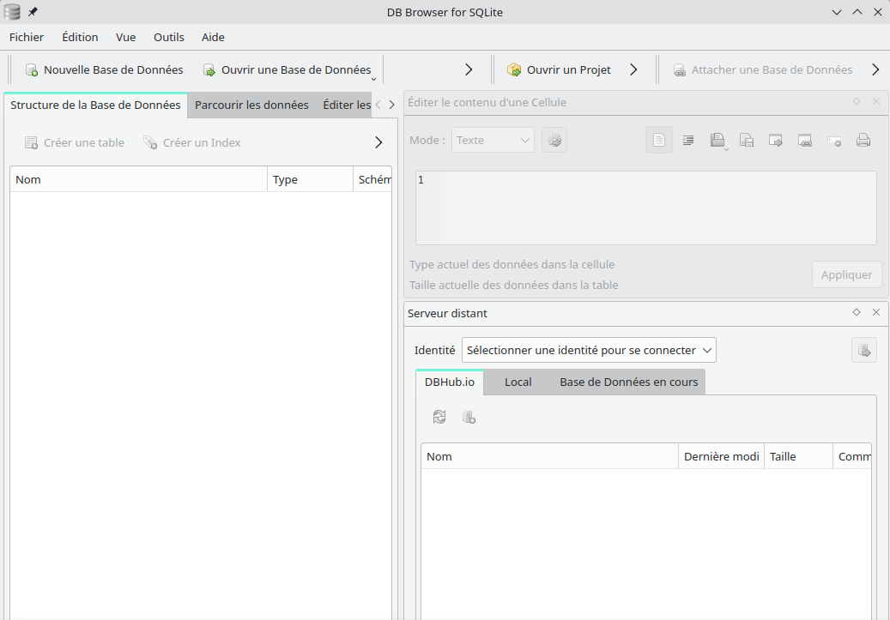
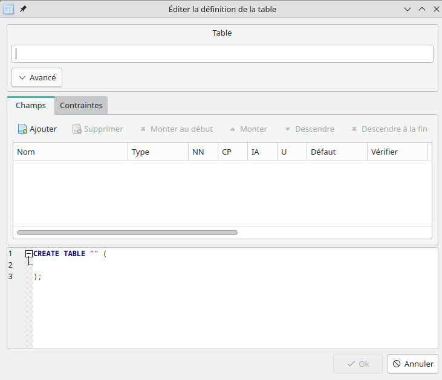
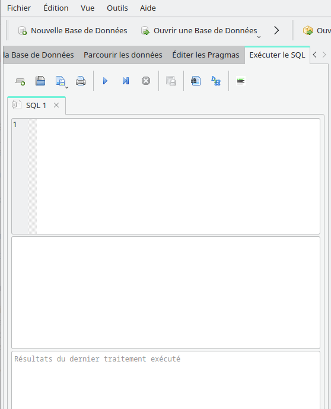

# Le langage SQL

## Introduction

Le **modèle relationnel** introduit est un **modèle mathématique** permettant de raisonner sur des **données tabulées**. Il est mis en œuvre par un **logiciel** particulier, le **système de gestion de bases de données** (**SGBD** en abrégé).

Un **SGBD relationnel** est un **SGBD** utilisant le **modèle relationnel** pour la **représentation des données**. L'écrasante majorité des **SGBD relationnels** utilisent le **langage SQL** (*Structured Query Language*, langage de requête structuré).

Ce dernier permet d'envoyer des **ordres** au **SGDB**. Les **ordres** peuvent être de **deux natures** :

- les **mises à jour** permettant la **création** de **relations**,
- l'ajout d'**entités** dans ces **dernières**, leur **modification** et leur **suppression**,
- les **requêtes** permettent de **récupérer les données** répondant à des **critères particuliers**.

Présenter de façon **intuitive** le **langage SQL** et les **SGBD**, tout en restant dans le cadre du programme de terminale, est une tâche complexe. En effet, on ne peut comprendre certains aspects du langage sans connaître un peu le fonctionnement des **SGBD** et à l'inverse le fonctionnement et les limites des **SGBD** ne sont explicables qu'avec une certaine pratique de la **manipulation de données**.

!!! abstract "Notions de SQL au programme"
    Voici ce qu'indique le **programme de terminale** concernant le **langage SQL** :

    

    La **création de tables** n'est ==pas au programme== mais sera tout de même abordée dans ce chapitre.

## Créer des tables avec SQL

Directement inspiré du **modèle relationnel** introduit par Edgar Frank Codd (considéré comme l'**inventeur** du **modèle relationnel** et des **SGBD relationnels**), le **langage SQL** permet la **définition de relations** (ou **tables**) dans une **base de données relationnelle**. Ce langage est standardisé par l'**ISO** (*Organisation internationale de normalisation*), sous la référence *ISO / IEC 9075*. La dernière version du standard date de **2016**.

Le **langage SQL** permet de **créer des tables** en spécifiant leur **nom**, leurs **attributs**, les **types** de ces derniers et les **contraintes** associées à la table.

!!! abstract ""
    On propose de reprendre le **diagramme** et le **schéma relationnel** définis dans la correction de l'[exercice 2 sur le modèle relationnel](modele_relationnel.md#un-exemple-pratique) du cours précédent :

    ```mermaid
    erDiagram
        LIVRES ||--o{ AUTEURS : "Auteur_ID"
        LIVRES ||--o{ LANGUES : "Langue_ID"
        LIVRES {
            INT ID_Livre
            STR Titre
            INT Annee_Publication
            INT Langue_ID
            INT Auteur_ID
        }

        AUTEURS {
            INT ID_Auteur
            STR Nom
            STR Prenom
            DATE Date_Naissance
        }

        THEMES {
            INT ID_Theme
            STR Nom
        }

        LANGUES {
            INT ID_Langue
            STR Nom
        }

        LIVRES_Themes ||--o{ LIVRES : "ID_Livre"
        LIVRES_Themes ||--o{ THEMES : "ID_Theme"
        LIVRES_Themes {
            INT ID_Livre
            INT ID_Theme
        }
    ```

    Et voici le **schéma relationnel** correspondant :

    - *Livres*(<u>*ID_Livre* Int</u>, *Titre* String, *Annee_Publication* Int, #*Langue_ID* Int, #*Auteur_ID* Int)
    - *Auteurs*(<u>*ID_Auteur* Int</u>, *Nom* String, *Prenom* String, *Date_Naissance* Date)
    - *Themes*(<u>*ID_Theme* Int</u>, *Nom* String)
    - *Langues*(<u>*ID_Langue* Int</u>, *Nom* String)
    - *Livres_Themes*(<u>#*ID_Livre* Int, #*ID_Theme* Int</u>)

!!! abstract "DB Browser for SQLite"
    Dans le cadre de ce cours sur le **SQL**, on travaillera avec le logiciel *DB Browser for SQLite*, permettant de **manipuler** des **bases de données** à l'aide de la **bibliothèque** *SQLite* et de bénéficier d'une interface graphique simplifiant la **manipulation des tables**.

    

    Sur votre machine personnelle, vous pouvez installer ce logiciel via [sa page de téléchargement](https://sqlitebrowser.org/dl/){ target="_blank" }.

!!! note "À faire 1"
    On souhaiter **créer chacune des tables** définies dans notre **modèle**.

    On va commencer par **créer une nouvelle base de données** (en cliquant sur le bouton ++"Nouvelle Base de Données"++), que l'on enregistrera dans un fichier `livres.db`.

    Après la création de la base de données, une **fenêtre de création de table** devrait s'afficher :

    

    On peut alors **définir chaque attribut** et **chaque contrainte** via l'*interface graphique*.

    Dans notre cas, plutôt que d'utiliser cette fenêtre, on créera **chaque table** à l'aide d'une **requête SQL** appropriée. Cliquez sur le bouton ++"Annuler"++ pour **sortir** de la **fenêtre de création de table**.

    Ensuite, ouvrez l'**onglet** ++"Exécuter le SQL"++.

    

    ==C'est ici que l'on **saisira** et **exécutera** toutes nos **requêtes SQL**.==


!!! success "Types de données"
    Les principaux **types de données** rencontrés en **SQL** sont :

    - **CHARACTER** (ou **CHAR**) : valeur alpha de longueur fixe.
    - **CHARACTER VARYING** (ou **VARCHAR**) : valeur alpha de longueur maximale fixée.
    - **TEXT** : suite longue de caractères (sans limite de taille).
    - **NUMERIC** (ou **DECIMAL** ou **DEC**) : décimal
    - **INTEGER** (ou **INT**) : entier long
    - **REAL** : réel à virgule flottante dont la représentation est binaire.
    - **BOOLEAN** (ou **LOGICAL**) : vrai/faux
    - **DATE** : date du calendrier grégorien.

!!! warning "Types de données avec SQLite"
    **SQLite**, contrairement aux **SGBD traditionnels** comme **MySQL**, propose une **gestion spécifique et simplifiée des types de données**.

    ??? quote "Lire l'extrait de *[Wikipédia](https://fr.wikipedia.org/wiki/SQLite#Types_de_donn%C3%A9es){ target="_blank" }*"
        **SQLite** utilise un **typage dynamique** pour le contenu des cellules, contrairement à la quasi-totalité des **SGBD** qui utilisent un **typage statique** : lors de la création d'une nouvelle table dans la base de données, c'est un type recommandé ou d'affinité, non forcé, de la donnée à stocker dans la colonne qui est renseigné et non un type qui définit la façon dont celle-ci sera représentée en mémoire, cette tâche étant réservée à la cellule elle-même. Lorsque des données seront entrées dans la base, SQLite tentera de convertir les nouvelles données vers le type recommandé mais ne le fera pas si cela s'avère impossible16.

        Il existe plusieurs types d'affinité dans SQLite, ceux-ci définissant la façon dont SQLite va travailler lors de l'entrée des nouvelles données16 :

        - **TEXT** : enregistre la donnée comme une chaine de caractères, sans limite de taille. Si un nombre est entré dans une colonne de ce type, il sera automatiquement converti en une chaine de caractères ;
        - **NUMERIC** : tente d'enregistrer la donnée comme un entier ou comme un réel, mais si cela s'avère impossible, la donnée sera enregistrée comme une chaine de caractères ;
        - **INTEGER** : enregistre la donnée comme un entier si celle-ci peut être encodée sans perte, mais peut utiliser les types REAL ou TEXT si ça ne peut être fait ;
        - **REAL** : enregistre la donnée comme un réel, même s'il s'agit d'un entier. Si la valeur est trop grande, la donnée sera convertie en chaine de caractères ;
        - **NONE** : la donnée est enregistrée telle quelle, sans conversion.

    Depuis la version 3.37.0 (2021-11-27), **SQLite** propose des [tables STRICT](https://www.sqlite.org/stricttables.html){ target="_blank" } permettant un **typage rigide** comme pour les autres **SGBD**.

    ??? quote "Détermination du type d'affinité *([source](https://www.sqlite.org/datatype3.html#determination_of_column_affinity){ target="_blank" })*"
        Pour les tables non déclarées comme STRICT, l'affinité d'une colonne est déterminée par le type déclaré de la colonne, selon les règles suivantes dans l'ordre indiqué :

        1. Si le type déclaré contient la chaîne "INT", alors il est assigné une affinité INTEGER.
        2. Si le type déclaré de la colonne contient l'une des chaînes "CHAR", "CLOB" ou "TEXT", alors cette colonne a une affinité TEXT. Remarquez que le type VARCHAR contient la chaîne "CHAR" et est donc assigné une affinité TEXT.
        3. Si le type déclaré pour une colonne contient la chaîne "BLOB" ou si aucun type n'est spécifié, alors la colonne a une affinité BLOB.
        4. Si le type déclaré pour une colonne contient l'une des chaînes "REAL", "FLOA" ou "DOUB", alors la colonne a une affinité REAL.
        5. Sinon, l'affinité est NUMERIC.

        Notez que l'ordre des règles pour déterminer l'affinité des colonnes est important. Une colonne dont le type déclaré est "CHARINT" correspondra aux règles 1 et 2, mais la première règle a la priorité et donc l'affinité de la colonne sera INTEGER.

Pour créer nos **tables de données**, on utilisera donc les **types** proposés par **SQLite**, notamment **TEXT**, **NUMERIC**, **INTEGER** et **REAL**.

!!! note "À faire 2 - Créer les tables"
    Nous allons à présenter **créer nos 5 tables** modélisées précédemment.

    Il faut commencer par **créer les tables** qui ne **dépendent pas d'autres tables**, c'est-à-dire celles qui ne possèdent pas de **clés étrangères**. En effet, si l'on essaie de créer d'abord la table `Livres` par exemple, on va avoir un problème car la table `Livres` dépend des tables `Auteurs` et `Langues`.

    - On va donc commencer par **créer les tables** `Auteurs`, `Themes` et `Langues`,
    - Ensuite on créera la **table** `Livres` qui dépend des **tables** `Auteurs` et `Langues`,
    - Enfin, on créera la **table** `Livres_Themes` qui dépend des tables `Livres` et `Themes`.

    **^^La table `Auteurs`^^** :

    ```sql
    CREATE TABLE Auteurs (
        ID_Auteur INTEGER PRIMARY KEY,
        Nom TEXT,
        Prenom TEXT,
        Date_Naissance INTEGER
    );
    ```

    !!! question "Sur un SGBD classique"
        Si on utilisait un **SGBD** traditionnel comme **MySQL**, on pourrait utiliser le type **VARCHAR** pour **limiter la taille maximale** des **chaînes de caractères**, par exemple :

        ```sql
        CREATE TABLE Auteurs (
            ID_Auteur INT PRIMARY KEY,
            Nom VARCHAR(25),
            Prenom VARCHAR(25),
            Date_Naissance INT
        );
        ```

    ***Note** : l'indentation n'est pas obligatoire lorsque l'on écrit une requête SQL, mais permet de mieux se repérer. Par ailleurs, une requête se termine toujours par un `;`.*

    **^^La table `Themes`^^** :

    ```sql
    CREATE TABLE Themes (
        ID_Theme INTEGER PRIMARY KEY,
        Nom TEXT
    );
    ```

    **^^La table `Langues`^^** :

    ```sql
    CREATE TABLE Langues (
        ID_Langue INTEGER PRIMARY KEY,
        Nom TEXT
    );
    ```

    **^^La table `Livres`^^** :

    ```sql
    CREATE TABLE Livres (
        ID_Livre INTEGER PRIMARY KEY,
        Titre TEXT,
        Annee_Publication INTEGER,
        Langue_ID INTEGER,
        Auteur_ID INTEGER,
        FOREIGN KEY (Langue_ID) REFERENCES Langues(ID_Langue),
        FOREIGN KEY (Auteur_ID) REFERENCES Auteurs(ID_Auteur),
        CHECK(Annee_Publication >= 1800 AND Annee_Publication <= 2023)
    );
    ```

    Le mot-clé `CHECK` permet d'indiquer une ==**contrainte utilisateur**==. Ici, on a indiqué que l'**année de publication** devait être ==comprise entre les valeurs `1800` et `2023`==.

    `FOREIGN KEY` permet d'indiquer une ==**clé étrangère**== et la ==**table à laquelle elle fait référence**==. On aurait pu également écrire :

    ```sql
    CREATE TABLE Livres (
        ID_Livre INTEGER PRIMARY KEY,
        Titre TEXT,
        Annee_Publication INTEGER,
        Langue_ID INTEGER REFERENCES Langues(ID_Langue),
        Auteur_ID INTEGER REFERENCES Auteurs(ID_Auteur),
        CHECK(Annee_Publication >= 1800 AND Annee_Publication <= 2023)
    );
    ```

    **^^La table `Livres_Themes`^^** :

    ```sql
    CREATE TABLE Livres_Themes (
        ID_Livre INTEGER,
        ID_Theme INTEGER,
        PRIMARY KEY (ID_Livre, ID_Theme),
        FOREIGN KEY (ID_Livre) REFERENCES Livres(ID_Livre),
        FOREIGN KEY (ID_Theme) REFERENCES Themes(ID_Theme)
    );
    ```

    Ici, la **clé primaire** est constituée de **deux attributs** : `ID_Livre` et `ID_Theme`.  
    Ces deux **attributs** sont également des **clés étrangères**, référençant chacune une **table** différente : la table `Livres` et la table `Themes`.

## Insérer des données dans une table

!!! note "À faire 3 - Insérer les données"
    On va cette fois-ci insérer **toutes les données** sur les **livres**, vous pouvez [retrouver ici](modele_relationnel.md#un-exemple-pratique){ target="_blank" } la **table initiale**.

    Bien sûr, on va insérer les données en suivant **notre nouvelle organisation**.

    **^^Insérer les langues^^** :

    On va commencer par **insérer les langues**. Dans notre cas, il n'y a des livres qu'en **deux langues** : en `français` et en `anglais`. Bien sûr, si l'on souhaite par la suite ajouter des **livres** écrits dans **d'autres langues**, on pourra alors **ajouter de nouvelles langues** à la **table** `Langues`.

    Pour **insérer** des **données**, on utilise les mots-clés `INSERT INTO ... VALUES ...` :

    ```sql
    INSERT INTO Langues(ID_Langue, Nom) VALUES(1, 'anglais');
    INSERT INTO Langues(ID_Langue, Nom) VALUES(2, 'français');
    ```

    !!! question ""
        Entre les *premières parenthèses*, on indique l'**ordre des colonnes** dans lesquelles on veut enregistrer les **valeurs**. Entre les *deuxièmes parenthèses*, on entre les **valeurs** que l'on souhaite **insérer**.

        Ici, on a ajouté des **valeurs** pour **toutes les colonnes** et dans l'**ordre initial**.  
        Il n'y a, dans ce cas précis, pas la nécessité de spécifier l'ordre des colonnes :

        ```sql
        INSERT INTO Langues VALUES(1, 'anglais');
        INSERT INTO Langues VALUES(2, 'français');
        ```

        On aurait même pu n'**écrire qu'une seule requête** avec nos **deux n-uplets de valeurs** :

        ```sql
        INSERT INTO Langues VALUES(1, 'anglais'), (2, 'français');
        ```
    
    !!! question "Auto-incrément de l'**ID**"
        Ici, on a indiqué une **valeur** pour le champ `ID_Langue`, d'abord `1`, puis `2`.  
        Ce champ étant une **clé primaire**, il est possible de **ne pas indiquer de valeur** et de la laisser être **déterminée automatiquement**.

        Si vous essayez maintenant d'ajouter la langue `portugais` avec la **requête SQL** suivante :

        ```sql
        INSERT INTO Langues(Nom) VALUES('portugais');
        ```

        ou encore avec la **requête** suivante :

        ```sql
        INSERT INTO Langues VALUES(NULL, 'portugais');
        ```

        Vous verrez qu'un **nouvel enregistrement** possédant un `ID_Langue` de valeur `3` (c'est-à-dire le *nombre total d'enregistrements* créés jusque-là *auquel on a ajouté 1*) a été créé. En réalité, **SQLite** possède une colonne spéciale `rowid` qui permet d'associer à chaque enregistrement un **identifiant unique**, c'est cet **identifiant** qui est utilisé lorsqu'on ne spécifie pas de **valeur** pour la **clé primaire** (==dans le cas où il s'agit d'un `INTEGER`==).

    **^^Insérer les auteurs^^** :

    Ajoutons maintenant les **auteurs** avec la **requête suivante** :

    ```sql
    INSERT INTO Auteurs(ID_Auteur, Nom, Prenom, Date_Naissance) VALUES
        (1, 'Orwell', 'George', 1903),
        (2, 'Herbert', 'Frank', 1920),
        (3, 'Asimov', 'Isaac', 1920),
        (4, 'Huxley', 'Aldous', 1894),
        (5, 'Bradbury', 'Ray', 1920),
        (6, 'K. Dick', 'Philip', 1928),
        (7, 'Barjavel', 'René', 1911),
        (8, 'Boulle', 'Pierre', 1912),
        (9, 'Van Vogt', 'Alfred Elton', 1912),
        (10, 'Verne', 'Jules', 1828);
    ```

    **^^Insérer les thèmes^^** :

    ```sql
    INSERT INTO Themes(ID_Theme, Nom) VALUES
        (1, 'Totalitarisme'),
        (2, 'Science-fiction'),
        (3, 'Anticipation'),
        (4, 'Dystopie'),
        (5, 'Economie'),
        (6, 'Intelligence artificielle'),
        (7, 'Science fiction'),
        (8, 'IA'),
        (9, 'Tragédie'),
        (10, 'Uchronie'),
        (11, 'Voyage dans le temps'),
        (12, 'Aventure');
    ```

    **^^Insérer les livres^^** :

    ```sql
    INSERT INTO Livres(ID_Livre, Titre, Annee_Publication, Langue_ID, Auteur_ID) VALUES
        (1, '1984', 1949, 1, 1),
        (2, 'Dune', 1965, 1, 2),
        (3, 'Fondation', 1951, 1, 3),
        (4, 'Le meilleur des mondes', 1931, 1, 4),
        (5, 'Fahrenheit 451', 1953, 1, 5),
        (6, 'Ubik', 1969, 1, 6),
        (7, 'Chroniques martiennes', 1950, 1, 5),
        (8, 'La nuit des temps', 1968, 2, 7),
        (9, 'Blade runner', 1968, 1, 6),
        (10, 'Les robots', 1950, 1, 3),
        (11, 'La planète des singes', 1963, 2, 8),
        (12, 'Ravage', 1943, 2, 7),
        (13, 'Le maître du haut chateau', 1962, 1, 6),
        (14, 'Le monde des A', 1945, 1, 9),
        (15, "La fin de l'éternité", 1955, 1, 3),
        (16, 'De la Terre à la Lune', 1865, 2, 10);
    ```

    **^^Créer les liens entre les livres et les thèmes^^** :

    Pour **chaque livre**, il faut ajouter **autant d'enregistrements** dans la **table** `Livres_Themes` qu'il y a de **thèmes associés** au **livre**.

    Par exemple, le **livre** nommé `"1984"` traite des **4 thèmes** `"Totalitarisme, science-fiction, anticipation, Dystopie"`, il faudra donc **insérer 4 enregistrements** dans `Livres_Themes` juste pour ce **livre**.

    Voici la **requête** qui permet d'insérer toutes les données nécessaires :

    ```sql
    INSERT INTO Livres_Themes(ID_Livre, ID_Theme) VALUES
        (1, 1), (1, 2), (1, 3), (1, 4),
        (2, 2), (2, 3),
        (3, 2), (3, 5),
        (4, 1), (4, 2), (4, 4),
        (5, 2), (5, 4),
        (6, 2), (6, 3),
        (7, 2), (7, 3),
        (8, 2), (8, 9),
        (9, 7), (9, 10),
        (10, 7), (10, 8),
        (11, 2), (11, 4),
        (12, 2), (12, 3),
        (13, 2), (13, 9),
        (14, 7), (14, 8),
        (15, 2), (15, 11),
        (16, 12);
    ```

## Sélection dans une base de données

Maintenant que notre **base de données de livres** est **créée**, on va enfin pouvoir travailler dessus !

L'intérêt d'une telle **base de données** est de pouvoir effectuer des **requêtes de sélection**, afin de récupérer une information bien précise, ou d'effectuer un calcul (par exemple *le nombre de livres sortis en telle année*, le *nombre de livres écrits par tel auteur*, etc.)

!!! note "À faire 4 - Requêtes sur la base de données"
    1 - Afficher **tous les titres des livres**

    ??? tip "Correction 1"
        ```sql
        SELECT Titre
        FROM Livres;
        ```
    
    Ici, on a fait une **projection** : on a affiché uniquement le contenu de la **colonne** `Titre`, pour **tous les enregistrements** de la table `Livres`.

    2 - Afficher les **noms** et **prénoms** de **tous les auteurs nés après 1920** :
    
    ??? tip "Correction 2"
        ```sql
        SELECT Nom, Prenom
        FROM Auteurs
        WHERE Date_Naissance > 1920;
        ```
    
    Ici, il s'agit d'une **projection** avec **restriction** : on affiche uniquement les valeurs des colonnes spécifiées, en ajoutant une **condition** avec la clause `WHERE ...` pour n'obtenir que des résultats bien précis.

    3 - Compter le **nombre total de livres** publiés en **anglais** (l'*ID* correspondant à la *langue anglaise* est `1`) :

    ??? tip "Correction 3"
        ```sql
        SELECT COUNT(*) AS total
        FROM Livres
        WHERE Langue_ID = 1;
        ```
    
    On a utilisé la **fonction d'agrégat** `COUNT` qui permet de **compter tous les enregistrements** obtenus. Il existe d'autres **fonctions d'agrégat** permettant d'obtenir la **somme** (`SUM`), la **moyenne** (`AVG`), le **maximum** (`MAX`) et le **minimum** (`MIN`) d'un **ensemble de lignes**.

    On a également **créé un alias** en utilisant le mot-clé `AS`, ainsi, la **colonne résultante** s'appellera `total` au lieu de s'appeler `COUNT(*)`.

    4 - Afficher les **titres** des **livres** publiés **avant 1950** et écrits par des **auteurs française** (l'*ID* correspondant à la *langue française* est `2`) :

    ??? tip "Correction 4"
        ```sql
        SELECT Titre
        FROM Livres
        WHERE Annee_Publication < 1950
        AND Langue_ID = 2;
        ```
    
    5 - Afficher les **noms** des **auteurs** qui **ont écrit au moins deux livres** :

    ??? tip "Correction 5"
        ```sql
        SELECT Nom, Prenom
        FROM Auteurs
        JOIN Livres
        ON Auteurs.ID_Auteur = Livres.Auteur_ID
        GROUP BY Auteurs.ID_Auteur
        HAVING COUNT(Livres.ID_Livre) >= 2;
        ```

    Ici, on utilise `JOIN` pour créer une **jointure** entre **deux tables** : la table `Livres` et la table `Auteurs`, en indiquant que l'on effectue le lien entre la **clé primaire** `Auteurs.ID_Auteur` et la **clé étrangère** `Livres.Auteur_ID`.

    On **groupe les résultats** par rapport à l'attribut `Auteurs.ID_Auteur` (on aura donc un seul résultat dans chaque groupe), puis on affiche **uniquement les groupes pour lesquels il y a au moins deux livres**.

    Plutôt qu'utiliser une **jointure**, on peut également utiliser un **produit cartésien** (*produit d'ensembles de n-uplets*) :

    ??? tip "Correction 5 *(version 2)*"
        ```sql
        SELECT Nom, Prenom
        FROM Auteurs, Livres
        WHERE Auteurs.ID_Auteur = Livres.Auteur_ID
        GROUP BY Auteurs.ID_Auteur
        HAVING COUNT(Livres.ID_Livre) >= 2;
        ```

    6 - **Compter** le **nombre de livres écrits** par **chaque auteur**, et les **afficher** (on affichera le nom et le prénom de l'auteur ainsi que le nombre de livres écrits) par **ordre décroissant du nombre de livres** :

    ??? tip "Correction 6"
        ```sql
        SELECT Auteurs.Nom, Auteurs.Prenom, COUNT(Livres.ID_Livre) AS NombreLivres
        FROM Auteurs
        JOIN Livres
        ON Auteurs.ID_Auteur = Livres.Auteur_ID
        GROUP BY Auteurs.ID_Auteur
        ORDER BY NombreLivres DESC;
        ```
    
    Ici, on a écrit `SELECT Auteurs.Nom, Auteurs.Prenom`, alors qu'on aurait pu écrire `SELECT Nom, Prenom`, puisqu'il n'y a pas d'**attributs** `Nom` et `Prenom` dans la table `Livres`.  
    Dans certains cas, **sélectionner** les **attributs** de cette manière permet de **lever une ambiguïté** qui peut exister lorsque **plusieurs tables possèdent les mêmes noms d'attributs**.

    On a indiqué avec `ORDER BY NombreLivres DESC` que l'on souhaite **trier les lignes** par rapport à l'attribut `NombreLivres` de manière **décroissante**. (Si on avait voulu trier par ordre croissant, on aurait pas mis le `DESC`.)

    7 - **Afficher** les **thèmes distincts des livres publiés en anglais** (l'*ID* correspondant à la *langue anglaise* est `1`) :

    ??? tip "Correction 7"
        ```sql
        SELECT DISTINCT Themes.Nom
        FROM Themes
        JOIN Livres_Themes
        ON Themes.ID_Theme = Livres_Themes.ID_Theme
        JOIN Livres
        ON Livres_Themes.ID_Livre = Livres.ID_Livre
        WHERE Livres.Langue_ID = 1;
        ```

    Le mot-clé `DISTINCT` permet de ne pas otenir **plusieurs fois les mêmes résultats**.

    Si on ne connaissait pas l'*ID* correspondant à la **langue anglaise**, il aurait fallu faire une **jointure supplémentaire** :

    ??? tip "Correction 7 *(version 2)*"
        ```sql
        SELECT DISTINCT Themes.Nom
        FROM Themes
        JOIN Livres_Themes
        ON Themes.ID_Theme = Livres_Themes.ID_Theme
        JOIN Livres
        ON Livres_Themes.ID_Livre = Livres.ID_Livre
		JOIN Langues
		ON Livres.Langue_ID = Langues.ID_Langue
		WHERE Langues.Nom = "anglais"
		AND Livres.Langue_ID = 1;
        ```
    
    8 - **Afficher** les **titres** des **livres écrits par des auteurs nés après 1920** et **publiés en français**, **classés par ordre alphabétique des titres**.

    9 - **Afficher** les **noms des auteurs** qui ont **écrit des livres dans au moins deux langues différentes**.

    10 - **Afficher** les **thèmes des livres** ayant été **publiés après 1950** et **écrits par des auteurs nés avant 1920**, en indiquant le **nombre de livres par thème**, et en ne montrant que les **thèmes avec plus d'un livre**.

## Mise à jour / suppression dans une table

D'autres types d'opérations possibles sur les **tables** sont :

- l'opération de **mise à jour** (modification d'*enregistrements* d'une table),
- l'opération de **suppression** (suppression d'*enregistrements* d'une table).

!!! note "À faire 5 - Modifier des données"
    On va commencer par ajouter **quelques livres fictifs** dans notre **base de données de livres**.

    Exécutez les **instructions SQL** suivantes (dans le bon ordre) :

    ```sql
    INSERT INTO Auteurs(ID_Auteur, Nom, Prenom, Date_Naissance) VALUES(11, 'Christophe', 'Jean', 1995);

    INSERT INTO Livres (Titre, Annee_Publication, Langue_ID, Auteur_ID)
    VALUES
    ('Le Monde Imaginaire', 1980, 1, 11),
    ('Voyage Interstellaire', 2005, 1, 11);
    ('Retour vers le passé', 2022, 2, 11);
    ```

    *Note* : On n'a ici pas indiqué d'**ID** pour les livres, ils seront alors déterminés **automatiquement**.

    1 - On souhaite **remplacer l'année de publication** du film `"Voyage Interstellaire"` par l'année `"1960"`.

    ??? tip "Correction 1"
        ```sql
        UPDATE Livres SET Annee_Publication = 1960 WHERE ID_Livre = 5;
        ```
    
    Les requêtes de **mise à jour** sont de la forme :  
    `UPDATE <table> SET <attribut> = <nouvelle valeur> WHERE <condition>`

    2 - On souhaite **supprimer touts les livres** dont l'**auteur** a l'identifiant `11`.

    ??? tip "Correction 2"
        ```sql
        DELETE FROM Livres WHERE Auteur_ID = 11;
        ```
    
    Les requêtes de **suppression** sont de la forme :  
    `DELETE FROM <table> WHERE <condition>`

    !!! success "Jointure dans un `UPDATE` (pas au programme)"
        Il est possible de faire des **jointures** dans une **requête** `UPDATE`.  
        Une telle requête sera de la forme suivante :

        ```sql
        UPDATE table1
        SET table1.colonne1 = nouvelle_valeur
        FROM table1
        JOIN table2 ON table1.clé_primaire = table2.clé_étrangère
        WHERE condition;
        ```

        Par exemple :

        ```sql
        UPDATE Livres
        SET Langue_ID = 3
        FROM Livres
        JOIN Auteurs ON Livres.Auteur_ID = Auteurs.ID_Auteur
        WHERE Auteurs.Nom = 'Asimov';
        ```

        Cette requête met à jour la colonne `Langue_ID` de la table `Livres` pour **tous les livres** écrits par l'**auteur** avec le **nom** `'Asimov'` en utilisant une **jointure** avec la table `Auteurs`.
    
    !!! success "Jointure dans un `DELETE` (pas au programme)"
        La syntaxe standard **SQL** pour une requête de **suppression** (`DELETE`) **ne permet pas** directement l'utilisation de la clause `JOIN`. Cependant, vous pouvez utiliser une sous-requête (subquery) dans la clause `WHERE` pour atteindre un effet similaire.

        Une telle requête sera de la forme suivante :

        ```sql
        DELETE FROM table1
        WHERE colonne1 IN (SELECT colonne1 FROM table2 WHERE condition);
        ```

        Par exemple :

        ```sql
        DELETE FROM Livres
        WHERE Auteur_ID IN (SELECT ID_Auteur FROM Auteurs WHERE Nom = 'Asimov');
        ```

        Cette requête **supprime** tous les **livres** dont l'**auteur** a le **nom** `'Asimov'`.