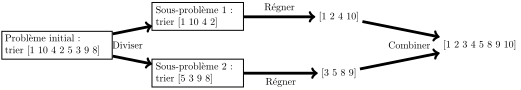
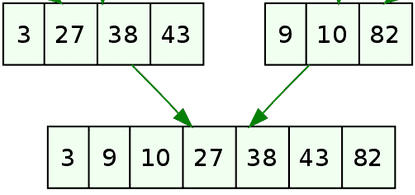

# Cours - "Diviser pour régner"

## Introduction

Le principe ==**"diviser pour régner"**== (*"divide and conquer"*) est un principe militaire ancestrale. Cette stratégie a été mise en avant par Jules César, sous le nom "divide et impera", elle est également reprise également dans les écrits politiques de [Nicolas Machiavel](https://fr.wikipedia.org/wiki/Nicolas_Machiavel){ target="_blank" }.

!!! abstract ""
    La **méthode** ==**"Diviser pour régner"**== est une **approche algorithmique** qui repose sur le **principe** suivant :

    Face à un problème généralement complexe, on le ==**divise**== en une **multitude de petits problèmes**, avec l'idée que ces "petits problèmes" seront plus simples à résoudre que le **problème original**. Une fois les **petits problèmes** résolus, on ==**combine**== les solutions obtenues pour obtenir la **solution du problème initial**.

    Le **paradigme "Diviser pour régner"** s'articule donc autour de **trois étapes** :

    - ==**DIVISER**== : le problème original est **fractionné** en **plusieurs sous-problèmes**.
    - ==**RÉGNER**== : on **résout** individuellement les **sous-problèmes**, qui sont plus aisés à traiter que le problème initial.
    - ==**COMBINER**== : les **solutions** des **sous-problèmes** sont ensuite **combinées** pour obtenir la **solution du problème original**.

    Les algorithmes basés sur cette approche sont souvent de nature **récursive**.

## Un exemple : Le tri fusion

### Présentation

!!! success "Rappels de première"
    En **première année**, nous avons étudié **deux algorithmes de tri** peu performants :

    - Le ==**tri par sélection**==, qui présente une **complexité quadratique dans le pire cas**, le **meilleur cas**, et **en moyenne** (le nombre de comparaisons est toujours le même).
    - Le ==**tri par insertion**==, dont la **complexité** est **linéaire dans le meilleur cas**, mais **quadratique dans le pire cas** et **en moyenne**.

    Ces algorithmes ne sont pas couramment utilisés en pratique en raison de leur **faible efficacité**. En effet, des analyses ont démontré que dans le **pire des cas** et **en moyenne**, la **meilleure complexité possible** pour un algorithme de tri était de $O(n~log⁡(n))$.

    Ceci représente une grande amélioration, car $log⁡(n)⋘n⋘nlog(n)⋘$n^{2}$. Pour illustrer, considérons les exemples suivants :

    - $log⁡(n) = 10$ pour $n = 2^{10} = 1024$.
    - $log⁡(n) = 100$ pour $n = 2^{100} = 1267650600228229401496703205376$.

    Cela souligne une **différence significative**, mettant en évidence l'efficacité accrue de **complexités logarithmiques** par rapport à **linéaires**.

Nous allons explorer l'un de ces algorithmes qui applique le principe 'Diviser pour régner' : le **tri-fusion**.

!!! abstract "Le principe du tri fusion"
    Au lieu de **trier la liste entière**, nous allons **couper la liste** en **plus petites listes** qui seront **faciles à trier**. On **combinera** ensuite les **petites listes triées** obtenues en **une seule**.

    <figure markdown="span">
    
    <figcaption>Étapes du tri fusion *(source : [Wikimedia](https://commons.wikimedia.org/wiki/File:Trois_%C3%A9tapes_illustr%C3%A9_avec_l%27algorithme_du_tri_fusion.svg){ target="_blank" })*</figcaption>
    </figure>

    Le **tri fusion** s’appuie sur le fait que **fusionner deux tableaux triés** en **un tableau trié** se fait en un **temps linéaire** $O(n)$.

??? tip "Animation du tri fusion (*cliquer ici pour afficher*)"
    <div id="controls">
        <button id="run-mergeSort" class="md-button">Lancer la visualisation</button>
        <button id="run-mergeSort-step" class="md-button">Pas à pas</button>
        <button id="reset-mergeSort" class="md-button">Réinitialiser</button>
    </div>
    <h2 class="title1" style = "background: green; color: white; font: italic;">Le tableau n'est pas trié </h2>
    <canvas id="Canvas"></canvas>
    <script src="../javascripts/mergeSort.js"></script>

!!! quote "Un exemple de **fusion**"
    <figure markdown="span">
    
    <figcaption>Fusion de deux tableaux à 3 et 4 éléments *(source : [lyceum](https://www.lyceum.fr/tg/nsi/5-algorithmique/2-diviser-pour-regner/){ target="_blank" })*</figcaption>
    </figure>

    On **itère simultanément** sur **les deux listes**, ce qui donne une complexité en $O(n)$ (*linéaire*). On procède de la manière suivante :

    - On prend en compte **3** et **9**, les premiers éléments des deux listes, et on place **3** (le plus petit), puis on **avance dans la première liste**.
    - Puis, avec **27** et **9**, on place **9** et on **avance dans la deuxième liste**.
    - L'étape suivante avec **27** et **10** consiste à placer **10**, et ainsi de suite.
    - Lorsque l'on atteint **27** et **82**, on place **27**, et ainsi de suite.
    - En arrivant à **38** et **82**, on place **38**.
    - Puis, avec **43** et **82**, on place **43**, constatant ainsi que nous avons parcouru **toute la première liste**. À ce stade, on **place tous les éléments restants** de la **deuxième liste**.

D'un autre côté, la découpe récursive d'un tableau jusqu'à atteindre le **cas terminal** - un tableau trié d'**un seul élément** - a une complexité en $log⁡(n)$. Cela donne une complexité totale de $O(nlog⁡(n))$, ce qui représente la **meilleure performance possible**.

Pour améliorer la lisibilité, nous allons diviser notre algorithme en **deux fonctions distinctes** : l'une pour effectuer la **fusion** et l'autre pour effectuer le **tri** (qui effectue le processus de découpage).

- en **rouge** : diviser
- en **bleu** : régner
- en **vert** : fusionner

<center>

</center>

### Implémentation du tri fusion

#### Fusion

La fonction `fusion(t1, t2)` peut s'écrire de la manière suivante :

De manière **itérative** :

```python
def fusion(t1, t2):
    # Initialisation
    resultat = []
    i, j = 0, 0

    # Boucle sur les deux tableaux
    while i < len(t1) and j < len(t2):
        if t1[i] < t2[j]:
            resultat.append(t1[i])
            i += 1
        else:
            resultat.append(t2[j])
            j += 1

    # Finalisation: On ajoute les éléments restants du tableau non vide restant
    # Si t1 n'a pas été entièrement vidé, on ajoute ses éléments restants
    if i < len(t1):
        for k in range(i, len(t1)):
            resultat.append(t1[k])
    # Sinon on ajoute les éléments de tbl2 restants
    elif j < len(t2):
        for k in range(j, len(t2)):
            resultat.append(t2[k])

    return resultat
```

La dernière partie de cette algorithme peut se simplifier en utilisant la méthode `extend` de `list` :

```python
def fusion(t1, t2):
    # Initialisation
    resultat = []
    i, j = 0, 0

    # Boucle sur les deux tableaux
    while i < len(t1) and j < len(t2):
        if t1[i] < t2[j]:
            resultat.append(t1[i])
            i += 1
        else:
            resultat.append(t2[j])
            j += 1

    # Finalisation: On ajoute les éléments restants du tableau non vide restant
    # Si t1 n'a pas été entièrement vidé, on ajoute ses éléments restants
    resultat.extend(t1[i:])
    resultat.extend(t2[j:])

    return resultat
```

La fonction `fusion` peut également s'écrire **de manière récursive**, de la manière suivante :

```python
def fusion(t0, t1):
    if not t0:
        return t1
    if not t1:
        return t0

    if t0[0] < t1[0]:
        return [t0[0]] + fusion(t0[1:], t1)
    else:
        return [t1[0]] + fusion(t0, t1[1:])
```

#### Tri fusion

L'algorithme du **tri fusion**, qui réutilise donc l'algorithme `fusion`, s'écrit plus facilement **de manière récursive** :

```python
def tri_fusion(tab):
    # Si la taille du tableau est inférieure ou égale à 1, il est déjà trié
    if len(tab) <= 1:
        return tab

    # Diviser le tableau en deux moitiés
    milieu = len(tab) // 2
    t1 = tab[:milieu]
    t2 = tab[milieu:]

    # Trier récursivement les deux moitiés
    t1_trie = tri_fusion(t1)
    t2_trie = tri_fusion(t2)

    # Fusionner les deux moitiés triées
    resultat = fusion(t1_trie, t2_trie)

    return resultat
```

Vous pouvez tester ce tri ci-dessous :

{{ IDE('src/trifusion.py') }}