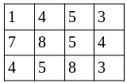
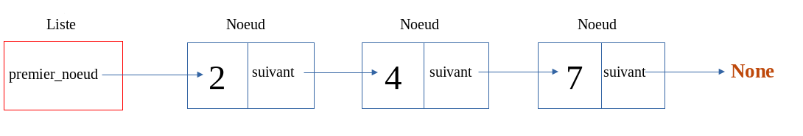

# Révisions et entraînement au langage Python

## Introduction

Cette activité est constituée de plusieurs **programmes**, de **difficulté croissante**, à **compléter** ou à **réaliser**.

Pour chaque programme, des **tests** sont effectués dans chaque **fonction** pour vérifier leur bon fonctionnement.
Si vous n'avez pas d'erreur, rien ne doit s'afficher lorsque vous exécutez le programme.

# Programme 1

!!! success "À télécharger"
    - [programme1.py](src/programme1.py){ target="_blank" } : programme 1 à compléter
    - [programme1_corr.py](src/corr/programme1_corr.py){ target="_blank" } : corrigé du programme 1

Ouvrez le fichier `programme1.py` dans **Thonny** (ou votre *IDE* préféré).

!!! note "Question 1"
    Écrivez la fonction `somme(a,b)`, qui renvoie la **somme** de deux entiers *a* et *b*.

!!! note "Question 2"
    Complétez la fonction `produit(a,b)`, qui renvoie le **produit** de deux entiers *a* et *b*, **sans utiliser l'opérateur** `*`.

!!! note "Question 3"
    Complétez la fonction `prod_liste(l1, l2)` qui fait le **produit** des éléments de deux listes, et renvoie une nouvelle liste contenant les éléments résultant de ces produits.

    <u>Exemple</u> : Si `l1 = [1, 2, 3]` et `l2 = [4, 5, 6]`, la fonction renverra une liste `[4, 10, 18]`.

# Programme 2

!!! success "À télécharger"
    - [programme2.py](src/programme2.py){ target="_blank" } : programme 2 à compléter
    - [programme2_corr.py](src/corr/programme2_corr.py){ target="_blank" } : corrigé du programme 2

!!! note "Question 4"
    Complétez la fonction `minimum(liste)` qui renvoie **le plus petit élément d'une liste**.

!!! note "Question 5"
    Écrivez la fonction `maximum(liste)` en vous basant sur le même principe que la fonction précédente.

!!! note "Question 6"
    Complétez la fonction `indice_min(liste)` qui renvoie l'**indice** du **plus petit élément** de la liste.

!!! note "Question 7"
    Complétez la fonction `tri_selection(liste)` qui effectue le **tri par sélection** d'une liste.

# Programme 3

!!! success "À télécharger"
    - [programme3.py](src/programme3.py){ target="_blank" } : programme 3 à compléter
    - [programme3_corr.py](src/corr/programme3_corr.py){ target="_blank" } : corrigé du programme 3

!!! note "Question 8"
    Écrivez la fonction `concatener(liste)` qui renvoie la **concaténation de deux listes**.

!!! note "Question 9"
    Écrivez la fonction `inverse(liste)` qui renvoie l'**inverse d'une liste**, vous ne devez pas utiliser la méthode `reverse` !

!!! note "Question 10"
    Écrivez la fonction `somme_li(liste)` qui renvoie une liste contenant **la somme des éléments de la liste avec les éléments de son inverse**.

!!! note "Question 11"
    Écrivez la fonction `somme_lignes(tableau)` et complétez la fonction `somme_colonnes(tableau)` qui renvoient respectivement une **liste** contenant la **somme de chaque ligne d'un tableau 2D** et la **somme de chaque colonne d'un tableau 2D**.

    On considère que les lignes du tableau font toutes **la même taille**.

    Une liste `l = [[1, 4, 5, 3], [7, 8, 5, 4], [4, 5, 8, 3]]` par exemple correspondrait au tableau suivant :

    {width="20%"}

# Programme 4

!!! success "À télécharger"
    - [programme4.py](src/programme4.py){ target="_blank" } : programme 4 à compléter
    - [programme4_corr.py](src/corr/programme4_corr.py){ target="_blank" } : corrigé du programme 4

!!! note "Question 12"
    Écrivez une fonction `trouver(liste, element)` qui renvoie **True** si l'élément `element` est dans la liste `liste`, **False** s'il n'y est pas.

!!! note "Question 13"
    Complétez la fonction `dichotomie(liste, element)` qui renvoie **True** si `element` est dans la liste `liste`, **False** sinon. Le paramètre `liste` est une **liste triée**.

# Programme 5

!!! success "À télécharger"
    - [programme5.py](src/programme5.py){ target="_blank" } : programme 5 à compléter
    - [programme5_corr.py](src/corr/programme5_corr.py){ target="_blank" } : corrigé du programme 5

!!! note "Question 14"
    Écrivez une fonction `compter(mot, lettre)` qui **compte** le nombre de fois qu'une **lettre** apparaît dans un **mot**.

!!! note "Question 15"
    Écrivez une fonction `supprimer(mot, lettre)` qui renvoie le **mot initial** sans la **lettre spécifiée**.

!!! note "Question 16"
    Écrivez une fonction `rercherche(chaine, sequence)` qui recherche une **séquence** (une suite de caractères) dans une **chaîne de caractères** et renvoie **True** si elle est trouvée, **False** sinon.

# Programme 6

!!! success "À télécharger"
    - [programme6.py](src/programme6.py){ target="_blank" } : programme 6 à compléter

On s'intéresse aux **classes**.

Ce programme contient une classe `Carte` qui représente une **carte** ayant une **valeur** (représentée par un entier de 1 à 4) et une **couleur** (représentée par un entier de 1 à 13).

!!! note "Question 17"
    Le programme contient également une classe `PaquetDeCarte` dans laquelle vous devez écrire la méthode `remplir()` qui remplit un **paquet de cartes** avec les 52 cartes (13 cartes de 4 couleurs) et la méthode `getCarteAt(pos)` permettant de récupérer la carte à la position `pos` donnée.

# Programme 7

!!! success "À télécharger"
    - [programme7.py](src/programme7.py){ target="_blank" } : programme 7 à compléter

On souhaite représenter une **liste chainée** à l'aide de **classes** Python.
Ce programme contient une classe `Noeud` et une classe `Liste`.

On représente une liste chainée de la manière suivante :

La classe **Liste** a comme attribut `premier_noeud` qui pointe vers le premier noeud de la liste.
Un noeud a comme attribut `valeur` qui contient la **valeur du noeud**, et `suivant` qui pointe vers **le noeud suivant**.
Ainsi, le premier noeud pointe vers le second, le second vers le troisième, etc.
Un **noeud vide** est représenté par l'objet `None`.

Le schéma ci-dessus par exemple représente la liste `[2, 4, 7]`.

!!! note "Question 18"
    Complétez la classe `Noeud` et la classe `Liste` en respectant les instructions contenues dans les **docstrings**.

# Programme 8

!!! success "À télécharger"
    - [programme8.py](src/programme5.py){ target="_blank" } : programme 8 à compléter

Un peu de récursivité.
Les fonctions suivantes doivent être écrites de manière **récursive**.

!!! note "Question 19"
    Écrivez une fonction `factorielle(n)` qui renvoie la **factorielle** du nombre **n** spécifiée.

!!! note "Question 20"
    Écrivez une fonction `fibonacci(n)` qui donne le n-ième terme de la suite de **Fibonacci**.
    La suite de Fibonacci donne :
    
    - **n** si *n = 0* ou *n = 1*
    - **fibonacci(n - 1) + fibonacci(n - 2)** si *n > 1*

Voir le tableau suivant :

| n =  | résultat  |
| ---- | --------- |
| 0    | 0         |
| 1    | 1         |
| 2    | 1 + 0 = 1 |
| 3    | 1 + 1 = 2 |
| 4    | 2 + 1 = 3 |

!!! note "Question 21"
    Le **tri fusion** est un tri basé sur l'algorithme "Diviser pour régner" qui effectue le tri d'une liste en séparant récursivement la liste en deux, jusqu'à effectuer des comparaisons d'éléments un à un et à reconstituer la liste finale.
    Plus d'informations ici : <https://fr.wikipedia.org/wiki/Tri_fusion>

    Voici un schéma du tri fusion appliqué à une liste de 7 éléments :

    {width="40%"}

    La fonction `fusion`, qui fusionne deux listes triées, est donnée.
    Écrivez la fonction `tri_fusion` qui effectue le tri d'une liste en suivant cette méthode.
