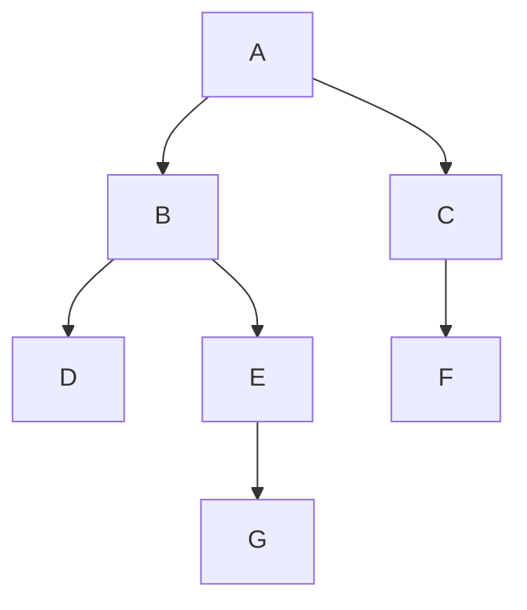

# Cours/TD - Introduction aux graphes

## Vidéo d'introduction

<iframe width="560" height="315" src="https://www.youtube.com/embed/YYv2R1cCTa0?si=JJx-NNZnBuz-gVMM" title="YouTube video player" frameborder="0" allow="accelerometer; autoplay; clipboard-write; encrypted-media; gyroscope; picture-in-picture; web-share" referrerpolicy="strict-origin-when-cross-origin" allowfullscreen></iframe>

## Les graphes - Définitions, vocabulaire et représentations

!!! success ""

    Ce **Cours/TD** est disponible au format **PDF** :

    <center>
    [:material-cursor-default-click: Télécharger `introduction_graphes.pdf`](src/introduction_graphes.pdf){ style="font-size:1.2em" target="_blank" }
    </center>

## Parcours de graphes

**Parcourir un graphe** consiste à **visiter ses sommets** en suivant un certain **ordre**, selon le type de parcours appliqué.

Il existe deux parcours classiques :

- Le **parcours en profondeur** (*DFS : Depth-First Search*)
- Le **parcours en largeur** (*BFS : Breadth-First Search*)

Nous allons étudier chacun d’eux à travers un exemple.

On considèrera pour la suite le **graphe non orienté** suivant :



*(Exceptionnellement, les flèches représentent ici des arêtes, et pas des arcs.)*

On le représentera ici en **Python** sous la forme d'un **dictionnaire des voisins** :

```python
graphe = {
    'A': ['B', 'C'],
    'B': ['A', 'D', 'E'],
    'C': ['A', 'F'],
    'D': ['B'],
    'E': ['B', 'G'],
    'F': ['C'],
    'G': ['E']
}
```

### Parcours en profondeur

Le **parcours en profondeur** consiste à aller **d'abord** le **plus loin possible** lors du parcours. On va donc parcourir un sommet voisin du sommet de départ, puis un voisin du voisin, puis un voisin du voisin du voisin... etc, puis revenir en arrière lorsqu'on ne peut plus aller en profondeur.

Un **parcours en profondeur** du graphe `graphe` défini précédemment pourrait donner l'ordre suivant :

```
A → B → D → E → G → C → F
```

L'algorithme de **parcours en profondeur** peut s'écrire de manière **récursive** :

```python
def parcours_profondeur_rec(graphe, sommet, visites=None):
    ''' Renvoie les sommets visités selon un parcours en profondeur. '''

    if visites is None:  # lors du premier appel
        visites = []  # on initialise le tableau des sommets visités
    visites.append(sommet)  # on ajoute le sommet donné aux sommets visités
    for voisin in graphe[sommet]:  # pour chaque voisin du sommet courant
        if voisin not in visites:  # si le voisin n'a pas déjà été visité
            parcours_profondeur_rec(graphe, voisin, visites)  # on fait un appel récursif sur chaque sommet voisin
    return visites  # renvoyer la liste des sommets visités
```

ou de manière **itérative** en utilisant une structure de **pile** :

```python
def parcours_profondeur(graphe, sommet_depart):
    ''' Renvoie les sommets visités selon un parcours en profondeur. '''

    pile = [sommet_depart]  # initialiser une pile avec le sommet de départ
    visites = []  # initialiser la liste des sommets visités

    while pile:  # tant que la pile n'est pas vide
        sommet = pile.pop()  # on dépile la pile
        if sommet not in visites:  # si le sommet courant n'a pas déjà été visité
            visites.append(sommet)  # on l'ajoute aux sommets visités
            for voisin in graphe[sommet]:  # pour chaque voisin du sommet
                if voisin not in visites:  # si le voisin n'a pas déjà été visité
                    pile.append(voisin)  # on l'ajoute à la pile

    return visites  # renvoyer la liste des sommets visités
```

### Parcours en largeur

Le **parcours en largeur** explore les **voisins d’un sommet** avant de passer aux sommets suivants.

Un **parcours en largeur** du graphe `graphe` défini précédemment pourrait donner l'ordre suivant :

```
A → B → C → D → E → F → G
```

On peut implémenter ce parcours en **Python** de manière itérative en utilisant une **structure de file** :

```python
def parcours_largeur(graphe, sommet_depart):
    ''' Renvoie les sommets visités selon un parcours en largeur. '''

    file = [sommet_depart]  # initialiser une file contenant uniquement le sommet de départ
    visites = [sommet_depart]  # initialiser liste des visités avec uniquement le sommet de départ

    while file:  # tant que la file n'est pas vide
        sommet = file.pop(0)  # on défile la file
        for voisin in graphe[sommet]:  # pour chaque voisin du sommet
            if voisin not in visites:  # si le voisin n'a pas déjà été visité
                visites.append(voisin)  # on l'ajoute aux sommets visités
                file.append(voisin)  # on l'ajoute à la file
    
    return visites  # renvoyer la liste des sommets visités
```