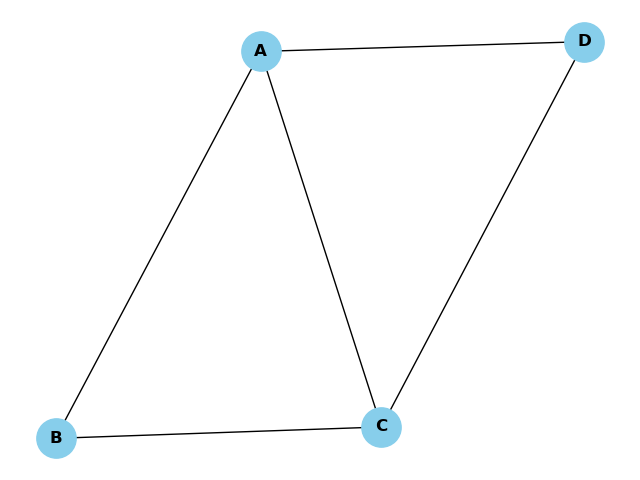
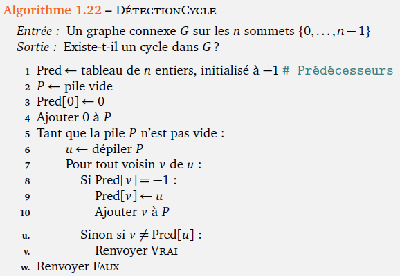

# Implémentation des graphes en Python

Comme nous l'avons vu dans le [cours](cours.md), il existe **deux manières** de **représenter les graphes** :

- en utilisant les **listes d'adjacence** (ou *listes de successeurs*),
- en utilisant des **matrices d'adjacence**.

Dans cette partie, nous **implémenterons** la **structure de graphe** en *Python* en choisissant comme **paradigme** la **programmation orientée objet** (*POO*).

Nous proposerons une première implémentation en utilisant une **liste d'adjacence** que l'on implémentera en *Python* sous la forme d'un **dictionnaire**. Nous élaborerons ensuite une seconde implémentation en utilisant une **matrice d'adjacence**, implémentée sous la forme d'une **liste de listes**.

On distinguera une structure de **graphe non-orienté**, et une structure de **graphe orienté**.

## Graphe non-orienté

### Type abstrait

Avant d'implémenter notre **structure de graphe** en Python, définissons tout d'abord le **type abstrait `Graphe`**, ainsi que les **opérations** qui y sont associées.

!!! abstract "Type abstrait *Graphe*"

	**Utilise :** *Sommet*, *Entier*, *Booléen*, *Liste*<br />
	**Opérations de base :**<br />
	&nbsp;&nbsp;&nbsp;&nbsp; $nouveau\_graphe :~\rightarrow Graphe$<br />
	&nbsp;&nbsp;&nbsp;&nbsp; $ajouter\_sommet :~Graphe \times Sommet \rightarrow Graphe$<br />
	&nbsp;&nbsp;&nbsp;&nbsp; $ajouter\_arete :~Graphe \times Sommet \times Sommet \rightarrow Graphe$<br />
	&nbsp;&nbsp;&nbsp;&nbsp; $supprimer\_sommet :~Graphe \times Sommet \rightarrow Graphe$<br />
	&nbsp;&nbsp;&nbsp;&nbsp; $supprimer\_arete :~Graphe \times Sommet \times Sommet \rightarrow Graphe$<br />
	**Autres opérations :**<br />
    &nbsp;&nbsp;&nbsp;&nbsp; $est\_sommet :~Graphe \times Sommet \rightarrow Booléen$<br />
    &nbsp;&nbsp;&nbsp;&nbsp; $est\_arete :~Graphe \times Sommet \times Sommet \rightarrow Booléen$<br />
	&nbsp;&nbsp;&nbsp;&nbsp; $ordre :~Graphe \rightarrow Entier$<br />
    &nbsp;&nbsp;&nbsp;&nbsp; $degre :~Graphe \times Sommet \rightarrow Entier$<br />
	&nbsp;&nbsp;&nbsp;&nbsp; $voisins :~Graphe \times Sommet \rightarrow Liste$<br />

### Implémentation avec un dictionnaire

Plutôt qu'utiliser plusieurs **listes d'adjacence**, on utilisera un **dictionnaire d'adjacence** qui permettra de stocker les **voisins** de chaque **sommet** du graphe.

!!! note "À faire 1"
    **Téléchargez** le **fichier Python** ci-dessous :

    <center>
    [:material-cursor-default-click: Télécharger `graphe.py`](src/graphe.py){ style="font-size:1.2em" target="_blank" }
    </center>

    Complétez chaque **méthode** de la classe `Graphe` (à l'exception de la méthode `affiche` qui vous est donnée.)

??? tip "Corrigé - À faire 1"
    ```python
    import networkx as nx
    import matplotlib.pyplot as plt

    class Graphe:
        def __init__(self):
            self.adj = {}

        # Opérations de base

        def ajouter_sommet(self, s:str):
            ''' Ajoute un sommet dans le graphe.
            On vérifiera si le sommet n'existe pas déjà. '''
            
            if not s in self.adj:
                self.adj[s] = []
        
        def ajouter_arete(self, s1:str, s2:str):
            ''' Ajoute une arête entre les sommets s1 et s2 du graphe.
            Si les sommets n'existent pas, on les crée. '''
            
            self.ajouter_sommet(s1)
            self.ajouter_sommet(s2)
            self.adj[s1].append(s2)
            self.adj[s2].append(s1)
        
        def supprimer_sommet(self, s:str):
            ''' Supprime le sommet s du graphe, ainsi que les arêtes associées. '''
            
            if self.est_sommet(s):
                for voisin in self.adj[s]:
                    self.adj[voisin].remove(s)
                del self.adj[s]
        
        def supprimer_arete(self, s1:str, s2:str):
            ''' Supprime l'arête du graphe entre les sommets s1 et s2. '''
            
            if self.est_arete(s1, s2):
                self.adj[s1].remove(s2)
                self.adj[s2].remove(s1)
        
        # Autres opérations

        def est_sommet(self,s) -> bool:
            ''' Renvoie True si s est un sommet du graphe, False sinon. '''
            
            return s in self.adj

        def est_arete(self,s1,s2) -> bool:
            ''' Renvoie True si une arête existe entre s1 et s2, False sinon. '''
            
            return s1 in self.adj[s2] and s2 in self.adj[s1]
        
        def ordre(self) -> int:
            ''' Renvoie l'ordre du graphe. '''
            
            pass
        
        def degre(self, s: str) -> int:
            ''' Renvoie le degré d'un sommet du graphe. '''
            
            pass
        
        def voisins(self, s: str) -> list:
            ''' Renvoie une liste des voisins du sommet donné. '''
            
            pass

        # Parcours de graphes

        pass

        # Connexité, cycles et arbre

        pass

        # Affichage

        def affiche(self):
            ''' Affiche une représentation visuelle du graphe. '''
            
            G = nx.Graph()
            for sommet, voisins in self.adj.items():
                for voisin in voisins:
                    G.add_edge(sommet, voisin)
            nx.draw(G, with_labels=True, node_color='skyblue', node_size=800, font_size=12, font_weight='bold')
            plt.show()

    if __name__ == "__main__":
        ''' Mettre ici les instructions pour tester votre classe Graphe. '''
            
        pass
    ```

!!! tip "Test de votre classe"

    Dans le bloc en bas de script `if __name__ == "__main__"`, ajoutez les instructions suivantes :

    ```python
    graphe = Graphe()  # création d'un nouveau graphe
    graphe.ajouter_arete('A', 'B')  # ajout d'une arête entre A et B
    graphe.ajouter_arete('B', 'C')  # ajout d'une arête entre B et C
    graphe.ajouter_arete('C', 'D')  # ajout d'une arête entre C et D
    graphe.ajouter_arete('D', 'A')  # ajout d'une arête entre D et A
    graphe.ajouter_arete('A', 'C')  # ajout d'une arête entre A et C
    graphe.affiche()  # afficher le graphe
    ```

    Si votre programme est correct, vous devriez obtenir la visualisation suivante en exécutant votre programme :

    { width="450" }

### Parcours de graphes

!!! note "À faire 2"
    Dans votre fichier `graphe.py`, ajoutez une méthode `parcours_largeur(self, s: str) -> list` qui prend un **sommet** en entrée et renvoie la **liste des sommets** parcourus avec un **parcours en largeur**.  
    Vous écrirez cette méthode de manière **itérative**.

    Vous pouvez vous aider de [cet algorithme en pseudo-code](https://fr.wikipedia.org/wiki/Algorithme_de_parcours_en_largeur#Pseudo_code).

!!! note "À faire 3"
    Ajoutez une méthode `parcours_profondeur(self, s: str) -> list` qui prend un **sommet** en entrée et renvoie la **liste des sommets** parcourus avec un **parcours en profondeur**.  
    Vous écrirez cette méthode de manière **itérative**.

    Vous pouvez vous aider de [cet algorithme en pseudo-code](https://fr.wikipedia.org/wiki/Algorithme_de_parcours_en_profondeur#Impl%C3%A9mentation_it%C3%A9rative).

!!! note "À faire 4"
    Écrivez maintenant une méthode `parcours_profondeur_rec(self, s: str) -> list` qui effectue le même **parcours en profondeur**, mais de manière **récursive**.

!!! tip "Aide - À faire 4"
    ```python
    def parcours_profondeur_rec(self, s: str, visites=None) -> list:
        ''' Effectue un parcours en profondeur de manière récursive. '''

        if visites is None:  # si c'est le premier appel de la méthode,
            visites = []  # on initialise la liste des sommets visités
        ...  # ajouter le sommet s aux sommets visités
        for ... in ...:  # pour chaque sommet voisin du sommet s
            if ... not in ...:  # si le sommet voisin courant n'a pas déjà été visité
                visites = ...  # on parcourt récursivement ce sommet
        return ...  # on renvoie la liste des sommets visités
    ```

!!! note "À faire 5"
    Écrire une méthode `distances(self, s: str) -> dict` qui renvoie le **dictionnaire des distances** entre un sommet `s` donné et chaque autre sommet du graphe, après avoir effectué un **parcours en largeur**.

    On procédera de la manière suivante :

    1. initialiser le **dictionnaire des distances**, contenant initialement le sommet `s`, auquel on associera la **distance** `0`,
    2. initialiser une **file** contenant initialement le sommet `s`,
    3. tant que la **file** n'est pas **vide** :
          1. on **défile** la file pour récupérer un **sommet**,
          2. on récupère la **distance** associée à ce sommet,
          3. pour chaque **sommet voisin** du sommet défilé :
             1. si le sommet n'a **pas déjà été visité**, on l'**ajoute au dictionnaire** en lui associant la **distance** appropriée, et on l'**enfile** dans la **file**.
    4. on **renvoie** le **dictionnaire des distances**.

### Connexité, cycles et arbre

On souhaite ajouter une **méthode** à notre classe `Graphe` permettant de déterminer si un **graphe** est un **arbre**.

On rappelle qu'il faut pour cela vérifier :

- que le graphe est **connexe**,
- que le graphe ne contient **aucun cycle**.

!!! note "À faire 6"
    Écrivez une méthode `est_connexe(self) -> bool` qui renvoie **True** si le graphe est **connexe**, et **False** sinon.

Pour la **détection des cycles**, on utilisera l'algorithme suivant, basé sur le **parcours en profondeur** :



On adaptera cet algorithme pour qu'il puisse fonctionner avec des **sommets** autres que des *entiers* de `0` à `n`, en utilisant non pas une liste de prédecesseurs mais un **dictionnaire des prédecesseurs**.

!!! note "À faire 7"
    Recopiez et complétez la méthode `detection_cycle` suivante :

    ```python
    def detection_cycle(self, s: str) -> bool:
        ''' Renvoie true si un cycle atteignable par s est détecté, False sinon. '''

        pile = [s]  # création d'une pile contenant uniquement le sommet s
        pred = {s: s}  # création du dictionnaire des prédecesseurs
        # À compléter
        pass
    ```

    Puisque l'on utilise un **dictionnaire** au lieu d'un **tableau**, l'instruction `Si Pred[v] = -1` dans le pseudo-code, qui permet de vérifier si le sommet `v` n'a pas déjà été visité, sera remplacé par `Si v EST DANS pred`.

!!! note "À faire 8"
    Enfin, écrivez une **méthode** `est_arbre(self) -> bool` qui renvoie `True` si le **graphe** est un **arbre**, et `False` sinon.

## Graphe orienté

### Type abstrait

Nous allons définir cette fois un **type abstrait `GrapheO`**, représentant un **graphe orienté**, ainsi que les **opérations** qui y seront associées.

!!! abstract "Type abstrait *Graphe Orienté*"

	**Utilise :** *Sommet*, *Entier*, *Booléen*, *Liste*<br />
	**Opérations de base :**<br />
	&nbsp;&nbsp;&nbsp;&nbsp; $nouveau\_graphe :~\rightarrow Graphe$<br />
	&nbsp;&nbsp;&nbsp;&nbsp; $ajouter\_sommet :~Graphe \times Sommet \rightarrow Graphe$<br />
	&nbsp;&nbsp;&nbsp;&nbsp; $ajouter\_arc :~Graphe \times Sommet \times Sommet \rightarrow Graphe$<br />
	&nbsp;&nbsp;&nbsp;&nbsp; $supprimer\_sommet :~Graphe \times Sommet \rightarrow Graphe$<br />
	&nbsp;&nbsp;&nbsp;&nbsp; $supprimer\_arc :~Graphe \times Sommet \times Sommet \rightarrow Graphe$<br />
	**Autres opérations :**<br />
    &nbsp;&nbsp;&nbsp;&nbsp; $est\_sommet :~Graphe \times Sommet \rightarrow Booléen$<br />
    &nbsp;&nbsp;&nbsp;&nbsp; $est\_arc :~Graphe \times Sommet \times Sommet \rightarrow Booléen$<br />
	&nbsp;&nbsp;&nbsp;&nbsp; $ordre :~Graphe \rightarrow Entier$<br />
    &nbsp;&nbsp;&nbsp;&nbsp; $degre\_entrant :~Graphe \times Sommet \rightarrow Entier$<br />
    &nbsp;&nbsp;&nbsp;&nbsp; $degre\_sortant :~Graphe \times Sommet \rightarrow Entier$<br />
    &nbsp;&nbsp;&nbsp;&nbsp; $degre :~Graphe \times Sommet \rightarrow Entier$<br />
	&nbsp;&nbsp;&nbsp;&nbsp; $successeurs :~Graphe \times Sommet \rightarrow Liste$<br />
    &nbsp;&nbsp;&nbsp;&nbsp; $predecesseurs :~Graphe \times Sommet \rightarrow Liste$

### Implémentation avec une matrice d'adjacence

!!! note "À faire 1"
    **Téléchargez** le **fichier Python** ci-dessous :

    <center>
    [:material-cursor-default-click: Télécharger `grapheo.py`](src/grapheo.py){ style="font-size:1.2em" target="_blank" }
    </center>

    Complétez chaque **méthode** définie dans la classe `GrapheO` (à l'exception de la méthode `affiche` qui vous est donnée.)