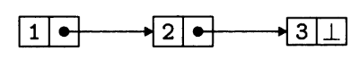
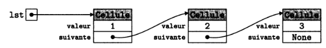

!!! warning "En construction"
    Ce cours est encore en construction...

# Les listes chaînées

## Les listes Python

Vous connaissez déjà les **listes Python**, qui permettent de stocker simplement des séquences d'éléments, mais ces listes ne sont pas adaptées à toutes les opérations que l'on pourrait vouloir effectuer sur des séquences. 

Les **listes** de **Python** permettent par exemple d'**insérer** ou de **supprimer** efficacement des éléments **à la fin** d'un tableau, avec les opérations `append` et `pop`, mais se prêtent mal à l'insertion ou la suppression d'un élément à une autre position `l`. En effet, les éléments d'un tableau étant contigus et ordonnés en mémoire, insérer un élément dans une séquence demande de **déplacer tous les éléments** qui le suivent pour lui laisser une place.

Par exemple, si l'on veut insérer un élément au début d'une liste, on pourrait utiliser la méthode `insert` du type `List` :

{{ IDEv('scripts/01.py') }}

En terme de **coût algorithmique**, cela revient à écrire ceci :

{{ IDEv('scripts/02.py') }}

On voit donc que les listes Python ne sont pas toujours idéales, selon les opérations que l'on souhaite faire.  
C'est la raison pour laquelle nous allons nous intéresser à un nouveau type de listes : les **listes chaînées**.

## Présentation des listes chaînées

Une **liste chaînée** permet, tout comme les **listes Python**, de **représenter une liste**, c'est-à-dire une **séquence finie de valeurs**.

Sa structure a pour particularité le fait que les éléments sont **chaînés** entre eux, permettant le passage d'un élément à l'élément suivant. Ainsi, **chaque élément** est stocké dans un petit bloc alloué quelque part dans la mémoire, que l'on pourra appeler **maillon** ou **cellule**, à laquelle est associée :

- une **valeur**,
- la **référence** vers la **cellule contenant l'élément suivant** de la **liste**.

<figure markdown>
  { width="300" }
  <figcaption>Une liste chaînée</figcaption>
</figure>

La **liste chaînée** ci-dessus contient donc les éléments `1, 2, 3`.

!!! abstract "Type abstrait *Liste*"
    Voici *une manière* de définir le **type abstrait** `Liste` représentant une **liste chaînée**.  

	**Utilise :** *Element*, *Entier*, *Booleen* 
	**Opérations fondamentales (primitives):**

    | Opération                                                    | Description                                                  |
    | ------------------------------------------------------------ | ------------------------------------------------------------ |
    | $nouvelleListeVide :~\rightarrow Liste~VIDE$                 | Renvoie une **nouvelle liste vide**.                         |
    | $estListeVide :~Liste \rightarrow Booleen$                   | Renvoie `True` si la liste donnée est vide, `False` sinon.   |
    | $inserer :~Liste \times Element \times Entier \rightarrow Liste~NON~VIDE$ | Renvoie une **nouvelle liste** incluant les éléments de la liste donnée à laquelle on a ajouté l'**élément donné** d'**indice donné**. |
    | $listeTete :~Liste \rightarrow Element$                      | Renvoie l'**élément en tête** (dans la première cellule) de la liste.                   |
    | $listeQueue :~Liste \rightarrow Liste$                       | Renvoie la liste donnée **privée de sa tête**.                  |

    **Autres opérations:**

    | Opération                                                    | Description                                                  |
    | ------------------------------------------------------------ | ------------------------------------------------------------ |
    | $nieme\_element :~Liste \times Entier \rightarrow Element$   | Renvoie l'**élément** situé à l'**indice donné** de la **liste donnée**. |
    | $supprimer :~Liste~NON~VIDE \times Entier \rightarrow Liste$ | Renvoie une **nouvelle liste** contenant les éléments de la liste donnée à laquelle on a supprimé l'**élément donné** d'**indice donné**. |
    | $longueur :~Liste \rightarrow Entier~Naturel$                | Renvoie la **longueur** (nombre d'éléments) de la **liste donnée**. |

    On peut également avoir des **opérations** permettant d'**interagir avec les cellules** de la liste, à condition de faire, lors de l'implémentation, la distinction entre "liste" et "cellule" (en créant une classe `Liste` et une classe `Cellule` par exemple).  
    En effet, dans certaines implémentations, listes et cellules peuvent être confondues.

    **Interactions avec les Cellules:**

    | Opération                                                  | Description                                                  |
    | ---------------------------------------------------------- | ------------------------------------------------------------ |
    | $acces :~Liste~NON~VIDE \times Entier \rightarrow Cellule$ | Renvoie la **cellule** située à l'**indice donné** de la liste donnée. |
    | $contenu :~Cellule \rightarrow Element$                    | Renvoie l'**élément** contenu dans la **cellule** donnée.    |
    | $successeur :~Cellule \rightarrow Cellule$                 | Renvoie la **cellule qui succède** à la cellule donnée.      |

    !!! warning "Type abstrait $\ne$ implémentation"
        Il est essentiel de faire la différence entre un **type abstrait** et une **implémentation**.  
        On qualifie d'**abstrait** ce type de donnée car on ne spécifie pas comment les données sont **représentées** ni comment les opérations sont **implémentées**.

        Cette **définition abstraite** du type **liste chaînée**, bien qu'étant **non mutable** (on renvoie une nouvelle liste lors d'une insertion ou de la suppression d'un élément), peut donner lieu à tout un tas d'implémentations différentes : **avec** ou **sans** la **POO**, **récursive** ou non, **muable** ou **immuable**, etc. Il n'y a aucune obligation de suivre à la lettre la définition abstraite lors de l'implémentation, tant que les opérations définies sont bien implémentées.

        On sera donc libre de faire une **implémentation muable**, avec modification **en place** de la liste si on le souhaite.

## Implémentations des listes chaînées

### Implémentation récursive avec POO

Pour notre **première implémentation** des **listes chaînées**, on propose d'utiliser la *POO*.

On crée une classe `Cellule` permettant de représenter une **cellule** (ou un *maillon*) d'une **liste** :

{{ IDE('scripts/03.py') }}

<figure markdown>
  
  <figcaption>Visualisation des cellules</figcaption>
</figure>

!!! abstract "Implémentation"
    Avec cette **implémentation**, une **liste chaînée** est soit :

    - une **liste vide** représentée par la valeur `None`
    - une **liste** représentée par une **instance** de `Cellule`.

### Autres implémentations