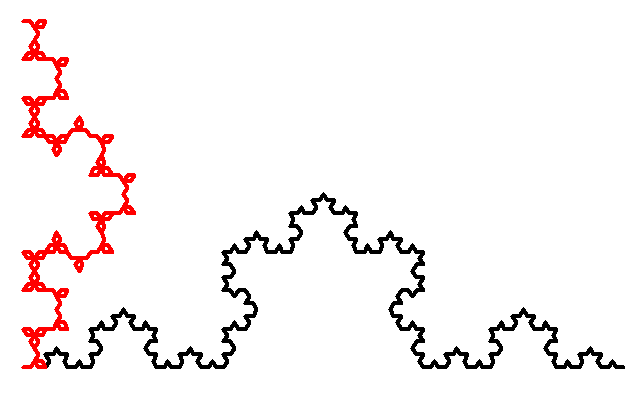
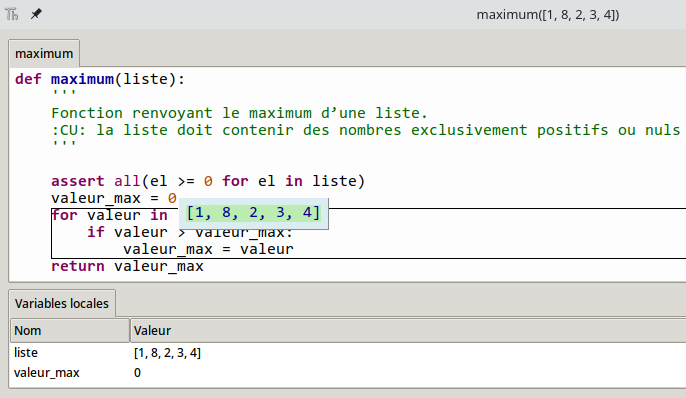
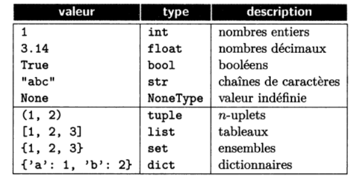

??? quote "Sources"
    - [dautrylimoges.scenari-community.org](https://dautrylimoges.scenari-community.org/TNSI/MiseAuPtPgmes_Bugs_TNSI_web/co/0BO_MiseAuPt_Bugs.html){ target="_blank" }  
    - [silanus.fr](http://www.silanus.fr/nsi/premiere/python/erreur.html#_erreurs_a_lexecution){ target="_blank" } 
    - [lamadone.frama.io](https://lamadone.frama.io/informatique/terminale-nsi/mise_au_point_des_programmes.html){ target="_blank" } 
    - [Eduscol](https://eduscol.education.fr/document/7307/download){ target="_blank" }  
    - Livres : *Hachette Terminale NSI*, *Serge Bays - Terminale NSI*, *Balabonski Terminale*

# Cours - Mise au point des programmes

Extrait du programme officiel :

| Contenus                                             | Capacités attendues                                          | Commentaires                                                 |
| ---------------------------------------------------- | ------------------------------------------------------------ | ------------------------------------------------------------ |
| Mise au point des programmes. Gestion des bugs. | Dans la pratique de la programmation, **savoir répondre aux causes typiques de bugs** : problèmes liés au typage, effets de bord non désirés, débordements  dans les tableaux, instruction conditionnelle non exhaustive, choix des  inégalités, comparaisons et calculs entre flottants, mauvais nommage des variables, etc. | On prolonge le travail entrepris en classe de première sur l'utilisation de la **spécification**, des **assertions**, de la **documentation des programmes** et de la construction de **jeux de tests**. |

Lorsque l’on exécute un **programme**, il peut ne pas fonctionner comme prévu. Par exemple, il peut boucler indéfiniment, ou bien ne pas produire le résultat escompté. Et même s’il fonctionne comme prévu, rien ne garantit qu'il fournisse toujours un résultat correct quelles que soient les données d’entrée qu’on lui fournit. Un **dysfonctionnement** dans un programme informatique lié à un **défaut de conception** est appelé **"bug"** :material-bug:.

Les bugs causent chaque année des **millions d’euros de perte** pour les entreprises et les États (on peut parler du fameux **bug** ayant causé l'[explosion de la fusée Ariane 5](https://fr.wikipedia.org/wiki/Vol_501_d%27Ariane_5){ target="_blank" }), voire sont parfois responsables de **morts civiles ou militaires**.

Par ailleurs, un **bug** peut produire un **résultat erroné**, un **effet de bord non souhaité**, voire fournir un **résultat inattendu mais très intéressant**. On dit qu'un programme est "**correct**" s'il :

- se **termine** toujours,
- fait ce que l'on attend de lui (adéquation à la **spécification**).

Autrement dit, pour que le programme soit correct, il ne doit pas y avoir de **bug**.

## :material-bug: Bugs

!!! tip "Point historique"
    Le terme **bug** (*insecte* en français) est apparu sur un document de 1947, écrit par un groupe travaillant sur le calculateur *Mark II* à l'université d'Harvard. Ce terme était toutefois déjà employé en électricité depuis des dizaines d'années pour évoquer un problème de fonctionnement ou de connexion d'un appareil électrique. Cela a été confirmé par Grace Hopper, informaticienne américaine ayant travaillé sur le *Mark I* puis sur le *Mark II* depuis 1943.

Bien sûr, le but est d'éviter autant que possible l'écriture de **bugs**. Pour ce faire, on peut utiliser des **méthodes de développement** particulières, ou des **outils** d’aide au développement (certains ***IDE*** sont capables de détecter des erreurs avant l'exécution du programme). Malheureusement, on finit en général tôt ou tard par introduire des bugs dans un programme, auquel cas il faut :

- savoir **mettre en évidence** le bug et le reproduire ;
- **comprendre l'origine** du bug ;
- **corriger** le bug.

C’est ce qu’on appelle la **mise au point**, ou le **déboguage**.

### Un exemple

Voici un programme utilisant le module `Turtle`, un module permettant de faire du dessin vectoriel en déplaçant une tortue sur l'écran :

```python
from turtle import *

def m1(taille):
    forward(taille)
    left(60)
    forward(taille)
    right(120)
    forward(taille)
    left(60)
    forward(taille)
    
def m2(taille):
    forward(taille)
    left(60)
    forward(taille)
    right(120)
    forward(taille)
    left(60)
    forward(taille)
    left(60)
    
def courbe(longueur, niveau, motif):
    if niveau == 1:
        motif(longueur)
    else:
        longueur = longueur / 3
        niveau = niveau - 1
        courbe(longueur, niveau, motif)
        lt(60)
        courbe(longueur, niveau, motif)
        rt(120)
        courbe(longueur, niveau, motif)
        lt(60)
        courbe(longueur, niveau, motif)

up()
goto(-300, -160)
down()
speed(0)
ht()
width(4)
color('black')
courbe(200, 4, m1)
up()
goto(-300, -160)
down()
color('red')
courbe(200, 4, m2)
```

Les différences entre la fonction `m1` et `m2` sont **minimes** : Il y a **une seule instruction** en plus à la fin de la fonction `m2` : `left(60)`. Et pourtant, en exécutant le programme, voici **en noir** le tracé utilisant la fonction `m1`, et **en rouge** le tracé utilisant la fonction `m2` :

<figure markdown>
  { width="500" }
  <figcaption>Capture d'écran de Turtle</figcaption>
</figure>

On voit donc qu'un tout petit élément peut avoir un impact énorme sur le fonctionnement d'un programme ! D'où l'importance de prévenir les erreurs, mêmes celles qui peuvent sembler minimes.

### Déceler l'origine d'un bug

Pour comprendre la cause d’un **bug**, il faut d'abord comprendre comment s’est déroulée l’**exécution du programme** qui a amené au bug. Il est important d'être capable de **simuler à la main** l'exécution du programme.

Il est également important de connaître, pour chaque fonction, quelles sont les **préconditions**, c'est-à-dire les **conditions sur les paramètres d'entrée**. On peut pour cela définir des **assertions** à l'intérieur de nos fonctions pour vérifier les préconditions, ou **au minimum** définir les préconditions à l'intérieur de la **docstring** de nos fonctions.

Par exemple, voici une fonction `maximum` renvoyant le maximum d'une liste de nombres **positifs ou nuls** :

```python
def maximum(liste):
    '''
    Fonction renvoyant le maximum d’une liste.
    :CU: la liste doit contenir des nombres exclusivement positifs ou nuls
    '''
    
    valeur_max = 0
    for valeur in liste:
        if valeur > valeur_max:
            valeur_max = valeur
    return valeur_max
```

Ici, `CU` signifie "**conditions d'utilisation**" (on y indique les **préconditions** relatives aux **paramètres** d'entrée). Sur la forme de votre docstring, il n'y a pas de règle particulière. On aurait pu écrire `assert` ou encore `préconditions` au lieu de `CU`, par exemple.

Si l'on ajoute des **assertions** à l'intérieur de notre fonction :

```python
def maximum(liste):
    '''
    Fonction renvoyant le maximum d’une liste.
    :CU: la liste doit contenir des nombres exclusivement positifs ou nuls
    '''

    assert all(el >= 0 for el in liste)
    valeur_max = 0
    for valeur in liste:
        if valeur > valeur_max:
            valeur_max = valeur
    return valeur_max
```


Pour effectuer une analyse **pas-à-pas** de votre code, vous pouvez également utiliser un **débuggueur**. De nombreux **IDE** sont dotés d'un **débuggueur**, c'est le cas notamment de **Thonny**. (Pour débugguer un script avec **Thonny**, il faut cliquer sur la petite icône à droite de l'icône d'exécution du script courant.)

<figure markdown>
  { width="500" }
  <figcaption>Débuggueur de Thonny</figcaption>
</figure>

Par ailleurs, une autre technique plus primaire mais fort utile consiste à ajouter des **affichages** à l'intérieur de vos fonctions, avec la fonction `print`, de manière à observer l'évolution du contenu des variables.

---

!!! tip "En savoir plus"
    Pour en savoir plus sur la gestion des bugs, je vous recommande de lire [ce document](https://eduscol.education.fr/document/7307/download){ target="_blank" } proposé par Eduscol.

## Les types d'erreurs en Python

### Erreurs de syntaxe

Les **erreurs de syntaxe** sont liées à des **instructions malformées**, qui ne respectent pas les règles du langage. Elles sont détectées lors de l’exécution du programme et sont assez faciles à corriger car un message d’erreur explicite indique la nature et la localisation de l'erreur.

Quelques exemples d'erreurs de syntaxe :

- Mauvaise indentation du code, mélange d'espaces et de tabulations
- Oubli des deux-points à la fin d'une instruction comme `def`, `if` ou `while`
- Utilisation de `=` au lieu de `==` pour les tests d'égalité
- ...

### Erreurs de typage

Chaque **valeur** manipulée par un programme Python est associée à un **type**.
On rappelle les principaux types manipulés en Python :

<figure markdown>
  { width="400px" }
  <figcaption>Les principaux types en Python<br />(extrait du Balabonski terminale)</figcaption>
</figure>

Voici un exemple d'instruction incorrecte :

```python
>>> '2' + 2
Traceback (most recent call last):
  File "<pyshell>", line 1, in <module>
TypeError: can only concatenate str (not "int") to str
```

En cas d'erreur de type, Python lève une erreur de type `TypeError`, ici Python indique qu'il n'est possible de concaténer que deux chaînes de caractères.

D'autres erreurs de **types** :

```python
''' L : (list) '''
>>> print(L[1.5])
TypeError: list indices must be integers or slices, not float
```

Parenthèses à la place de crochets (pour un objet qui ne peut pas être appelé) :

```python
''' L : (list), i : (int) '''
>>> print(L(i))
TypeError: ’list’ object is not callable
```

Crochets à la place des parenthèses (pour un objet qui ne peut pas être indicé) :

```python
''' mystere : (function), i : (int), a : (int) '''
>>> print(mystere[i])
TypeError: ’function’ object is not subscriptable
>>> print(a[i])
TypeError: ’int’ object is not subscriptable
```

Opérations entre deux types non compatibles (ici addition) :

```python
''' i : (int) '''
>>> print(i + ’a’)
TypeError: unsupported operand type(s) for +: ’int’ and ’str’
```

Opérations entre deux types non compatibles (ici concaténation) :

```python
''' i : (int) '''
>>> print(’a’ + i)
TypeError: can only concatenate str (not "int") to str
```

!!! note "À vous de jouer"
    Pour chacune des fonctions suivantes, proposez un type pour chacun de ses arguments et un type pour les résultats. Il peut parfois y avoir plusieurs solutions !

    ```python
    def f1(t) : 
        return t[O] + 1 
    def f2(x) : 
        return str(3.14 * x) 
    def f3(p) : 
        x, y = p 
        return 2 * x + y 
    def f4(d, s): 
        if s != "toto": 
            d[s] += 1 
        return d[s] 
    ```

### Erreurs liées aux effets de bord

Un **effet de bord** est une **modification d’une variable** qui **affecte l’état du programme** en dehors de la fonction ou de la méthode où elle a lieu. En Python, cela arrive principalement de deux manières : par les variables globales et par l’aliassage.

On rappelle que pour modifier une variable globale dans une fonction, il est nécessaire d'ajouter l’instruction `global <nom de la variable>` dans la fonction. Par conséquent, il est rare de créer un effet de bord par erreur.

L’**aliassage** survient lorsque deux variables référencent **la même donnée**, ce qui peut arriver avec les types structurés **tableau** et **dictionnaire** et avec les objets, notamment lorsqu’on les passe en paramètre.

Les effets de bord indésirables peuvent être difficile à détecter car ils ne lèvent **pas d'erreurs à l'exécution**. Il s'agit donc de bien documenter les fonctions pour indiquer quels sont les éventuels effets de bord attendus.

Voici un petit exemple :

```python
def mystere():
  L.sort()
  for i in L:
    return i == 1

def autre_fonction():
  assert L == [3,2,1]
```

Si l'on exécute les instructions suivantes :

```python
>>> L = [3,2,1]
>>> mystere()
>>> autre_fonction()
Traceback (most recent call last):
  File "C:\Users\demer\Desktop\test.py", line 12, in <module>
    autre_fonction()
  File "C:\Users\demer\Desktop\test.py", line 8, in autre_fonction
    assert L == [3,2,1]
AssertionError
```

!!! note "À vous de jouer"
    Pourquoi la fonction `autre_fonction` a t-elle échouée ?

### Erreurs sémantiques

L'erreur **sémantique**, également appelée **erreur de logique**, est une erreur qui n'implique pas de message d'erreur : le programme semble s'exécuter parfaitement, **mais le résultat n’est pas le résultat attendu**.

En fait, le programme fait exactement ce que vous lui avez dit de faire, mais ce que vous lui avez dit de faire ne correspond pas à **ce que vous vouliez qu’il fasse** : la séquence d’instructions du programme ne correspond pas à l’objectif visé. La sémantique (la logique) est donc incorrecte.

Ces erreurs sont particulièrement difficile à identifier, et nécessite d'être capable de vous replonger dans la logique de votre code pour en déceler les failles.

### Erreurs à l'exécution

Il s'agit d'une erreur qui survient **en cours d’exécution** (*Runtime error*), lorsqu'un programme fonctionne déjà, mais que des circonstances particulières se présentent (par exemple, le programme essaie de lire un fichier qui n’existe plus).

### Erreurs de valeur

Un exemple :

```python
>>> from random import randrange
>>> randrange(1, 3.5)
Traceback (most recent call last):
    File "<pyshell#92>", line 1, in <module>
        randrange(1, 3.5)
    File "C:\python3.7.4.amd64\lib\random.py", line 195, in randrange
        raise ValueError("nonintegerstop for randrange()")
ValueError: nonintegerstop for randrange()
```

### Erreurs liés au nommage des variables

Le **bon nommage des variables** est particulièrement important car il permet d'améliorer la **lisibilité** du programme, et également d'éviter le **masquage de variables**.

Le **masquage de variables** peut survenir lorsque :

- Vous importez une **bibliothèque** et déclarez une fonction dans votre programme qui a **le même nom** qu'une fonction de votre bibliothèque. Cela peut survenir lorsque vous effectuez des imports de la forme `from ma_bibliotheque import *`, **il faut vraiment éviter ce type d'imports**. Il vaut mieux effectuer des imports de la forme `import ma_bibliotheque` ou encore `import ma_bibliotheque as mb`, cela permet de faire des appels de fonctions de la forme `mb.ma_fonction`.
- Vous utiliser une **variable globale** à l'intérieur d'une fonction qui porte **le même nom** qu'un des **paramètres** de la fonction. Pour éviter cela, on peut par exemple ajouter `g_` devant le nom de toutes nos variables globales. Par ailleurs, en général, les variables globales sont utilisées comme des **constantes**, et on met leurs noms en majuscules par convention.

### Autres types d'erreurs...

* Erreurs de syntaxe et d'indentation :
    * `SyntaxError` : erreur de parenthèse manquante.<br />
      Exemple : `len([1,2,3]`
    * `IdentationError` (hérite de `SyntaxError`) : Indentation oubliée, trop grande, blocs mal délimités, etc.
* Erreurs d'exécution d'opérations de base :
    * `IndexError` : Accès à un index non présent dans une liste, un tuple, un str...<br />
      Exemple : `[1,2,3][3]`
    * `KeyError` : Erreur de clé avec un dictionnaire.
    * `NameError` Nom de fonction ou de variable mal orthographié.<br />
      Exemple : `prout("Bonsoir")`
    * `ValueError` : Levée lorsqu'une opération ou une fonction reçoit une valeur inappropriée.
    * `TypeError` : Opération impossible entre deux types, conversion de type impossible.<br />
      Exemple : `"3" * "5"`
    * `ZeroDivisionError` : Levée en cas de division par zéro.
* Oubli du `return` dans une fonction.

### Exercices

!!! note "À vous de jouer !"
    [Cliquez-ici](http://www.silanus.fr/nsi/premiere/python/erreur.html#_trouver_les_erreurs){ target="_blank" } pour accéder aux exercices.

## Spécification et tests

**Tester un programme** (ou une fonction, un module) consiste à vérifier qu’il fonctionne **comme prévu** dans un **maximum de situations** possibles. Un **jeu de tests** est un programme ou un ensemble de programmes qui vise à mettre en défaut la partie testée. Si un test **échoue**, il faut **mettre au point** le code, c’est-à-dire **identifier** puis **corriger** le **problème**, et effectuer à nouveau le **test**.

!!! warning "Attention !"
    **Les jeux de tests ne permettent pas de garantir qu'un programme est correct**, à moins que ceux-ci soient exhaustifs (c'est-à-dire que l'on teste notre programme avec toutes les entrées possibles, ce qui n'est pas envisageable la plupart du temps.)

    Si l'on veut **prouver** qu'un programme est **correct**, il faut utiliser la notion d'**invariant** vue en première, et pour prouver que notre programme **se termine**, il faut utiliser la notion de **variant**. Lorsque l'on parvient à exhiber un **variant** et un **invariant**, on peut les vérifier avec des **assertions** à l'intérieur de notre programme (voir [activité préliminaire](preliminaire.md).)

Durant la phase de conception d'un programme, on commence par :

- écrire la **spécification** du programme

- écrire des **jeux de tests** pour valider le fonctionnement du programme.

La **spécification d'une fonction** :

- décrit **ce que fait la fonction**.
- **liste ses paramètres** d'entrée et **leur type**
- indique le **type de la valeur de retour**
- éventuellement :
    - spécifie les **préconditions** (parfois appelées *conditions d'utilisation*) sur les **paramètres** d'entrée,
    - indique les **effets de bord** de la fonction,
    - propose des **exemples** d'utilisation de la fonction,
    - indique les **erreurs levées** en cas de mauvaise utilisation,
    - etc.

Elle peut prendre diverses formes, comme un simple titre, un long document, une spécification formelle écrite dans un langage dédié, un ensemble d’exemples d’utilisation, un ensemble de cas de tests, etc.

En **Python**, on utilise des **docstrings** (chaînes de caractères sous la forme `""" [...] """` ou `''' [...] '''`) pour spécifier les **fonctions**, **programmes**, **classes**, etc.

Les **tests** doivent donc se baser sur cette **spécification** qui indique ce que le programme **est censé faire** et **ne pas faire**.

### Plusieurs types de tests

!!! abstract "Les différents types de tests"
    On peut classer les **tests** selon différents critères :

    - le **niveau des tests** (tests *unitaires*, tests *d’intégration*, tests *de recette*) ;
    - le **processus de conception** des tests (tests *boîte blanche*, tests *boîte noire*) ;
    - le **sujet** du test (tests *fonctionnels*, tests de *montée en charge*, tests d’*utilisabilité*,
    etc.).

    Voici quelques définitions essentielles concernant les tests.

    - **cas de test** : triplet (descriptif, données d’entrée, résultat attendu) précisant, pour des données précises, le résultat attendu de la partie du programme que l’on veut tester.
    - **jeu de tests** : ensemble de cas de test destinés à valider une partie précise du fonctionnement d’un programme. Le terme **test** peut se référer suivant les circonstances à un cas de test, à un jeu de tests, ou au processus de test en général.

    **<u>Niveaux des tests</u>** :

    - **test unitaire** : test destiné à tester une petite partie d'un programme (comme une fonction) indépendamment des autres parties.
    - **test d’intégration** : test destiné à vérifier que 2 parties d’un programme, développées a priori indépendamment l’une de l’autre, fonctionnent correctement lorsqu’elles sont mises ensemble.
    - **test de recette** : test destiné à vérifier une fonctionnalité générale d’un logiciel dans son ensemble.

    **<u>Processus de conception</u>** :
  
    On distingue les **tests « boîte noire »** et les **tests « boîte blanche »** (à noter que ces notions ne sont **pas au programme**) :

    - Un **test « boîte noire »** est un test qui est conçu à partir des données d’entrées potentielles, indépendamment du code écrit. Un test « boîte noire » peut donc être écrit avant le code, ou s’il est écrit après, il doit être écrit par quelqu’un qui ne connaît pas le code.  
    <u>Exemple</u> : une fonction doit générer l’en-tête d’une lettre. Pour cela, elle prend en paramètre un objet représentant le destinataire de la lettre (prénom, nom, sexe). Sans connaître le code de la fonction, on peut déjà envisager 2 cas de test, un pour un homme et un pour une femme, et vérifier que dans le premier cas l’en-tête commence par « Cher » alors qu’il commence par « Chère » dans le second cas.

    - Un **test « boîte blanche »** est un test qui est conçu à partir du programme. Le but de ce
    type de test est de tester les différents cas prévus par le programme.

    **<u>Sujets du test</u>** :

    - **test fonctionnel** : test visant à déterminer la **correction** de l’**état final** par rapport à l’**état initial** d'un programme. Si l'on parle de **fonctions**, il s'agit de déterminer la **correction** de la **valeur de retour** (c'est-à-dire vérifier que la valeur de retour soit bien celle qui est attendue) de la fonction par rapport aux **données d'entrée**. Souvent un **test « boîte noire »**.
    - **test structurel** : test vérifiant le **fonctionnement interne** d'un programme. Souvent un **test « boîte blanche »**.
    - **test de montée en charge** : test visant à vérifier si un serveur continue à bien fonctionner avec un grand nombre de sollicitations simultanées.
    - **test d'utilisabilité** : test destiné à évaluer l’**ergonomie** (efficacité et simplicité de l'interface utilisateur) d’un programme.
    - **test de performance** : test vérifiant que le logiciel se comporte correctement lorsqu’il est confronté à des **données de grande taille** ou, pour un serveur, à un **grand nombre de connexions**.

!!! tip "En savoir plus"
    Pour en savoir plus sur l'écriture de tests, je vous recommande [ce très bon document](https://eduscol.education.fr/document/7298/download){ target="_blank" } proposé par Eduscol.

    Toutefois, gardez en tête que beaucoup de choses qui y sont présentées ne sont pas au programme. Mais cela peut être intéressant pour votre culture personnelle !

### Tests avec des assertions

On peut effectuer des tests à l'aide d'**assertions**.  
Si rien ne se passe, les tests sont validés.

```python
def trouver_indice(lst, n):
    ''' Fonction qui renvoie l'indice de l'entier n dans la liste lst.
    Si l'élément n est présent plusieurs fois, l'indice du premier est renvoyé.
    :param lst: (list[int]) Liste d'entiers
    :param n: (int) Entier à chercher
    :return: (int) si élément trouvé, (None) sinon
    '''
    
    for i in range(len(lst)):
        if lst[i] == n:
            return i

assert trouver_indice([2,1,4], 4) == 2
assert trouver_indice([2,1,4], 5) == None
assert trouver_indice([], 1) == None
assert trouver_indice([2,1,8,1,5], 1) == 1
```

Dans certains cas, il peut également être utile d'effectuer des **boucles de tests** et des **tests aléatoires**.

_Exemple :_

```python
def tri(lst: list[int]) -> list[int]  # Prend une liste non-triée, renvoie la liste triée
def generer_liste(n: int) -> list[int]  # Génère une liste aléatoire de taille n
def est_trie(lst: list[int]) -> bool  # Renvoie True si une liste est triée, False sinon

for n in range(20):  # Tester pour des tailles de 0 à 19
    for _ in range(10):  # Tester sur 10 listes aléatoires différentes
        l = generer_liste(n)
        assert est_trie(tri(l))
```

On peut également **ajouter un message d'erreur** lorsqu'une `AssertionError` est levée :

```python
assert trouver_indice([], 1) == None, "Erreur lors d'un test avec une liste vide."
```

!!! note "À vous de jouer !"
    Écrivez une fonction `est_pair` qui renvoie `True`si un nombre `n` donné est pair, `False` sinon, puis créez un ensemble de tests de votre fonction à l'aide d'**assertions**.

    Documentez-bien votre fonction à l'aide d'une **docstring** et éventuellement d'**annotations de types**.

!!! note "Quelques exercices"
    Voici deux exercices pour vous entraîner à écrire des tests à l'aide d'assertions :

    - [Exercice - La fonction Factorielle](http://www.silanus.fr/nsi/premiere/python/erreur.html#_travail_faire_la_fonction_factorielle){ target="_blank" }
    - [Exercice - Que fait ce programme ?](http://www.silanus.fr/nsi/premiere/python/erreur.html#_travail_faire_que_fait_ce_programme){ target="_blank" }

### Quelques modules de tests

!!! warning "Pas au programme"
    Les modules de tests sont présentés ici pour votre culture générale, et parce qu'ils vous seront bien utiles si vous souhaitez continuer à travailler dans l'informatique après le bac.

    Toutefois, dans le cadre des sujets proposés au bac, les **tests** sont principalement effectués à l'aide d'**assertions**. La connaissance des modules de tests présentés ici ne sont donc pas exigibles.
    
Il existe principalement **3 modules Python** pour écrire et exécuter des tests :

- `unittest` : outil de base, intégré à Python ;
- `doctest` : outil externe qui permet d’exécuter des tests inclus dans la documentation des fonctions. Les tests servent alors également de documentation de la fonction ;
- `pytest` : outil externe qui permet d’exécuter des tests écrits dans des fichiers dédiés. C’est l’outil le plus utilisé, car le plus complet.

(En construction...)

## Plus d'exercices

!!! success "À télécharger"
    [Cliquez ici](pdf/exercices_Hachette.pdf){ target="_blank" } pour télécharger la fiche d'exercices (issue du *Hachette Terminale 2022*).

    [Télécharger les ressources](src/ressources_exercices.zip) (fichiers Python et CSV liés aux exercices).