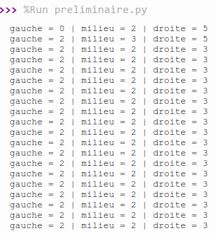
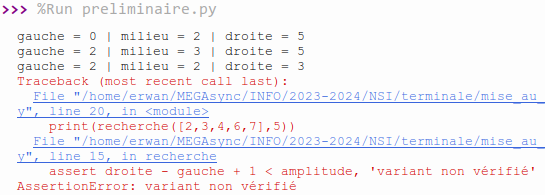
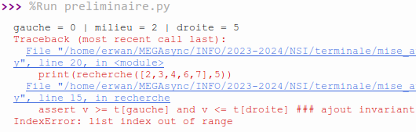

# Activité préliminaire

!!! quote "Source"
    Inspiré d'une activité du *Hachette NSI Terminale*.

## Ajouter des traces

La fonction suivante a été écrite par un élève de première suite à une consigne de son professeur pour implémenter l’**algorithme de recherche dichotomique**.

La **docstring**, présenté dans la fonction, spécifie ce qu'elle est censée faire.

```python
def recherche(t, v):
    ''' Renvoie l'indice de l'élément v dans le tableau t.
    Si l'élément n'est pas trouver, renvoie -1.
    :param t: (list) un tableau d'entiers
    :param v: (int) l'entier à chercher
    :return: (int) l'indice de l'élément s'il est trouvé, ou -1 sinon '''

    gauche = 0
    droite = len(t)
    while gauche < droite:
        milieu = (gauche+droite) // 2
        if t[milieu] < v:
            gauche = milieu
        else:
            droite = milieu
    return droite
```

!!! note "Exercice 1"
    1. Tester la fonction recherche avec le tableau `[2, 3, 4, 6, 7]` et la valeur **5**.
    Qu’observe-t-on ? La fonction est-elle **correcte** ?
    2. Ajouter des instructions `print` pour afficher les valeurs des variables au cours de l’exécution. Pour vous aider, vous pouvez également utiliser un `assert` pour tester l'**invariant**, ainsi qu'un `assert` pour tester le **variant**.  
    On rappelle l'**invariant** de la recherche dichotomique :  
    <span style="color:blue">« Si l'élément recherché `v` est présent dans le tableau, alors `v` est compris entre l'élément d'indice `gauche` et l'élément d'indice `droite` »</span>.  
    On peut écrire l'**assertion** vérifiant cet invariant de la manière suivante :  
    ```python
    assert v not in t or (v >= t[gauche] and v <= t[droite]) ### ajout invariant
    ```  
    Autrement dit, soit **`v` n'est pas dans le tableau**, soit (si `v` est dans le tableau) **`v` est compris entre les éléments d'indices `gauche` et `droite`**.  
    Pour ce qui est du **variant**, il s'agit de `droite - gauche + 1` (quantité **positive et strictement décroissante**). Il faut vérifier que cette quantité **diminue à chaque itération de la boucle**.

    3. Identifier la ou les erreurs à l’aide de ces traces et les corriger.

??? tip "Corrigé détaillé exercice 1"
    1. Lorsque l'on exécute la fonction telle qu'elle est donnée, on se rend compte que l'**exécution ne se termine pas**. On peut donc deviner que la boucle `while` itère indéfiniment.
    2. En ajoutant une instruction `print` pour voir le contenu des variables `gauche`, `milieu` et `droite`, on voit qu'à un certain stade, les valeurs de `gauche` et de `droite` ne changent plus, ainsi la **condition d'arrêt** du `while` n'est jamais rencontrée :  
      
    Si l'on teste notre variant `droite - gauche + 1` avec une **assertion**, en modifiant le code de la manière suivante :  
    ```python
    def recherche(t, v):
        gauche = 0
        droite = len(t)
        amplitude = droite - gauche + 1  # On stocke la valeur initiale du variant
        while gauche < droite:
            milieu = (gauche+droite) // 2
            print(f'gauche = {gauche} | milieu = {milieu} | droite = {droite}')
            if t[milieu] < v:
                gauche = milieu 
            else:
                droite = milieu
            assert droite - gauche + 1 < amplitude, 'variant non vérifié'
            amplitude = droite - gauche
        return droite
    ```
    En exécutant le programme, on obtient une `assertionError` : notre **variant n'est pas vérifié**, ce qui prouve donc que le programme **ne se termine pas**.  
      
    Par ailleurs, si on teste l'**invariant**, en rajoutant une **assertion** de la manière suivante :
    ```python
    def recherche(t, v):
    gauche = 0
    droite = len(t)
    amplitude = droite - gauche + 1  # On stocke la valeur initiale du variant
    while gauche < droite:
        milieu = (gauche+droite) // 2
        print(f'gauche = {gauche} | milieu = {milieu} | droite = {droite}')
        if t[milieu] < v:
            gauche = milieu 
        else:
            droite = milieu
        assert v >= t[gauche] and v <= t[droite] ### ajout invariant
        assert droite - gauche + 1 < amplitude, 'variant non vérifié'
        amplitude = droite - gauche
    return droite
    ```  
    On obtient l'erreur suivante :  
      
    La **valeur recherchée** doit toujours être comprise entre l'**élément d'indice** `gauche` et l'**élément d'indice** `droite`. Or, l'élément d'indice `droite` vaut initialement `len(t)`, alors que sa valeur devrait correspondre à l'indice du **dernier élément du tableau**, soit `len(t) - 1`, d'où l'erreur obtenue : `len(t)` ne correspond pas à un indice du tableau.
    3. Finalement, voici une liste des différentes erreurs que comporte la fonction donnée :
          1. `droite` doit être égal à l'**indice du dernier élément** du tableau, soit `len(t) - 1`
          2. Lorsque `t[milieu] < v` (l'élément recherché est **plus grand** que l'élément du milieu), on sait que l'on doit ré-effectuer la recherche dans la partie du tableau **à droite de l'élément du milieu**. Or, dans la fonction donnée, `gauche` prend la valeur de l'indice stocké dans `milieu`, alors que l'on sait que l'élément associé à l'indice `milieu` ne peut pas être l'élément recherché. `gauche` doit donc prendre la valeur de l'indice **juste à droite** de `milieu`, soit `milieu + 1`.
          3. Lorsque `t[milieu] > v` (l'élément recherché est **plus petit** que l'élément du milieu), on sait que l'on soit ré-effectuer la recherche dans la partie du tableau **à gauche de l'élément du milieu**. Donc, `droite` doit prendre la valeur de l'indice **juste à gauche** de `milieu`, soit `milieu - 1.`
          4. Actuellement, la boucle continue tant que `gauche < droite`. Or, on oublie le cas où `gauche = droite`, auquel cas on doit rester dans la boucle. On ne doit sortir de la boucle que lorsque `gauche > droite`. Ainsi, la condition du `while` doit devenir : `gauche <= droite`.
          5. On oublie de **traiter un cas** à l'intérieur du `while` : celui où l'élément `t[milieu]` correspond à l'élement `v` recherché : dans ce cas, selon la **docstring**, on doit **renvoyer l'indice de l'élément trouvé**, c'est à dire `milieu`.
          6. Enfin, lorsque l'on sort de la boucle `while`, c'est-à-dire lorsque l'élément recherche n'a **pas été trouvé**, la **docstring** indique que l'on doit renvoyer `-1`, et non pas l'indice stocké dans `droite`. Il faut en effet toujours faire en sorte que notre fonction respecte la spécification, c'est-à-dire qu'elle fait bien ce qui est attendu.

    Finalement, voici **la bonne implémentation** de cette fonction, après avoir corrigé toutes ces **erreurs**, ajouté des `print` pour afficher une **trace d'exécution**, ajouté une **assertion** pour le **variant** et pour l'**invariant** :  
    ```python
    def recherche(t, v):
        print(t, v) # TRACE
        gauche = 0
        droite = len(t) - 1
        amplitude = droite - gauche + 1  # On stocke la valeur initiale du variant
        while gauche <= droite:
            milieu = (gauche+droite) // 2
            print(f'gauche = {gauche} | milieu = {milieu} | droite = {droite}')
            if t[milieu] == v:
                return milieu
            elif t[milieu] < v:
                gauche = milieu + 1
            else:
                droite = milieu - 1
            assert v not in t or (v >= t[gauche] and v <= t[droite]) ### ajout invariant
            print(f'variant = {droite - gauche + 1}')
            assert droite - gauche + 1 < amplitude, 'variant non vérifié'
            amplitude = droite - gauche
        return -1
    ```

??? tip "Fonction finale uniquement exercice 1"
    Voici **la bonne implémentation** de cette fonction, après avoir corrigé toutes les **erreurs**, ajouté des `print` pour afficher une **trace d'exécution**, ajouté une **assertion** pour le **variant** et pour l'**invariant** :

    ```python
    def recherche(t, v):
        ''' Renvoie l'indice de l'élément v dans le tableau t.
        Si l'élément n'est pas trouver, renvoie -1.
        :param t: (list) un tableau d'entiers
        :param v: (int) l'entier à chercher
        :return: (int) l'indice de l'élément s'il est trouvé, ou -1 sinon '''

        print(t, v) # TRACE
        gauche = 0
        droite = len(t) - 1
        amplitude = droite - gauche + 1  # On stocke la valeur initiale du variant
        while gauche <= droite:
            milieu = (gauche+droite) // 2
            print(f'gauche = {gauche} | milieu = {milieu} | droite = {droite}')
            if t[milieu] == v:
                return milieu
            elif t[milieu] < v:
                gauche = milieu + 1
            else:
                droite = milieu - 1
            assert v not in t or (v >= t[gauche] and v <= t[droite]) ### ajout invariant
            print(f'variant = {droite - gauche + 1}')
            assert droite - gauche + 1 < amplitude, 'variant non vérifié'
            amplitude = droite - gauche
        return -1
    ```

## Utiliser un débogueur

L’implémentation suivante de l’algorithme de **tri par sélection** contient elle aussi des erreurs.

```python
def tri(t):
    ''' Effectue un tri par sélection en place du tableau entré.
    :param t: (list) Une liste d'éléments à trier
    :return: (None) On ne renvoie rien '''

    for i in range(len(t)):
        jmin = i
        for j in range(i, len(t)):
            if t[j] <= t[jmin]:
                jmin = j
        if jmin != i:
            t[i] = t[jmin]
            t[jmin] = t[i]
```

!!! note "Exercice 2"
    Nous allons utiliser un outil de mise au point appelé débogueur (ou debugger en anglais).

    1. Copier le programme ci-dessus dans l’éditeur de texte de **Thonny** et ajouter une instruction qui appelle la fonction tri avec le tableau `[4, 2, 6, 7, 1, 8]`.
    2. Exécuter le programme. Qu’observe-t-on ?
    3. Lancer le programme avec le **débogueur** de **Thonny** (l'icône juste à droite de celle permettant d'exécuter un script). Vous pouvez également mettre des **points d'arrêt** sur des lignes précises pour pouvoir exécuter votre programme normalement et ne l'arrêter qu'à ces points définis en vue du déboguage.  
    Un autre outil bien sympathique pour vous aider à déboguer un programme :material-arrow-right: [Python Tutor](https://pythontutor.com/){ target="_blank" }.
    4. Identifier la ou les erreurs à l’aide du débogueur et les corriger.