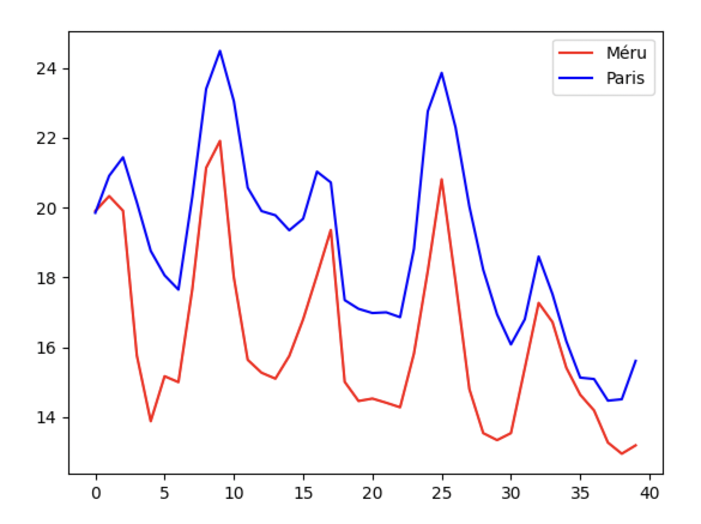

??? quote "Ressources"
    - [Les différents types d'API](https://www.free-work.com/fr/tech-it/blog/actualites-informatiques/types-dapi-quelles-sont-leurs-differences)

# Les API

Une **API** (Application Programming Interface) permet aux développeurs d'**intégrer** une application à une autre. Cela peut permettre par exemple de récupérer des données structurées depuis un site web pour les exploiter de manière automatisée dans un programme.

Il existe différents types d'API, notamment les **API Web** permettant d'**accéder à des données**.  
Pour ce type d'API, une méthode consiste à émettre une **requête HTTP** permettant de récupérer des **données** sur un serveur web.

Il existe différents formats structurants de données, notamment le format **XML** (proche du HTML) et le format **JSON**, qui sont devenus des standards.

Voici quelques exemples d'API :

- [https://openweathermap.org/api](https://openweathermap.org/api){ target="_blank" } - Diverses API concernant le climat et la météo,
- [https://openfoodfacts.org/data](https://openfoodfacts.org/data){ target="_blank" } - Base de données collaborative, libre et ouverte des produits alimentaires du monde entier,
- [https://openstreetmap.fr/](https://openstreetmap.fr/){ target="_blank" } - Un projet collaboratif de cartographie en ligne qui vise à constituer une base de données géographiques libre du monde, en utilisant le système GPS et d'autres données libres.

## Activité - Récupérer la météo dans un programme Python

Pour cette activité, on souhaite récupérer des données sur la **météo** de différentes villes en utilisant les données fournies par l'API de [openweathermap.org](https://openweathermap.org/){ target="_blank" }.

Plus précisément, on utilisera la **météo actuelle**, vous pouvez vous rendre sur [cette page](https://openweathermap.org/current){ target="_blank" } pour voir les différentes façons de faire un appel avec l'API. Vous pouvez notamment utiliser la **latitude**, la **longitude**, le **nom de la ville**, le **code postal**...  
**openweathermap** fournit des données en JSON, XML et HTML. Nous utiliserons ici le format **JSON**.

!!! success "À télécharger"
    - [meteo.py](src/meteo.py){ target="_blank" } : Programme initial à compléter

Le module `requests` de Python permet d'effectuer des **appels d'API** à l'aide de **requêtes HTTP**, et ainsi de de récupérer des données sur le web **au format JSON** et de les intégrer dans un **dictionnaire**.

!!! tip "Utilisation du programme"
    Ouvrez le script `meteo.py` dans **Thonny** (ou dans votre IDE préféré), puis exécutez-le.

    En appelant `get_weather('Paris')`, vous devriez obtenir quelque chose comme ceci :
    ```python
    {'coord': {'lon': 2.3488, 'lat': 48.8534}, 
    'weather': [{'id': 800, 'main': 'Clear', 'description': 'clear sky', 'icon': '01n'}], 
    'base': 'stations', 
    'main': {'temp': 23.67, 'feels_like': 24, 'temp_min': 20.32, 'temp_max': 24.52, 'pressure': 1024, 'humidity': 73}, 
    'visibility': 10000, 
    'wind': {'speed': 5.14, 'deg': 60}, 
    'clouds': {'all': 0}, 
    'dt': 1693777827, 
    'sys': {'type': 2, 'id': 2041230, 'country': 'FR', 'sunrise': 1693717783, 'sunset': 1693765857}, 
    'timezone': 7200, 
    'id': 2988507, 
    'name': 'Paris', 
    'cod': 200}
    ```

!!! tip "Remarque 1 : Les f-strings"
    Lorsque vous souhaitez intégrer la valeur d'une variable à une chaîne de caractères, vous avez sans doute l'habitude d'utiliser la **concaténation** (avec le symbole `+`).  
    Par exemple :

    ```python
    >>> prenom = 'Erwan'
    >>> 'Bonjour ' + prenom + ' !'
    'Bonjour Erwan !'
    ```

    Dans la fonction `get_weather` de notre programme, vous pouvez voir la ligne suivante (ligne **12**):
    ```python
    url = f"https://api.openweathermap.org/data/2.5/weather?q={ville},{PAYS}&appid={API_KEY}&units=metric"
    ```

    Ici, la chaîne de caractères créée est un peu particulière : il s'agit d'une **f-string**.  
    Une **f-string** permet d'intégrer facilement des variables à une chaîne de caractères. Il suffit de rajouter un `f` devant la chaîne de caractères, puis de mettre le nom des variables entre accolades. De cette manière, les noms des variables entre accolades seront remplacés par la **valeur** qui leur est associée.

    En reprenant l'exemple précédent :

    ```python
    >>> prenom = 'Erwan'
    >>> f'Bonjour {prenom} !'
    'Bonjour Erwan !'
    ```

!!! tip "Remarque 2 : Les annotations de types"
    Chaque fonction de notre fichier `meteo.py` utilise ce que l'on appelle des **annotations de types**. Par exemple, si l'on regarde l'en-tête de la fonction `get_weather` :

    ```python
    def get_weather(ville: str) -> dict:
    ```

    Ici, on indique que la paramètre `ville` doit être de type `str` (une **chaîne de caractères**), et que la fonction doit **renvoyer** un **dictionnaire**. Il s'agit simplement d'une **indication** qui n'a aucun effet sur l'exécution du programme.

    On aurait pu, à la place, donner ces indications dans la **docstring**, par exemple :

    ```python
    def get_weather(ville: str) -> dict:
        ''' Renvoie un dictionnaire contenant les données sur la météo actuelle de la ville entrée.
        :param ville: (str) Le nom de la ville dont on souhaite obtenir la météo
        :return: (dict) Le dictionnaire contenant les données sur la météo
        '''
    ```

    Si l'on regarde l'en-tête de notre fonction `get_temp_from_lat_long` :
    
    ```python
    def get_temp_from_lat_long(lat: float, long: float) -> None:
    ```
    
    On peut voir qu'elle doit renvoyer un objet de type `None` : autrement dit, elle ne **doit rien renvoyer**. (Effectivement, il s'agit d'une fonction qui doit simplement **afficher** quelque chose. Les fonctions qui ne renvoient rien peuvent également être appelées **procédures**.)

!!! note "Exercice 1"
    Complétez la fonction `temperature_ressentie`, réutilisant la fonction `get_weather`, permettant d'**afficher** la **température ressentie** (*feels_like*) dans une **ville** donnée en **entrée**.  
    Le **message affiché** doit être de la forme `Température ressentie à Paris : 15.72 °C.` si l'on donne en entrée `"Paris"` à la fonction.

!!! tip "Rappel"
    En bas du script, vous pouvez voir le bloc de code suivant :
    ```python
    if __name__ == '__main__':
        ''' Instructions exécutées si l'on exécute ce fichier directement '''
    
        pass
    ```

    Les instructions saisies dans ce bloc ne seront prises en compte que si le script est exécuté directement. Si `meteo.py` est importé dans un autre script, ces instructions seront ignorées.

!!! note "Exercice 2"
    En vous inspirant des deux fonctions précédentes, complétez la fonction `get_temp_from_lat_long` permettant d'**afficher** la **température** (*temp*) d'un lieu localisé par sa valeur de **latitude** et de **longitude** (voir [documentation](https://openweathermap.org/current){ target="_blank" } si besoin).

    Faites le test avec `lat = 49.23588940429046, long = 2.135797340968115` (localisation de Méru).

    Dans votre **url** utilisée pour l'**appel**, vous utiliserez la **clé d'API** contenue dans la **variable globale** `API_KEY`.

???+ tip "Température en degrés celsius"
    Par défaut, les températures obtenues sont en **degrés Kelvin**. Si vous souhaitez obtenir les températures en **degrés Celsius**, il faut indiquer dans la requête HTTP que l'on souhaite utiliser le **système métrique**.

    Pour cela, il faut ajouter le paramètre `units` avec la valeur `metric` à votre requête. Autrement dit, à la fin de votre **URL**, vous devez ajouter `&units=metric` (le `&` permet de faire la séparation avec le paramètre précédent).

---

On souhaite maintenant obtenir les **prévisions météo** d'une ville de manière à **afficher une courbe d'évolution** de la **température** (*temp*) prévue.  
L'API permet d'obtenir les prévisions des **5 prochains jours**, à raison **d'une mesure toutes les 3 heures**. La page documentant les **appels d'API** permettant d'obtenir ces prévisions est la suivante : [https://openweathermap.org/forecast5](https://openweathermap.org/forecast5){ target="_blank" }.

Ainsi, on obtiendra une liste de **40 mesures**, la première mesure correspondant aux données sur la météo à l'heure actuelle, la deuxième mesure correspondant à la météo prévue **dans 3 heures**, la troisième à celle prévue **dans 6 heures**, et ainsi de suite...

Si l'on regarde un exemple de réponse de l'API :

??? quote "Exemple de réponse de l'API"
    ```json
    {
    "cod": "200",
    "message": 0,
    "cnt": 40,
    "list": [
        {
        "dt": 1661871600,
        "main": {
            "temp": 296.76,
            "feels_like": 296.98,
            "temp_min": 296.76,
            "temp_max": 297.87,
            "pressure": 1015,
            "sea_level": 1015,
            "grnd_level": 933,
            "humidity": 69,
            "temp_kf": -1.11
        },
        "weather": [
            {
            "id": 500,
            "main": "Rain",
            "description": "light rain",
            "icon": "10d"
            }
        ],
        "clouds": {
            "all": 100
        },
        "wind": {
            "speed": 0.62,
            "deg": 349,
            "gust": 1.18
        },
        "visibility": 10000,
        "pop": 0.32,
        "rain": {
            "3h": 0.26
        },
        "sys": {
            "pod": "d"
        },
        "dt_txt": "2022-08-30 15:00:00"
        },
        {
        "dt": 1661882400,
        "main": {
            "temp": 295.45,
            "feels_like": 295.59,
            "temp_min": 292.84,
            "temp_max": 295.45,
            "pressure": 1015,
            "sea_level": 1015,
            "grnd_level": 931,
            "humidity": 71,
            "temp_kf": 2.61
        },
        "weather": [
            {
            "id": 500,
            "main": "Rain",
            "description": "light rain",
            "icon": "10n"
            }
        ],
        "clouds": {
            "all": 96
        },
        "wind": {
            "speed": 1.97,
            "deg": 157,
            "gust": 3.39
        },
        "visibility": 10000,
        "pop": 0.33,
        "rain": {
            "3h": 0.57
        },
        "sys": {
            "pod": "n"
        },
        "dt_txt": "2022-08-30 18:00:00"
        },
        {
        "dt": 1661893200,
        "main": {
            "temp": 292.46,
            "feels_like": 292.54,
            "temp_min": 290.31,
            "temp_max": 292.46,
            "pressure": 1015,
            "sea_level": 1015,
            "grnd_level": 931,
            "humidity": 80,
            "temp_kf": 2.15
        },
        "weather": [
            {
            "id": 500,
            "main": "Rain",
            "description": "light rain",
            "icon": "10n"
            }
        ],
        "clouds": {
            "all": 68
        },
        "wind": {
            "speed": 2.66,
            "deg": 210,
            "gust": 3.58
        },
        "visibility": 10000,
        "pop": 0.7,
        "rain": {
            "3h": 0.49
        },
        "sys": {
            "pod": "n"
        },
        "dt_txt": "2022-08-30 21:00:00"
        },
        ....
        {
        "dt": 1662292800,
        "main": {
            "temp": 294.93,
            "feels_like": 294.83,
            "temp_min": 294.93,
            "temp_max": 294.93,
            "pressure": 1018,
            "sea_level": 1018,
            "grnd_level": 935,
            "humidity": 64,
            "temp_kf": 0
        },
        "weather": [
            {
            "id": 804,
            "main": "Clouds",
            "description": "overcast clouds",
            "icon": "04d"
            }
        ],
        "clouds": {
            "all": 88
        },
        "wind": {
            "speed": 1.14,
            "deg": 17,
            "gust": 1.57
        },
        "visibility": 10000,
        "pop": 0,
        "sys": {
            "pod": "d"
        },
        "dt_txt": "2022-09-04 12:00:00"
        }
    ],
    "city": {
        "id": 3163858,
        "name": "Zocca",
        "coord": {
        "lat": 44.34,
        "lon": 10.99
        },
        "country": "IT",
        "population": 4593,
        "timezone": 7200,
        "sunrise": 1661834187,
        "sunset": 1661882248
    }
    }
    ```

On peut voir qu'une **liste Python** est associée à la clé `list` du dictionnaire principal obtenu. Ce tableau contient lui-même **40 dictionnaires**, chacun correspondant à une mesure de la météo.

Voici un exemple de graphe affichant la comparaison entre l'évolution de la température de la ville de **Paris** et celle de la ville de **Méru**, sur les 5 prochains jours :

<figure markdown>
  { width="500px" }
  <figcaption>Courbes d'évolution des températures</figcaption>
</figure>

!!! note "Exercice 3"
    Complétez la fonction `compare_two_cities` prenant deux noms de villes en entrée, et affichant un graphe contenant les courbes d'évolution de la température de ces deux villes.

    Faites le test avec deux villes de votre choix.

    Pour procéder, vous pouvez découper votre travail en **3 étapes** :

    <u>**Étape 1**</u> : Récupérer les **dictionnaires** contenant les **données** sur la **ville 1** et sur la **ville 2**. Pour vous aider (et parce qu'on manipule des objets, notion qui n'a pas encore été étudiée), je vous donne le code permettant de récupérer et de stocker ces données dans une variable `r1` pour la ville 1 et `r2` pour la ville 2 :

    ```python
        url1 = f"https://api.openweathermap.org/data/2.5/forecast?q={ville1},{PAYS}&appid={API_KEY}&units=metric"
        url2 = f"https://api.openweathermap.org/data/2.5/forecast?q={ville2},{PAYS}&appid={API_KEY}&units=metric"
        r1 = requests.get(url1).json()  # r1 contient le dictionnaire contenant les données sur la ville 1
        r2 = requests.get(url2).json()  # r2 contient le dictionnaire contenant les données sur la ville 2
    ```

    <u>**Étape 2**</u> : Créer **deux tableaux** contenant respectivement les **40 températures** de la **ville 1** et les **40 températures** de la **ville 2**. Vous pouvez (mais ce n'est pas obligatoire) pour cela utiliser la méthode de création de **listes par compréhension**.
   
    On rappelle que les données sur les 40 mesures d'une ville sont contenues dans 40 dictionnaires, eux-mêmes contenus dans une **liste** associée à la clé `list` du dictionnaire principal.

    Pour revoir un exemple de réponse de l'API pour vous aider, vous pouvez dérouler le bloc suivant :

    ??? quote "Exemple de réponse de l'API"
        ```json
        {
        "cod": "200",
        "message": 0,
        "cnt": 40,
        "list": [
            {
            "dt": 1661871600,
            "main": {
                "temp": 296.76,
                "feels_like": 296.98,
                "temp_min": 296.76,
                "temp_max": 297.87,
                "pressure": 1015,
                "sea_level": 1015,
                "grnd_level": 933,
                "humidity": 69,
                "temp_kf": -1.11
            },
            "weather": [
                {
                "id": 500,
                "main": "Rain",
                "description": "light rain",
                "icon": "10d"
                }
            ],
            "clouds": {
                "all": 100
            },
            "wind": {
                "speed": 0.62,
                "deg": 349,
                "gust": 1.18
            },
            "visibility": 10000,
            "pop": 0.32,
            "rain": {
                "3h": 0.26
            },
            "sys": {
                "pod": "d"
            },
            "dt_txt": "2022-08-30 15:00:00"
            },
            {
            "dt": 1661882400,
            "main": {
                "temp": 295.45,
                "feels_like": 295.59,
                "temp_min": 292.84,
                "temp_max": 295.45,
                "pressure": 1015,
                "sea_level": 1015,
                "grnd_level": 931,
                "humidity": 71,
                "temp_kf": 2.61
            },
            "weather": [
                {
                "id": 500,
                "main": "Rain",
                "description": "light rain",
                "icon": "10n"
                }
            ],
            "clouds": {
                "all": 96
            },
            "wind": {
                "speed": 1.97,
                "deg": 157,
                "gust": 3.39
            },
            "visibility": 10000,
            "pop": 0.33,
            "rain": {
                "3h": 0.57
            },
            "sys": {
                "pod": "n"
            },
            "dt_txt": "2022-08-30 18:00:00"
            },
            {
            "dt": 1661893200,
            "main": {
                "temp": 292.46,
                "feels_like": 292.54,
                "temp_min": 290.31,
                "temp_max": 292.46,
                "pressure": 1015,
                "sea_level": 1015,
                "grnd_level": 931,
                "humidity": 80,
                "temp_kf": 2.15
            },
            "weather": [
                {
                "id": 500,
                "main": "Rain",
                "description": "light rain",
                "icon": "10n"
                }
            ],
            "clouds": {
                "all": 68
            },
            "wind": {
                "speed": 2.66,
                "deg": 210,
                "gust": 3.58
            },
            "visibility": 10000,
            "pop": 0.7,
            "rain": {
                "3h": 0.49
            },
            "sys": {
                "pod": "n"
            },
            "dt_txt": "2022-08-30 21:00:00"
            },
            ....
            {
            "dt": 1662292800,
            "main": {
                "temp": 294.93,
                "feels_like": 294.83,
                "temp_min": 294.93,
                "temp_max": 294.93,
                "pressure": 1018,
                "sea_level": 1018,
                "grnd_level": 935,
                "humidity": 64,
                "temp_kf": 0
            },
            "weather": [
                {
                "id": 804,
                "main": "Clouds",
                "description": "overcast clouds",
                "icon": "04d"
                }
            ],
            "clouds": {
                "all": 88
            },
            "wind": {
                "speed": 1.14,
                "deg": 17,
                "gust": 1.57
            },
            "visibility": 10000,
            "pop": 0,
            "sys": {
                "pod": "d"
            },
            "dt_txt": "2022-09-04 12:00:00"
            }
        ],
        "city": {
            "id": 3163858,
            "name": "Zocca",
            "coord": {
            "lat": 44.34,
            "lon": 10.99
            },
            "country": "IT",
            "population": 4593,
            "timezone": 7200,
            "sunrise": 1661834187,
            "sunset": 1661882248
        }
        }
        ```

    <u>**Étape 3**</u> : Enfin, il ne reste plus qu'à créer les deux courbes avec la fonction `plot`, puis à les afficher avec la fonction `show` de **pyplot**. Voir [documentation de pyplot](http://www.python-simple.com/python-matplotlib/pyplot.php){ target="_blank" }.

    Vous devrez donc appeler deux fois la fonction `plot`, en donnant les tableaux créés précédemment en entrées.

!!! tip "Aide Pyplot"
    Vous pouvez consulter [cette page](http://www.python-simple.com/python-matplotlib/pyplot.php){ target="_blank" } pour des rappels concernant le module **pyplot** contenu dans la bibliothèque **Matplotlib**. N'oubliez pas d'importer le module dans votre script s'il ne l'est pas, en rajoutant cette ligne au début de votre script :
    
    ```python
    from matplotlib import pyplot
    ```

    **Si le module n'est pas installé sur votre machine, vous devez l'installer**. Pour cela, dans Thonny, cliquez sur "Outils" puis sur "Gérer les paquets", puis recherchez et installez le paquet **Matplotlib**.

    En l'occurence, vous n'aurez besoin que des fonctions `plot` et `show`, et éventuellement de `legend` si vous souhaitez afficher des légendes.