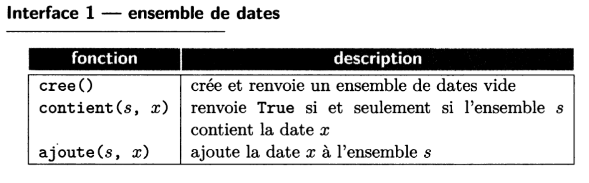

# Gestion de modules

Comme vu dans le chapitre précédent, le travail sur les **API** a été grandement facilité par l'utilisation du module `requests` de Python, qui a fait une bonne partie du travail pour nous. Sans avoir eu à inspecter le code de ce module, nous avons pu l'utiliser facilement et avons ainsi évité de longues heures de développement pour obtenir le même résultat.

Lorsque le code d’un programme devient **volumineux**, il devient difficile de le **mettre au point**, c’est-à-dire de corriger ses **bugs** et de le maintenir, de le faire évoluer, notamment pour intégrer de nouvelles fonctionnalités.

Il est alors indispensable de le découper en plusieurs parties aussi indépendantes que possible les unes des autres. La plupart des programmes sont ainsi découpés en plusieurs **modules**, on parle de **programmation modulaire**.

On peut alors tester **chaque module indépendamment** (tests unitaires), et tester les modules ensemble (tests d’intégration), nous reviendrons sur les tests plus tard. La modularité facilite également la **réutilisation** : un module bien conçu peut être utilisé par d’autres programmes et mis à disposition de la communauté.

Les modules Python permettent ainsi d'enrichir le langage de nouvelles **fonctionnalités** et de nouveaux **objets réutilisables facilement**.

## Importer un module

Un module s'**importe** par son **nom**, qui correspond au **nom du fichier Python** privé de l'extension **.py**.

Par exemple, le module `random` qui regroupe des fonctions en lien avec l'aléatoire (randint, choice, shuffle, ...) peut être appelé de la manière suivante :

```python
import random
```

Le contenu du module est alors importé dans un **espace de noms**, ici "random". Si l'on souhaite par exemple appeler la fonction `randint`, on écrira donc :

```python
alea = random.randint(1,5)
```

On peut également utiliser un **espace de noms différent** :

```python
import random as rd
alea = rd.randint(1,5)
```
Cela permet de rendre l'appel plus concis et d'éviter que des méthodes qui auraient le même nom se court-circuitent.

Une autre manière de faire est d'utiliser le symbole `*` pour **tout importer** depuis un module :

```python
from random import *
alea = randint(1,6)
```

!!! warning "Attention !"
    En utilisant cette méthode, il y a un risque de conflit si le module contient des fonctions portant le même nom que d'autres fonctions déjà existantes.

Si l'on souhaite simplement, par exemple, importer la fonction `randint` et la fonction `choices` du module `random`, on peut écrire :

```python
from random import randint, choices
alea = randint(1,6)
alea_lst = choices[1,2,4,3,7]
```

## Obtenir de l'aide sur une fonction

Un module s'apparente à une **boîte noire**, on a donc en général pas le code des fonctions sous les yeux, d'où l'intérêt d'une **bonne documentation**.

La **spécification d'une fonction** permet d'informer les **utilisateurs** des tâches effectuées par cette fonction, des contraintes imposées sur les paramètres, des résultats attendus, (éventuellement) des erreurs affichées en cas de mauvaise utilisation...

On utilise pour cela une **docstring** (commentaire sur plusieurs lignes) qui :

* décrit ce que fait de la fonction.
* précise les **paramètres d'entrée** et leur **type**
* précise la **valeur de sortie** et son **type**
* éventuellement :
    * spécifie les **conditions d'utilisation** (préconditions) d'une fonction.
    * indique les **effets de bord** d'une fonction.
    * propose des **exemples d'utilisation** d'une fonction.
    * indique les **erreurs levées** en cas de mauvaise utilisation...
    * etc.

Voici un exemple avec une fonction `produit` qio calcule le produit de deux entiers `a` et `b` :

```python
def produit(a, b):
    ''' Fonction qui renvoie le produit de a et b.
    :CU: type(a) == type(b) == int
    :param a: (int) Un entier
    :param b: (int) Un autre entier
    :return: (int) Le produit de a et b
    
    :Exemple:
    >>> produit(4, 6)
    24
    '''
    assert type(a) == type(b) == int
    res = 0
    for _ in range(b):
        res += a
    assert res == a*b
    return res
```

??? tip "Rappels annotations de types"
    On peut également indiquer les **types des paramètres** de fonctions sous la forme d'**annotations de types**, plutôt que de les spécifier dans la docstring. Une fonction `produit` qui calcule le produit de deux entiers `a` et `b` pourrait donc être présentée ainsi :

    ```python
    def produit(a, b):
        ''' Fonction qui renvoie le produit de a et b.
        :param a: (int) Un entier
        :param b: (int) Un autre entier
        :return: (int) Le produit de a et b
        
        :Exemple:
        >>> produit(4, 6)
        24
        '''
        [...]
    ```

    ou

    ```python
    def produit(a: int, b: int) -> int:
        ''' Fonction qui renvoie le produit de deux entiers a et b.
        
        :Exemple:
        >>> produit(4, 6)
        24
        '''
        [...]
    ```

La fonction `help` de **Python** permet d'obtenir la documentation des modules et fonctions.  
Par exemple, les instructions suivantes permettent d'afficher toute la documentation du module `random` (*classes*, *méthodes*, *fonctions*...) :

```python
>>> import random
>>> help(random)
```

De plus, le module **pydoc** permet de **générer de la documentation** à partir de **docstrings**.

`pydoc <nom_classe>` : Afficher la documentation sur terminal<br />
`pydoc -w <nom_classe>` : Générer un fichier HTML

!!! note "À vous de jouer"
    À l'aide de la fonction `help`, déterminez à quoi sert la fonction `randrange` du module `random`, le nombre et le nom de ses paramètres. Combien y a t-il de paramètres **obligatoires** ? **Facultatifs** ?

!!! info "Note"
    On parle ici de "fonctions", mais en réalité on devrait plutôt parler de "méthodes", c'est-à-dire de fonctions contenues dans des "classes". Tout cela sera abordé lors du chapitre sur la **programmation orientée objet** (POO).


## Activité - Créer un module

Vous allez créer un module permettant d'effectuer un certain nombre d'opérations sur des **listes d'entiers**.

!!! success "À télécharger"
    - [operations.py](src/operations.py){ target="_blank" } - Module permettant d'effectuer des opérations sur des listes.
    - [main.py](src/main.py){ target="_blank" } - Programme principal

!!! note "Exercice 1"
    Complétez le corps des fonctions `sum_lst`, `min_lst` et `max_lst` permettant de renvoyer respectivement la somme des éléments, l'élément minimal et l'élément maximal d'une liste d'entiers passée en argument. Complétez également le corps de la fonction `ajouter_debut` permettant d'ajouter un élément au début d'une liste.

!!! note "Exercice 2"
    Ouvrez le script nommé `main.py`, et y importer le module `operations`.

    Compléter la fonction `to_bin` permettant de transformer un entier en nombre binaire stocké sous la forme d'une liste de **0** et de **1**. Vous utiliserez pour cela la fonction `ajouter_debut` définie dans le module `operations`.

!!! note "Exercice 3"
    Complétez la fonction `moyenne` permettant de calculer la moyenne des éléments d'une liste, en utilisant la fonction `sum_lst` de `operations`.

## La notion d'interface

!!! quote "Extrait du *Balabonski Terminale*"
    Pour chaque module, on distingue:

    - sa **réalisation** (on dit aussi souvent **implémentation**), c'est-à-dire le code lui-même, et 
    - son **interface**, consistant en une énumération des fonctions définies dans le module qui sont destinées à être utilisées dans la réalisation d'autres modules, appelés clients. 

    L'interface d'un module est liée à sa documentation, et doit notamment expliciter ce qu'un utilisateur a besoin de connaître des fonctions proposées: comment et pour quoi les utiliser. Pour chaque fonction de l'interface, on a ainsi besoin de son nom, de la liste de ses paramètres et de sa spécification, c'est-à-dire les conditions auxquelles la fonction peut être appliquée et les résultats à attendre. Des informations supplémentaires concernant des caractéristiques comme le temps d'exécution ou l'espace mémoire requis peuvent également être utiles.

    L'objectif est que ces fonctions incluses dans l'interface soient suffisantes pour permettre à un utilisateur de faire appel aux fonctionnalités du module, et qu'elles puissent être utilisées sans avoir besoin d'aller consulter le code du module. L'interface peut être décrite comme une abstraction du module: une description de ce qui caractérise le module, mais faite à un niveau assez haut, ignorant les détails concrets de la réalisation. La documentation de l'interface peut être vue comme un contrat entre l'auteur d'un module et ses utilisateurs, qui simplifie l'utilisation du module en limitant le nombre de choses qu'il faille lire, comprendre et mémoriser pour utiliser le module.

    Voici un exemple d'interface :

    

!!! abstract "Notion d'encapsulation"
    Le contrat qu'une **interface** établit entre l'utilisateur et l'auteur d'un module porte sur les **résultats**, et non pas sur les **moyens** mis en oeuvre : il est notamment libre d'introduire des fonctions, variables, constantes, ..., qui ne sont **pas incluses** dans l'**interface**. On parle alors de fonctions, variables, constantes **encapsulées** dans le module. (On reviendra sur cette notion d'encapsulation dans la partie sur la **POO**.)

    En Python, l'auteur d'un module peut indiquer que certains éléments sont **privés** (c'est-à-dire encapsulés) en faisant commencer leur nom par un caractère `_`. Toutefois, contrairement à d'autres langages, en **Python**, on ne peut pas réellement empêcher l'utilisation de données "privées". Il s'agit plus d'une indication tacite à destination de l'utilisateur, que celui-ci doit respecter pour garantir le bon fonctionnement du module.

!!! note "À vous de jouer !"
    Voici une **interface** permettant de **créer et manipuler des dictionnaires** :

    | fonction         | description                                                  |
    | ---------------- | ------------------------------------------------------------ |
    | `cree()`         | crée et renvoie un dictionnaire vide                         |
    | `cle(d, k)`      | renvoie `True` si et seulement si le dictionnaire `d`contient la clé `k`. |
    | `lit(d, k)`      | renvoie la valeur associée à la clé `k` dans le dictionnaire `d`, et `None` si la clé `k` n'apparait pas. |
    | `ecrit(d, k, v)` | ajoute au dictionnaire `d` l'association entre la clé `k` et la valeur `v`, en remplaçant une éventuelle association déjà présente pour `k`. |

    **Implémentez un module** `dictionnaire` qui correspond à cette interface.
