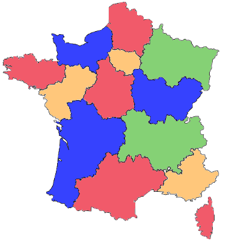

# Interrogation sur la POO corrigée

??? quote "Sujet au format PDF"
    <center>
    [Cliquez ici pour télécharger le sujet en PDF](exercices/interro_POO.pdf){ style="font-size:1.3em;" }
    </center>

!!! abstract ""
    Un *pays* est composé de différentes *régions*. Deux régions sont **voisines** si elles ont au moins **une frontière** en commun. L’objectif est d’attribuer une **couleur** à chaque *région* sur la carte du *pays* sans que deux *régions* voisines aient la même couleur et en utilisant le moins de couleurs possibles.

    La **figure 1** ci-dessous donne un exemple de résultat de coloration des régions de la France métropolitaine.

    <figure markdown="span">
    
    <figcaption>Figure 1: Carte coloriée des régions de France métropolitaine</figcaption>
    </figure>

!!! info "Rappels"
    On rappelle quelques **fonctions** et **méthodes** des **tableaux** (le type `list` en Python) qui pourront être utilisées dans cet exercice :

    - `len(tab)` : renvoie le nombre d’éléments du tableau `tab` ;
    - `tab.append(elt)` : ajoute l’élément `elt` en fin de tableau `tab` ;
    - `tab.remove(elt)` : enlève la première occurrence de `elt` de `tab` si `elt` est dans `tab`. Provoque une erreur sinon.

    Exemple :

    - `len([1, 3, 12, 24, 3])` renvoie `5` ;
    - avec `tab = [1, 3, 12, 24, 3]`, l’instruction `tab.append(7)` modifie `tab` en `[1, 3, 12, 24, 3, 7]` ;
    - avec `tab = [1, 3, 12, 24, 3]`, l’instruction `tab.remove(3)` modifie `tab` en `[1, 12, 24, 3]`.

## Partie 1

On considère la classe `Region` qui modélise une région sur une carte et dont le début de l’implémentation est :

```python
class Region:
    " " " Modélise une région d'un pays sur une carte." " "

    def __init__(self, nom_region):
        '''
        initialise une région
        : param nom_region (str) le nom de la région
        '''
        self.nom = nom_region
        # tableau des régions voisines, vide au départ
        self.tab_voisines = []
        # tableau des couleurs disponibles pour colorier la région
        self.tab_couleurs_disponibles = ['rouge', 'vert', 'bleu', 'jaune', 
        'orange', 'marron']
        # couleur attribuée à la région et non encore choisie au départ
        self.couleur_attribuee = None
```
!!! note "Question 1"
    Associer, en vous appuyant sur l’extrait de code précédent, les noms `nom`, `tab_voisines`, `tab_couleurs_disponibles` et `couleur_attribuee` au terme qui leur correspond parmi : *objet*, *attribut*, *méthode* ou *classe*.

??? tip "Réponse question 1"
    `nom`, `tab_voisines`, `tab_couleurs_disponibles` et `couleur_attribuee` sont des ==**attributs**== de la classe `Region`.

!!! note "Question 2"
    Indiquer le type du paramètre `nom_region` de la méthode `__init__` de la classe `Region`.

??? tip "Réponse question 2"
    `nom_region` est de type `str` (==**chaîne de caractères**==).

!!! note "Question 3"
    Donner une instruction permettant de créer une instance nommée `ge` de la classe `Region` correspondant à la région dont le nom est « Grand Est ».

??? tip "Réponse question 3"
    Voici l'instruction à saisir pour créer un nouvel objet `ge` de type `Region` représentant la région « Grand Est » :

    ```python
    ge = Region(“Grand Est”)
    ```

!!! note "Question 4"
    Recopier et compléter la ligne 6 de la méthode de la classe `Region` ci-dessous :

    ```python
    def renvoie_premiere_couleur_disponible(self):
        '''
        Renvoie la première couleur du tableau des couleurs disponibles supposé non vide.
        : return (str)
        '''
        return ...
    ```

??? tip "Réponse question 4"
    On récupère la **première couleur** dans le tableau de l'attribut `tab_couleurs_disponibles` de la région référencée par `self` :

    ```python
    def renvoie_premiere_couleur_disponible(self):
        '''
        Renvoie la première couleur du tableau des couleurs disponibles supposé non vide.
        : return (str)
        '''
        return self.tab_couleurs_disponibles[0]
    ```

!!! note "Question 5"
    Recopier et compléter la ligne 6 de la méthode de la classe `Region` ci-dessous :

    ```python
    def renvoie_nb_voisines(self) :
        '''
        Renvoie le nombre de régions voisines.
        : return (int)
        '''
        return ...
    ```

??? tip "Réponse question 5"
    On récupère le **nombre d'éléments** dans le tableau de l'attribut `tab_voisines` de la région référencée par `self` :

    ```python
    def renvoie_nb_voisines(self) :
        '''
        Renvoie le nombre de régions voisines.
        : return (int)
        '''
        return len(self.tab_voisines)
    ```

!!! note "Question 6"
    Compléter la méthode de la classe `Region` ci-dessous à partir de la ligne 6 :

    ```python
    def est_coloriee(self):
        '''
        Renvoie True si une couleur a été attribuée à cette région et False sinon.
        : return (bool)
        '''
        ...
    ```

??? tip "Réponse question 6"
    On peut l'écrire **en une ligne** :

    ```python
    def est_coloriee(self):
        '''
        Renvoie True si une couleur a été attribuée à cette région et False sinon.
        : return (bool)
        '''
        return self.couleur_attribuee != None
    ```

    Cela revient exactement au même que d'écrire :

    ```python
    def est_coloriee(self):
        '''
        Renvoie True si une couleur a été attribuée à cette région et False sinon.
        : return (bool)
        '''
        if self.couleur_attribuee != None:
            return True
        else:
            return False
    ```

!!! note "Question 7"
    Compléter la méthode de la classe `Region` ci-dessous à partir de la ligne 8 :

    ```python
    def retire_couleur(self , couleur):
        '''
        Retire couleur du tableau de couleurs disponibles de la région si elle est dans ce tableau. Ne fait rien sinon.
        : param couleur (str)
        : ne renvoie rien
        : effet de bord sur le tableau des couleurs disponibles
        '''
        ...
    ```

??? tip "Réponse question 7"
    Il faut d'abord vérifier que la couleur `couleur` soit dans le tableau `tab_couleurs_disponibles`, et si c'est le cas, on la supprime du tableau :

    ```python
    def retire_couleur(self , couleur):
        '''
        Retire couleur du tableau de couleurs disponibles de la région si elle est dans ce tableau. Ne fait rien sinon.
        : param couleur (str)
        : ne renvoie rien
        : effet de bord sur le tableau des couleurs disponibles
        '''
        if couleur in self.tab_couleurs_disponibles:
            self.tab_couleurs_disponibles.remove(couleur)
    ```

!!! note "Question 8"
    Compléter la méthode de la classe `Region` ci-dessous, à partir de la ligne 7, <u>en utilisant une boucle</u> :

    ```python
    def est_voisine(self , region):
        '''
        Renvoie True si la region passée en paramètre est une voisine et False sinon.
        : param region (Region)
        : return (bool)
        '''
        ...
    ```

??? tip "Réponse question 8"
    Attention, il est bien indiqué dans la consigne d'==**utiliser une boucle**==. Autrement, on aurait pu simplement écrire `return region in self.tab_voisines`.

    On va donc **parcourir** le tableau `tab_voisines` des régions voisines de la région référencée par `self`, puis à l'aide d'une condition `if ...`, on renverra `True` si l'une des régions voisines de `self` est la région `region`.  
    Si après avoir parcouru tout le tableau on a pas trouvé la région `region`, on renverra `False`.  
    Attention, il faut donc renvoyer `False` ==**après la boucle**==, quand tout le parcours est terminé.

    ```python
    def est_voisine(self , region):
        '''
        Renvoie True si la region passée en paramètre est une voisine et False sinon.
        : param region (Region)
        : return (bool)
        '''
        for r in self.tab_voisines:
            if r == region:
                return True
        return False
    ```

## Partie 2

Dans cette partie :

- on considère qu’on dispose d’un ensemble d’*instances* de la classe `Region` pour lesquelles l’attribut `tab_voisines` a été renseigné ;
- on pourra utiliser les *méthodes* de la classe `Region` évoquées dans les questions de la partie 1 :
    - `renvoie_premiere_couleur_disponible`
    - `renvoie_nb_voisines`
    - `est_coloriee`
    - `retire_couleur`
    - `est_voisine`

On a créé une classe `Pays` :

- cette classe modélise la carte d’un pays composé de régions ;
- l’unique attribut `tab_regions` de cette classe est un tableau (type `list` en Python) dont les éléments sont des instances de la classe `Region`.

!!! note "Question 9"
    Recopier et compléter la méthode de la classe `Pays` ci-dessous à partir de la ligne 7 :

    ```python
    def renvoie_tab_regions_non_coloriees(self):
        '''
        Renvoie un tableau dont les éléments sont les régions du pays sans couleur attribuée.
        : return (list) tableau d'instances de la classe Region
        '''
        ...
    ```

??? tip "Réponse question 9"

    ```python
    def renvoie_tab_regions_non_coloriees(self):
        '''
        Renvoie un tableau dont les éléments sont les régions du pays sans couleur attribuée.
        : return (list) tableau d'instances de la classe Region
        '''
        tab_r = []                    # créer un tableau initialement vide
        for r in self.tab_regions:    # pour chaque région du pays self
            if not r.est_coloriee():  # si la région n'est pas coloriée
                tab_r.append(r)       # ajouter la région dans le tableau tab_r
        return tab_r                  # renvoyer le tableau des régions non coloriées
    ```

!!! note "Question 10"
    On considère la méthode de la classe `Pays` ci-dessous.

    ```python
    def renvoie_max(self):
        nb_voisines_max = -1
        region_max = None
        for reg in self.renvoie_tab_regions_non_coloriees():
            if reg.renvoie_nb_voisines() > nb_voisines_max:
                nb_voisines_max = reg.renvoie_nb_voisines()
                region_max = reg
        return region_max
    ```
    
    a. Expliquer dans quel cas cette méthode renvoie `None`.  
    b. Indiquer, dans le cas où cette méthode ne renvoie pas `None`, les deux particularités de la région renvoyée.

??? tip "Réponse question 10"
    a. La méthode renvoie `None` dans le cas où ==**toutes les régions sont coloriées**==. Dans ce cas là, la méthode `renvoie_tab_regions_non_coloriees` renvoie un **tableau vide**, et donc la variable `region_max` conserve sa valeur `None` initiale jusqu'à son renvoi à la fin de la fonction.   
    b. La région renvoyée est ==**non coloriée**== et possède ==**le plus grand nombre de voisins**==.

!!! note "Question 11"
    Coder la méthode `colorie(self)` de la classe `Pays` qui choisit une couleur pour chaque région du pays de la façon suivante :

    - On récupère la région non coloriée qui possède le plus de voisines.
    - Tant que cette région existe :
        - La couleur attribuée à cette région est la première couleur disponible dans son tableau de couleurs disponibles.
        - Pour chaque région voisine de la région :
            - si la couleur choisie est présente dans le tableau des couleurs disponibles de la région voisine alors on la retire de ce tableau.
        - On récupère à nouveau la région non coloriée qui possède le plus de voisines.

??? tip "Réponse question 11"
    Ici, il faut réutiliser les différentes **méthodes** définies précédemment.

    ```python
    def colorie(self):
        r_max = self.renvoie_max()  # récupérer région non coloriée avec le max de voisines
        while r_max != None:        # tant que cette région existe (ne vaut pas None)
            couleur = r_max.renvoie_premiere_couleur_disponible()  # récupérer la première couleur disponible
            r_max.couleur_attribuee = couleur  # attribuer la couleur choisie à cette région
            for r in r_max.tab_voisines :  # pour chaque région voisine de la région
                r.retire_couleur(couleur)  # retirer la couleur choisie du tableau des couleurs disponibles
            r_max = self.renvoie_max()     # récupérer région non coloriée avec le max de voisines
    ```