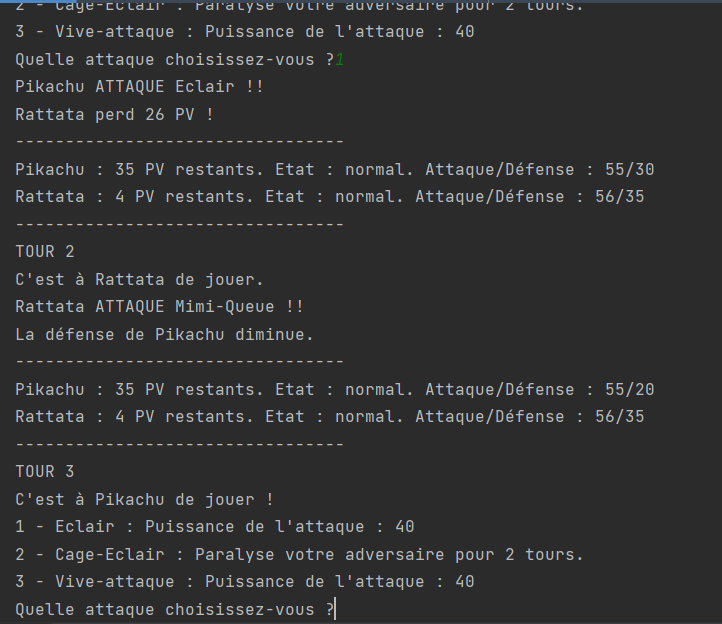
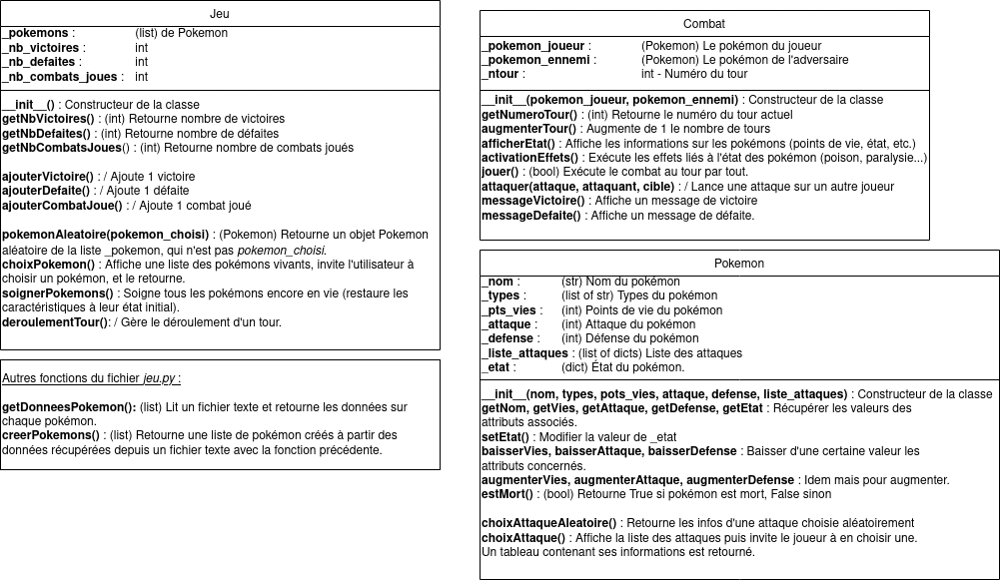

# TP - Un jeu pokémon

!!! info "Modalités de rendus"
    Vous rendrez une **archive ZIP** contenant tous les fichiers de votre travail via la [page de rendus des travaux](../../rendus.md){ target="_blank" }. Votre archive devra se nommer `<VOTRE_NOM>_Pokemons.zip`. Pour rappel, pour créer une archive, sélectionnez tous vos fichiers, puis faites un *clic droit* :material-arrow-right: *envoyer vers* :material-arrow-right: *dossier compressé*.

## Objectif du TP

L'objectif de ce **TP** est de réaliser, en **Python**, un jeu de **combats de pokémons**.
En particulier, on s'inspirera du jeu **Pokémon**.

!!! success "À télécharger"
    - [tp_pokemons.zip](exercices/tp_pokemons.zip){ target="_blank" } - Fichiers **Python** à compléter.

    Si vous souhaitez **tester le jeu**, vous pouvez [cliquer ici](https://replit.com/@erwandemerville/TP-Classes-Pokemon){ target="_blank" }.

!!! tip "Correction + Un petit défi"
    - [tp_pokemons_correction.zip](exercices/tp_pokemons_correction.zip){ target="_blank" } - Fichiers **corrigés** du TP Pokémon.

    <u>Défi pour 2 points bonus au DS</u> :  
    Vous souhaitez obtenir non pas **un point**, mais **<span style="font-size:1.2em; color:rgb(200,100,100);">DEUX POINTS BONUS</span>** à votre note obtenue au dernier DS sur la POO ?

    Voici comment faire :

    - Ajoutez **3 nouveaux pokémons** dans la base de données des pokémons (fichier `pokemons.txt`).
    - Créez **un nouveau type d'attaque**, comme le sommeil par exemple (qui empêche un pokémon d'attaquer pendant un certain nombre de tours), ou encore la confusion (qui fait qu'un pokémon attaquant va subir des dégâts 50% du temps), vous pouvez consulter [cette page](https://www.pokepedia.fr/Statut){ target="_blank" } pour voir la liste des **statuts** possibles.
    - Réglez le soucis de la **mort liée à un effet**. En effet, actuellement, lors de l'exécution de la méthode `activation_effets`, si les **points de vie** d'un pokémon atteignent `0`, et que le pokémon est donc **K.O.**, le tour actuel se déroule quand même.  
    On peut constater cela dans la méthode `jouer` (lignes **164 à 181** dans `combat.py`) :
    ```python linenums="1"
    self.activation_effets()  # Activation des altérations d'états
    print(f"TOUR {self.get_numero_tour()}")  # Affichage du numéro du tour
    if tour == 0:  # C'est au pokémon du joueur de jouer
        if not self.get_pokemon_joueur().get_etat()["nom_etat"] == 'paralysie':
            print(f"C'est à {self.get_pokemon_joueur().get_nom()} de jouer !")
            attaque = self.get_pokemon_joueur().choix_attaque()
            self.attaquer(attaque, self.get_pokemon_joueur(), self.get_pokemon_ennemi())
            sleep(3)  # Laisser un délai de 3 secondes
        tour = 1
    else:  # C'est au pokémon adverse de jouer
        if not self.get_pokemon_ennemi().get_etat()["nom_etat"] == 'paralysie':
            print(f"C'est à {self.get_pokemon_ennemi().get_nom()} de jouer.")
            sleep(3)
            attaque = self.get_pokemon_ennemi().choix_attaque_aleatoire()
            self.attaquer(attaque, self.get_pokemon_ennemi(), self.get_pokemon_joueur())
            sleep(3)
        tour = 0
    self.augmenter_tour()  # Incrémenter le nombre de tours
    ```
    Il faudrait donc faire en sorte que **si un pokémon meurt** à cause d'un **effet** (comme le *poison* ou le *drainage*), le combat **prenne immédiatement fin**. Il faudrait donc ne pas exécuter les **lignes 2 à 18** dans ce cas là.

Ce projet est constitué des fichiers suivants :

* `main.py` - Programme principal permettant l'exécution du jeu
* `jeu.py` - Classe qui gère l'ensemble du jeu et réutilise les autres classes
* `combat.py` - Classe permettant de représenter un combat du jeu
* `pokemon.py` - Classe permettant de représenter les Pokémons
* `pokemons.txt` - Fichier texte contenant la **base de données** des **pokémons** du jeu (contenant leurs noms, caractéristiques et attaques.)

Voici une capture de ce que l'on souhaite obtenir :

<figure markdown>
  { width="500" }
  <figcaption>Exemple d'exécution du jeu</figcaption>
</figure>

## Modélisation

Voici une modélisation sous forme de diagramme des différentes classes constituant ce projet :

<figure markdown>
  
  <figcaption>Modélisation des classes du jeu<br /><a href="../images/Jeu_Pokemon.drawio.png" target="_blank">Voir l'image en taille réelle</a></figcaption>
</figure>

**Notes** :

Les données sur les pokémons sont stockées dans un fichier `pokemons.txt`.

L'inscription d'un pokémon se fait de la manière suivante :

```
Bulbizarre	Plante,Poison	45	49	49
Charge,50	Rugissement,attaque-e,5	Vampigraine,drainage,3
```

**Chaque donnée est séparée par une tabulation**.
La première ligne renseigne les données principales sur le Pokémon : Son **nom**, ses **types**, son **nombre de vies**, son **attaque** et enfin sa **défense**.
La deuxième ligne contient **les attaques du pokémon**.

- S'il s'agit d'une attaque qui inflige simplement des dégâts, on l'écrit sous la forme : `Nom_de_lattaque,puissance` (donc seulement deux éléments).
- S'il s'agit d'une attaque qui n'inflige pas de dégâts mais effectue une autre action, ou inflige une altération d'état, on l'écrira sous la forme suivante (3 éléments) :
    - `Nom_attaque,poison,3 ` : **empoisonnement** pendant **3 tours**,
    - `Nom_attaque,attaque+,10` : **augmenter** de **10** points l'**attaque** du pokémon **allié**,
    - `Nom_attaque,defense+,10` : **augmenter** de **10** points la **défense** du pokémon **allié**,
    - `Nom_attaque,attaque-e,10` : **diminuer** de **10** points l'**attaque** du pokémon **ennemi**,
    - `Nom_attaque,defense-e,10` : **diminuer** de **10** points la **défense** du pokémon **ennemi**.

Pour l'instant, il existe :

* `poison` : empoisonner l'ennemi,
* `paralysie` : paralyser l'ennemi,
* `drainage` : drainer la vie de l'ennemi (vole des PV au pokémon adverse),
* `attaque+`, `attaque-`, `defense+`, `defense-` : augmenter/diminuer l'attaque ou la défense alliée,
* `attaque+e`, `defense+e`, `attaque-e`, `defense-e` : augmenter/diminuer l'attaque ou la défense ennemie.
* Rien ne vous empêche de créer de nouveaux effets, si vous vous sentez capable de les rajouter dans le code !

Après lecture du fichier `pokemons.txt`, les attaques de chaque `Pokemon` sont enregistrées dans l'attribut `_liste_attaques` sous la forme d'une **liste de dictionnaires**.  
Par exemple, s'il y a **2 attaques** : `[{"nom_attaque": "Charge", "degats_attaque": 35}, {"nom_attaque": "Rugissement", "effet_attaque": "attaque-e", "valeur_attaque": 5}]`

- La première attaque "Charge" a une **puissance de 35**.
- La seconde attaque **diminue l'attaque de l'ennemi de 5 points**.

- L'état du pokémon est stockée sous la forme d'un **dictionnaire** :
    - Initialement, l'attribut `_etat` est égal à `{"nom_etat": "normal", "duree_etat": -1}` => Cela indique que le pokémon est dans son **état normal** (le `-1` indique que l'état est permanent).
    - S'il est empoisonné par exemple, `_etat` devient égal à `{"nom_etat": "poison", "duree_etat": 3}` => Empoisonnement **pendant encore 3 tours**. (Même principe pour la **paralysie**, ou le **drainage**).

- Vous pouvez **ajouter de nouveaux pokémons** dans le fichier `pokemons.txt`, en respectant bien le format.
Vous pouvez créer vos propres pokémons ou vous inspirer du [pokédex](https://www.pokebip.com/pokedex/pokedex_5G_liste_des_pokemon.html){ target="_blank" }.

## Réalisation

Les fichiers `pokemon.py`, `combat.py` et `jeu.py`, qui définissent les **classes** `Pokemon`, `Combat` et `Jeu` nécessaires au bon fonctionnement du jeu sont pré-remplis, mais vous devez **les compléter**.

Les zones à compléter sont marquées par des pointillés `.........`.

Les **méthodes** (fonctions inclues dans des classes) contiennent la mention "À COMPLÉTER" ou "COMPLÉTER" dans la docstring lorsqu'il y a des zones à compléter, certaines méthodes sont déjà complètement écrites.

Lisez bien les documentations et les commentaires pour vous assurer de bien comprendre le fonctionnement du programme !

---

### Déroulement du jeu

Le jeu, défini dans la classe `Jeu`, se déroule **indéfiniment** et ne s'arrête que si :

* le **nombre de victoires** correspond à la valeur de la variable globale `NB_VICTOIRES`,
* le **nombre de défaites** correspond à la valeur de la variable globale `NB_DEFAITES`,
* il reste **moins de 2 pokémons** en jeu.

Si aucune de ces conditions n'est remplie :

* on demande au joueur de choisir un pokémon parmi les pokémons encore vivants du jeu,
* l'adversaire choisit un pokémon de manière aléatoire,
* on **lance un combat**,
* à la fin du combat : en cas de victoire, on incrémente la valeur du nombre de victoires, en cas de défaite, on incrémente la valeur du nombre de défaites,
* on recommence le même déroulement tant qu'aucune des 3 conditions définies précédemment n'est remplie.

### Déroulement d'un combat

Pour vous aider à comprendre, voici une explication du déroulement d'un combat (méthode `jouer` de la classe `Combat`) :

* on **vérifie** si le pokémon du joueur est **mort**. Si oui, fin du combat, avec un message de défaite.
* sinon, on **vérifie** si le pokémon de l'ennemi est **mort**. Si oui, **fin du combat, avec message de victoire**.
* si aucun pokémon n'est mort :
  * on affiche les infos sur les pokémons du combat (points de vies, état, attaque, défense...),
  * on active les effets relatifs aux altérations d'état,
  * si c'est au tour du joueur, le joueur choisit une attaque,
  * si c'est au tour du joueur adversaire, l'attaque est choisie aléatoirement,
  * à la fin, on incrémente le nombre de tours.
