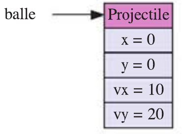

# Activité d'introduction

!!! quote "Source"
    Inspiré d'une activité du *Hachette NSI Terminale*.

Pour simuler la trajectoire d’un projectile que l’on lance en l’air avec une certaine vitesse et qui est soumis à la gravité, on a besoin de connaître sa position $x$, $y$ et sa vitesse $vx$, $vy$. Après un intervalle de temps dt, la position et la vitesse du projectile sont modifiées comme suit :

- $x = x + dt × vx ; y = y + dt × vy$ ;
- $vy = vy − g × dt$ où $g$ est l’intensité de la pesanteur ($9,81 m/s^2$ sur Terre).

Pour représenter le projectile, nous allons utiliser un nouveau type de données : un objet . Pour créer un objet représentant un projectile, il faut d’abord définir une classe, que l’on appelle ici `Projectile` . La fonction `Projectile()` **renvoie** alors un **nouvel objet**, qui est comme une coquille vide. On peut ensuite « remplir » cette coquille avec les attributs qui représentent l’état du projectile, ici `x`, `y`, `vx` et `vy`, auxquels on accède par la notation pointée :

```python
class Projectile:  # déclarer une classe
    pass

balle = Projectile()  # créer un objet
balle.x = 0  # affecter son attribut x,
balle.y = 0  # son attribut y,
balle.vx = 10  # son attribut vx,
balle.vy = 20  # et son attribut vy
```

<figure markdown>
  { width="50%" }
  <figcaption>Représentation de l'objet `balle`</figcaption>
</figure>

!!! note "Exercice 1"
    Écrire la **fonction** `pas(balle, dt)` qui prend une balle en paramètre et modifie son état après l’intervalle de temps `dt`.

!!! note "Exercice 2"
    Écrire un **programme** qui **crée une balle** et **appelle 50 fois la fonction** `pas` avec le paramète `dt = 0.1` en **affichant** la **position de la balle**.

!!! note "Exercice 3"
    **Modifier** la **fonction** `pas` pour qu’elle **affiche la trajectoire de la balle** en **dessinant un trait** depuis sa dernière position. On utilisera la bibliothèque `turtle` et la fonction `goto(x,y)` qui déplace la tortue à la position `x`, `y` en **traçant un trait**.

La fonction `pas` n’a de sens que si on lui passe un projectile comme premier paramètre. Pour rendre cela explicite, on peut la définir *à l’intérieur* de la classe `Projectile`. On dit que l’on définit la **méthode** `pas` de la classe `Projectile`. Au lieu d’appeler la fonction `pas(balle, dt)`, on utilise la notation pointée pour appeler cette méthode : `balle.pas(dt)`.

```python
class Projectile:
    def pas(self , dt):  # définir la méthode `pas` dans la classe `Projectile`
        ...              # `self` est l'objet pour lequel on a appelé la méthod
...
balle.pas(dt)            # appeler la méthode `pas` pour l'objet `balle`
```

!!! note "Exercice 4"
    Modifier le **programme** précédent pour définir la fonction `pas` sous forme d’une méthode de la classe `Projectile`.

!!! note "Exercice 5"
    Modifier la **méthode** `pas` pour programmer le rebond sur le sol : si la coordonnée $y$ du projectile devient négative, on inverse la vitesse verticale $vy$

!!! note "Exercice 6"
    Modifier le **programme** pour **créer plusieurs balles** avec des **positions** et des **vitesses initiales différentes** et **lancer la simulation** en appelant **répétitivement** la **méthode** `pas` de **chaque balle** à tour de rôle.