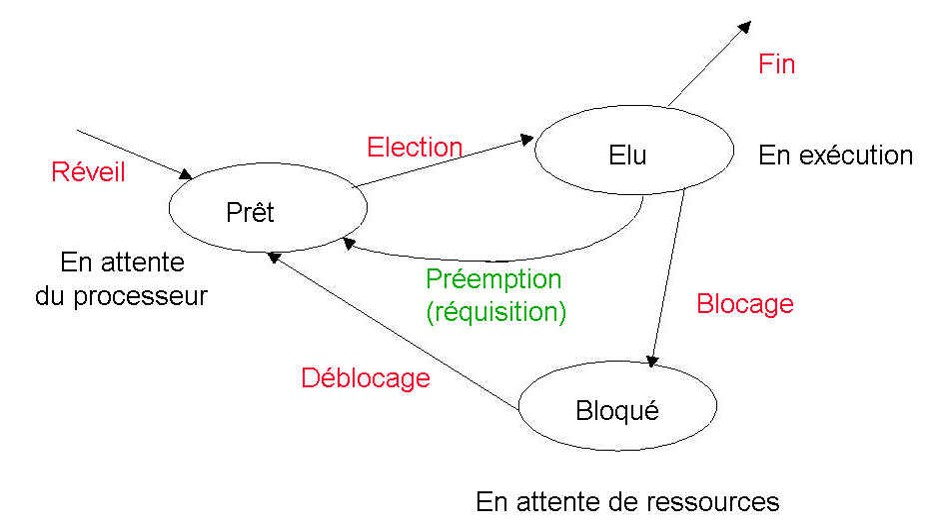

??? quote "Ressources / Liens intéressants"
    - [zonensi.fr](https://www.zonensi.fr/NSI/Terminale/C06/Ordonnancement/){ target="_blank" }
    - [https://mcoilhac.forge.aeif.fr/term/processus/2_ordonnancement/](https://mcoilhac.forge.aeif.fr/term/processus/2_ordonnancement/){ target="_blank" }
    - [https://cours.polymtl.ca/inf2610/documentation/notes/chap8.pdf](https://cours.polymtl.ca/inf2610/documentation/notes/chap8.pdf){ target="_blank" }
    - [http://fab7887.free.fr/Fac-Plops/Taf/SE/SE%20-%20Cours%20Sem1/Cours%20PDF/chap5.pdf](http://fab7887.free.fr/Fac-Plops/Taf/SE/SE%20-%20Cours%20Sem1/Cours%20PDF/chap5.pdf){ target="_blank" }

# TD/TP - Processus et ordonnancement

!!! success "À télécharger"

    Ce **TD/TP** est disponible au format **PDF** et **ODT** :

    - Version *PDF* : [processus_et_ordonnancement_eleve.pdf](src/processus_et_ordonnancement_eleve.pdf){ target="_blank" }
    - Version *ODT* : [processus_et_ordonnancement_eleve.odt](src/processus_et_ordonnancement_eleve.odt){ target="_blank" }

    Voici le **script** à charger dans l'extension *Firefox* [XLinux Terminal et console](https://addons.mozilla.org/fr/firefox/addon/xlinux-console-terminal/?utm_source=addons.mozilla.org&utm_medium=referral&utm_content=search){ target="_blank" } :

    - [script.sh](src/script.sh){ target="_blank" }

<figure markdown="span">
  { width="500" }
  <figcaption>Schéma ordonnancement</figcaption>
</figure>

<figure markdown="span">
  
  <figcaption>Une situation d'interblocage</figcaption>
</figure>