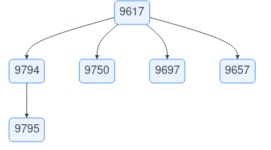
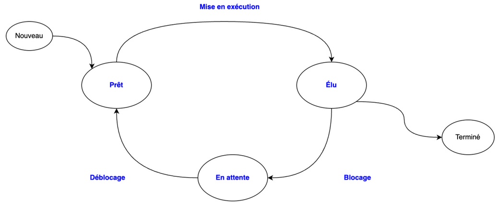

# Sujet de bac

<center>
[:material-cursor-default-click: Télécharger extrait du sujet 2 - Polynésie 2023](src/extrait_23nsij2po1.pdf){ style="font-size:1.5em" target="_blank" }
</center>

!!! tip "Correction"
    1. 
        a.  
          
        b. La commande qui a lancé le premier processus de firefox est `bash`.  
        c. La commande permettant de supprimer tous les processus liés à firefox est `kill 9617`.  
    2.
        a.   
        b. Les temps d’exécution des quatre processus sont :

        | Processus | Instant d’arrivée | Instant de terminaison | Temps d’exécution |
        | --------- | ----------------- | ---------------------- | ----------------- |
        | 1 | 0 | 12 | $12 - 0 = 12$ |
        | 2 | 2 | 18 | $18 - 2 = 16$ |
        | 3 | 3 | 5 | $5 - 3 = 2$ |
        | 4 | 7 | 9 | $9 - 7 = 2$ |

        **moyenne** : $\frac{12 + 16 + 2 + 2}{4} = 8$  
        c. **P1-P1-P1-P1-P3-P3-P1-P1-P1-P1-P4-P4-P2-P2-P2-P2-P2-P2**  
        d. Les temps d'exécution es quatre processus sont :

        | Processus | Instant d’arrivée | Instant de terminaison | Temps d’exécution |
        | --------- | ----------------- | ---------------------- | ----------------- |
        | 1 | 0 | 10 | $10 - 0 = 10$ |
        | 2 | 2 | 18 | $18 - 2 = 16$ |
        | 3 | 3 | 6 | $6 - 3 = 3$ |
        | 4 | 7 | 12 | $12 - 7 = 5$ |
        
        **moyenne** : $\frac{10 + 16 + 3 + 5}{4} = 8.5$

        On constate donc que **cet ordonnancement est moins performant que le précédent**.
    3.
        a.
        ```python
        def choix_processus(liste_attente):
            """Renvoie l'indice du processus le plus court parmi 
            ceux présents en liste d'attente liste_attente"""
                if liste_attente != []:
                    mini = len(liste_attente[0])
                    indice = 0
                    # On parcourt les processus dans la liste d'attente
                    for i in range(1, len(liste_attente)):
                        # Si on trouve un processus plus court
                        if len(liste_attente[i]) < mini:
                            indice = i # On retient son indice
                            mini = len(liste_attente[i])
                    return indice
        ```
        b.
        ```python
        def ordonnancement(liste_proc):
            """Exécute l'algorithme d'ordonnancement
            liste_proc -- liste des processus
            Renvoie la liste d'exécution des processus"""
            execution = []
            attente = scrutation(liste_proc, [])
            while attente != []:
                indice = choix_processus(attente)  # on choisit le processus avec la plus petite durée
                # Retrait de la liste d'attente du dernier élément du processus le plus court
                process_execute = attente[...].pop()
                # Le processus est entièrement fini, on l'enlève de la liste d'attente
                if attente[indice] == ...:
                    ...  # retirer l'élément d'indice "indice" de la liste "attente"
                # On ajoute l'élément du processus choisi à la liste d'exécution
                execution.append(...)
                attente = scrutation(liste_proc, attente)
            return execution
        ```