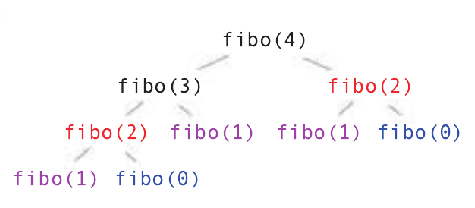

# Cours - Programmation dynamique

La **programmation dynamique**, conçue dans les **années 1950** par le mathématicien américain Richard Bellman, partage une similitude avec la **méthode « diviser pour régner »**. Elle consiste à décomposer un **problème complexe** en **sous-problèmes plus simples**, puis à utiliser ces derniers pour **trouver la solution optimale au problème initial**. La principale différence réside dans l'utilisation de la **« mémoïsation »**, qui implique l'enregistrement des **résultats intermédiaires** des **sous-problèmes** dans un **cache** afin d'éviter leur **recalcul** ultérieur.

La programmation dynamique est applicable lorsque d**eux conditions** sont réunies :

- ==**Sous-structure optimale**== : Un **problème** a une **sous-structure optimale** s’il peut se **décomposer** en **sous-problèmes** et si sa **solution optimale** peut se calculer à partir de la **solution optimale de ses sous-problèmes**. En d'autres termes, toute étape doit pouvoir être calculée à partir des étapes précédentes. Généralement, cela signifie que la résolution du problème
peut se représenter à l’aide d’un **graphe**.
- ==**Sous-problèmes superposés**== : Un problème satisfaisant cette condition nécessite de résoudre **plusieurs fois** le(s) **même(s) sous-problème(s)**. En d’autres termes, sa résolution ne doit pas pouvoir se représenter comme un **arbre**.

!!! abstract "Méthodes ascendante et descendante"
    On distingue **deux façons** de calculer une solution en utilisant la **programmation dynamique** : la ==**méthode ascendante**== (bottom-up en anglais) et la ==**méthode descendante**== (ou top-down).

    - La ==**méthode ascendante**== consiste à partir des plus petits **sous-problèmes** et d'enregistrer leurs **résultats** pour résoudre les **problèmes plus grands**, et ainsi de suite jusqu’à résoudre le **problème global**. La ==**mémoïsation**== des résultats intermédiaires s’effectue donc de **bas en haut** (bottom-up), en partant des problèmes les **plus simples** jusqu'aux **plus complexes**.
    - Dans la ==**méthode descendante**==, on part du **problème initial** et on procède de **façon récursive**, mais en **enregistrant les valeurs déjà calculées** afin de ne pas **résoudre** le **même sous-problème plusieurs fois**.

!!! note "Exercice - *Fibonacci*"
    On rappelle l'algorithme de **Fibonacci** écrit de **manière naïve** :

    ```python
    def fibonacci(n):
        ''' Renvoie le n-ième terme de la suite de Fibonacci
        :param n: (int) indice du terme à calculer
        :return: (int) n-ième terme de la suite '''

        if n <= 1:
            return n
        else:
            return fibonacci(n-1) + fibonacci(n-2)
    ```

    Si l'on représente l'**arbre des appels récursifs** pour `fibonacci(4)` par exemple, on obtient ceci:

    { width="300" }

    **<u>Approche descendante</u>** :

    Dans la **méthode descendante** (*top-down*), on part du **problème initial** et on procède de façon **récursive**, mais en **enregistrant les valeurs déjà calculées** (avec la ==**mémoïsation**==) afin de **ne pas résoudre le même sous-problème plusieurs fois**.

    On va donc créer une **liste de mémoïsation** `mem`. Cette liste n’est pas remplie dans l’ordre croissant et on ne peut donc pas utiliser la méthode` append()` au fur et à mesure. Elle doit être initialisée avec le **nombre total de « cases »** qu’elle devra contenir.

    ```python
    def fibonacci(n, mem=None):
        ''' Renvoie le n-ième terme de la suite de Fibonacci
        :param n: (int) indice du terme à calculer
        :param mem: (list[int]) tableau de mémoïsation
        :return: (int) n-ième terme de la suite '''

        if mem is None : # Premier appel, on initialise notre « cache »
            mem = [None] * (n +1) # Une liste contenant n+1 fois `None`
        if mem[n] is None:
            if n <= 1:
                ...
            else:
                ...
        return ...
    ```

    **<u>Approche ascendante</u>** :
    
    Dans la **méthode ascendante**, on part des **plus petits sous-problèmes** et on enregistre leurs résultats pour résoudre les **problèmes plus grands**, et ainsi de suite jusqu’à ce que l’on ait résolu le **problème global**. La **mémoïsation** des résultats intermédiaires s’effectue donc de **bas en haut** (*bottom-up*), en partant des **problèmes les plus simples**.
    
    ```python
    def fibonacci(n, mem=None):
        ''' Renvoie le n-ième terme de la suite de Fibonacci
        :param n: (int) indice du terme à calculer
        :param mem: (list[int]) tableau de mémoïsation
        :return: (int) n-ième terme de la suite '''

        mem = [] # Notre « cache » de mémoïsation
        mem.append(0) # fibonacci(0) = 0
        mem.append(...) # fibonacci(1) = 1

        for i in range(..., ...):
            mem.append(...)
        return ...
    ```

??? tip "Correction - *Fibonacci*"
    **<u>Approche descendante</u>** :

    Pour modifier notre **fonction récursive** `fibonacci` de manière à utiliser la **programmation dynamique**, nous allons utiliser un ==**tableau de mémoïsation**==, représenté en *Python* sous la forme d'une **liste** appelée `mem` qui stockera chaque **terme calculé** de la suite de *Fibonacci*.

    La liste `mem` prendra une taille de `n + 1` de manière à pouvoir y stocker **chaque terme** du $0^{ième}$ au $n^{ième}$.

    Ainsi, le **premier élément** de `mem` sera le **terme** de la suite pour $n = 0$, le **deuxième élément** sera le **terme** de la suite pour $n = 1$, et ainsi de suite.  
    Initialement, la liste `mem` sera **remplie** avec des `None`. Chaque fois qu'un **terme** sera calculé, on remplacera `None` par la valeur calculée.

    De cette manière :
    - si un terme n'a **pas déjà été calculé**, on le calculera et on le stockera à sa **bonne position** dans la liste `mem`. Puis on renverra la valeur stockée dans `mem`.
    - si le terme a **déjà été calculé**, on ne le re-calculera pas, et on renverra directement la valeur stockée dans `mem`.

    ```python
    def fibonacci(n, mem=None):
        ''' Renvoie le n-ième terme de la suite de Fibonacci
        :param n: (int) indice du terme à calculer
        :param mem: (list[int]) tableau de mémoïsation, par défaut à None
        :return: (int) n-ième terme de la suite '''

        if mem is None : # premier appel, on initialise notre « cache »
            mem = [None] * (n +1) # une liste contenant n+1 fois `None`
        if mem[n] is None:  # si le n-ième terme n'est pas déjà calculé
            # on le calcule (comme avant) et on le stocke dans mem
            if n <= 1:
                mem[n] = n
            else:
                # il ne faut pas oublier de passer 'mem' en entrées des appels récursifs
                mem[n] = fibonacci(n-1, mem) + fibonacci(n-2, mem)
        return mem[n]
    ```

    *À noter* : on pourrait affecter une *liste vide* `[]` à `mem` directement dans la définition des **paramètres** de la **fonction** `fibonacci`, mais cela risque de présenter des soucis si l'on fait plusieurs appels successifs à la fonction `fibonacci`. En effet, compte-tenu de la manière dont les données d'une liste sont **stockées en mémoire**, il y a un risque que les éléments de `mem` ne soient pas effacés d'un appel à un autre.  
    Il est donc préférable de créer la **liste vide** et de l'affecter à `mem` dans la fonction.

    **<u>Approche ascendante</u>** :

    L'approche **ascendante** (*bottom-up*) consiste à **calculer les termes** de la suite **un par un** du $0^{ième}$ jusqu'au $n^{ième}$, en écrivant notre algorithme de manière **itérative**, à l'aide d'une **boucle** `for`.

    On part du bas (des **sous-problèmes**) pour monter vers le **problème principal**, contrairement à l'**approche descendante**.

    Encore une fois, on définira notre **tableau de mémoïsation**, représenté par une **liste** appelée `mem`.  
    Cette liste contiendra initialement les **deux termes que l'on connait**, à savoir pour $n = 0$ et pour $n = 1$.

    ```python
    def fibonacci(n, mem):
        ''' Renvoie le n-ième terme de la suite de Fibonacci
        :param n: (int) indice du terme à calculer
        :param mem: (list[int]) tableau de mémoïsation
        :return: (int) n-ième terme de la suite '''

        mem = [] # notre « cache » de mémoïsation
        mem.append(0) # fibonacci(0) = 0
        mem.append(1) # fibonacci(1) = 1

        # on calcule chacun des termes suivants à partir des deux précédents
        for i in range(2, n + 1):  # du 2-ième jusqu'au n-ième terme
            mem.append(mem[i - 1] + mem[i - 2])
        return mem[n]
    ```