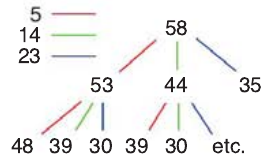

# Exercices sur la programmation dynamique

!!! note "Exercice 1 - *Rendu de monnaie simple* (extrait du Hachette Terminale)"
    1.  En appliquant l’**algorithme glouton**, écrire la fonction `monnaie_glouton(valeurs, montant)` qui renvoie la **liste la plus courte possible** des « pièces » à rendre pour obtenir le **montant demandé**, sachant qu’on ne peut rendre que des **pièces** dont les **valeurs** sont **inclues** dans la **liste** `valeurs`.  
    Trouver **trois exemples** de **montants** qui **peuvent être rendus** avec les valeurs `[5, 14, 23]`, mais pour lesquels `monnaie_glouton` ne trouve **pas de solution**.
    2.  Compléter la **fonction** `monnaie_systematique` ci-dessous qui parcourt systématiquement l’arbre des rendus possibles jusqu’à ce que le **montant restant à rendre** soit **nul** ou que **tous les nœuds d’un niveau de l’arbre** soient **négatifs** :
    <center>
    { width="200" }
    </center>
    ```python
    def monnaie_systematique(valeurs, montant):
        # L'arbre : un dictionnaire par niveau, dont
        # les clés sont les valeurs ayant menées à la
        # somme restant à rendre.
        mem = [ {(): montant} ]

        # À chaque niveau de l'arbre on calcule
        # l'effet des valeurs possibles à partir
        # des nœuds supérieurs.
        while len(mem[-1]) > 0:
            mem.append( {} )
            for chemin, restant in mem[-2].items():
                ...
    ```
    3. Cette approche trouve-t-elle toujours une solution, si elle existe ?
    4. Le remplissage et l’usage de `mem` constitue-t-il un exemple de **mémoïsation** ?
    5. Cette approche est-elle un exemple de **programmation dynamique** ? Pourquoi ?

!!! note "Exercice 2 - *Rendu de monnaie dynamique* (extrait du Hachette Terminale)"
    1. À partir de la **fonction** `monnaie_systematique` de l’**exercice 1** , écrire la **fonction** `monnaie_dynamique(valeurs, montant)` qui effectue le **même parcours**, mais qui évite d’évaluer les **combinaisons redondantes de valeurs**, par exemple `[5, 14, 23]` et `[14, 5, 23]`.  
    Pour ce faire, les **clés** des éléments de `mem` doivent être des **listes** de **nombres de pièces** pour chaque **valeur** de `valeurs`, par exemple [1, 0, 2] correspond à une pièce de 5 et deux pièces de 23.  De cette manière, les **séquences de valeurs** comme `[5, 14, 23]` et `[14, 5, 23]` sont représentées de la **même façon** (ici `[1, 1, 1]`), et on peut **économiser des calculs redondants**.
    2. Cette approche est-elle **montante** ou **descendante** ?
    3. Écrire une **seconde version** de `monnaie_dynamique` qui utilise l’**autre approche**.