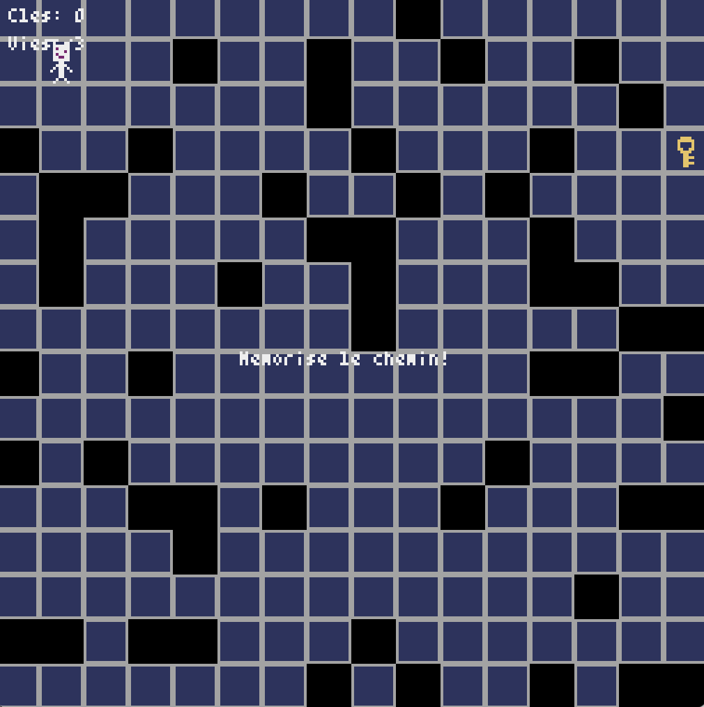
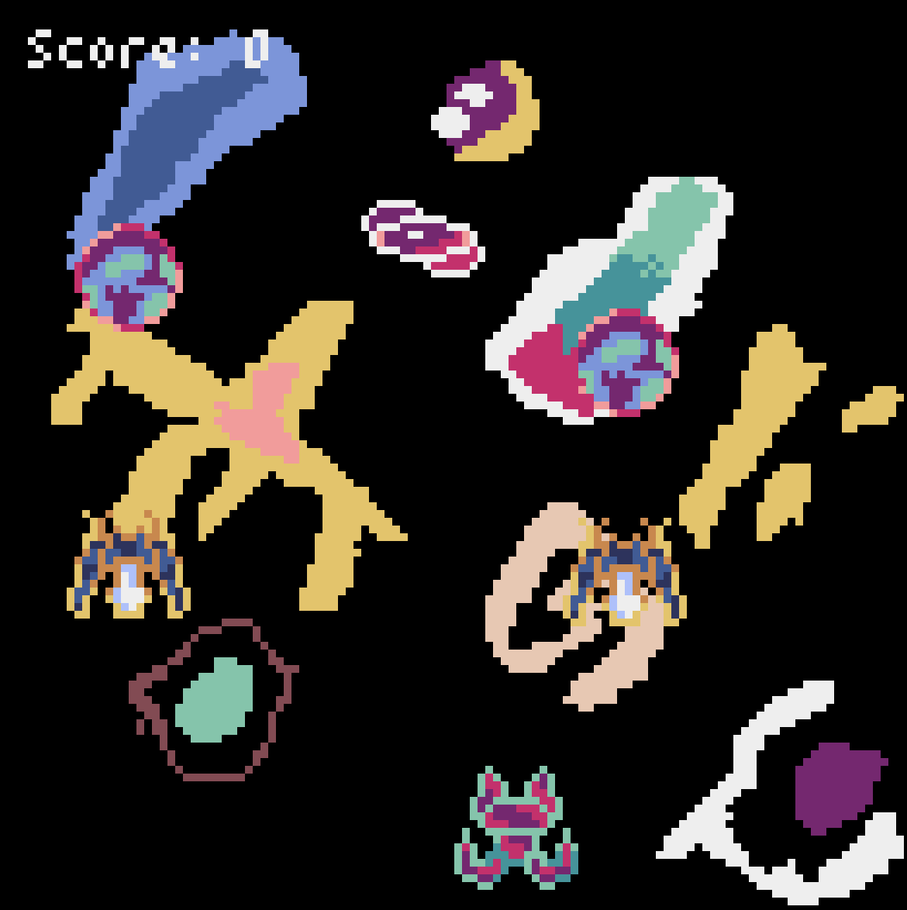
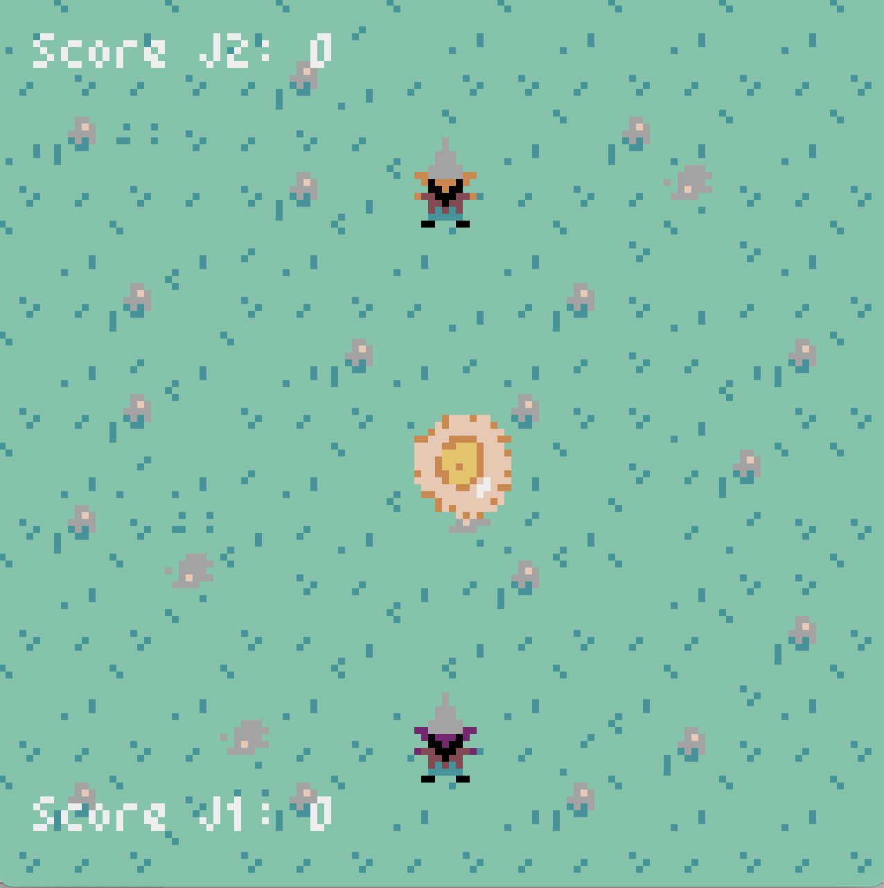
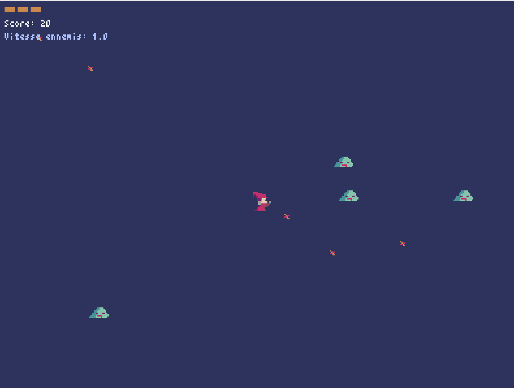
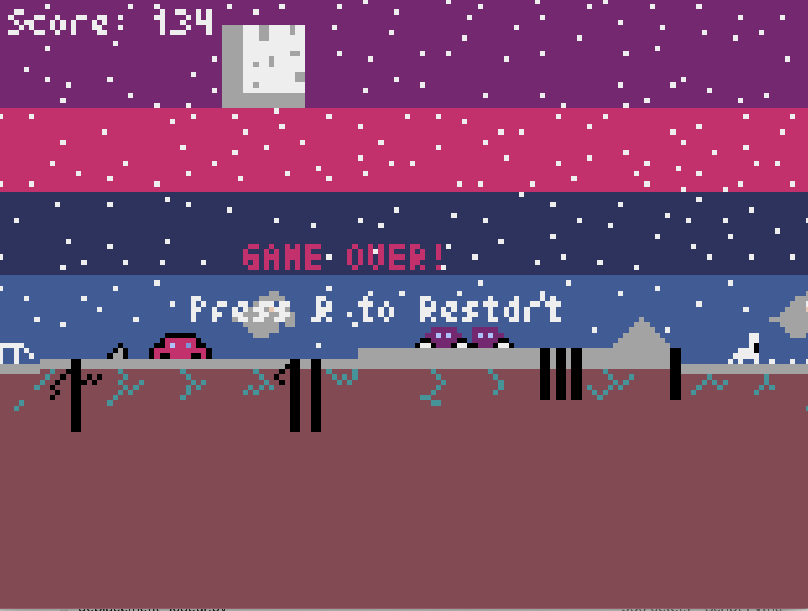

# Réalisations des élèves

Voici les **jeux** réalisés par les **élèves de terminale** à l'aide du module *Pyxel*.

Cliquez sur le **bouton** ++"Jouer"++ pour **lancer un jeu** sur votre navigateur.  
*Note : au moment où le texte `"CLICK TO START"` apparaît, il faut parfois patienter quelques secondes après avoir cliqué pour que le jeu démarre.*

---

Blindfall

{ width="400" }

[Jouer :video_game:](#){ .md-button onclick="window.open('../jeux/Blindfall.html', '_blank', 'scrollbars=yes,resizable=yes,width=1280,height=720')" }

---

Destructor

{ width="400" }

[Jouer :video_game:](#){ .md-button onclick="window.open('../jeux/Destructor.html', '_blank', 'scrollbars=yes,resizable=yes,width=1280,height=720')" }

---

PVP Gobelin

{ width="400" }

[Jouer :video_game:](#){ .md-button onclick="window.open('../jeux/PVP_Gobelin', '_blank', 'scrollbars=yes,resizable=yes,width=1280,height=720')" }

---

Sauvetage

{ width="400" }

[Jouer :video_game:](#){ .md-button onclick="window.open('../jeux/Sauvetage.html', '_blank', 'scrollbars=yes,resizable=yes,width=1280,height=720')" }

---

Shadow Sprint

{ width="400" }

[Jouer :video_game:](#){ .md-button onclick="window.open('../jeux/Shadow_Sprint.html', '_blank', 'scrollbars=yes,resizable=yes,width=1280,height=720')" }

