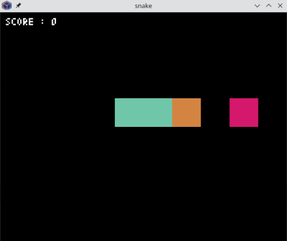
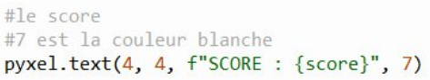
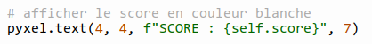
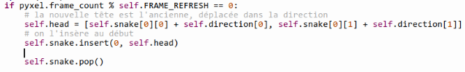

# Un jeu de snake avec Pyxel

<figure markdown>
  { width="300" }
  <figcaption>Screen de la fenêtre de jeu</figcaption>
</figure>

!!! success "Énoncé et programme de base"
    Voici une version **PDF** de l'**énoncé de l'exercice** (comportant des *trous* à compléter), ainsi qu'une **structure de base** pour votre **programme Python**.

    - [Snake - Énoncé à trous](documents/Enonce_Snake_Pyxel.pdf){ target="_blank" }
    - [Programme Python de base](src/snake_base.py){ target="_blank" }

    N'hésitez pas à consulter [la documentation de Pyxel](https://github.com/kitao/pyxel){ target="_blank" } si vous recherchez une fonctionnalité particulière de **Pyxel** qui n'est pas présentée dans l'énoncé.

??? tip "Corrigé"
    <center>
    [:material-cursor-default-click: Télécharger le programme corrigé](src/snake_corr.py){ target="_blank" }
    </center>

## Quelques explications utiles

Pour réaliser ce **jeu de snake**, vous utilisez la **POO** (**p**rogrammation **o**rientée **o**bjet).

Voici une structure de base pour votre **programme** (vous pouvez [télécharger le fichier](src/snake_base.py){ target="_blank" } ou copier / coller le code ci-dessous):

```python
import pyxel
from random import randint

class SnakeGame:
    def __init__(self):
        
        # AJOUTEZ ICI VOS INSTRUCTIONS
        
        # exécuter le jeu
        pyxel.run(self.update, self.draw)

    def update(self):
        
        pass

    def draw(self):
        
        # on ajoute une instruction permettant d'effacer l'écran
        # et de le remplir avec la couleur 0 (= couleur noire) :
        pyxel.cls(0)
        
        pass

if __name__ == "__main__":
    SnakeGame()  # Instanciation de la classe SnakeGame
```

!!! tip "Explication"
    Voici une petite explication de ce bout de code :

    - les **deux premières lignes** permettent d'**importer** le **module Pyxel** et **la fonction *randint* du module *random*** (qui sera utile pour générer la position de la **nourriture**),
    - on a créé une **classe** nommée `SnakeGame` (vous pouvez l'appeler comme vous voulez), qui contient **un constructeur** `__init__`, une **méthode** `update` et une **méthode** `draw`.
        - la méthode `__init__` permet :
            - de définir tous les **attributs** dont vous aurez besoin pour travailler (par exemple un attribut pour représenter le `snake` lui-même, la `direction` de déplacement du snake, le `score` du joueur, etc.),
            - d'**initialiser la fenêtre de jeu** avec la fonction `init` du module `pyxel`,
            - d'**exécuter le jeu** avec la fonction `run` du module `pyxel`.  
            C'est ce que l'on fait avec l'instruction :  
            `pyxel.run(self.update, self.draw)`  
            Cette fonction `run` prend comme **entrées** votre méthode `update` et votre méthode `draw`.  
            Ces deux méthodes seront **exécutées 20 fois par seconde**.
        - la méthode `draw` contiendra **toutes les instructions permettant de dessiner** ce que vous **verrez à l'écran** dans la **fenêtre de jeu**,
        - la méthode `update` contiendra *toutes les instructions** permettant de **mettre à jour l'état du jeu**.
    - Au début de la méthode `draw`, vous pouvez voir l'instruction suivante :  
    `pyxel.cls(0)`  
    On a ici appelé la **fonction** `cls` de `pyxel`, qui permet d'**effacer l'écran** et de le **remplir avec la couleur noire** (valeur `0`). Il y a au total **16 couleurs possibles**, de **valeurs** allant de `0` (pour le **noir**) à `15` :  
      
      
    L'instruction `pyxel.cls(0)` est nécessaire pour pouvoir modifier notre affichage à chaque appel de `draw` sans conserver les affichages précédents.
    - Enfin, le **bloc d'instructions** `if __name__ == "__main__":` en **fin de script** permet de définir des **instructions** qui seront **exécutées uniquement si l'on exécute directement ce script**. Elles ne seront donc pas exécutées si le script est importé dans un autre.  
    Ici, on se contente d'**instancier la classe**`SnakeGame`, ce qui entraîne automatiquement l'**exécution du jeu** (puisque l'instruction `pyxel.run` est dans le **constructeur de la classe**). Vous remarquerez que l'on ne stocke pas notre nouvel **objet** dans une **variable**, puisqu'on n'a pas besoin de le modifier.

!!! danger "Erreur sur votre feuille"
    Dans la **version papier de l'énoncé** que je vous ai donnée, il y a une petite **erreur** sur la **^^page 2^^**, sur l'extrait de code suivant :

    { width="300" }

    En effet, le `score` doit être un **attribut** défini dans le **constructeur** de la classe, puisque l'on souhaite le **stocker** et pouvoir à tout moment le **modifier** dans notre méthode `update` (en l'occurence, on augmentera ce score à chaque fois que le snake mangera une nourriture).  
    ==Il faut donc remplacer `score` par `self.score`== :

    

!!! warning "Ajouts dans le code de base"
    Notez les **deux différences** entre le **code de base** que je vous avais fourni, et celui qui est maintenant proposé :

    - on a ajouté l'instruction `pyxel.cls(0)` au **début** de la méthode `draw`,
    - on a placé l'instruction d'**exécution du jeu** `pyxel.run` à **la fin** du **constructeur de la classe** plutôt que dans le **bloc en fin de script**.  
    En soi, ça ne change pas grand chose, dans les deux cas notre jeu s'exécutera, mais cette solution là est plus élégante et logique.

    ==N'oubliez pas de modifier votre code en tenant compte de ces deux éléments.==

!!! warning "Information - Déplacement du snake"
    En bas de la **page 3** de l'**énoncé**, on vous donne une partie du code permettant de **réagir aux touches du clavier** en **modifiant** la **direction de déplacement** du **snake** :

    

    - Bien évidemment, vous devez **compléter** ce bout de code en **ajoutant les instructions** pour prendre en compte l'**appui** sur la **touche** ++arrow-up++ et sur la **touche** ++arrow-down++.
    - Vous pouvez, si vous le souhaitez, remplacer les touches de flèches par les touches ++z++, ++q++, ++s++ et ++d++.

## Une version améliorée

Maintenant que vous avez une première version de votre jeu, vous pouvez y apporter des **améliorations**, comme par exemple :

- **agrandir** la **fenêtre de jeu**,
- faire en sorte qu'en sortant de l'écran d'un côté, le **snake** réapparaisse de l'autre côté,
- ajouter un écran de **"Game Over"** en cas d'échec,
- **accélérer la vitesse de déplacement** du ***snake*** toutes les $x$ nourritures mangées,
- créer un **système de niveaux** de plus en plus durs et en y ajoutant des obstacles,
- etc.