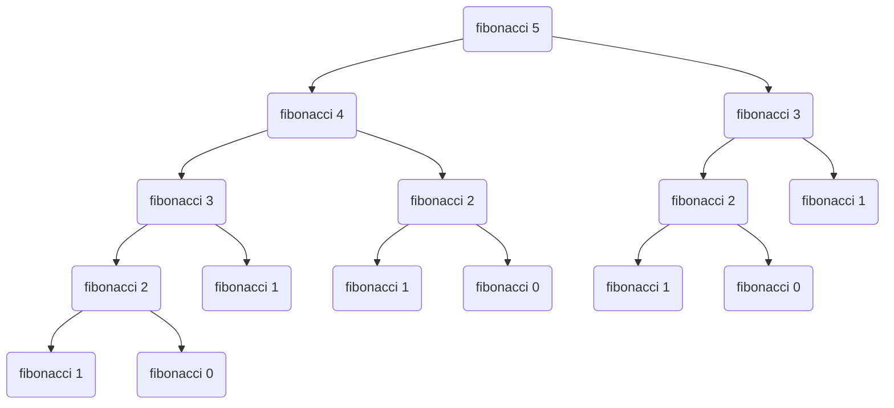
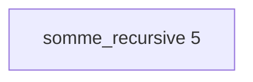
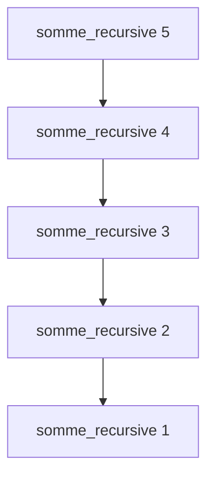
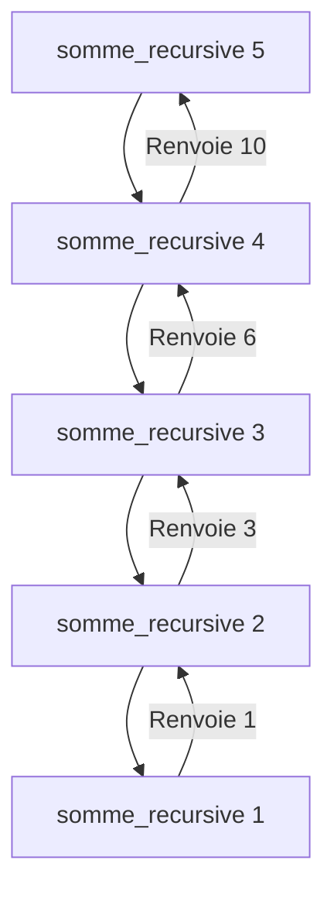
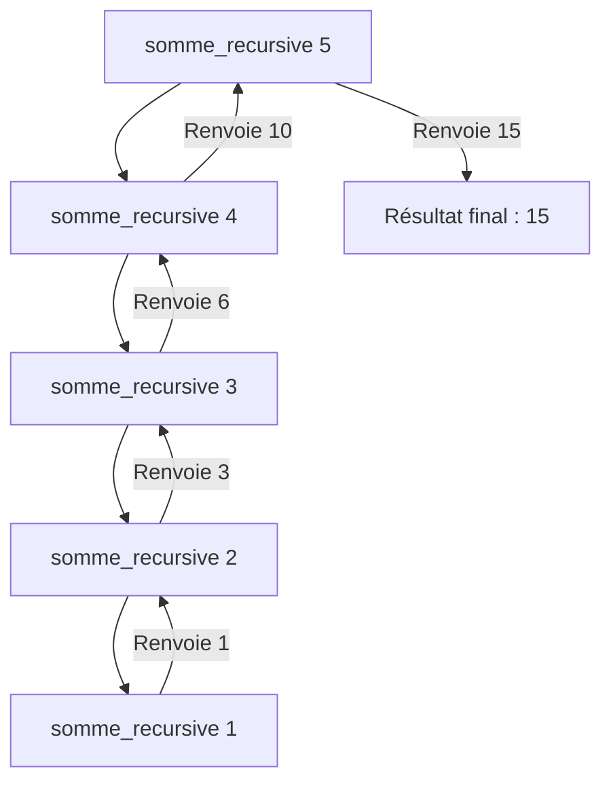

# Cours - La récursivité

## Introduction

La **récursivité** est une démarche largement utilisée dans de nombreux domaines, y compris en **informatique**. Elle repose sur le principe de résoudre un **problème** en le divisant en **sous-problèmes plus petits**, souvent de manière **répétitive**, jusqu'à ce que les sous-problèmes deviennent suffisamment simples pour être résolus directement. En programmation, cela se traduit par **une fonction qui s'appelle elle-même** pour résoudre un problème plus vaste.

La récursivité n'est pas seulement un outil de résolution de problèmes, mais aussi un concept profondément enraciné dans l'histoire des mathématiques et de l'informatique. En fait, le mathématicien indien du 12e siècle, Bhaskara II, est souvent crédité comme l'un des premiers à avoir utilisé la récursivité pour résoudre des équations mathématiques. Cependant, le concept de récursivité a vraiment pris de l'ampleur avec le mathématicien britannique George Boole au 19e siècle et plus tard avec l'œuvre d'Alan Turing et d'autres pionniers de l'informatique au 20e siècle.

## Les fonctions récursives

### Qu'est-ce que c'est ?

Une fonction récursive est **une fonction qui s'appelle elle-même dans sa propre définition**. Elle est composée de **deux parties** principales :

- **Le cas de base** : C'est le point d'arrêt de la récursion. Il spécifie quand la fonction doit cesser de s'appeler elle-même et renvoyer une valeur.
- **Le cas récursif** : C'est la partie où la fonction s'appelle elle-même avec des arguments modifiés, généralement plus petits, afin de progresser vers le cas de base.

Voici un **exemple** simple en Python pour illustrer ce concept :

{{ IDE('scripts/01.py') }}

[Visualiser sur Python Tutor](https://pythontutor.com/visualize.html#code=def%20compte_a_rebours%28n%29%3A%0A%20%20%20%20if%20n%20%3C%3D%200%3A%0A%20%20%20%20%20%20%20%20print%28%22Fin%20du%20compte%20%C3%A0%20rebours!%22%29%0A%20%20%20%20else%3A%0A%20%20%20%20%20%20%20%20print%28n%29%0A%20%20%20%20%20%20%20%20compte_a_rebours%28n%20-%201%29%0A%0Acompte_a_rebours%283%29&cumulative=false&heapPrimitives=nevernest&mode=edit&origin=opt-frontend.js&py=3&rawInputLstJSON=%5B%5D&textReferences=false){ .md-button target="_blank" }

Dans cet exemple, `compte_a_rebours` est une **fonction récursive** qui **affiche les nombres de n jusqu'à 1**, puis **affiche** `"Fin du compte à rebours!"`.

??? tip "Déroulement détaillé de compte_a_rebours"
    N'hésitez pas à visualiser le déroulement de `compte_a_rebours` sur [Python Tutor](https://pythontutor.com/visualize.html#code=def%20compte_a_rebours%28n%29%3A%0A%20%20%20%20if%20n%20%3C%3D%200%3A%0A%20%20%20%20%20%20%20%20print%28%22Fin%20du%20compte%20%C3%A0%20rebours!%22%29%0A%20%20%20%20else%3A%0A%20%20%20%20%20%20%20%20print%28n%29%0A%20%20%20%20%20%20%20%20compte_a_rebours%28n%20-%201%29%0A%0Acompte_a_rebours%283%29&cumulative=false&heapPrimitives=nevernest&mode=edit&origin=opt-frontend.js&py=3&rawInputLstJSON=%5B%5D&textReferences=false){ target="_blank" }.

    Supposons que nous appelions `compte_a_rebours(3)`. Voici comment cela se déroule :

    1. La fonction `compte_a_rebours(3)` est appelée.

    2. La condition `if n <= 0:` n'est pas satisfaite, donc la fonction affiche `3` et appelle `compte_a_rebours(2)`.

        - La fonction `compte_a_rebours(2)` est appelée.
        - Elle affiche `2` et appelle `compte_a_rebours(1)`.
            - La fonction `compte_a_rebours(1)` est appelée.
            - Elle affiche `1` et appelle `compte_a_rebours(0)`.
                - La fonction `compte_a_rebours(0)` est appelée.
                - La condition `if n <= 0:` est satisfaite, donc elle affiche `"Fin du compte à rebours!"` et ne renvoie rien (`None`).
            - La fonction `compte_a_rebours(1)` revient à son appelant (qui est `compte_a_rebours(2)`).
        -  La fonction `compte_a_rebours(2)` revient à son appelant (qui est `compte_a_rebours(3)`).

    3. La fonction `compte_a_rebours(3)` revient à son appelant (qui peut être l'appel initial).

### Plusieurs cas de base

Voici un autre exemple de **fonction Python récursive** qui présente **plusieurs cas de base**. Cette fonction calcule le $n-ième$ **terme** de la **suite de Fibonacci**, une suite mathématique célèbre où **chaque terme** est la **somme des deux termes précédents** : $F(n) = F(n-1) + F(n-2)$.

{{ IDE('scripts/02.py') }}

[Visualiser sur Python Tutor](https://pythontutor.com/visualize.html#code=def%20fibonacci%28n%29%3A%0A%20%20%20%20if%20n%20%3C%3D%200%3A%0A%20%20%20%20%20%20%20%20return%200%0A%20%20%20%20elif%20n%20%3D%3D%201%3A%0A%20%20%20%20%20%20%20%20return%201%0A%20%20%20%20else%3A%0A%20%20%20%20%20%20%20%20return%20fibonacci%28n%20-%201%29%20%2B%20fibonacci%28n%20-%202%29%0A%0Aprint%28f'fibonacci%285%29%20%3D%20%7Bfibonacci%285%29%7D'%29%20%20%23%20test%20avec%20n%20%3D%205&cumulative=false&heapPrimitives=nevernest&mode=edit&origin=opt-frontend.js&py=3&rawInputLstJSON=%5B%5D&textReferences=false){ .md-button target="_blank" }

Dans cette fonction `fibonacci`, nous avons trois cas principaux :

- Le **cas de base 1** : Si `n` est **inférieur ou égal** à `0`, nous **renvoyons** `0`, car $F(0) = 0$.
- Le **cas de base 2** : Si `n` est **égal** à `1`, nous renvoyons `1`, car $F(1) = 1$.
- Le **cas récursif** : Pour les valeurs de `n` **supérieures à** `1`, nous **appelons récursivement** `fibonacci(n - 1)` et `fibonacci(n - 2)` pour **calculer les deux termes précédents** dans la suite, puis nous les **additionnons** pour obtenir le $n-ième$ **terme**.

L'utilisation de **deux appels récursifs** avec des valeurs différentes de `n` crée une structure de récursivité en **arbre**, où **chaque nœud a deux enfants** :



!!! warning "Coût algorithmique exponentiel"
    Le problème de la fonction telle que nous l'avons écrite est que son **coût algorithmique** est **exponentiel** en raison de la **duplication de calculs** (voir arbre ci-dessus). Vous pouvez par exemple faire le test avec une valeur comme `n = 37` (sur un *IDE* externe comme **Thonny**, car l'*IDE* intégré à la page, bien que pratique, est peu performant et risque de planter même pour des petites valeurs de `n`), vous verrez que le résultat prendra un certain temps à s'afficher (plus ou moins *10 secondes* selon la puissance de votre machine).

    Maintenant, si vous essayez avec `n = 100`, il faudra faire **1 146 295 688 027 634 168 201** appels récursifs ! Ce qui prendra environ... **13 197 652 000 000 000 secondes**, soit **418 494 799 années, 216 jours, 20 heures, 26 minutes et 40 secondes** de **temps de calcul**.
    
    Ainsi, pour des valeurs de $n$ plus élevées, cette approche devient **inefficace**, et il est préférable d'utiliser des techniques de **programmation dynamique** pour **optimiser le calcul** des termes de Fibonacci (on abordera cela plus tard dans l'année).


### Plusieurs cas récursifs

Il est également possible de définir une fonction **avec plusieurs cas récursifs**. Par exemple, on souhaite proposer une fonction `puissance(x, n)`, **renvoyant** le résultat de $x^n$, en distinguant **deux cas** en fonction de la **parité** de `n`.

Mathématiquement, on peut définir $x^n$ de la façon suivante :

<center>
$x^n=\left\{ \begin{array}{lll} 1 \;si \; n=0\\
{(x^\frac{n}{2})}^2 \;si \; n \geq 1 \;et\; n \;pair\\
x \times (x^{\frac{(n-1)}{2}})^2 \;si \; n \geq 1 \;et\; n \;impair \end{array} \right.$
</center>

On a donc ici **un cas de base** (non récursif) et **deux cas récursifs** selon si `n` est **pair** ou **impair**.

L'opération de **division** est ici supposée être la **division entière** (on utilisera le symbole `//` en **Python**).

On écrira pour implémenter cela :

- une fonction `carre(x)` qui renvoie le **carré d'un nombre `x` donné**,
- une fonction `puissance(x, n)` définie de la manière suivante :

<center>
$puissance(x,n)=\left\{ \begin{array}{lll} 1 \;si \; n=0\\
carre(puissance(x,\frac{n}{2})) \;si \; n \geq 1 \;et\; n \;pair\\
x \times carre(puissance(x,\frac{n-1}{2}) \;si \; n \geq 1 \;et\; n \;impair \end{array} \right.$
</center>

{{ IDE('scripts/04.py') }}

On constate donc que les seules **opérations arithmétiques** sont effectuées dans la fonction `carre(x)`, et dans le cas où `n` est **impair** dans la fonction `puissance(x,n)`. Les **appels récursifs** font que ces opérations sont répétées autant de fois qu'il faut pour calculer $x^n$.

### À vous de jouer !

!!! info "La fonction factorielle"
    Écrire la fonction **factorielle** d'abord de façon **itérative**, puis de façon **récursive**.  
    On rappelle que `factorielle(n) = 1` si `n = 0`,  
    `factorielle(n) = 1 x 2 x ... x (n-1) x n` si `n >= 1`.

    {{ IDE('scripts/03.py') }}

## Les Piles d'exécution

Lorsque l'on appelle une **fonction récursive**, le système doit garder une trace de **chaque appel** de **fonction active** et de ses **paramètres** pour pouvoir revenir à ces appels une fois que les appels récursifs sont terminés. Cela se fait à l'aide d'une structure de données appelée **pile d'exécution** (ou *call stack* en anglais).

Voici comment cela fonctionne, en prenant l'exemple de `fibonacci` :

- **<u>Appel Initial</u>** : Lorsque vous appelez une fonction récursive pour la première fois (par exemple, `fibonacci(5)`), un nouvel appel de fonction est ajouté **au sommet de la pile d'appels**. Les paramètres de cet appel (dans ce cas, `n=5`) sont stockés sur la pile.
- **<u>Appels Récursifs</u>** : Si la fonction récursive effectue des appels récursifs (comme `fibonacci(n-1)` et `fibonacci(n-2)` dans le cas de *Fibonacci*), chaque nouvel appel est ajouté **au sommet de la pile** avec ses propres **paramètres**. La pile continue de s'accumuler avec ces appels tant que les conditions de base ne sont pas atteintes.
- **<u>Retours</u>** : Lorsque les **cas de base** sont **atteints** (par exemple, `fibonacci(0)` et `fibonacci(1)` dans le cas de *Fibonacci*), la fonction commence à **renvoyer des valeurs**. Les appels de fonctions les plus récents sont **retirés de la pile** et leurs **résultats** sont **utilisés** pour **calculer les valeurs des appels précédents**.
- **<u>Dépilement</u>** : La **pile d'appels** est déchargée de **haut en bas**, ce qui signifie que **le dernier appel** est **le premier à être retiré** (c'est pourquoi on parle de "pile"). Les **valeurs de retour** des **appels** de fonction sont utilisées pour remonter dans la pile jusqu'à ce que l'**appel initial** soit **atteint**.
- **<u>Résultat Final</u>** : Une fois que l'**appel initial** a été évalué, la pile est **complètement vidée**, et vous obtenez le **résultat final** de la fonction récursive.

À chaque étape, la fonction est **empilée** sur la **pile d'appels** jusqu'à ce que le **cas de base** soit **atteint** (n <= 0), puis les fonctions commencent à se dépiler et à revenir successivement à leur appelant.

### Exemple : une fonction `somme_recursive`

Nous allons utiliser une fonction récursive pour calculer la somme des nombres de `1` à `n` (c'est-à-dire `1 + 2 + 3 + ... + n`).

Voici la fonction Python pour calculer la somme récursivement :

```python
def somme_recursive(n):
    if n == 1:
        return 1
    else:
        return n + somme_recursive(n - 1)
```

#### Étape 1 : Appel initial

Au début, nous appelons `somme_recursive(5)`. La **pile d'appels** est **vide**.



#### Étape 2 : Appels Récursifs

L'**appel initial** génère des **appels récursifs**. Nous **ajoutons** (*empilons*) `somme_recursive(4)`, puis `somme_recursive(3)`, et ainsi de suite, jusqu'à ce que `somme_recursive(1)` soit atteint.



#### Étape 3 : Retours et Calculs

Maintenant, nous commençons à **retirer** (*dépiler*) les **appels** de la **pile** et à **calculer les résultats** à chaque étape. Les **résultats** sont ensuite **renvoyés à l'appel précédent** pour le **calcul final**.



#### Étape 4 : Résultat Final

La **pile** est complètement **vidée**, et nous obtenons le **résultat final** de `somme_recursive(5)`, qui est `15`.



C'est ainsi que fonctionne la **pile d'appels** dans ce scénario **récursif**. Chaque appel est ajouté à la pile, les résultats sont renvoyés et utilisés pour calculer le résultat final une fois que tous les appels récursifs ont été résolus.