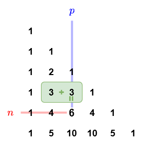
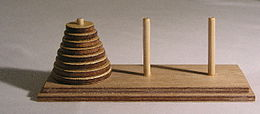

# Exercices - La récursivité

## Notebook d'exercices

!!! success "Notebook sur *Capytale*"
    Cliquez sur le lien ci-dessous pour accéder au **notebook** d'exercices sur *Capytale* :

    <center style="font-size:1.3em">
    [Accéder au notebook d'exercices](https://capytale2.ac-paris.fr/web/c/4bce-4291104)
    </center>

## Exercice : Triangle de Pascal

Le **triangle de Pascal** (nommé ainsi en l'honneur du mathématicien français *Blaise Pascal*) est une présentation des coefficients binomiaux sous la forme d’un triangle :

<figure markdown="span">
  
  <figcaption>Source de l'image : <a href="https://info.blaisepascal.fr/nsi-exercices-recursivite/">info.blaisepascal.fr</a></figcaption>
</figure>

On peut le définir par **récurrence** de la manière suivante :

$$
C(n,p)=
\begin{cases}
1, & \text{si } n = p \text{ ou } p = 0,\\[6pt]
C(n-1,p-1) + C(n-1,p), & \text{sinon}.
\end{cases}
$$

avec $0 \lt p \le n$.

!!! note "Exercice 1"
    Écrire une **fonction récursive** `pascal(n, p)` qui **renvoie** la valeur de $C(n, p)$, le paramètre `n` étant l'indice d'une *ligne* et `p` l'indice d'une *colonne* du **triangle de Pascal**.

    ```python
    def pascal(n, p):
        """ Renvoie la valeur de C(n, p).
        :param n: (int) indice d'une ligne
        :param p: (int) indice d'une colonne
        :return: (int) valeur du coefficient d'indices (n, p)
        """

        ...
    ```

??? tip "Correction exercice 1"

    ```python
    def pascal(n, p):
        """ Renvoie la valeur de C(n, p).
        :param n: (int) indice d'une ligne
        :param p: (int) indice d'une colonne
        :return: (int) valeur du coefficient d'indices (n, p)
        """

        if n == p or p == 0:  # cas de base
            return 1
        else:                 # cas général (récursif)
            return pascal(n-1, p-1) + pascal(n-1, p)
    ```

!!! note "Exercice 2"
    Complétez le **programme** suivant qui **affiche** le **triangle de Pascal** sur un *nombre de lignes* qu'on définira avec une **variable globale** `NB_LIGNES`.

    ```python
    NB_LIGNES = 6
    for ... in range(...):
        for ... in range(...):
            print(..., end=" ")
        print()
    ```

??? tip "Correction exercice 2"

    ```python
    NB_LIGNES = 6
    for n in range(NB_LIGNES):
        for p in range(n+1):
            print(pascal(n, p), end=" ")
        print()
    ```

    Pour rappel, le paramètre `end` de la fonction `print` permet de remplacer le retour à la ligne après un affichage par un autre caractère (ici un espace).

## Exercice : Les tours de Hanoï

*Source : [https://www.codingame.com/playgrounds/56923/apprendre-les-bases-de-python-pour-reussir-en-n-s-i-/tours-de-hanoi](https://www.codingame.com/playgrounds/56923/apprendre-les-bases-de-python-pour-reussir-en-n-s-i-/tours-de-hanoi){ target="_blank" }*.

Les tours de Hanoï est un casse-tête composé de trois tours et une pile de disques rangés du plus grand au plus petit comme sur la photo ci-dessous :

<center>

</center>

Le but est de déplacer la pile de disques sur la tour de droite en ne déplaçant à chaque fois qu'un seul disque et un disque ne peut pas être posé sur un disque plus petit. Voici une animation de ce qu'il faut faire dans le cas où il y a 4 disques.

<center>

</center>

Vous pouvez consulter [Wikipédia](https://fr.wikipedia.org/wiki/Tours_de_Hano%C3%AF){ target="_blank" } par exemple pour plus d'informations.

Nous allons voir qu'il est très simple de créer un programme récursif qui nous dit quoi faire pour résoudre le problème. Tout d'abord on appelle les tours `A`, `B` et `C`. On appelle `n` le **nombre de disque** présents au départ dans la tour `A`. Pour **déplacer tous les disques** de la tour `A` vers la tour `C`, on peut raisonner comme suit :

- On déplace `n-1` disques de `A` vers la tour `B`
- On déplace le dernier disque de `A` vers `C`
- On déplace les `n-1` disques de `B` vers `C`

L'astuce ici est de créer une fonction `hanoi` qui prend **4 paramètres** : `hanoi(n,debut,inter,fin)` où `n` est le **nombre de disques** à déplacer, `debut` est la **tour de départ** de nos `n` disques, `inter` est la **tour intermédiaire** que l'on peut utiliser pour déplacer et `fin` est la **tour** ou doivent se trouver les `n` **disques** au **final**.

Ainsi, on va initialement appeler `hanoi(n,"A","B","C")`, et lorsque l'on voudra déplacer les `n-1` **disques** de `A` vers `B`, on appelera `hanoi(n-1,"A","C","B")` .

!!! note "Exercice"
    Écrire cette **fonction récursive** `hanoi(n,debut,inter,fin)` de manière à afficher (avec **print**) à chaque étape le déplacement à effectuer sous la forme `"A B"` pour un déplacement de la tour "**A**" vers la tour "**B**" par exemple.

    On souhaite :
    
    - donner en **entrée** : `(n,"A","B","C")` où `n` est un entier.
    - obtenir en **sortie** : Les instructions à suivre pour déplacer les `n` disques de la tour `"A"` à la tour `"C"` donnée sous la forme `"A B"` pour signifier un déplacement de `A` vers `B` et affiché avec `print`.

## Autres exercices

!!! note "Exercice 1"
    Écrire une **fonction récursive** `F(n)`, où `n` est un *entier positif ou nul*, qui **affiche** `n` fois le message `"Hello world !"`.

??? tip "Aide exercice 1"
    Ici, il faut distinguer :

    - le **<u>cas général</u>** (récursif), lorsque $n > 0$, auquel cas on **affiche le message**, puis on **appelle récursivement** la fonction sur $n - 1$ (décrémentation de $n$) de manière à **converger** vers le **cas de base**.
    - le **<u>cas de base</u>**, lorsque $n = 0$, auquel cas on **ne fait rien**.

    Reprenez le code suivant et complétez les deux lignes manquantes :

    ```python
    def F(n):
        if n > 0:  # cas général
            ...
            ...
        # pas besoin de mettre un else pour le cas de base,
        # puisque dans ce cas on ne renvoie rien.
    ```

!!! note "Exercice 2"
    Écrire une **fonction récursive** `somme(n)`, qui reçoit en paramètre un *entier* $n \ge 1$, et qui **renvoie** la valeur de :

    $$
    S_n = \frac{1}{1^2} + \frac{1}{2^2} + \frac{1}{3^3} + ... + \frac{1}{n^2}
    $$

    donc :

    $$
    S_n = 1 + \frac{1}{4} + \frac{1}{9} + ... + \frac{1}{n^2}
    $$

    c'est-à-dire la **somme** des **inverses** des **carrés** des nombres de $1$ à $n$.

??? tip "Aide exercice 2"
    Trouvons d'abord une **définition récursive**.  
    $S_n$ peut s'écrire ainsi :

    $$
    S_n = 1 + \frac{1}{4} + \frac{1}{9} + ... + \frac{1}{(n-1)^2} + \frac{1}{n^2}
    $$

    Si on exprime $S_n$ en fonction de $S_{n-1}$, on peut donc écrire :

    $$
    S_n = S_{n-1} + \frac{1}{n^2}
    $$

    On a notre **cas général** !

    Il n'y a plus qu'à trouver un **cas de base**... Ici, on peut prendre le cas où $n = 1$.  
    Si $n = 1$, $S_1 = \frac{1}{1^2} = \frac{1}{1} = 1$.

    Finalement, on distingue :

    - un **<u>cas de base</u>**, lorsque $n = 1$, auquel cas on **renvoie** la valeur de $S_1$, c'est-à-dire $1$.
    - un **<u>cas général</u>** sinon, auquel cas on renvoie $S_{n-1} + \frac{1}{n^2}$.

!!! note "Exercice 3"
    Écrire une **fonction récursive** `minR(L)`, de paramètre `L` une *liste non-vide d’entiers*, qui **renvoie** le **plus petit élément** de cette liste.

## Sujets de bac

!!! success "À télécharger"
    - [Extrait du sujet zéro B - 2023](exercices/sujet_02.pdf){ target="_blank" }
    - [Extrait du sujet Polynésie J1 - 2022](exercices/sujet_polynesie_2022.pdf){ target="_blank" }