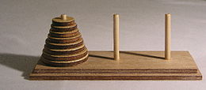

# Exercices - La récursivité

## Notebook d'exercices

!!! success "Notebook sur *Capytale*"
    Cliquez sur le lien ci-dessous pour accéder au **notebook** d'exercices sur *Capytale* :

    

    [Accéder au notebook d'exercices](https://capytale2.ac-paris.fr/web/c/4bce-4291104)
    

## Exercice : Les tours de Hanoï

*Source : [https://www.codingame.com/playgrounds/56923/apprendre-les-bases-de-python-pour-reussir-en-n-s-i-/tours-de-hanoi](https://www.codingame.com/playgrounds/56923/apprendre-les-bases-de-python-pour-reussir-en-n-s-i-/tours-de-hanoi){ target="_blank" }*.

Les tours de Hanoï est un casse-tête composé de trois tours et une pile de disques rangés du plus grand au plus petit comme sur la photo ci-dessous :

Le but est de déplacer la pile de disques sur la tour de droite en ne déplaçant à chaque fois qu'un seul disque et un disque ne peut pas être posé sur un disque plus petit. Voici une animation de ce qu'il faut faire dans le cas où il y a 4 disques.

Vous pouvez consulter [Wikipédia](https://fr.wikipedia.org/wiki/Tours_de_Hano%C3%AF){ target="_blank" } par exemple pour plus d'informations.

Nous allons voir qu'il est très simple de créer un programme récursif qui nous dit quoi faire pour résoudre le problème. Tout d'abord on appelle les tours `A`, `B` et `C`. On appelle `n` le **nombre de disque** présents au départ dans la tour `A`. Pour **déplacer tous les disques** de la tour `A` vers la tour `C`, on peut raisonner comme suit :

- On déplace `n-1` disques de `A` vers la tour `B`
- On déplace le dernier disque de `A` vers `C`
- On déplace les `n-1` disques de `B` vers `C`

L'astuce ici est de créer une fonction `hanoi` qui prend **4 paramètres** : `hanoi(n,debut,inter,fin)` où `n` est le **nombre de disques** à déplacer, `debut` est la **tour de départ** de nos `n` disques, `inter` est la **tour intermédiaire** que l'on peut utiliser pour déplacer et `fin` est la **tour** ou doivent se trouver les `n` **disques** au **final**.

Ainsi, on va initialement appeler `hanoi(n,"A","B","C")`, et lorsque l'on voudra déplacer les `n-1` **disques** de `A` vers `B`, on appelera `hanoi(n-1,"A","C","B")` .

!!! note "Exercice"
    Écrire cette **fonction récursive** `hanoi(n,debut,inter,fin)` de manière à afficher (avec **print**) à chaque étape le déplacement à effectuer sous la forme `"A B"` pour un déplacement de la tour "**A**" vers la tour "**B**" par exemple.

    On souhaite :
    
    - donner en **entrée** : `(n,"A","B","C")` où `n` est un entier.
    - obtenir en **sortie** : Les instructions à suivre pour déplacer les `n` disques de la tour `"A"` à la tour `"C"` donnée sous la forme `"A B"` pour signifier un déplacement de `A` vers `B` et affiché avec `print`.

## Sujets de bac

!!! success "À télécharger"
    [Extrait du sujet zéro B - 2023](exercices/sujet_02.pdf){ target="_blank" }