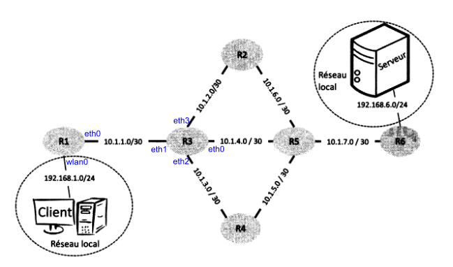

??? quote "Sources / Liens utiles"
    - [https://www.lyceum.fr/tg/nsi/3-architectures-materielles-systemes-dexploitation-et-reseaux/3-protocoles-de-routage/](https://www.lyceum.fr/tg/nsi/3-architectures-materielles-systemes-dexploitation-et-reseaux/3-protocoles-de-routage/){ target="_blank" }
    - [http://nsi4noobs.fr/IMG/pdf/c3_tnsi_routage.pdf](http://nsi4noobs.fr/IMG/pdf/c3_tnsi_routage.pdf){ target="_blank" }
    - [https://glassus.github.io/terminale_nsi/T5_Architecture_materielle/5.3_Protocoles_de_routage/cours/](https://glassus.github.io/terminale_nsi/T5_Architecture_materielle/5.3_Protocoles_de_routage/cours/){ target="_blank" }
    - [https://pixees.fr/informatiquelycee/n_site/nsi_term_archi_routage.html](https://pixees.fr/informatiquelycee/n_site/nsi_term_archi_routage.html){ target="_blank" }
    - TP Filius : [https://nsirennes.fr/os-archi/reseaux/](https://nsirennes.fr/os-archi/reseaux/){ target="_blank" }

# Cours - Protocoles de routage

## Rappels de première

Voici une petite activité (sous la forme d'un notebook) de rappel sur l'**adressage IP et les masques de sous-réseau** :
    

[:material-cursor-default-click: Télécharger l'activité d'introduction](src/protocoles_routage_activite_introduction.ipynb){ target="_blank" }

## Rappels modèles OSI et TCP / IP

## Introduction

Un **réseau informatique** permet la **connexion entre différentes machines** afin de faciliter la **communication** entre elles. Le modèle de communication généralement utilisé est le modèle **client-serveur**, qui permet aux **clients** d'échanger des **paquets d'informations** avec les **serveurs**. La notion de "client" est large, pouvant désigner aussi bien une application qu'une machine exécutant cette application. De même, le terme "serveur" peut faire référence à l'ordinateur hébergeant un service ou au logiciel fournissant ce service.

Les **paquets** de **bits** échangés sont les unités de base transitant sur le réseau physique. Ils résultent de la fragmentation des données à transmettre, telles que des pages web, des courriels ou des vidéos. Ces paquets sont envoyés séparément sur le réseau, et l'information initiale est reconstituée une fois qu'ils atteignent leur destination, que ce soit du côté client ou serveur.

En plus des clients et des serveurs, un réseau informatique est composé de **routeurs**, pouvant être de deux types : des **routeurs d'accès** (en bordure de réseau) ou des **routeurs internes**.  
Ces machines ont pour rôle de **relayer les paquets** dans le **réseau** pour les acheminer vers leur **destination finale**. Un **routeur** fait le lien entre **deux réseaux**. Les clients et les serveurs sont connectés aux routeurs d'accès via des **réseaux locaux** (en utilisant par exemple le Wi-Fi ou l'Ethernet). Les **routeurs internes** sont reliés entre eux sur de **plus longues distances** à l'aide de **fibres optiques**, de **câbles téléphoniques**, de **liaisons par satellite**, etc. L'interconnexion de ces routeurs via ces liens forme la **topologie du réseau**.

Par exemple, la **figure ci-dessous** représente la **topologie d'un réseau** avec **six routeurs**.

!!! success ""
    Les routeurs R1 et R6 sont des routeurs d'accès permettant aux machines Client et Serveur d'accéder au réseau. Les autres routeurs (R2 à R5) sont des routeurs internes. Les **adresses IP** des machines sont indiquées par une paire sous-réseau/masque. Par exemple, les routeurs R1 et R3 sont connectés à un sous-réseau avec l'adresse 10.1.1.0 et un masque de 30, signifiant que seuls les deux bits de poids faible de l'adresse peuvent être utilisés pour associer des adresses IP aux machines.

Lorsqu'un routeur reçoit un paquet, il analyse l'**adresse de destination** et choisit vers **quel routeur voisin** transmettre le paquet pour le faire progresser vers sa destination. Cette décision est prise en se basant sur la **table de routage du routeur**, qui associe les **adresses de destination** à des **adresses de routeurs voisins**. Ainsi, le paquet progresse de routeur en routeur jusqu'à atteindre le client ou le serveur auquel il est destiné. 

!!! note ""
    Par exemple, si un client souhaite envoyer un message au serveur, il le transmet à son **routeur d'accès** (R1), qui le renvoie au routeur R3. R3 choisit ensuite le prochain routeur à utiliser (R2, R4 ou R5) en se basant sur sa **table de routage**. Ce processus se répète à chaque routeur jusqu'à ce que le paquet parvienne au routeur R6, qui le délivre ensuite au **serveur**.

## Protocole RIP

Le **nombre de routeurs** dans un **réseau** est souvent trop élevé pour envisager une **configuration manuelle des tables de routage**. En effet, à chaque fois qu'un élément du réseau tombe en panne ou qu'une modification est apportée à sa **topologie** (comme l'ajout d'une nouvelle liaison ou d'un nouveau routeur), il devient nécessaire de recalculer toutes les routes et de mettre à jour les tables de routage de chaque routeur. Pour réaliser cette tâche, il serait également nécessaire d'envoyer toutes les données relatives à l'état des liaisons et des routeurs vers un opérateur unique, chargé de calculer les nouvelles routes. Outre les inconvénients de centraliser cette tâche, il faut également garantir que les informations sur l'état du réseau peuvent être transmises sans problème à cet opérateur. Malheureusement, les moyens de communication utilisés à cette fin peuvent eux aussi tomber en panne.

Pour toutes ces raisons, l'approche consiste à automatiser ce processus en permettant aux routeurs de mettre à jour leurs tables de routage sans intervention humaine. Ainsi, en plus de la transmission des paquets, les routeurs échangent des informations sur les routes du réseau en fonction de l'état de leurs voisins et de leurs liens de communication. Les règles régissant ces échanges sont définies par un protocole de routage.

Initialement, les informations dont dispose un routeur concernent ses voisins immédiats ainsi que les sous-réseaux auxquels il est connecté. En envoyant régulièrement des messages à ses voisins et en mesurant les temps de réponse de ces machines, le routeur peut déterminer si un autre routeur est en panne ou si la liaison entre eux est rompue. Il peut ensuite diffuser ces informations à tous ses voisins, qui peuvent à leur tour les transmettre à leurs voisins, et ainsi de suite. De cette manière, progressivement, tous les routeurs finissent par partager les mêmes connaissances sur la topologie du réseau. Cependant, pour que l'échange de ces informations soit bien coordonné, les routeurs doivent suivre le même protocole. Dans cette section, nous décrivons le **protocole RIP** (*Routing Information Protocol* en anglais), un exemple de protocole utilisé à cette fin.