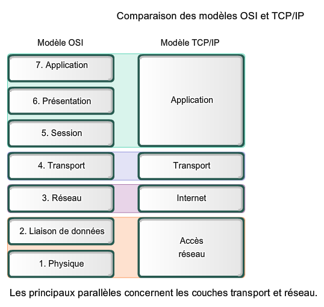
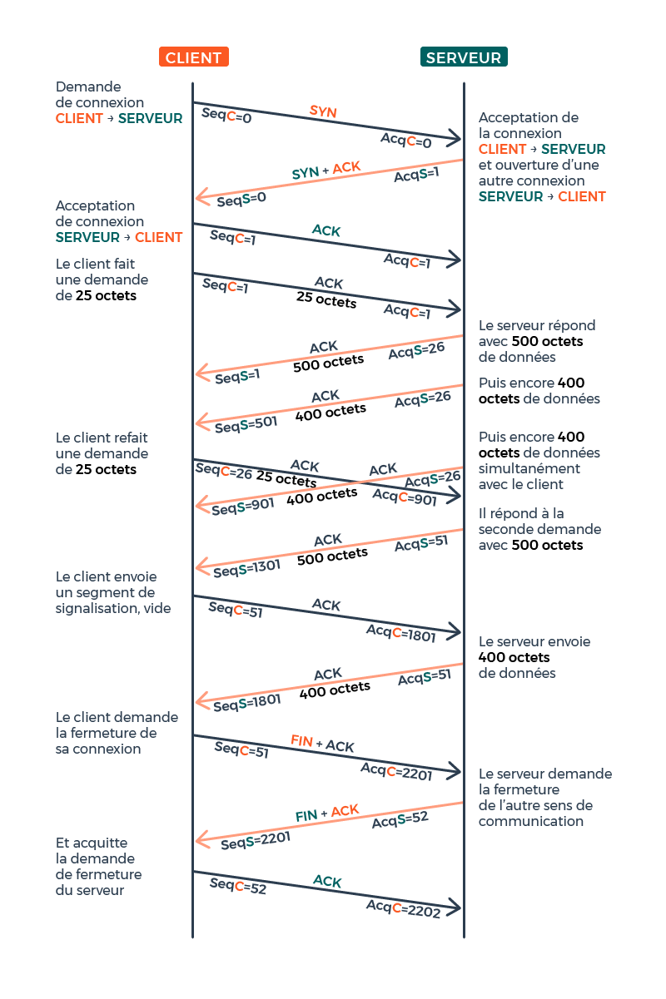

??? quote "Sources / Liens utiles"
    - Balabonski Terminale
    - [https://www.lyceum.fr/tg/nsi/3-architectures-materielles-systemes-dexploitation-et-reseaux/3-protocoles-de-routage/](https://www.lyceum.fr/tg/nsi/3-architectures-materielles-systemes-dexploitation-et-reseaux/3-protocoles-de-routage/){ target="_blank" }
    - [http://nsi4noobs.fr/IMG/pdf/c3_tnsi_routage.pdf](http://nsi4noobs.fr/IMG/pdf/c3_tnsi_routage.pdf){ target="_blank" }
    - [https://glassus.github.io/terminale_nsi/T5_Architecture_materielle/5.3_Protocoles_de_routage/cours/](https://glassus.github.io/terminale_nsi/T5_Architecture_materielle/5.3_Protocoles_de_routage/cours/){ target="_blank" }
    - [https://pixees.fr/informatiquelycee/n_site/nsi_term_archi_routage.html](https://pixees.fr/informatiquelycee/n_site/nsi_term_archi_routage.html){ target="_blank" }
    - TP Filius : [https://nsirennes.fr/os-archi/reseaux/](https://nsirennes.fr/os-archi/reseaux/){ target="_blank" }

# Cours - Protocoles de routage

## Rappels sur l'adressage IP

Voici une petite activité (sous la forme d'un notebook) de rappel sur l'**adressage IP et les masques de sous-réseau** :
    

[:material-cursor-default-click: Télécharger l'activité d'introduction](src/protocoles_routage_activite_introduction.ipynb){ target="_blank" }

!!! tip "Adresses *broadcast* et *multicast*"
    - **Broadcast** : Cette adresse vous permet d'appeler **tous les hôtes** (*interfaces*) à l'intérieur d'un **sous-réseau**. Une **adresse IP broadcast** est par exemple `192.168.100.255` et un **broadcast MAC** est `FF:FF:FF:FF:FF:FF`.
    - **Multicast** : Ce type d'adresse permet d'appeler un **groupe spécifique d'hôtes** (*interfaces*) dans un **sous-réseau**.

## Rappels - Qu'est-ce qu'un réseau ?

Vous pouvez dans un premier temps essayer de faire l'[exercice 1](#exercices) pour tester vos connaissances sur les composants d'un réseau.

Voici une petite vidéo résumant la **constitution d'un réseau** (et plus généralement du **réseau mondial**) :

<iframe width="560" height="315" src="https://www.youtube-nocookie.com/embed/JqweQE6TDTc" title="YouTube video player" frameborder="0" allow="accelerometer; autoplay; clipboard-write; encrypted-media; gyroscope; picture-in-picture; web-share" allowfullscreen></iframe>

## Rappels modèles OSI et TCP/IP

Voici un rappel des **modèles en couches** (en **7 couches** avec le modèle **OSI** et en **4 couches** avec le modèle **TCP/IP**,également appelé "modèle internet".)

??? abstract "Schéma plus détaillé - Encapsulation des données (modèle TCP/IP)"
    

??? abstract "Protocoles IP et TCP"
    Les **deux protocoles** qui nous intéressent particulièrement sont :

    - Le **protocole IP** (COUCHE **RÉSEAU**) qui consiste à attribuer à chaque machine une **adresse IP unique** pour l’**identifier sur le réseau**, et ainsi transmettre l'information sous la forme de **paquets** comportant l'indication de l'**adresse IP source** et de l'**adresse IP de destination**.
    - Le **protocole TCP** (COUCHE **TRANSPORT**) qui permet d’assurer la communication de l’information en la **découpant en segments**, comportant l'indication du **port source** et du **port de destination**, et en s’assurant que tous les paquets soient bien **reçus** et **conformes** à l’**information envoyée**. (Il existe un protocole plus rapide mais qui, contraiement à **TCP**, n'assure pas que toutes les données soient reçues : le protocole **UDP**.)

    Voici un rappel de la manière dont s'effectue l'**établissement d'une connexion** ainsi que la **transmission des données** avec le protocole **TCP** ([source de l'image](https://openclassrooms.com/fr/courses/2340511-maitrisez-vos-applications-et-reseaux-tcp-ip/5678267-exercez-vous-au-suivi-de-connexion){ target="_blank" }):

    

    Lorsqu'un paquet n'est pas correctement transmis, il est **de nouveau envoyé** ([source de l'image](http://shtroumbiniouf.free.fr/CoursInfo/Reseau2/Cours/TCP/TCP.html){ target="_blank" }):

    

    
    

    

    [:octicons-link-external-16: Voir plus d'informations sur le protocole TCP](https://laissus.developpez.com/tutoriels/cours-introduction-tcp-ip/?page=page_7){ target="_blank" }
    

## Introduction

Un **réseau informatique** permet la **connexion entre différentes machines** afin de faciliter la **communication** entre elles. Le modèle de communication généralement utilisé est le modèle **client-serveur**, qui permet aux **clients** d'échanger des **paquets d'informations** avec les **serveurs**. La notion de "client" est large, pouvant désigner aussi bien une application qu'une machine exécutant cette application. De même, le terme "serveur" peut faire référence à l'ordinateur hébergeant un service ou au logiciel fournissant ce service.

Les **paquets** de **bits** échangés sont les unités de base transitant sur le réseau physique. Ils résultent de la fragmentation des données à transmettre, telles que des pages web, des courriels ou des vidéos. Ces paquets sont envoyés séparément sur le réseau, et l'information initiale est reconstituée une fois qu'ils atteignent leur destination, que ce soit du côté client ou serveur.

En plus des clients et des serveurs, un réseau informatique est composé de **routeurs**, pouvant être de deux types : des **routeurs d'accès** (en bordure de réseau) ou des **routeurs internes**.  
Ces machines ont pour rôle de **relayer les paquets** dans le **réseau** pour les acheminer vers leur **destination finale**. Un **routeur** fait le lien entre **deux réseaux**. Les clients et les serveurs sont connectés aux routeurs d'accès via des **réseaux locaux** (en utilisant par exemple le *Wi-Fi* ou l'*Ethernet*). Les **routeurs internes** sont reliés entre eux sur de **plus longues distances** à l'aide de **fibres optiques**, de **câbles téléphoniques**, de **liaisons par satellite**, etc. L'interconnexion de ces routeurs via ces liens forme la **topologie du réseau**.

Par exemple, la **figure ci-dessous** représente la **topologie d'un réseau** avec **six routeurs**.

<figure markdown>
  
  <figcaption><b>Figure 1</b> : Topologie d'un réseau</figcaption>
</figure>

!!! success ""
    Les **routeurs R1** et **R6** sont des **routeurs d'accès** permettant aux **machines Client** et **Serveur** d'**accéder au réseau**. Les autres routeurs (**R2 à R5**) sont des **routeurs internes**. Les **adresses IP** des machines sont indiquées par une paire **sous-réseau/masque**. Par exemple, les routeurs **R1** et **R3** sont connectés à un **sous-réseau** avec l'adresse **10.1.1.0** et un **masque de 30**, signifiant que seuls les deux bits de poids faible de l'adresse peuvent être utilisés pour associer des adresses IP aux machines.

Lorsqu'un routeur reçoit un paquet, il analyse l'**adresse de destination** et choisit vers **quel routeur voisin** transmettre le paquet pour le faire progresser vers sa destination. Cette décision est prise en se basant sur la **table de routage du routeur**, qui associe les **adresses de destination** à des **adresses de routeurs voisins**. Ainsi, le paquet progresse de routeur en routeur jusqu'à atteindre le client ou le serveur auquel il est destiné. 

!!! note ""
    Par exemple, si un client souhaite envoyer un message au serveur, il le transmet à son **routeur d'accès** (R1), qui le renvoie au routeur R3. R3 choisit ensuite le prochain routeur à utiliser (R2, R4 ou R5) en se basant sur sa **table de routage**. Ce processus se répète à chaque routeur jusqu'à ce que le paquet parvienne au routeur R6, qui le délivre ensuite au **serveur**.

## Principe du routage

Si l'**hôte de destination** et l'**hôte source** sont **sur le même réseau**, les paquets de données circulent directement entre eux sur le **support local** de **niveau 2** (*deuxième couche du modèle OSI*) via des **commutateurs** (*switchs*), sans nécessiter l'intervention d'un **routeur**. Les **commutateurs** construisent une **table d'adresses MAC** des **machines IP** connectées à eux, utilisant ces **adresses** pour **commuter les trames**.

En revanche, si l'**hôte source** et l'**hôte de destination** ne sont **pas sur le même réseau**, le réseau local dirige le **paquet** de la **source** vers son **routeur de passerelle de niveau 3** (*troisième couche du modèle OSI*). Le **routeur** analyse la **partie réseau de l'adresse de destination** du **paquet** et le **dirige vers l'interface appropriée**. Si le **réseau de destination** est directement **connecté à ce routeur**, le **paquet** est **transmis directement à l'hôte de destination**. Dans le cas contraire, le **paquet** est **envoyé à un second routeur**, qui agit comme le **routeur de tronçon suivant**. Le transfert du paquet devient alors la responsabilité de ce second routeur. De **multiples routeurs ou sauts** tout au long du chemin peuvent traiter le paquet avant qu'il n'atteigne sa **destination**. Contrairement aux **commutateurs**, les **routeurs** se basent sur les **adresses IP** pour le transfert des données.

!!! success ""
    Aucun paquet ne peut être acheminé sans route. Que le paquet provienne d'un **hôte** ou soit dirigé par un **routeur intermédiaire**, le routeur a besoin d'une **route** pour déterminer son **itinéraire**. Si aucune route n'existe vers le **réseau de destination**, le paquet ne peut pas être transféré.
    
    Les **routeurs** utilisent des **tables de routage**, qui peuvent être établies de deux manières :
    
    - par un ==**routage statique**== : chaque ligne doit être renseignée "à la main". Cette solution est seulement envisageable pour des très petits réseaux de réseaux.
    - par un ==**routage dynamique**== : tout se fait "automatiquement", en utilisant des **protocoles** tels que **RIP** (*Routing Information Protocol*) ou **OSPF** (*Open Shortest Path First*)==, qui vont permettre de "découvrir" les **différentes routes automatiquement** afin de pouvoir **remplir la table de routage** tout aussi **automatiquement**.

!!! abstract "Une tableau de routage"
    Voici à quoi ressemble une **table de routage** (source : [Wikipédia](https://fr.wikipedia.org/wiki/Table_de_routage){ target="_blank" }) :

    | Réseau destination (format CIDR) | Masque           | Passerelle      | Interface       | Métrique |
    |----------------------------------|------------------|-----------------|------------------|----------|
    | 0.0.0.0/0                        | 0.0.0.0          | 192.168.0.1     | 192.168.0.100   | 1        |
    | 127.0.0.0/8                      | 255.0.0.0        | 127.0.0.1       | 127.0.0.1       | 1        |
    | 192.168.0.0/24                   | 255.255.255.0    | 192.168.0.100   | 192.168.0.100   | 1        |
    | 192.168.0.100/32                 | 255.255.255.255  | 127.0.0.1       | 127.0.0.1       | 1        |
    | 192.168.0.1/32                   | 255.255.255.255  | 192.168.0.100   | 192.168.0.100   | 1        |

    La ==**métrique**== est une mesure de la « distance » qui ==sépare un **routeur** d'un **réseau de destination**==. Dans le cadre du **protocole RIP**, on peut l'assimiler au **nombre de sauts IP nécessaires** pour **atteindre le réseau destination** (ce qui n'est pas le cas pour le protocole **OSPF**, où la métrique sera liée au **coût des liaisons**). Ainsi, un réseau **directement lié à un routeur** aura une métrique de `0`.

    Sur votre ordinateur, vous pouvez **afficher la table de routage** utilisée par **votre système** en utilisant les commandes suivantes :

    - Sous **Windows** : `route print` ou `netsh int ipv4/ipv6 sh route`
    - Sous **Unix/OS X** : `netstat -rn
    - Sous **Linux** : `ip -4/-6 route`

!!! note "Exemple de table de routage"
    Voici un exemple de réseau (*source* : [pixees](https://pixees.fr/informatiquelycee/n_site/nsi_term_archi_routage.html){ target="_blank" })

    <figure markdown>
    
    <figcaption><b>Figure 2</b> : Diagramme d’un réseau</figcaption>
    </figure>

    Voici par exemple ce que donnerait la **table de routage** du **routeur A**, après la mise à jour effectuée avec le **protocole RIP** :

    | Réseau           |   Passerelle   | Interface | Métrique |
    |------------------|----------------|-----------|----------|
    | 172.168.0.0/16   |                | eth0      | 0        |
    | 192.168.7.0/24   |                | eth1      | 0        |
    | 172.169.0.0/16   |                | eth2      | 0        |
    | 10.0.0.0/8       | 192.168.7.2/24 | eth1      | 1        |

    !!! note ""
        À votre tour, donnez la **table de routage** du routeur **G**.

## Principe des algorithmes de routage

Un **ensemble de réseaux interconnectés** par des **routeurs** peut être **représenté** sous forme de ==**graphe**==, où **chaque routeur** est un ==**nœud**== et **chaque connexion entre les routeurs** ou **entre un routeur et un commutateur** constitue une ==**arête**==. Les **algorithmes** employés par les **protocoles de routage** sont ainsi dérivés de la **théorie des graphes**. Une illustration de ce concept est présentée dans le schéma ci-dessous :

<figure markdown>
  
  <figcaption><b>Figure 3</b> : Exemple de réseau représenté sous la forme de graphe, avec les tables de routage qui correspondent.</figcaption>
</figure>

L'objectif d'un **algorithme de routage** est de **déterminer un chemin dans ce graphe**, établissant ainsi une **liaison** entre l'**émetteur et le destinataire**. Bien qu'il existe de nombreux **algorithmes** pour trouver le **chemin le plus court** entre deux points d'un graphe, ces derniers sont rarement utilisés de manière directe par les algorithmes de routage.

Les **algorithmes de routage** peuvent également prendre en considération les **performances** des divers **chemins** entre deux **routeurs**. La mise à jour des **tables de routage** permet alors d'identifier des **chemins plus courts** ou **plus rapides** pour **acheminer des données** vers une **adresse IP spécifique**. Pour y parvenir, on peut attribuer un ==**poids**== (*pondération*) à chaque **arête**, représentant le **coût de transmission** entre **deux routeurs**, en fonction du **débit de la liaison** (c'est ce que l'on verra avec le protocole **OSPF**).

## Protocole « à vecteur de distances » - RIP

Le **nombre de routeurs** dans un **réseau** est souvent **trop élevé** pour envisager une **configuration manuelle des tables de routage**. En effet, à chaque fois qu'un élément du réseau tombe en panne ou qu'une modification est apportée à sa **topologie** (comme l'ajout d'une nouvelle liaison ou d'un nouveau routeur), il devient nécessaire de **recalculer toutes les routes** et de **mettre à jour les tables de routage de chaque routeur**. Pour réaliser cette tâche, il serait également nécessaire d'envoyer toutes les données relatives à l'**état des liaisons** et des **routeurs** vers un **opérateur unique**, chargé de **calculer les nouvelles routes**. Outre les inconvénients de centraliser cette tâche, il faut également garantir que les informations sur l'état du réseau peuvent être transmises sans problème à cet opérateur. Malheureusement, les moyens de communication utilisés à cette fin peuvent eux aussi **tomber en panne**.

Pour toutes ces raisons, l'approche consiste à **automatiser ce processus** en permettant aux routeurs de mettre à jour leurs tables de routage sans intervention humaine. Ainsi, en plus de la **transmission des paquets**, les routeurs échangent des informations sur les **routes** du **réseau** en fonction de l'**état de leurs voisins** et de leurs **liens de communication**. Les règles régissant ces échanges sont définies par un **protocole de routage**.

Initialement, les **informations** dont dispose un **routeur** concernent **ses voisins immédiats** ainsi que les **sous-réseaux auxquels il est connecté**. En **envoyant** régulièrement des **messages** à ses **voisins** et en mesurant les temps de réponse de ces machines, le routeur peut déterminer si un autre routeur **est en panne** ou si la liaison entre eux est **rompue**. Il peut ensuite diffuser ces informations à tous ses voisins, qui peuvent à leur tour les transmettre à leurs voisins, et ainsi de suite. De cette manière, progressivement, tous les routeurs finissent par partager les mêmes connaissances sur la topologie du réseau. Cependant, pour que l'échange de ces informations soit bien coordonné, les routeurs doivent suivre **le même protocole**. Dans cette section, nous décrivons le ==**protocole RIP**== (*Routing Information Protocol* en anglais), un exemple de protocole utilisé à cette fin.

!!! abstract "Principe du protocole RIP"
    Le **protocole RIP** s'appuie sur l'==**algorithme de Bellman-Ford**== (un algorithme utilisant le principe de **programmation dynamique**), permettant de **calculer les plus courts chemins** dans un graphe.

    L'**algorithme** du **protocole RIP** repose sur le **partage d'informations entre routeurs** pour déterminer les **meilleures routes vers différents sous-réseaux**. Chaque **routeur** communique avec ses **voisins** en échangeant des ==**vecteurs de distance**==, c'est-à-dire des ==couples `(adresse, distance)`==, qui représentent la distance en **nombre de sauts** vers une **machine spécifique**. Ces échanges permettent aux routeurs de **construire** et **mettre à jour** leurs tables de routage.

    Dans la phase d'**initialisation**, chaque routeur **transmet les adresses de ses voisins** et les **distances associées**. Ces informations sont utilisées pour former des **vecteurs de distance**. À partir de là, le **protocole RIP** continue par des **échanges périodiques** de **demandes** et de **réponses** entre les **routeurs**. Lorsqu'un **routeur** reçoit une réponse de son **voisin**, plusieurs scénarios peuvent se produire :

    1. Découverte d'une nouvelle route vers un sous-réseau inconnu : le routeur l'ajoute à sa table.
    2. Découverte d'une route plus courte vers un sous-réseau connu : le routeur met à jour sa table en remplaçant l'ancienne route par la nouvelle.
    3. Réception d'une nouvelle route plus longue : le routeur ignore cette information.
    4. Réception d'une route existante, mais plus longue, vers un routeur passant par le même voisin : le routeur met à jour sa table en tenant compte de cette nouvelle route.

    Les **distances associées** aux routes sont ajustées en fonction du **chemin** parcouru, et la **distance maximale est limitée à 15 routeurs intermédiaires**. Au-delà de cette **limite**, la route est **ignorée** ou **supprimée des tables de routage**.

    En répétant ces échanges et en mettant à jour les tables de routage à intervalle fixe (l'intervalle de mise à jour par défaut pour le RIP est de 30 secondes.), les routeurs convergent vers une vision commune du réseau, déterminant ainsi les meilleures routes pour acheminer les paquets vers leurs destinations.

??? quote "Un exemple d'application"
    Si l'on reprend la **figure 1** :

    <figure markdown>
    
    <figcaption><b>Figure 1</b> : Topologie d'un réseau</figcaption>
    </figure>

    Au **début du protocole**, les tables des routeurs **R1** et **R3** sont initialisées avec les **informations** concernant leurs **voisins immédiats**, à savoir les **adresses des sous-réseaux** sur lesquels ils sont **directement connectés** :

    - Pour le routeur **R1** :
    
    | Réseau           |   Passerelle   | Interface | Distance |
    |------------------|----------------|-----------|----------|
    | 10.1.1.0/30      |                | eth0      | 0        |
    | 192.168.1.0/24   |                | wlan0     | 0        |

    - Pour le routeur **R3** :

    | Réseau           |   Passerelle   | Interface | Distance |
    |------------------|----------------|-----------|----------|
    | 10.1.1.0/30      |                | eth1      | 0        |
    | 10.1.2.0/30      |                | eth3      | 0        |
    | 10.1.3.0/30      |                | eth2      | 0        |
    | 10.1.4.0/30      |                | eth0      | 0        |

    ---

    Après avoir **échangé** une **demande RIP avec R3**, la table du **routeur R1** contient les **informations suivantes** :

    | Réseau           |   Passerelle   | Interface | Distance |
    |------------------|----------------|-----------|----------|
    | 10.1.1.0/30      |                | eth0      | 0        |
    | 192.168.1.0/24   |                | wlan0     | 0        |
    | 10.1.2.0/30      |   10.1.1.2     | eth0      | 1        |
    | 10.1.3.0/30      |   10.1.1.2     | eth0      | 1        |
    | 10.1.4.0/30      |   10.1.1.2     | eth0      | 1        |

    **À votre tour**, indiquez les **informations** contenues dans la **table du routeur R3** après son **échange** avec **R1**.

    ??? tip "Solution"
        | Réseau           |   Passerelle   | Interface | Distance |
        |------------------|----------------|-----------|----------|
        | 10.1.1.0/30      |                | eth1      | 0        |
        | 10.1.2.0/30      |                | eth3      | 0        |
        | 10.1.3.0/30      |                | eth2      | 0        |
        | 10.1.4.0/30      |                | eth0      | 0        |
        | 192.168.1.0/24   |   10.1.1.1     | eth1      | 1        |

    ---

    Si l'on **répète** ces **demandes RIP** et en **mettant à jour les tables de routages** selon l'algorithme décrit précédemment, les routeurs auront finalement **la même « vision » du réseau** avec les **meilleures routes à suivre** pour **acheminer un paquet**.
    
    Par exemple, la **table de routage finale** du routeur **R1** sera la suivante :

    | Réseau           |   Passerelle   | Interface | Distance |
    |------------------|----------------|-----------|----------|
    | 10.1.1.0/30      |                | eth0      | 0        |
    | 192.168.1.0/24   |                | wlan0     | 0        |
    | 10.1.2.0/30      |   10.1.1.2     | eth0      | 1        |
    | 10.1.3.0/30      |   10.1.1.2     | eth0      | 1        |
    | 10.1.4.0/30      |   10.1.1.2     | eth0      | 1        |
    | 10.1.7.0/30      |   10.1.1.2     | eth0      | 2        |
    | 192.168.6.0/24   |   10.1.1.2     | eth0      | 3        |

!!! tip "Détection des pannes"
    Le **protocole RIP** doit également inclure un mécanisme permettant de **déterminer si une liaison est défaillante**. À cet effet, un **routeur** considère qu'un **voisin est en panne** s'il ne reçoit **pas de réponse à une requête RIP** dans un **délai spécifique**, par défaut fixé à **trois minutes**. Lorsqu'un routeur détecte qu'un sous-réseau devient inaccessible, il transmet cette information à ses voisins en l'exprimant sous forme d'une **route avec une distance infinie**. Dans le contexte du **RIP**, cette **distance infinie** est représentée par une ==**valeur de 16**==.

!!! tip "Délai de convergence"
    Étant donné que les distances maximales ne peuvent dépasser **15 sauts** (ou liaisons traversées), les routeurs ne peuvent pas déterminer les chemins les plus courts vers des sous-réseaux nécessitant des routes excessivement longues. Cette restriction limite effectivement l'applicabilité du protocole RIP aux **réseaux de petite taille**. La fixation de cette limite vise à réduire le **délai de convergence** du **protocole**, c'est-à-dire le **temps nécessaire pour que tous les routeurs parviennent à une vision uniforme de la topologie du réseau**. Une limite plus élevée entraînerait un temps de convergence plus long.

!!! tip "Boucles de routage"
    Une **boucle de routage** peut se produire lorsque les informations dans les tables de routage entraînent la circulation continue d'un paquet dans le réseau, l'empêchant ainsi d'atteindre sa destination. **Deux solutions** sont envisageables pour prévenir ce phénomène :
    
    1. garantir que les **tables de routage** sont toujours **correctement configurées** pour éviter toute possibilité de boucle,
    2. permettre aux routeurs de détecter quand un paquet **circule en boucle** dans le réseau, notamment grâce au **TTL** (Time-to-Live)).

    Le **protocole RIP** est conçu de manière à prévenir la **création de boucles de routage** lors de la **mise à jour des tables**. La **limitation** imposée sur les **distances des routes** constitue une première technique. Cependant, cette mesure n'est **pas suffisante**, et il est nécessaire d'établir **d'autres règles** pour empêcher ce scénario. Par exemple, la règle du **"split horizon"** stipule qu'**un routeur ne doit pas renvoyer une information à un autre routeur s'il a appris cette information du même routeur**. Une autre règle, appelée le **temporisateur de retenue** (*Hold down* en anglais), oblige un routeur, qui constate l'indisponibilité d'une route vers un sous-réseau, à ignorer toute information concernant des routes vers ce sous-réseau pendant une certaine période (utilisant un temporisateur à cet effet).

## Protocole « à état de liens » - OSPF

### Présentation

Dans la section précédente, nous avons examiné le fonctionnement du **protocole RIP**, soulignant sa capacité à **configurer les tables de routage** en privilégiant les **routes les plus courtes** en termes de **nombre de routeurs traversés** (*nombre de sauts*). Malheureusement, cette approche basée sur la **distance** ne **garantit pas l'optimisation des routes en termes de débit**, car les caractéristiques des liaisons (*fibre optique*, *satellite*, *sans fil*, etc.) ne sont **pas prises en compte** dans les **échanges d'informations** entre les **dispositifs** via ce protocole. De plus, nous avons noté que le **RIP** n'était pas adapté aux **réseaux étendus**, limitant son exploration aux routes de **moins de 15 sauts** pour réduire le **délai de convergence** et éviter les **boucles de routage**.

C'est pour remédier à ces lacunes que le protocole ==**OSPF**== (*Open Shortest Path First*) a été développé dans les **années 90** par l'**IETF** (*Internet Engineering Task Force*), un **organisme de normalisation international**. La spécificité de l'**OSPF** réside dans son utilisation de la ==**bande passante des liaisons**== pour le **calcul des meilleures routes**. La bande passante, mesurée en **bits par seconde** (bit/s) ou avec des préfixes tels que **kilo** (kbit/s) et **Mega** (Mbit/s), devient ainsi un critère essentiel.  
Contrairement au **RIP**, le **nombre de routeurs traversés** n'influe **plus** sur le **choix de la route** dans **OSPF**, où la **distance** est uniquement **liée aux coûts des liaisons nécessaires** pour **relier deux routeurs**.

!!! abstract "Coût des liaisons"
    Le **coût** est défini ainsi :

    $$
    coût = \frac{10^8}{d}
    $$

    où $d$ représente la **bande passante** en **bit/s** de la **liaison**. La valeur de $10^8$ a été délibérément choisie pour attribuer un **coût de 1** à une **liaison FastEthernet** avec un débit de **100 Mbit/s**. Ainsi, une **liaison plus lente par satellite** à $50$ **Mbits/s** aura un coût de **5**, tandis qu'un **câble Ethernet** à $10$ **Mbit/s** aura un **coût de 10**.

!!! abstract "Principe du protocole OSPF"
    Le fonctionnement d'**OSPF** se découpe en deux étapes majeures.

    1. Dans la **première étape**, chaque **routeur**, après **initialisation**, cherche à **identifier ses voisins** pour établir une **relation de voisinage**.  
    Le protocole **OSPF** organise les **machines** en **différentes zones** (ensembles de machines), limitant ainsi la **recherche de voisins des routeurs** à leur **zone assignée**. La séquence de cette phase pour un **routeur R** est détaillée comme suit :
        - **R** choisit un identificateur unique, tel que sa **plus grande adresse IP** parmi celles de ses sous-réseaux.
        - Le **routeur R** envoie des messages de type ==**HELLO**== à travers toutes ses **interfaces réseau**, contenant son **identificateur**, le **numéro de sa zone**, et la **liste des identificateurs** de ses **voisins** avec qui il a établi une **relation de voisinage**.  
        { width="300" }
        - Quand un **routeur** de la zone reçoit un paquet **HELLO** de **R**, il vérifie si l'**identificateur** de **R** est **déjà dans sa liste de voisins**.
            - Si oui, il **envoie** un **accusé de réception à R** pour indiquer qu'il est **toujours actif**.
            - Sinon, il **répond** en **fournissant des informations** sur la **topologie du réseau**. 
        - **R** répond de même. Les **messages** qui contiennent les **états des liens** sont appelés **LSA** (*Link State Advertisement*). Ces **messages** ne **sortent jamais de la zone**, et **plusieurs échanges sont nécessaires** pour synchroniser les **connaissances des routeurs** dans une **zone**. Le processus de cette étape initiale est une **diffusion** (*flooding*) de l'**information de voisinage**.
    1. La deuxième étape d'**OSPF** implique l'**exécution d'un algorithme**, au sein de **chaque routeur**, pour calculer les **meilleures routes** vers tout **autre routeur de la zone**. Le **coût** d'une route, utilisé dans cet algorithme, est la **somme des coûts des liaisons entre les routeurs traversés**. La **meilleure route** est celle avec le **coût le plus bas**, et une fois calculée, elle est enregistrée dans la **table de routage du routeur**.

??? abstract "Établissement d'une relation de voisinage entre deux routeurs"
    Avant d'établir une relation de voisinage, les **routeurs OSPF** traversent plusieurs étapes de **changement d'état**. Voici quelles sont ces étapes **entre deux routeurs** :

    1. État **initial** : Un routeur reçoit un **message Hello** de l'autre **routeur OSPF**.
    2. État **2-way** : Le **voisin** a reçu le **message Hello** et a répondu avec un **message Hello**.
    3. État **Exstart** : Le début de l'échange de **LSDB** (Base de données d'état de lien) entre les **deux routeurs**. Les **routeurs** commencent à **échanger des informations sur l'état des liens**.
    4. État **Exchange** : Les paquets **DBD** (Database Descriptor) sont **échangés**. Les **DBD** contiennent des **en-têtes LSA** (Annonces d'**état de lien**). Les **routeurs** utilisent ces **informations** pour déterminer quels **LSA** doivent être échangés.
    5. État **Loading** : Un voisin envoie des **LSR** (Link State Requests) pour **chaque réseau qu'il ne connaît pas**. L'autre **voisin** répond avec les **LSU** (Link State Updates) contenant des **informations** sur les **réseaux demandés**. Après avoir reçu **toutes les informations demandées**, l'**autre voisin** passe par le même processus.
    6. État **Full** : Les **deux routeurs** ont une **base de données synchronisée** et sont **complètement adjacents** l'un à l'autre.

    En résumé, **chaque routeur** communique la **liste** des **réseaux** auxquels il est **connecté** au moyen de **messages Link-State Advertisements** (**LSA**) propagés **progressivement** à **tous les routeurs du réseau.**  
    L'ensemble des **LSA** forme une **base de données d'état des liens** (*Link-State Database* - **LSDB**) pour **chaque zone** (*area*), **identique pour tous les routeurs de cette zone**.  
    Ensuite, **chaque routeur** utilise l'==**algorithme de Dijkstra**== (*Shortest Path First*), pour déterminer la **route la plus rapide** vers **chacun des réseaux répertoriés** dans la **LSDB**.

??? abstract "Messages LSA, LSU et LSR"
    Les **messages LSA** (Link-State Advertisments) sont utilisés par les routeurs **OSPF** pour **échanger des informations topologiques**. Chaque **LSA** contient des **données de routage** et de **topologie**, décrivant ainsi une partie du **réseau OSPF**.
    
    - Lorsqu'il est décidé d'échanger des **routes** entre **deux voisins**, ceux-ci envoient **réciproquement** une **liste de tous les LSA présents dans leur base de données topologique respective**.  
    - Chaque **routeur** examine ensuite sa **base de données topologique** et envoie un **message LSR** (Link-State Request) demandant tous les **LSA** qui ne se trouvent **pas** dans sa **table de topologie**.
    - L'**autre routeur** répond avec le **LSU** (Link-State Update) contenant **tous les LSA demandés** par son **voisin**.

    <figure markdown>
    
    <figcaption>Source : <a href="http://nsi4noobs.fr/IMG/pdf/c3_tnsi_routage.pdf">nsi4noobs</a></figcaption>
    </figure>

    Dans l'**exemple** ci-dessus, après l'**initialisation d'OSPF** sur les **deux routeurs**, ces derniers échangent des **LSA** pour **décrire leur base de données topologique respective** :

    - Le **routeur R1** envoie un **en-tête LSA** pour son **réseau directement connecté**, le `10.0.1.0/24`.
    - Le **routeur R2** vérifie sa **base de données topologique** et constate qu'il ne possède **pas d'informations sur ce réseau**. Il envoie alors un **message** de **demande d'état de liaison** (**LSR**) pour obtenir des **détails** supplémentaires sur **ce réseau**.
    - **Le routeur R1** répond avec une **mise à jour de l'état de liaison** (**LSU**) contenant des informations sur le sous-réseau `10.0.1.0/24` (adresse du prochain saut, coût, etc.).

!!! abstract "Organisation en zones"
    Pour faciliter l'utilisation d'**OSPF** dans de **vastes réseaux**, les routeurs sont organisés de manière logique en **zones**, limitant la recherche de **voisins**, l'**échange d'états de liens**, et la **découverte de la topologie** aux **routeurs d'une même zone**. Cette organisation suit une **structure hiérarchique simple**, chaque zone ayant un **numéro unique**.

    <figure markdown>
    
    <figcaption>Topologie d'un réseau de routeurs OSPF répartis dans trois zones et avec des liaisons de communication de 10 ou 100 Mbit/s (extrait du <i>Balabonski Terminale</i>).</figcaption>
    </figure>

    La **zone 0**, appelée ***Backbone***, est **obligatoire** pour **OSPF**, agissant comme une **zone centrale** à laquelle **toutes les autres zones sont connectées**. Les ==**routeurs ABR**== (*Area Border Router*) sont **spécifiques à cette architecture**, étant les **seuls** à être **rattachés à deux zones** (leur zone et la Backbone). Les **autres routeurs** ne sont rattachés qu'à **une seule zone**, communiquant **exclusivement** avec les **routeurs de cette zone**.  
    Il existe également des **routeurs** qui **connectent un réseau OSPF** à d’**autres domaines de routage** (réseau EIGRP par exemple), on les appelle ==**routeurs ASBR**== (Autonomous System Border Routers).

    Cette **structure hiérarchique** entraîne une **conséquence notable** : pour **échanger des paquets** entre **zones** (c'est-à-dire avec des adresses source et destination situées dans des zones différentes), les **routeurs** doivent inévitablement **diriger ces paquets** vers leur **routeur ABR** pour **sortir de leur zone**.  
    Cependant, les **messages LSA** étant restreints à **une zone**, les **routeurs** n'ont **pas connaissance de la topologie du reste du réseau**, rendant impossible la détermination de la **meilleure route pour les paquets inter-zone**. Les **routeurs ABR** jouent un **rôle crucial** dans ce contexte, communiquant les **meilleures routes de leur zone** à **toutes les autres zones** via la **Backbone**. Ces informations, transmises à travers la **Backbone**, sont essentielles pour permettre à **chaque routeur** de **calculer les chemins les plus courts** pour **l'ensemble du réseau** sans avoir une connaissance complète de sa **topologie**.

!!! tip "Multidiffusion (*multicast*)"
    Pour une **diffusion plus efficace**, un **routeur** envoie ses messages **HELLO** en **multidiffusion** (ou *multicast*) vers **tous les routeurs de sa zone** toutes les **10 secondes**. En « écoutant » l'adresse `224.0.0.5` (qui est utilisée par défaut par le protocole **OSPF**), un **routeur** de la **zone** voit passer ces **messages** et peut y **répondre** s'il le souhaite.

    Une **minuterie morte** (*dead timer*) correspond à **quatre fois la valeur** de l’**intervalle HELLO**. Si un **routeur** sur un réseau **Ethernet** ne reçoit pas au moins **un paquet HELLO** d’un **voisin OSPF** pendant **40 secondes**, il est déclaré “non fonctionnel” (down) par les autres routeurs.

!!! tip "Gestion des pannes et des modifications de réseau"
     Pour avoir une image fidèle de la **topologie du résea**u, qui peut **évoluer** en fonction des **pannes** ou de l'**ajout de nouveaux routeurs** ou **liens de communications**, les routeurs s'échangent régulièrement des messages **HELLO** et **LSA**. Lorsqu'un routeur n'a **pas de réponse** d'un voisin qu'il connaît déjà **au bout de 4 messages HELLO**, ce voisin est considéré comme étant **en panne**.

??? tip "Tableau des bandes passantes"
    Voici un tableau de quelques **bandes passantes** (BP) des **liaisons de communication** les plus courantes. Certaines de ces technologies sont **asymétriques**, cela signifie que leur **bande passante ascendante** (de l'utilisateur vers le fournisseur) est **plus faible** que la **bande passante descendante** (du fournisseur vers l'utilisateur).

    
    <table class="tg">
    <thead>
    <tr>
        <th class="tg-fymr">Technologie</th>
        <th class="tg-fymr">BP descendante</th>
        <th class="tg-fymr">BP montante</th>
    </tr>
    </thead>
    <tbody>
    <tr>
        <td class="tg-0pky">Modem</td>
        <td class="tg-c3ow">56 kbit/s</td>
        <td class="tg-c3ow">48 kbit/s</td>
    </tr>
    <tr>
        <td class="tg-0pky">Bluetooth</td>
        <td class="tg-c3ow" colspan="2">3 Mbit/s</td>
    </tr>
    <tr>
        <td class="tg-0pky">Ethernet</td>
        <td class="tg-c3ow" colspan="2">10 Mbit/s</td>
    </tr>
    <tr>
        <td class="tg-0pky">Wi-Fi</td>
        <td class="tg-c3ow" colspan="2">11 Mbit/s à 10 Gbit/s</td>
    </tr>
    <tr>
        <td class="tg-0pky">ADSL</td>
        <td class="tg-c3ow">13 Mbit/s</td>
        <td class="tg-c3ow">1 Mbit/s</td>
    </tr>
    <tr>
        <td class="tg-0pky">4G</td>
        <td class="tg-c3ow">100 Mbit/s</td>
        <td class="tg-c3ow">50 Mbit/s</td>
    </tr>
    <tr>
        <td class="tg-0pky">Satellite</td>
        <td class="tg-c3ow">50 Mbit/s</td>
        <td class="tg-c3ow">1 Mbit/s</td>
    </tr>
    <tr>
        <td class="tg-0pky">FastEthernet</td>
        <td class="tg-c3ow" colspan="2">100 Mbit/s</td>
    </tr>
    <tr>
        <td class="tg-0pky">FFTH (Fibre)</td>
        <td class="tg-c3ow" colspan="2">10 Gbit/s</td>
    </tr>
    </tbody>
    </table>

??? success "Une petite vidéo résumant OSPF"
    <iframe width="560" height="315" src="https://www.youtube-nocookie.com/embed/RbPrYZzs_2M" title="YouTube video player" frameborder="0" allow="accelerometer; autoplay; clipboard-write; encrypted-media; gyroscope; picture-in-picture; web-share" allowfullscreen></iframe>

??? quote "Un exemple d'application"
    Pour illustrer le fonctionnement du **protocole OSPF**, prenons comme exemple le **réseau suivant** :
    
    <figure markdown>
    
    <figcaption>Topologie d'un réseau de routeurs OSPF répartis dans trois zones et avec des liaisons de communication de 10 ou 100 Mbit/s (extrait du <i>Balabonski Terminale</i>).</figcaption>
    </figure>

    Il est composé de **7 routeurs** (**R1** à **R7**) **connectés** par des **liaisons de communication** ayant des **bandes passantes** de **10** ou **100 Mbit/s**.
    
    Les **routeurs R1, R2 et R3** sont **regroupés** dans la **zone logique appelée Zone 1**, tandis que les **quatre autres routeurs**, **R4** à **R7**, appartiennent à la **zone** appelée **Zone 2**.
    
    La **Zone 0**, constituée des **routeurs R3 et R4**, joue respectivement le rôle de **routeur ABR** pour les **zones 1 et 2**.
    
    ---

    Pendant la **phase d'initialisation**, les **routeurs** reçoivent leurs **identificateurs**, choisis comme étant les plus **grandes adresses IP** de leurs **interfaces réseau**. Par exemple, si le routeur **R1** est sur les sous-réseaux `10.1.1.0/30` et `10.1.2.0/30`, son **identificateur** serait l'**adresse IP** de son **interface** sur `10.1.2.0/30` : supposons qu'il s'agit de `10.1.2.1`.
    
    Le tableau ci-dessous répertorie les identificateurs associés aux routeurs.

    | identificateur | routeur |
    | -------------- | ------- |
    | R1             | 10.1.2.1 |
    | R2             | 10.1.3.1 |
    | R3             | 10.3.1.1 |
    | R4             | 10.2.5.1 |
    | R5             | 10.2.5.2 |
    | R6             | 10.2.4.2 |
    | R7             | 10.2.2.2 |

    Pour simplifier notre explication, nous utilisons les **noms R1 à R7** des **routeurs** au lieu de leurs **identificateurs**. 
    
    ---

    Examinons d'abord comment le **routeur R5** interagit avec ses **voisins** et **construit sa vision de la topologie du réseau**.  
    
    - Au **démarrage du protocole**, **R5** envoie des messages **HELLO** sur **tous les sous-réseaux auxquels il est connecté**. Initiant une **relation de voisinage** dès qu'il **reçoit des réponses à ses messages**, **R5** identifie ainsi ses **voisins R4, R6 et R7**. Ayant des informations sur la **bande passante des liens vers ces trois routeurs**, sa **vision** de la **topologie du réseau** est la suivante :
    
    | Lien | sous-réseau | coût | zone |
    | ---- | ----------- | ---- | ---- |
    | R5-R4 | 10.2.5.0/28 | 10 | 2 |
    | R5-R6 | 10.2.3.0/28 | 1 | 2 |
    | R5-R7 | 10.2.1.0/28 | 1 | 2 |

    - Après cette **phase d'initialisation**, les **routeurs** échangent des **paquets LSA** contenant les **informations dont ils disposent** sur la **topologie du réseau**.
    - **R5** reçoit des **informations** de **R4** sur leur **liaison de communication avec R6**. De même, il complète sa **vision** de la **topologie** avec le **lien entre R6 et R7**, dont la **description** est fournie par **les deux routeurs**. Une fois ces **échanges terminés**, la **topologie** du réseau vue par **R5** est **définie ainsi** :

    | Lien | sous-réseau | coût | zone |
    | ---- | ----------- | ---- | ---- |
    | R5-R4 | 10.2.5.0/28 | 10 | 2 |
    | R5-R6 | 10.2.3.0/28 | 1 | 2 |
    | R5-R7 | 10.2.1.0/28 | 1 | 2 |
    | R4-R6 | 10.2.4.0/28 | 1 | 2 |
    | R6-R7 | 10.2.2.0/28 | 10 | 2 |

    -  Possédant maintenant la **topologie complète de sa zone**, **R5** passe à la **troisième étape du protocole**, exécutant l'==**algorithme de Dijkstra**== pour déterminer les **chemins les plus courts** entre **lui** et **tous les autres routeurs de la zone 2** :

    { width="350" }

    On constate qu'il est **plus efficace pour R5** de passer par **R6** pour **atteindre R4** plutôt que d'utiliser le **sous-réseau** `10.2.5.0/28`. En effet, le **coût du chemin** **R5 - R6 - R4** est seulement de **2** (**coût de 1** pour la liaison `10.2.3.0/28` entre **R5** et **R6**, auquel s'ajoute un **coût de 1** pour le **sous-réseau** `10.2.4.0/28` entre **R6** et **R4**), tandis qu'il est de **10** pour la **liaison directe** entre **R5** et **R4**.

    ---

    Ces **plus courts chemins** sont **spécifiques à la zone 2**.
    
    Pour **construire une table de routage pour l'ensemble du réseau**, le **routeur R5** doit d'abord **connaître quel routeur de sa zone** est **chargé** de **communiquer avec les autres zones**. C'est lors de la phase d'**initialisation de voisinage** que **R4 informe tous les routeurs de la zone 2 qu'il jouera le rôle de routeur ABR**.  
    Ainsi, **R4** communique à **toutes les autres zones** (via la **zone 0**) les **plus courts chemins** entre **lui** et les **autres routeurs de la zone 2**. Inversement, il reçoit les **plus courts chemins** de la **zone 1**, qu'il communique à **R5**. De cette manière, **R5** apprend, par exemple, qu'il existe une **route** avec un **coût de 3** pour atteindre **R1** en passant par **R4**.
    
    En intégrant ces informations sur les **meilleures routes de la zone 1** à sa **table de routage**, il obtient la **table suivante** :

    | destination | interface | liaison | coût |
    | ---- | ----------- | ---- | ---- |
    | 10.2.1.0/28 |  | fasteth1 | 1 |
    | 10.2.3.0/28 |  | fasteth0 | 1 |
    | 10.2.4.0/28 | 10.2.3.1 | fasteth0 | 2 |
    | 10.2.5.0/28 | 10.2.3.1 | fasteth0 | 2 |
    | 10.3.1.0/30 | 10.2.3.1 | fasteth0 | 3 |
    | 10.1.2.0/30 | 10.2.3.1 | fasteth0 | 5 |
    | 10.1.3.0/30 | 10.2.3.1 | fasteth0 | 4 |

### L'algorithme de Dijkstra

Voici une petite vidéo expliquant le principe de cet algorithme :

??? quote "Une exemple d'application"
    Prenons comme exemple le **graphe** suivant :

    <figure markdown>
    { width="200" }
    <figcaption>Un graphe</figcaption>
    </figure>

    On souhaite déterminer **le plus court chemin allant du point A au point E**.

    Tout au long de l’algorithme, on va garder en mémoire le **chemin le plus court** depuis **A** vers **chacun des autres sommets du graphe**.
    
    Les **distances minimales** entre **A** et **chaque autre sommet** est initialisée à l’**infini**, à l’exception de la **distance entre A et A** qui est initialisée à **0**.
    
    On répète toujours le **processus suivant** :
    
    1. On choisit le **sommet accessible** de **distance minimale** par rapport à **A** comme **sommet à explorer** parmi les **sommets n’ayant pas encore été explorés**.  
    *Au début, on choisira le sommet A, car la distance minimale entre A est A est la plus petite (0)*
    2. À partir de **ce sommet**, on **explore ses sommets voisins** et on **met à jour** les **distances minimales** pour chacun. On ne met à jour la distance **que si elle est inférieure à celle que l’on avait stocké auparavant**.
    *Par exemple, à partir de A, on peut se rendre sur les sommets B et C. La distance A-B est de 135, ce qui est inférieur à l’infini. La nouvelle distance minimale entre A et B devient donc 135. La distance A-C est de 4, ce qui est inférieur à l’infini. La nouvelle distance minimale entre A et C devient 4.*
    3. On **continue** jusqu’à ce que l’on **arrive au point d’arrivée** ou bien que **tous les sommets aient été explorés**. Puis on **renvoie** enfin la **distance minimale** entre **A et E** qui a été stockée.

    Pour voir le **déroulement complet de l'algorithme de Dijkstra** sur **ce graphe** :

    

    [:material-cursor-default-click: Télécharger `deroulement_Dijkstra.pdf`](src/deroulement_Dijkstra.pdf){ target="_blank" }
    

!!! note "Entrainement"
    À votre tour, exécutez l'**algorithme de Dijkstra** pour déterminer la **distance minimale** entre le *noeud A* et **tous les noeuds du graphe suivant** :

    <figure markdown>
    { width="400" }
    <figcaption>Un graphe</figcaption>
    </figure>

## Le champ TTL

Étant donné que tous les réseaux ne sont pas administrés par des **protocoles dynamiques** tels que **RIP** ou **OSPF**, il est envisageable que des **boucles de routage** existent. C'est particulièrement le cas dans des réseaux où les tables sont **configurées manuellement** (routage *statique*). Pour éviter qu'un paquet ne circule indéfiniment dans de tels scénarios, les protocoles de communication comme **IP** ont mis en place un **mécanisme** basé sur un **compteur de durée de vie**.

Ainsi, chaque paquet contient un octet appelé ==**TTL**== (*Time To Live* en anglais) qui spécifie le **nombre de routeurs** que le **paquet** peut **encore traverser** (la durée de vie initiale du paquet est fixée par le protocole). À chaque passage par un routeur, ce compteur est **décrémenté**. Lorsqu'un routeur reçoit un paquet avec un **compteur TTL** à `0`, il le **détruit**. Cette méthode garantit qu'un paquet ne peut pas errer indéfiniment dans le réseau.

Lors de l'exécution d'un **ping**, on peut **spécifier le TTL souhaité** :  
`ping -c 1 -t n erwandemerville.fr` : envoie **1 paquet** avec un **TTL de `n`**.

## Exercices

!!! note "Exercice 1 - Composants dans un réseau"
    Identifiez les différents composants du réseau suivant :

    

    A = `..........`  
    B = `..........`  
    C = `..........`  
    D = `..........`

Pour les **exercices 2, 3 et 4**, on utilisera la **figure suivante** :

<figure markdown>

<figcaption>Un exemple de réseau (extrait du <b>Balabonski Terminale</b>)</figcaption>
</figure>

!!! note "Exercice 2"
    On considère le réseau de la **figure précédente**.

    Dans ce réseau, les **nœuds A à F** sont des **routeurs** dont on veut **calculer les tables de routage**. On suppose que l'on a **exécuté le protocole RIP** sur ce **réseau**.  
    Compléter la **table suivante**, qui indique pour **chaque machine** la **portion de la table de routage** pour la **destination G**.

    | machine | destination | passerelle | interface | distance |
    | ------- | ----------- | ---------- | --------- | -------- |
    | A       | G           |            |           |          |
    | B       | G           |            |           |          |
    | C       | G           |            |           |          |
    | D       | G           |            |           |          |
    | E       | G           |            |           |          |
    | F       | G           |            |           |          |
    | G       | G           |            |           |          |

!!! note "Exercice 3"
    On considère le **réseau** de la **figure précédente** ainsi que le **tableau** trouvé en **solution de l'exercice 2**.

    On suppose maintenant que le **lien B-F tombe en panne**.
    
    1. Quel est le **vecteur de distance** envoyé par **B** à ses **voisins** pour **atteindre G**, une fois qu'il détecte la **panne** (on suppose que les autres nœuds n'ont pas modifié leurs tables de routage) ?
    2. Pour chacun des **événements** suivants, dire lequel des **quatre cas** (évoqués dans le bloc "Principe du protocole RIP") du protocole **RIP** est appliqué. On supposera, pour simplifier, qu'aucun autre événement ne se produit entre-temps et qu'ils sont tous exécutés « en séquence ».
          1. Les **routeurs A et C** reçoivent de **B** le **vecteur trouvé à la question 1**.
          2. Le **routeur C** retransmet ce **même vecteur** à **D**.
          3. Le **routeur D** transmet le **vecteur `(G,3)`** à **C**.
    3. Après le **dernier cas ci-dessus**, quel **vecteur** est transmis par **C** à **A et B** ?

!!! note "Exercice 4"
    On considère le **réseau** de la **figure précédente**. Pour **chacun** des **liens** du **réseau**, proposer une **technologie réseau** faisant que, pour les **nœuds A,B et C**, la **route pour atteindre G** soit **différente** selon que l'on utilise **OSPF** ou **RIP**.

!!! note "Exercice 5"
    On considère un réseau ayant les propriétés suivantes :
    
    - la distance entre **deux nœuds** est **toujours inférieure à 15** ;
    - pour **chaque paire de nœuds** `(A, B)`, il n'existe **pas plusieurs chemins** de **même taille** entre **A et B**.

    On considère ce **réseau** comme une **unique zone** *backbone* **OSPF**.  
    Donner une **condition suffisante** pour qu'**OSPF** et **RIP** calculent **les même routes**.

!!! note "Exercice 6"
    Si l'on essaie d'exécuter plusieurs fois de suite la **commande** `traceroute - I <url d'un site>`, obtiendra t-on toujours le **même résultat** ? (Vous pouvez faire des tests sur les sites de votre choix.)

    Justifier.