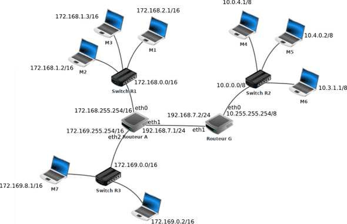

??? quote "Sources / Liens utiles"
    - Balabonski Terminale
    - [https://www.lyceum.fr/tg/nsi/3-architectures-materielles-systemes-dexploitation-et-reseaux/3-protocoles-de-routage/](https://www.lyceum.fr/tg/nsi/3-architectures-materielles-systemes-dexploitation-et-reseaux/3-protocoles-de-routage/){ target="_blank" }
    - [http://nsi4noobs.fr/IMG/pdf/c3_tnsi_routage.pdf](http://nsi4noobs.fr/IMG/pdf/c3_tnsi_routage.pdf){ target="_blank" }
    - [https://glassus.github.io/terminale_nsi/T5_Architecture_materielle/5.3_Protocoles_de_routage/cours/](https://glassus.github.io/terminale_nsi/T5_Architecture_materielle/5.3_Protocoles_de_routage/cours/){ target="_blank" }
    - [https://pixees.fr/informatiquelycee/n_site/nsi_term_archi_routage.html](https://pixees.fr/informatiquelycee/n_site/nsi_term_archi_routage.html){ target="_blank" }
    - TP Filius : [https://nsirennes.fr/os-archi/reseaux/](https://nsirennes.fr/os-archi/reseaux/){ target="_blank" }

# Cours - Protocoles de routage

## Rappels sur l'adressage IP

Voici une petite activité (sous la forme d'un notebook) de rappel sur l'**adressage IP et les masques de sous-réseau** :
    

[:material-cursor-default-click: Télécharger l'activité d'introduction](src/protocoles_routage_activite_introduction.ipynb){ target="_blank" }

!!! tip "Adresses *broadcast* et *multicast*"
    - **Broadcast** : Cette adresse vous permet d'appeler **tous les hôtes** (*interfaces*) à l'intérieur d'un **sous-réseau**. Une **adresse IP broadcast** est par exemple `192.168.100.255` et un **broadcast MAC** est `FF:FF:FF:FF:FF:FF`.
    - **Multicast** : Ce type d'adresse permet d'appeler un **groupe spécifique d'hôtes** (*interfaces*) dans un **sous-réseau**.

## Rappels - Qu'est-ce qu'un réseau ?

Vous pouvez dans un premier temps essayer de faire l'[exercice 1](#exercices) pour tester vos connaissances sur les composants d'un réseau.

Voici une petite vidéo résumant la **constitution d'un réseau** (et plus généralement du **réseau mondial**) :

<iframe width="560" height="315" src="https://www.youtube-nocookie.com/embed/JqweQE6TDTc" title="YouTube video player" frameborder="0" allow="accelerometer; autoplay; clipboard-write; encrypted-media; gyroscope; picture-in-picture; web-share" allowfullscreen></iframe>

## Rappels modèles OSI et TCP/IP

Voici un rappel des **modèles en couches** (en **7 couches** avec le modèle **OSI** et en **4 couches** avec le modèle **TCP/IP**,également appelé "modèle internet".)

??? abstract "Schéma plus détaillé - Encapsulation des données (modèle TCP/IP)"
    

??? abstract "Protocoles IP et TCP"
    Les **deux protocoles** qui nous intéressent particulièrement sont :

    - Le **protocole IP** (COUCHE **RÉSEAU**) qui consiste à attribuer à chaque machine une **adresse IP unique** pour l’**identifier sur le réseau**, et ainsi transmettre l'information sous la forme de **paquets** comportant l'indication de l'**adresse IP source** et de l'**adresse IP de destination**.
    - Le **protocole TCP** (COUCHE **TRANSPORT**) qui permet d’assurer la communication de l’information en la **découpant en segments**, comportant l'indication du **port source** et du **port de destination**, et en s’assurant que tous les paquets soient bien **reçus** et **conformes** à l’**information envoyée**. (Il existe un protocole plus rapide mais qui, contraiement à **TCP**, n'assure pas que toutes les données soient reçues : le protocole **UDP**.)

    Voici un rappel de la manière dont s'effectue l'**établissement d'une connexion** ainsi que la **transmission des données** avec le protocole **TCP** ([source de l'image](https://openclassrooms.com/fr/courses/2340511-maitrisez-vos-applications-et-reseaux-tcp-ip/5678267-exercez-vous-au-suivi-de-connexion){ target="_blank" }):

    

    Lorsqu'un paquet n'est pas correctement transmis, il est **de nouveau envoyé** ([source de l'image](http://shtroumbiniouf.free.fr/CoursInfo/Reseau2/Cours/TCP/TCP.html){ target="_blank" }):

    

    
    

    

    [:octicons-link-external-16: Voir plus d'informations sur le protocole TCP](https://laissus.developpez.com/tutoriels/cours-introduction-tcp-ip/?page=page_7){ target="_blank" }
    

## Introduction

Un **réseau informatique** permet la **connexion entre différentes machines** afin de faciliter la **communication** entre elles. Le modèle de communication généralement utilisé est le modèle **client-serveur**, qui permet aux **clients** d'échanger des **paquets d'informations** avec les **serveurs**. La notion de "client" est large, pouvant désigner aussi bien une application qu'une machine exécutant cette application. De même, le terme "serveur" peut faire référence à l'ordinateur hébergeant un service ou au logiciel fournissant ce service.

Les **paquets** de **bits** échangés sont les unités de base transitant sur le réseau physique. Ils résultent de la fragmentation des données à transmettre, telles que des pages web, des courriels ou des vidéos. Ces paquets sont envoyés séparément sur le réseau, et l'information initiale est reconstituée une fois qu'ils atteignent leur destination, que ce soit du côté client ou serveur.

En plus des clients et des serveurs, un réseau informatique est composé de **routeurs**, pouvant être de deux types : des **routeurs d'accès** (en bordure de réseau) ou des **routeurs internes**.  
Ces machines ont pour rôle de **relayer les paquets** dans le **réseau** pour les acheminer vers leur **destination finale**. Un **routeur** fait le lien entre **deux réseaux**. Les clients et les serveurs sont connectés aux routeurs d'accès via des **réseaux locaux** (en utilisant par exemple le *Wi-Fi* ou l'*Ethernet*). Les **routeurs internes** sont reliés entre eux sur de **plus longues distances** à l'aide de **fibres optiques**, de **câbles téléphoniques**, de **liaisons par satellite**, etc. L'interconnexion de ces routeurs via ces liens forme la **topologie du réseau**.

Par exemple, la **figure ci-dessous** représente la **topologie d'un réseau** avec **six routeurs**.

!!! success ""
    Les **routeurs R1** et **R6** sont des **routeurs d'accès** permettant aux **machines Client** et **Serveur** d'**accéder au réseau**. Les autres routeurs (**R2 à R5**) sont des **routeurs internes**. Les **adresses IP** des machines sont indiquées par une paire **sous-réseau/masque**. Par exemple, les routeurs **R1** et **R3** sont connectés à un **sous-réseau** avec l'adresse **10.1.1.0** et un **masque de 30**, signifiant que seuls les deux bits de poids faible de l'adresse peuvent être utilisés pour associer des adresses IP aux machines.

Lorsqu'un routeur reçoit un paquet, il analyse l'**adresse de destination** et choisit vers **quel routeur voisin** transmettre le paquet pour le faire progresser vers sa destination. Cette décision est prise en se basant sur la **table de routage du routeur**, qui associe les **adresses de destination** à des **adresses de routeurs voisins**. Ainsi, le paquet progresse de routeur en routeur jusqu'à atteindre le client ou le serveur auquel il est destiné. 

!!! note ""
    Par exemple, si un client souhaite envoyer un message au serveur, il le transmet à son **routeur d'accès** (R1), qui le renvoie au routeur R3. R3 choisit ensuite le prochain routeur à utiliser (R2, R4 ou R5) en se basant sur sa **table de routage**. Ce processus se répète à chaque routeur jusqu'à ce que le paquet parvienne au routeur R6, qui le délivre ensuite au **serveur**.

## Principe du routage

Si l'**hôte de destination** et l'**hôte source** sont **sur le même réseau**, les paquets de données circulent directement entre eux sur le **support local** de **niveau 2** (*deuxième couche du modèle OSI*) via des **commutateurs** (*switchs*), sans nécessiter l'intervention d'un **routeur**. Les **commutateurs** construisent une **table d'adresses MAC** des **machines IP** connectées à eux, utilisant ces **adresses** pour **commuter les trames**.

En revanche, si l'**hôte source** et l'**hôte de destination** ne sont **pas sur le même réseau**, le réseau local dirige le **paquet** de la **source** vers son **routeur de passerelle de niveau 3** (*troisième couche du modèle OSI*). Le **routeur** analyse la **partie réseau de l'adresse de destination** du **paquet** et le **dirige vers l'interface appropriée**. Si le **réseau de destination** est directement **connecté à ce routeur**, le **paquet** est **transmis directement à l'hôte de destination**. Dans le cas contraire, le **paquet** est **envoyé à un second routeur**, qui agit comme le **routeur de tronçon suivant**. Le transfert du paquet devient alors la responsabilité de ce second routeur. De **multiples routeurs ou sauts** tout au long du chemin peuvent traiter le paquet avant qu'il n'atteigne sa **destination**. Contrairement aux **commutateurs**, les **routeurs** se basent sur les **adresses IP** pour le transfert des données.

!!! success ""
    Aucun paquet ne peut être acheminé sans route. Que le paquet provienne d'un **hôte** ou soit dirigé par un **routeur intermédiaire**, le routeur a besoin d'une **route** pour déterminer son **itinéraire**. Si aucune route n'existe vers le **réseau de destination**, le paquet ne peut pas être transféré.
    
    Les **routeurs** utilisent des **tables de routage**, qui peuvent être établies de deux manières :
    
    - par un ==**routage statique**== : chaque ligne doit être renseignée "à la main". Cette solution est seulement envisageable pour des très petits réseaux de réseaux.
    - par un ==**routage dynamique**== : tout se fait "automatiquement", en utilisant des **protocoles** tels que **RIP** (*Routing Information Protocol*) ou **OSPF** (*Open Shortest Path First*)==, qui vont permettre de "découvrir" les **différentes routes automatiquement** afin de pouvoir **remplir la table de routage** tout aussi **automatiquement**.

!!! abstract "Une tableau de routage"
    Voici à quoi ressemble une **table de routage** (source : [Wikipédia](https://fr.wikipedia.org/wiki/Table_de_routage){ target="_blank" }) :

    | Réseau destination (format CIDR) | Masque           | Passerelle      | Interface       | Métrique |
    |----------------------------------|------------------|-----------------|------------------|----------|
    | 0.0.0.0/0                        | 0.0.0.0          | 192.168.0.1     | 192.168.0.100   | 1        |
    | 127.0.0.0/8                      | 255.0.0.0        | 127.0.0.1       | 127.0.0.1       | 1        |
    | 192.168.0.0/24                   | 255.255.255.0    | 192.168.0.100   | 192.168.0.100   | 1        |
    | 192.168.0.100/32                 | 255.255.255.255  | 127.0.0.1       | 127.0.0.1       | 1        |
    | 192.168.0.1/32                   | 255.255.255.255  | 192.168.0.100   | 192.168.0.100   | 1        |

    La ==**métrique**== est une mesure de la « distance » qui ==sépare un **routeur** d'un **réseau de destination**==. Dans le cadre du **protocole RIP**, on peut l'assimiler au **nombre de sauts IP nécessaires** pour **atteindre le réseau destination** (ce qui n'est pas le cas pour le protocole **OSPF**, où la métrique sera liée au **coût des liaisons**). Ainsi, un réseau **directement lié à un routeur** aura une métrique de `0`.

    Sur votre ordinateur, vous pouvez **afficher la table de routage** utilisée par **votre système** en utilisant les commandes suivantes :

    - Sous **Windows** : `route print` ou `netsh int ipv4/ipv6 sh route`
    - Sous **Unix/OS X** : `netstat -rn
    - Sous **Linux** : `ip -4/-6 route`

!!! note "Exemple de table de routage"
    Voici un exemple de réseau (*source* : [pixees](https://pixees.fr/informatiquelycee/n_site/nsi_term_archi_routage.html){ target="_blank" })

    <figure markdown>
    
    <figcaption>Diagramme d’un réseau</figcaption>
    </figure>

    Voici par exemple ce que donnerait la **table de routage** du **routeur A**, après la mise à jour effectuée avec le **protocole RIP** :

    | Réseau           |   Passerelle   | Interface | Métrique |
    |------------------|----------------|-----------|----------|
    | 172.168.0.0/16   |                | eth0      | 0        |
    | 192.168.7.2/24   |                | eth1      | 0        |
    | 172.169.0.0/16   |                | eth2      | 0        |
    | 10.0.0.0/8       | 192.168.7.2/24 |           | 1        |

    !!! note ""
        À votre tour, donnez la **table de routage** du routeur **G**.

## Protocole « à vecteur de distances » - RIP

Le **nombre de routeurs** dans un **réseau** est souvent **trop élevé** pour envisager une **configuration manuelle des tables de routage**. En effet, à chaque fois qu'un élément du réseau tombe en panne ou qu'une modification est apportée à sa **topologie** (comme l'ajout d'une nouvelle liaison ou d'un nouveau routeur), il devient nécessaire de **recalculer toutes les routes** et de **mettre à jour les tables de routage de chaque routeur**. Pour réaliser cette tâche, il serait également nécessaire d'envoyer toutes les données relatives à l'**état des liaisons** et des **routeurs** vers un **opérateur unique**, chargé de **calculer les nouvelles routes**. Outre les inconvénients de centraliser cette tâche, il faut également garantir que les informations sur l'état du réseau peuvent être transmises sans problème à cet opérateur. Malheureusement, les moyens de communication utilisés à cette fin peuvent eux aussi **tomber en panne**.

Pour toutes ces raisons, l'approche consiste à **automatiser ce processus** en permettant aux routeurs de mettre à jour leurs tables de routage sans intervention humaine. Ainsi, en plus de la **transmission des paquets**, les routeurs échangent des informations sur les **routes** du **réseau** en fonction de l'**état de leurs voisins** et de leurs **liens de communication**. Les règles régissant ces échanges sont définies par un **protocole de routage**.

Initialement, les **informations** dont dispose un **routeur** concernent **ses voisins immédiats** ainsi que les **sous-réseaux auxquels il est connecté**. En **envoyant** régulièrement des **messages** à ses **voisins** et en mesurant les temps de réponse de ces machines, le routeur peut déterminer si un autre routeur **est en panne** ou si la liaison entre eux est **rompue**. Il peut ensuite diffuser ces informations à tous ses voisins, qui peuvent à leur tour les transmettre à leurs voisins, et ainsi de suite. De cette manière, progressivement, tous les routeurs finissent par partager les mêmes connaissances sur la topologie du réseau. Cependant, pour que l'échange de ces informations soit bien coordonné, les routeurs doivent suivre **le même protocole**. Dans cette section, nous décrivons le ==**protocole RIP**== (*Routing Information Protocol* en anglais), un exemple de protocole utilisé à cette fin.

!!! abstract "Principe du protocole RIP"
    Le **protocole RIP** s'appuie sur l'==**algorithme de Bellman-Ford**== (un algorithme utilisant le principe de **programmation dynamique**), permettant de **calculer les plus courts chemins** dans un graphe.

    L'**algorithme** du **protocole RIP** repose sur le partage d'informations entre routeurs pour déterminer les meilleures routes vers différents sous-réseaux. Chaque routeur communique avec ses voisins en échangeant des vecteurs de distance, des couples (adresse, distance), qui représentent la distance en nombre de sauts vers une machine spécifique. Ces échanges permettent aux routeurs de construire et mettre à jour leurs tables de routage.

    Dans la phase d'initialisation, chaque routeur transmet les adresses de ses voisins et les distances associées. Ces informations sont utilisées pour former des vecteurs de distance. À partir de là, le protocole RIP continue par des échanges périodiques de demandes et de réponses entre les routeurs. Lorsqu'un routeur reçoit une réponse de son voisin, plusieurs scénarios peuvent se produire :

    1. Découverte d'une nouvelle route vers un sous-réseau inconnu : le routeur l'ajoute à sa table.
    2. Découverte d'une route plus courte vers un sous-réseau connu : le routeur met à jour sa table en remplaçant l'ancienne route par la nouvelle.
    3. Réception d'une nouvelle route plus longue : le routeur ignore cette information.
    4. Réception d'une route existante, mais plus longue, vers un routeur passant par le même voisin : le routeur met à jour sa table en tenant compte de cette nouvelle route.

    Les distances associées aux routes sont ajustées en fonction du chemin parcouru, et la distance maximale est limitée à 15 routeurs intermédiaires. Au-delà de cette limite, la route est ignorée ou supprimée des tables de routage.

    En répétant ces échanges et en mettant à jour les tables de routage à intervalle fixe (l'intervalle de mise à jour par défaut pour le RIP est de 30 secondes.), les routeurs convergent vers une vision commune du réseau, déterminant ainsi les meilleures routes pour acheminer les paquets vers leurs destinations.

## Protocole « à état de liens » - OSPF

## Exercices

!!! note "Exercice 1 - Composants dans un réseau"
    Identifiez les différents composants du réseau suivant :

    

    A = `..........`  
    B = `..........`  
    C = `..........`  
    D = `..........`